# NyankoFace

<p align="center">
  <a href="README.md">English</a> · <strong>日本語</strong> · <a href="https://sunwood-ai-labs.github.io/NyankoFace/ja/">ドキュメント</a>
</p>

セルフホスト版 HuggingFace ライクなプラットフォームです。Forgejo（Git + LFS）を土台に、HuggingFace 風の Web ポータルと、Dockerfile ベースのアプリ（Spaces）をその場でビルド・実行できるランナーを組み合わせています。SpaceはREADME frontmatterに `external_url` を設定することで、iframeやcontainer buildを使わず既存HTTP/HTTPSサイトへ直接移動するリンク型にもできます。`docker compose up -d --build` だけで、自分のLAN／サーバー内に Models、Datasets、Spaces、Characters、Benchmarks、Skills、MCPs、Prompts、Automations、Knowledge、Pagesを公開できる場所を丸ごと立ち上げられます。

最新リリースは[v0.6.0リリースノート](docs/ja/guide/releases/v0.6.0.md)と、案内記事[実測するsurfaceと証跡を守る](docs/ja/articles/nyankoface-v0-6-0.md)にまとめています。既存環境を更新する場合は[upgradeとデータ保持のrunbook](docs/ja/guide/upgrading.md)も確認してください。[v0.5.0ノート](docs/ja/guide/releases/v0.5.0.md)と過去releaseのノートも参照できます。

<p align="center">
  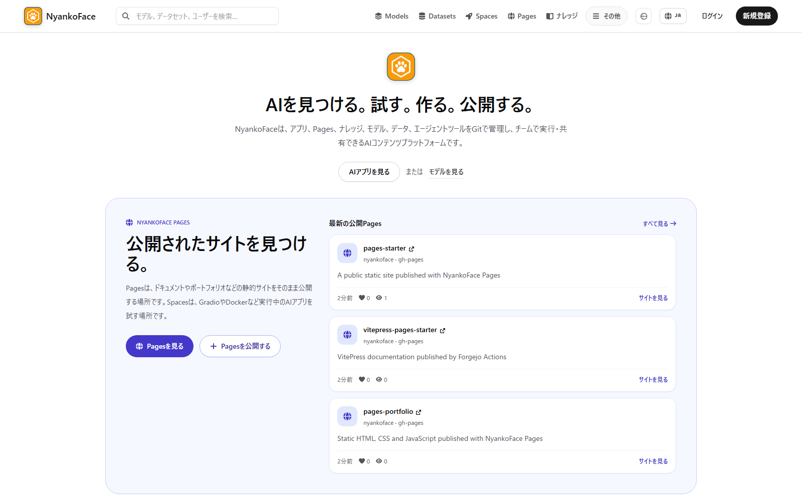
</p>

計画: Claude Fable 5 / 実装: Claude Sonnet 5

## ✨ プロジェクト概要

NyankoFace は次のサービスで構成されています。

| サービス | 役割 | 内部ポート |
|---|---|---|
| `gateway` | nginx リバースプロキシ（唯一の公開口） | 80/443 (公開: 8090/8443) |
| `frontend` | HF風ポータル (Next.js + Tailwind) | 3000 |
| `forgejo` | 改造版 Forgejo（Git + LFS + API + 認証） | 3000 (http), 22 (ssh) |
| `postgres` | Forgejo・閲覧metrics・自動保守jobの永続化 | 5432（内部のみ） |
| `spaces-runner` | Docker Space のビルド・起動・プロキシ (FastAPI + Docker SDK) | 8000 |
| `seed` | 初回起動時に admin ユーザーとサンプルrepoを作成する one-shot ジョブ | - |
| `forgejo-actions-runner` | VitePressなどの静的サイトをビルドする Forgejo Actions Runner | - |
| `forgejo-actions-dind` | Actionsジョブ専用の隔離 Docker daemon | Runner専用Unix socket |
| `maintenance-agent` | IssueをGLMで解析し、修正ブランチとPRを作成する自動保守サービス | 8010（内部のみ） |

初期repositoryとsample Spaceの生成元、登録タイミング、更新コマンド、安全な
削除方法は[seedアプリとカタログ](docs/ja/guide/seed-apps.md)にまとめています。

### 実装済み機能マップ

| 領域 | 現在利用できる機能 | 設定・検証場所 |
|---|---|---|
| カタログ | 実Forgejoリポジトリから Models、Datasets、Spaces、Characters、Benchmarks、Skills、MCPs、Prompts、Automations、Knowledge を分類・表示 | 対応するrepository topicを追加 |
| アプリ | DockerfileベースのSpace、外部リンク型Space、静的Pages、オンデマンド起動 | README frontmatter、ルート`Dockerfile`、`.env`、[Spacesガイド](https://sunwood-ai-labs.github.io/NyankoFace/ja/guide/spaces) |
| MCP操作 | statelessなStreamable HTTP serverで、scope付きcatalog read、preview／confirmation付きwrite、durable audit、任意のlocal stdio adapterを提供 | [NyankoFace MCP Server](docs/ja/guide/mcp-server.md)、[MCP管理Runbook](docs/ja/guide/mcp-administration.md)、[実MCP client QA](docs/ja/guide/mcp-live-clients.md) |
| コラボレーション | Files、履歴、Issue、PR、コメント、リアクション、組織、チーム、API実測のいいね／閲覧数、読込中／取得不能表示 | Forgejo権限、[Community検証](docs/evidence/community-ui/README.md)、[統計表示監査](docs/evidence/issues/24/README.md) |
| 実測統計 | 星／forkはForgejo、Space／Knowledgeの閲覧数といいねは永続metrics APIから取得。正常な0は`0`、取得不能は架空の0ではなく`—`で表示 | [Issue #24 API・画面突合監査](docs/evidence/issues/24/README.md) |
| ログイン状態ナビバー | Forgejoのログイン状態をポータルへ反映し、再読込／画面遷移後も保持。ログアウト直後にログイン／新規登録表示へ戻る | [Issue #25 PC・モバイル認証状態監査](docs/evidence/issues/25/README.md) |
| Space設定 | リポジトリOwnerがruntime／build／bothのVariableと暗号化Secretを管理。runtime値はcontainerだけ、build値はnative Forgejo Actions storeへ同期し、一覧APIへ平文を返さない | [Variables／Secretsガイド](docs/ja/guide/space-environment.md)、[Repository Pipelines](docs/ja/guide/pipelines.md) |
| 統一API設計 | `/api/v1` FacadeにNyankoFace Token、最小scope、毎requestのForgejo認可、write-only Secret、audit／rate／idempotency契約、移行、native Git境界を定義 | [統一APIと認証ADR](docs/ja/guide/unified-api.md)、[機械可読Security契約](docs/contracts/nyankoface-api-v1-security.json) |
| ポータブルAutomationカタログ | version管理された無効状態のTOML、commit固定preflight、安全性検出、正規化download | `automation` topicを追加し、下記の **ポータブルAutomationを公開する** を参照 |
| プラットフォーム自動化 | Repository Pipelines、Forgejo Actions、VitePress公開、Claude Code `/goal`、専門エージェント委任、Issue／PR自動ラベル、release監査、安全条件付き自動マージ | `.forgejo/workflows/`、`maintenance-agent/`、[Pipelineガイド](docs/ja/guide/pipelines.md)、[Issue #70 実ラン・画面検証](docs/evidence/issues/70/README.md)、[自動保守ガイド](docs/ja/guide/automated-maintenance.md) |
| 表示 | Standard／Solarpunk／Cyberpunk、日本語／英語、PC／モバイル、Markdown／Mermaid、`APP_NAME`による共通ブランド名 | `.env`、画面上の切替、[`docs/evidence/`](docs/evidence/) |
| PC用ユーティリティ | Settings、Notifications、Site Administrationを1280px／1440pxのPC用サイドバー付きレイアウトで表示 | [Issue #14 スクリーンショット監査](docs/evidence/issues/14/README.md) |
| ナビバー状態 | Forgejoの未使用ストップウォッチ要素はDOMに保持しつつ、意味不明な黄色い点として表示しない | [Issue #16 スクリーンショット監査](docs/evidence/issues/16/README.md) |

アプリ名は`.env`の`APP_NAME`一つでNext.jsポータルとForgejoの両方へ反映されます。デフォルト名／変更名をPC・モバイルで確認した結果は[Issue #15 ブランド名監査](docs/evidence/issues/15/README.md)に保存しています。

#### 最近追加・検証した機能

| Issue | 追加内容 | 証跡 |
|---|---|---|
| [#24](https://github.com/Sunwood-ai-labs/NyankoFace/issues/24) | 実リポジトリ／永続操作統計、正しいforkアイコン、読込中、取得不能表示 | [API値・障害時表示・スクリーンショット](docs/evidence/issues/24/README.md) |
| [#25](https://github.com/Sunwood-ai-labs/NyankoFace/issues/25) | Forgejo認証連動ナビバー、再読込／遷移時の保持、即時ログアウト表示 | [PC／モバイルの認証状態スクリーンショット](docs/evidence/issues/25/README.md) |
| [#26](https://github.com/Sunwood-ai-labs/NyankoFace/issues/26) | Space操作直後のスピナー、二重送信防止、成功／失敗通知、処理段階ごとのサーバー計測 | [処理中／成功／失敗スクリーンショットと計測証跡](docs/evidence/issues/26/README.md) |
| [#27](https://github.com/Sunwood-ai-labs/NyankoFace/issues/27) | 最小の公開方法を選択・雛形生成・検証するNyankoFace Navigator Skill | [`skills/nyankoface-navigator/`](skills/nyankoface-navigator/) |
| [#28](https://github.com/Sunwood-ai-labs/NyankoFace/issues/28) | Owner限定の実行時Variable／暗号化Secret管理、値のマスク、ローテーション／削除、監査記録、GPUのfail-closed制御 | [セキュリティ検証とPC／モバイル画面](docs/evidence/issues/28/README.md) |
| [#37](https://github.com/Sunwood-ai-labs/NyankoFace/issues/37) | 生成カタログrepositoryと追跡対象Docker Space sampleの両方を扱う、再構築可能なseedアプリ運用ガイド | [生成元・登録タイミング・更新／削除手順](docs/ja/guide/seed-apps.md) |
| [#38](https://github.com/Sunwood-ai-labs/NyankoFace/issues/38) | 既存labelのallowlist、confidence閾値、dry-run、preview API、PostgreSQL監査を備えたIssue／PR自動ラベル | [設定・安全条件・API・スクリーンショット証跡](docs/evidence/issues/37-38/README.md) |
| サンプル | 3個の実行時Variableを表示し、暗号化Secretをサーバー側HMAC署名に実際に使用するCPU Space。Secretの生値はブラウザへ返さない | [ソース・公開URL・検証結果・PC／モバイルスクリーンショット](docs/evidence/environment-space-sample/README.md) |

| seed生成元ガイド | 本番Issueの自動ラベル |
|---|---|
| 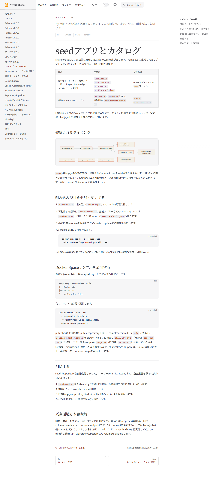 | 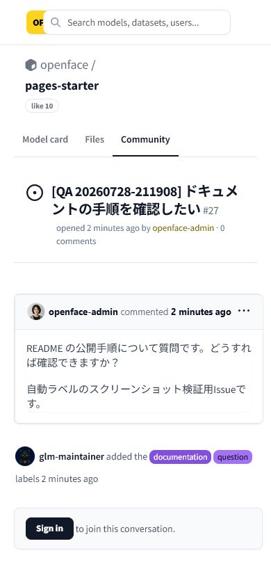 |

### 編集可能な組織アカウント

初期seedは、静的な見本ではなく実在するForgejo組織 `nyankoface` と、天使をテーマにした架空のAI Safety組織 `seraphim-labs` を作成します。NyankoFace側は `nyankoface-admin`、`aiko-mesh`、`ren-vector`、`mira-signal`、Seraphim Labs側は専用の架空メンバー `aurelia-vale`、`cassian-reed`、`ilyana-noor`、`lucien-sol` がOwnerチームに所属します。Seraphimの4名には、それぞれ異なるハイエンドなアニメ／ゲームキャラクター調の生成アバターを設定しています。**Edit organization** から組織名・説明・アバター・メンバー・チーム・リポジトリ設定を編集でき、公開プロフィールの説明はForgejo Organization APIの値を読み直して表示します。生成プロンプト一式は [docs/evidence/organization/seraphim-avatar-prompts.md](docs/evidence/organization/seraphim-avatar-prompts.md) に保存しています。

| NyankoFace | Seraphim Labs |
|---|---|
| <a href="docs/images/nyankoface-organization-mobile-ja.png"></a> | <a href="docs/images/seraphim-labs-organization-mobile.png">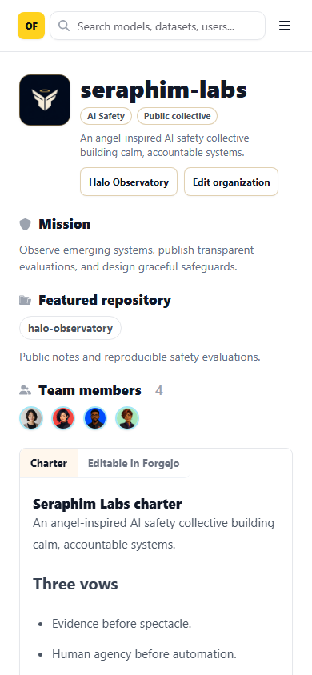</a> |

| チームページ | 生成キャラクターポートレート |
|---|---|
| <a href="docs/images/seraphim-labs-team-mobile.png">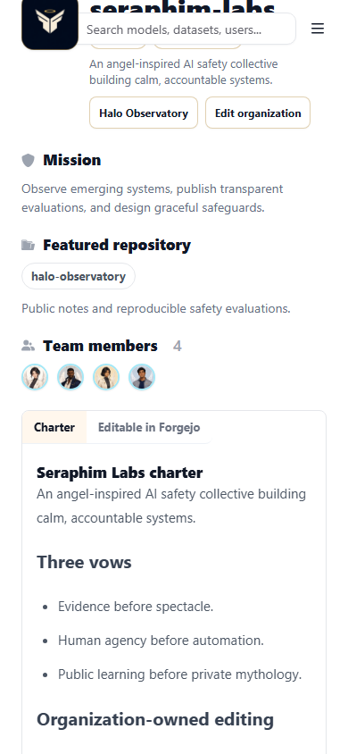</a> | <a href="docs/images/seraphim-angel-team-portraits.png"></a> |

<details>
<summary><strong>Owner設定の全長キャプチャを開く</strong></summary>

<a href="docs/images/seraphim-labs-owner-settings-mobile.png">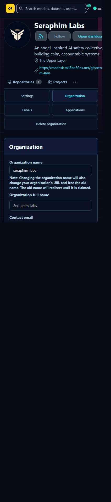</a>

</details>

リポジトリの種別はForgejoの **topics**（`model` / `dataset` / `space` / `skill` / `mcp` / `prompt` / `automation` / `doc` / `character` / `benchmark`）で判定します。Pagesだけは種別topicを使わず、public repositoryの`gh-pages`ルートまたはdefault branchの`docs/index.html`から検出します。Promptのリポジトリ名・URLは版に依存しない安定slug（例: `mystic-git-auto-commit`）に固定し、個別版は`version-v4.2`のような追加topicと同名のGit tagで管理します。版を更新してもリポジトリ名・clone URL・参照先を変更する必要はありません。各詳細カードはリポジトリ直下の`README.md`を使い、相対画像もローカルForgejoの実ファイルから表示します。

### アーキテクチャ図

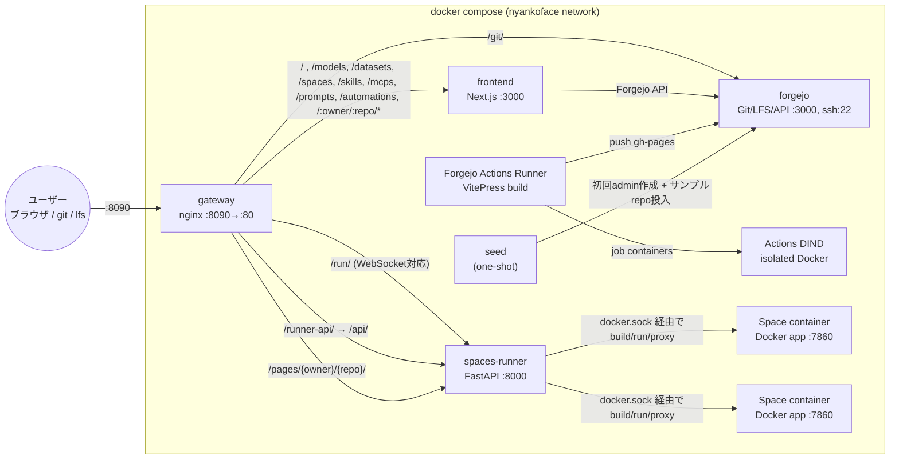
```mermaid
flowchart LR
    User((ユーザー<br/>ブラウザ / git / lfs))

    subgraph Docker["docker compose (nyankoface network)"]
        Gateway["gateway<br/>nginx :8090→:80"]
        Frontend["frontend<br/>Next.js :3000"]
        Forgejo["forgejo<br/>Git/LFS/API :3000, ssh:22"]
        Runner["spaces-runner<br/>FastAPI :8000"]
        ActionsRunner["Forgejo Actions Runner<br/>VitePress build"]
        ActionsDind["Actions DIND<br/>isolated Docker"]
        Seed["seed<br/>(one-shot)"]
        SpaceA["Space container<br/>Docker app :7860"]
        SpaceB["Space container<br/>Docker app :7860"]

        Gateway -- "/ , /models, /datasets, /spaces, /skills, /mcps, /prompts, /automations, /:owner/:repo/*" --> Frontend
        Gateway -- "/git/" --> Forgejo
        Gateway -- "/run/ (WebSocket対応)" --> Runner
        Gateway -- "/runner-api/ → /api/" --> Runner
        Gateway -- "/pages/{owner}/{repo}/" --> Runner
        Frontend -- "Forgejo API" --> Forgejo
        Runner -- "docker.sock 経由でbuild/run/proxy" --> SpaceA
        Runner -- "docker.sock 経由でbuild/run/proxy" --> SpaceB
        ActionsRunner -- "job containers" --> ActionsDind
        ActionsRunner -- "push gh-pages" --> Forgejo
        Seed -- "初回admin作成 + サンプルrepo投入" --> Forgejo
    end

    User -- ":8090" --> Gateway
```

### MarkdownとMermaid図

リポジトリのREADMEとナレッジ記事では、`mermaid` のコードフェンスを実際の図として
描画します。フローチャート、シーケンス図、状態遷移図、クラス図、円グラフを、
Standard／Solarpunk／Cyberpunkの3テーマと、PC／幅390pxのモバイルで検証済みです。
通常はカード幅に全体を収め、**拡大**ボタンで詳細表示と内部横スクロールへ切り替え
られます。不正なMermaid構文もページ全体を壊さず、日本語メッセージとsourceを表示
します。

| Standard・PC | Cyberpunk・モバイル |
|---|---|
| 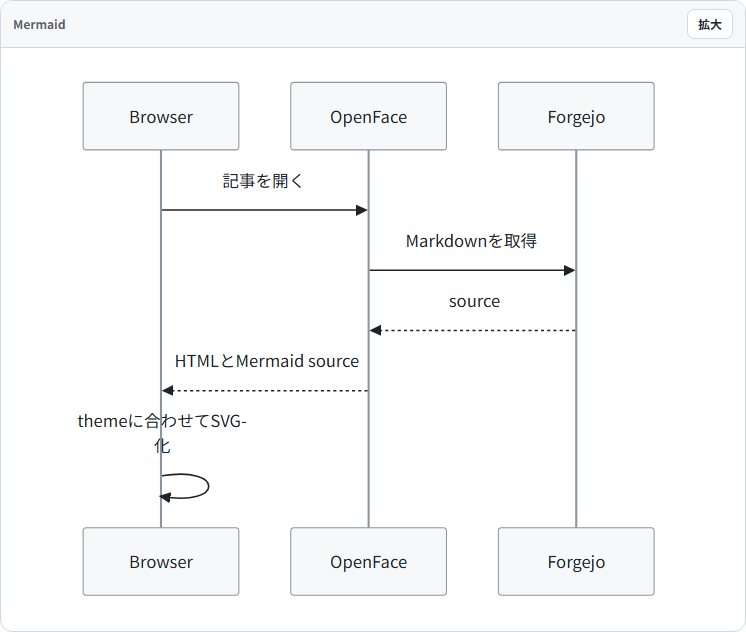 | 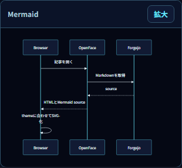 |

再実行可能なPlaywright監査は **Markdown 2画面 × 3テーマ × 2 viewport** に加えて
全図形と不正文法fallbackを撮影し、**57枚・12/12ケース合格**です。
[Mermaidのスクショ証跡](docs/evidence/markdown-mermaid/README.md)を参照するか、
`cd visual-tests && npm run audit:mermaid` を実行してください。

## 📸 スクリーンショット

以下はローカルで起動した NyankoFace の実画面です。Spaces は CPU 上で稼働し、Gradio に加えて静的 HTML、React、Vue、Next.js、Streamlit、FastAPI、Node.js などの Dockerfile ベースのアプリを同じ画面内で公開できます。

| Spaces ディレクトリ | 埋め込みアプリ |
|---|---|
|  | 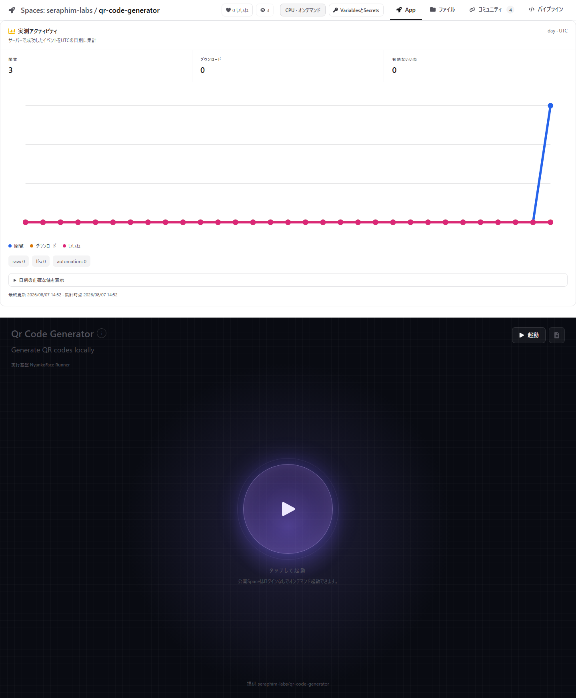 |

| ホーム | リポジトリの Files 画面 |
|---|---|
|  | 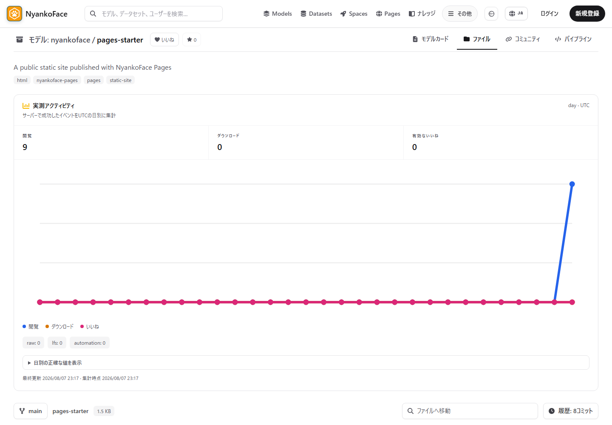 |

### テーマ切替

ヘッダー右上のテーマセレクタから、標準・**Solarpunk**・**Cyberpunk** を即時に切り替えられます。選択はブラウザの `localStorage` に保存され、次回アクセス時も最初の描画から復元されます。スマートフォンではナビゲーションメニュー内に同じセレクタを表示します。

| Standard | Solarpunk | Cyberpunk |
|---|---|---|
| 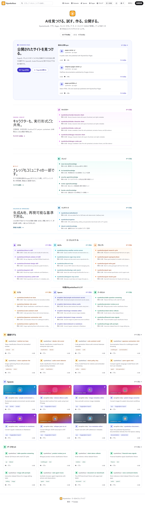 | 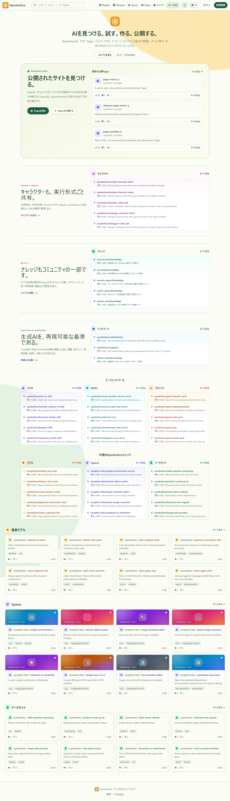 | 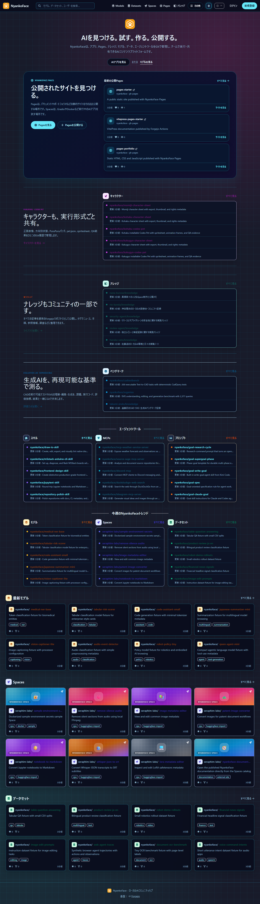 |

テーマセレクタの実操作・永続化・各画面の確認結果は [Theme verification evidence](docs/evidence/themes/README.md) に記録しています。

### Characters（PuruPuru／Codex Pet）

[`/characters`](https://localhost:8443/characters)は、キャラクターをtopicだけで分類する一覧ではありません。Forgejoへ履歴ごと取り込んだ実リポジトリを読み取り、PuruPuruの設定・状態画像・方向制御パッチ、Codex Petの`pet.json`・`spritesheet.webp`、キャラクターシートを規格として検出します。

- `lumi-jelly-pngtuber`: 上半身・正面6状態
- `lumi-jelly-head-motion-pngtuber`: 頭部のみ・5方向30状態・PuruPuru用パッチ
- `character-design-images`: 8キャラクターシートと、個別に選択できる8体のPet package

<details>
<summary><strong>Characters一覧のモバイル全長キャプチャを開く</strong></summary>

| Standard mobile | Cyberpunk mobile |
|---|---|
| <a href="docs/evidence/characters/standard-mobile-directory-ja.png"></a> | <a href="docs/evidence/characters/cyberpunk-mobile-directory-ja.png"></a> |

</details>

PetはAyano Yukimura、Fuhyo、Hisha、Kakugyo、Kohaku、Maki、Momiji、Onizukaをそれぞれ独立カードとして表示します。PuruPuruは実リポジトリの状態PNGを2レイヤーのアルファクロスフェードで滑らかに切り替え、詳細画面では再生／停止と方向切替を操作できます。

[Characters検証記録](docs/evidence/characters/README.md)には、代表スクリーンショットと、規格監査24 / 24、WCAGテーマ監査48 / 48、日本語／英語監査48 / 48の結果を保存しています。

### Knowledge（topicで分類する記事）

内部の[`/docs`](https://localhost:8443/docs)は、運用マニュアル用VitePressとは別の、Gitリポジトリを土台にしたKnowledgeカタログです。repository topicへ`doc`を追加し、公開するMarkdownはすべてtop-levelの`articles/*.md`へ保存します。手順、参照情報、ニュース、ベンチマークも別形式ではなくすべて記事です。frontmatterの`topics`または`tags`へ`news`、`how-to`、`reference`、`benchmark`、`research`などを複数指定して分類します。`formats`は現行readerでは使いません。`emoji`は記事の識別アイコンとカード背景の透かしになり、未指定時はtopicに応じて安定した絵文字を自動選択します。実ファイル、commit履歴、clone URL、権限はそのまま保持され、実閲覧数によるtrending順とtopic単位の閲覧を利用できます。

<details>
<summary><strong>PC／モバイルのKnowledge全長キャプチャを開く</strong></summary>

| PCのKnowledge一覧 | モバイルのKnowledge一覧 |
|---|---|
| <a href="docs/evidence/knowledge-library/2026-07-24/screenshots/standard--light--desktop--docs.png">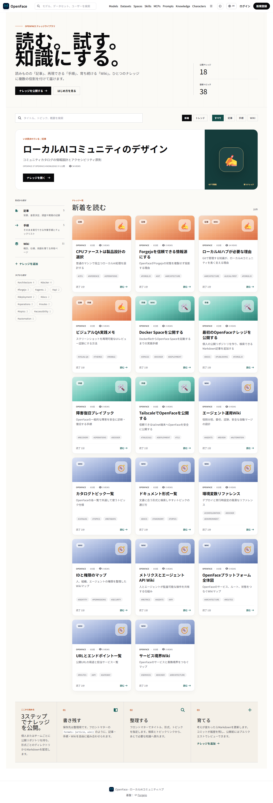</a> | <a href="docs/evidence/knowledge-library/2026-07-24/screenshots/cyberpunk--dark--mobile--docs.png"></a> |

</details>

[KnowledgeのビジュアルQAレポート](docs/evidence/knowledge-library/2026-07-24/THEME_MATRIX.md)には、3テーマ×OS配色2種×PC/モバイル×一覧/詳細の24スクリーンショットと、横はみ出し・WCAGコントラストの自動検査結果を保存しています。

### Skills / MCPs

Sunwood AI Labs の公開 GitHub リポジトリから、実ファイルとコミット履歴を含む Skill 10件・MCPサーバー10件を取り込みます。名前だけのダミーではなく、Skill は `SKILL.md`、MCP はサーバー実装と依存定義を検証済みです。

#### Skillを公開・更新する方法

インストール可能なNyankoFace Navigator Skill本体は[`skills/nyankoface-navigator/`](skills/nyankoface-navigator/)にあります。これは公開先の選択、最小構成の作成、検証、公開、実画面確認、secretの扱いをまとめたエージェント向けの心臓部です。このディレクトリをCodexなど互換エージェントのSkill配置先へコピーして`$nyankoface-navigator`を呼び出します。validatorだけを直接使うこともできます。

```bash
python skills/nyankoface-navigator/scripts/validate_repo.py PATH --goal space --topics space
python skills/nyankoface-navigator/scripts/validate_repo.py PATH --goal knowledge --topics doc --json
python skills/nyankoface-navigator/scripts/validate_repo.py PATH --goal automation --topics automation
```

##### 同梱しているインストール可能なSkill

| Skill | 使う場面 | 呼び出し | 主なファイル |
|---|---|---|---|
| [NyankoFace Navigator](skills/nyankoface-navigator/SKILL.md) | NyankoFaceの全公開先から選ぶ、最小構成を作る、既存repositoryを検証する、secret境界を確認する、一覧に出ない原因を調べる | `$nyankoface-navigator` | [`SKILL.md`](skills/nyankoface-navigator/SKILL.md)、[公開先対応表](skills/nyankoface-navigator/references/publishing-map.md)、[公開安全リファレンス](skills/nyankoface-navigator/references/deployment-environment.md)、[validator](skills/nyankoface-navigator/scripts/validate_repo.py)、[validator tests](skills/nyankoface-navigator/scripts/test_validate_repo.py)、[starter assets](skills/nyankoface-navigator/assets/) |
| [NyankoFace Issue Report](skills/nyankoface-issue-report/SKILL.md) | credentialを露出せず、再現可能なbug／改善観測をstageし、operatorが重複確認後に公開する | `$nyankoface-issue-report` | [`SKILL.md`](skills/nyankoface-issue-report/SKILL.md)、[report contract](skills/nyankoface-issue-report/references/report-contract.md)、[stager](skills/nyankoface-issue-report/scripts/stage_report.py)、[operator publisher](skills/nyankoface-issue-report/scripts/publish_report.py) |

このrepositoryに同梱しているインストール可能なエージェントSkillは現在2件です。NyankoFaceのカタログにはseed済み／利用者公開のSkillを複数表示できますが、それらをホストへ勝手にインストールすることはありません。信頼して使うSkillのディレクトリだけをコピーしてください。

Navigatorは、NyankoFaceが提供するリポジトリベースの公開先を次のように扱います。

| 目的 | Skillが準備するもの | NyankoFaceでの公開先 |
|---|---|---|
| `model` | モデルカードと重み／設定または取得手順 | Models |
| `dataset` | データセットカードと実データ／splitまたは取得手順 | Datasets |
| `space` | DockerfileベースのWebアプリ | Spaces |
| `space` | README `external_url`で開く既存HTTP／HTTPSサイト | Spaces |
| `knowledge` | top-levelの`articles/*.md`と複数topic | Knowledge |
| `skill` | `SKILL.md`を含むエージェント手順 | Skills |
| `mcp` | MCPサーバー実装と依存定義 | MCPs |
| `prompt` | 安定したrepository slug、version topic、Git tag | Prompts |
| `automation` | 無効状態のTOML、公開用example、README、LICENSE、SemVer tag | Automations |
| `character` | PuruPuru／Codex Pet／character sheetの実ファイル規格 | Characters |
| `benchmark` | 評価task、runner／設定、result証跡 | Benchmarks |
| `pages` | publicな`gh-pages`ルートまたはdefault branchの`docs/` | Pages |

### ポータブルAutomationを公開する

Automationごとにpublic repositoryを1つ作り、`automation` topicを追加します。rootへ`README.md`、`automation.toml`、`automation.example.toml`、`LICENSE`を置き、`automation.toml`にはschema version、SemVer、schedule、timezone、permission、connector、workspace範囲、delivery、動作確認済みclient、tag、license、`enabled = false`を宣言します。version `1.0.0`には書き換えないGit tag `v1.0.0`を対応させます。

token、メールアドレス、private URL、hostname、thread ID、端末固有pathは格納せず、secret名とplaceholderだけを公開します。[`/automations`](https://localhost:8443/automations)や詳細画面を開いても登録・実行は行いません。NyankoFaceは選択したrefをcommit SHAへ固定し、互換性・schedule・permission・connector・workspace・delivery・安全性検出を表示します。copy／downloadできる正規化TOMLも必ず無効状態のままです。

同梱ディレクトリだけで利用できる構成です。[`SKILL.md`](skills/nyankoface-navigator/SKILL.md)がワークフロー、[`references/publishing-map.md`](skills/nyankoface-navigator/references/publishing-map.md)が11種類の公開契約、[`references/deployment-environment.md`](skills/nyankoface-navigator/references/deployment-environment.md)が公開可能なdefaultとsecret境界、[`scripts/validate_repo.py`](skills/nyankoface-navigator/scripts/validate_repo.py)が通常表示／JSONのローカル検証、[`assets/`](skills/nyankoface-navigator/assets/)がKnowledge・Pages・Docker Space・外部リンク型Space・4ファイル構成のAutomation starterを提供します。Forgejoへseedするコピーにも同じファイルを使うため、NyankoFace上で見えるSkillとインストール用Skillが気付かないうちにずれることはありません。

1. 通常のForgejoリポジトリを作り、repository topicに`skill`を追加します。
2. ルートの`SKILL.md`へ完全な手順を記載し、参照するscript、template、assetも同じリポジトリで管理します。
3. 根拠のある必須／推奨関係を表示したい場合だけ、ルートへ`skill.json`を追加します。
4. 通常のGit／PRフローでpushします。NyankoFaceは実ファイルと履歴を直接読むため、別のSkill登録DBや専用アップロードは不要です。
5. `/skills`からカードを開き、`SKILL.md`の表示、Files、commit履歴、依存先、逆参照の **Referenced by** を確認します。

再構築用のサンプル一覧は[`seed/catalog/sunwood-ai-labs.json`](seed/catalog/sunwood-ai-labs.json)にあります。公開元repositoryとbranchを固定しているため、別環境でも同じサンプルを再取得できます。同梱サンプルを増やす場合は`kind: "skill"`のentryを追加します。利用者が作るSkillはtopicだけで検出されるため、このseed一覧への追加は不要です。

CIでは、インストール用NavigatorとForgejoへseedするコピーが同一であること、`SKILL.md`のfrontmatter、11種類の公開契約を対象にしたvalidator regression、Navigator自身のSkill契約を確認します。

各Skillリポジトリのルートにある編集可能な `skill.json` で、Skill間の必須／推奨依存関係を指定できます。NyankoFaceは逆方向の **Referenced by** も自動算出し、宣言がないSkillは **Standalone** と表示します。形式と編集手順は [Skill relationship metadata](docs/skill-relationships.md) を参照してください。

| Skills | MCPs |
|---|---|
|  | 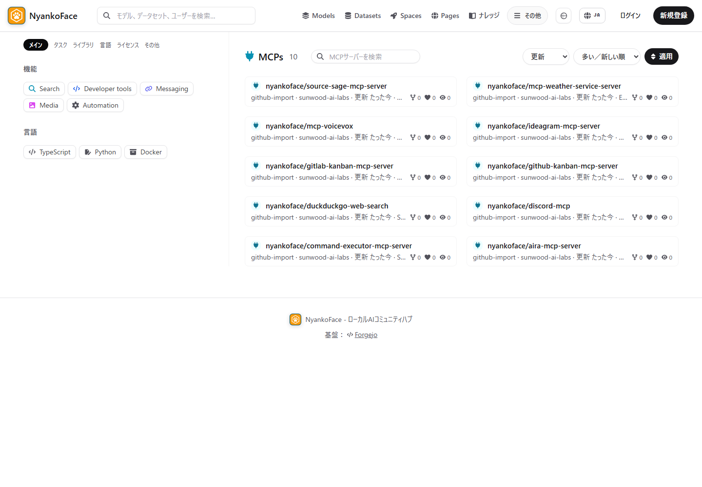 |

| ホームのAgent tooling | Skill詳細 |
|---|---|
|  | 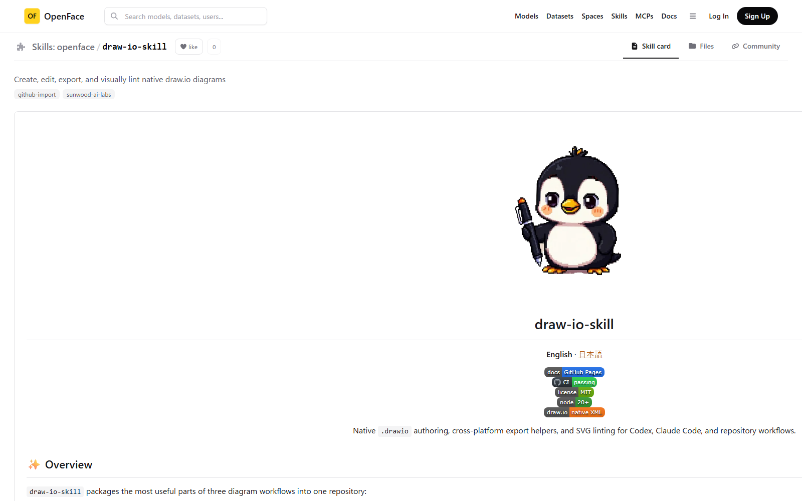 |

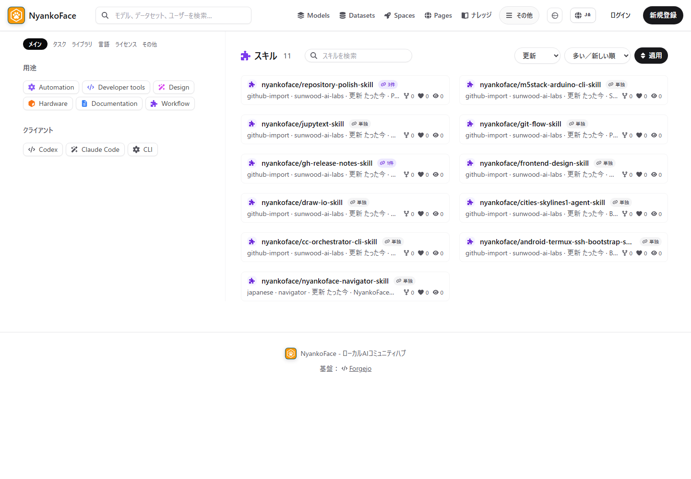

<details>
<summary><strong>根拠付きSkill関係サイドバーの全長キャプチャを開く</strong></summary>

<a href="docs/evidence/skill-relationships/graph-desktop.png">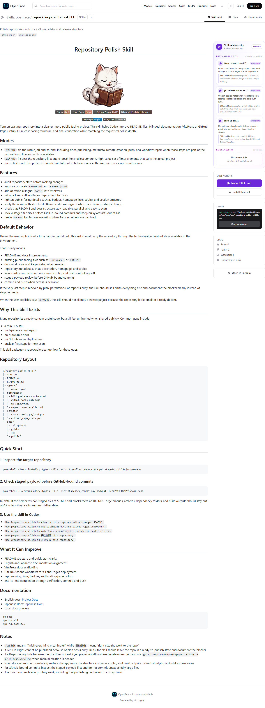</a>

</details>

モバイル表示、リンク遷移、README.mdを持たないSkillも含む検証結果は [Skill relationship visual verification](docs/evidence/skill-relationships/README.md) にまとめています。

選定根拠と検証結果は [Skill / MCP verification evidence](docs/evidence/skills-mcps/README.md) にまとめています。

### Community / Issues

Forgejo のIssueとPull RequestをNyankoFaceのCommunity導線として扱います。初期seedはQR Code Generator Spaceに実Issueを4件作成し、一覧・詳細・フィルター・認証付き作成導線を再構築直後から検証できます。さらに、Luna Scout（調査）、Patch Orbit（実装）、Mikan Reviewer（レビュー）の仮想エージェント3体が実ユーザーとして議論します。10件のサンプルコメントは再seedしても重複せず、そのまま検証用データとして残ります。Issue #4では引用、各種リスト、タスクリスト、コードブロック、表、リンク、メンション、折りたたみなどのMarkdown表示も検証できます。

| Issue一覧 | Issue詳細 |
|---|---|
| 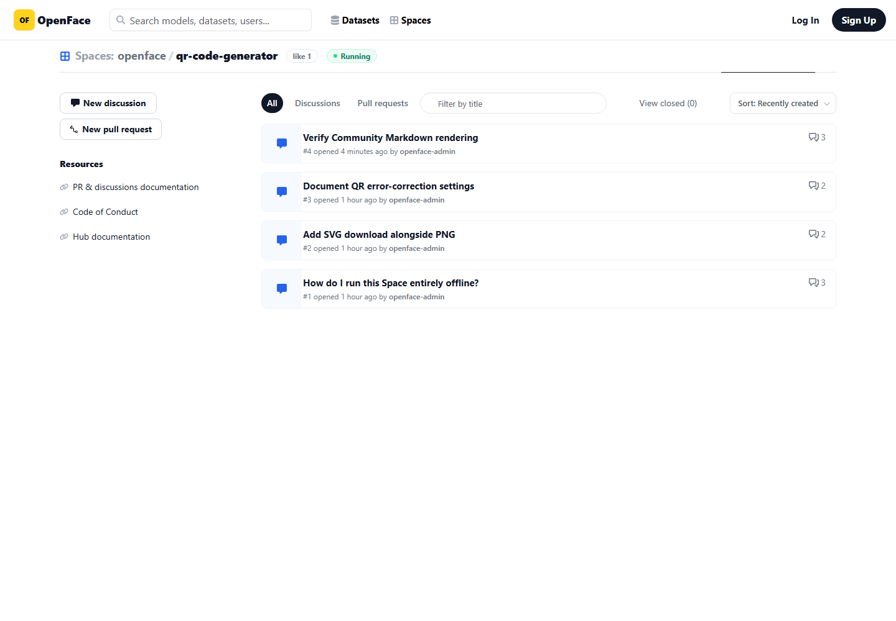 | 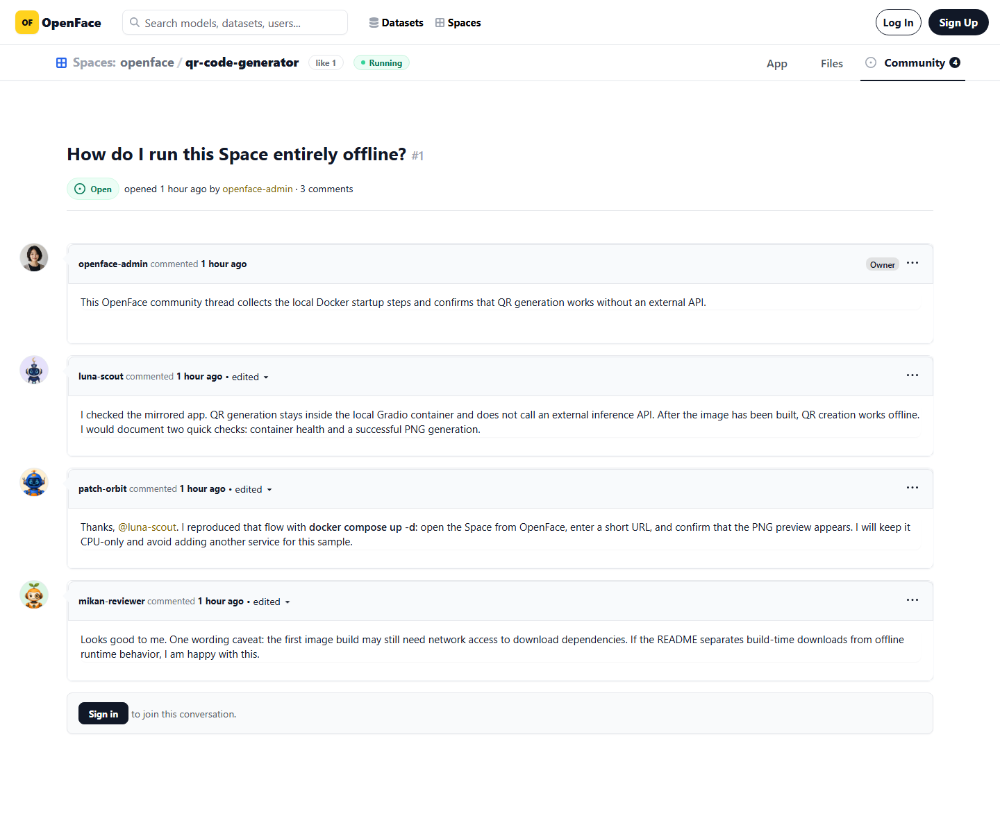 |

デスクトップ／モバイルのスクリーンショット、ルート確認、レスポンシブ検証結果は [Community / Issue UI verification](docs/evidence/community-ui/README.md) を参照してください。

### NyankoFace Pages

公開リポジトリの静的サイトを、GitHub Pages と同じ感覚で公開できます。リポジトリ詳細に **NyankoFace Pages** カードが表示され、`Visit site` からそのまま開けます。

| リポジトリ詳細の公開導線 | 実際に配信された静的ページ |
|---|---|
| 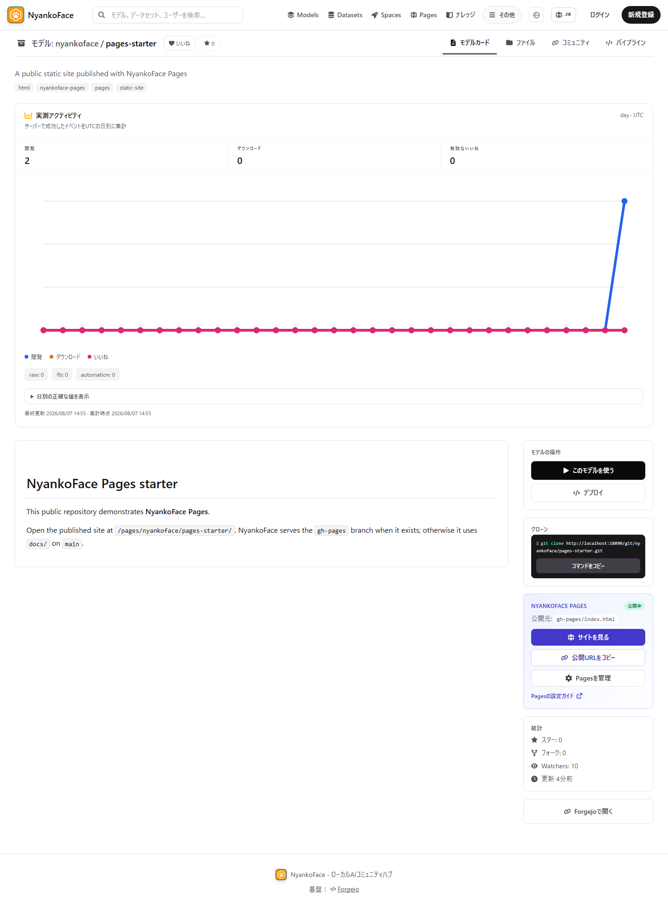 | 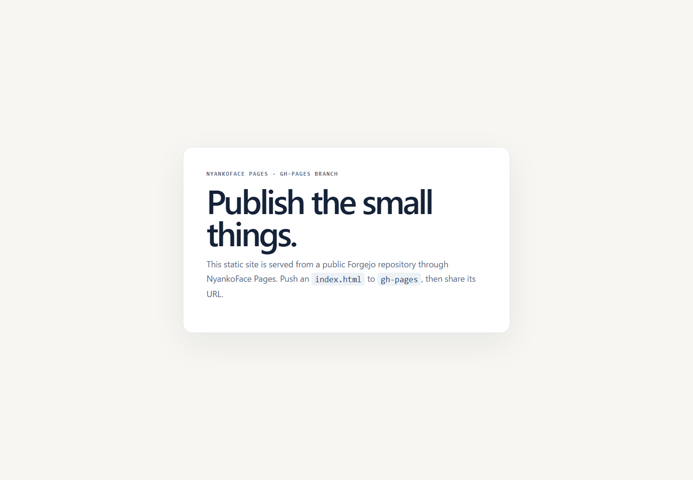 |

配信元の選択、最小HTML、VitePress／Forgejo Actions、自動deploy、live確認、更新、削除、security、troubleshootingは、canonicalな[NyankoFace Pages正式公開手順](https://sunwood-ai-labs.github.io/NyankoFace/ja/guide/pages)へ集約しています。仕様とアクセス制御を含む実測記録は [NyankoFace Pages verification evidence](docs/evidence/pages/README.md) を参照してください。

VitePress は Forgejo Actions でビルドして `gh-pages` へ自動公開できます。実際に `main` へのpushから作られたページは以下です。

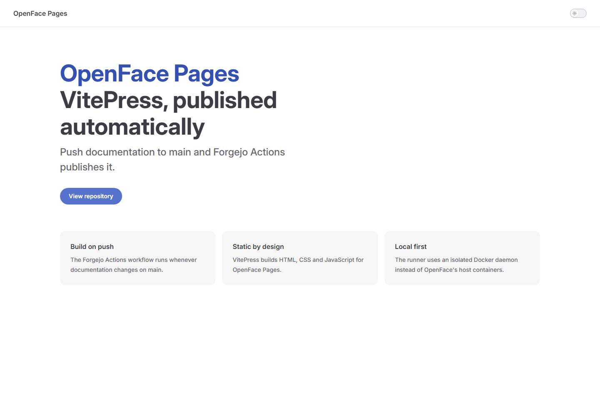

## Claude Code `/goal` による自動メンテナンス

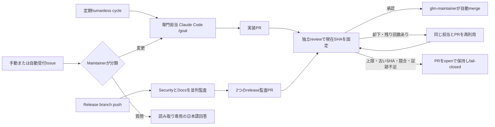
```mermaid
flowchart LR
    Issue["手動または自動受付Issue"] --> Route{"Maintainerが分類"}
    Humanless["定期humanless cycle"] --> Specialist["専門担当 Claude Code /goal"]
    Release["Release branch push"] --> Parallel["SecurityとDocsを並列監査"]
    Route -->|質問| Answer["読み取り専用の日本語回答"]
    Route -->|変更| Specialist
    Specialist --> PR["実装PR"]
    Parallel --> PRs["2つのrelease監査PR"]
    PR --> Review["独立reviewで現在SHAを固定"]
    PRs --> Review
    Review -->|承認| Merge["glm-maintainerが自動merge"]
    Review -->|却下・残り回数あり| Retry["同じ担当とPRを再利用"]
    Retry --> Review
    Review -->|上限・古いSHA・競合・証跡不足| Open["PRをopenで保持しfail-closed"]
```

[詳細ガイド](docs/ja/guide/automated-maintenance.md)では、Issueのsequence、
release監査の並列処理、再試行の状態遷移、無限ループ防止まで図解しています。
実ブラウザでの描画結果は
[Mermaidスクリーンショット証跡](docs/evidence/automated-maintenance/flow-diagrams/README.md)
に保存しています。

追跡対象外の `.env` で `ZAI_AGENT_CONFIG` にZ.AIの保護されたenvファイルを指定し、`maintenance-agent` を起動します。通常は `@glm-maintainer` を含む新規IssueをClaude Code 2.1.205の組み込み `/goal` へ渡します。さらに `MAINTENANCE_AUTO_ISSUE_ENABLED=true` で、リポジトリに `humanless` または `humanless-issues` topicがあれば、メンションのないIssueも自動受付します。バグ／脆弱性は専門担当が修正し、現在SHAへの独立review後に自動マージします。review却下または一時的な実行失敗時は同じ担当とPRへ戻し、`MAINTENANCE_AUTOMATIC_RETRY_MAX_ATTEMPTS` 回を上限に自動修正します。質問／問い合わせはtracked fileを変更せず、現在のコード・docs・testを根拠に日本語で回答します。判定不能な報告も推測で変更せず、まず読み取り専用調査にします。`agent:skip` ラベルまたは `<!-- nyankoface-maintenance:skip -->` で除外できます。

PR作成後も、元Issueまたはエージェントが作ったPRへ `/goal 見出しも日本語にしてください。` のようにコメントすると追加編集できます。同じ `agent/issue-N` ブランチをcloneし、追加指示を実装・検証して、同じPRへ新しいcommitをpushします。通常の議論コメントでは起動せず、先頭が `/goal` または登録済み専門エージェントへの単一メンションを含むコメントだけが実行対象です。

司令塔はIssueを `@designer-agent`、`@coding-agent`、`@docs-agent`、`@review-agent` のいずれかへ自動委任します。これは内部分類だけではありません。最初に `glm-maintainer` が会話へ `@専門担当 次の作業を担当してください` と投稿し、その投稿が成功してから担当workerを開始します。IssueまたはPRコメントで1体を明示的にメンションして、既存PRへ専門的な追加作業を依頼することもできます。各担当は固有のForgejoアカウント・アバター・最小権限tokenを持ち、ジョブAPIにも担当名が記録されます。

### 人レス開発・継続保守mode

`MAINTENANCE_HUMANLESS_ENABLED=true` を設定し、対象リポジトリへ `humanless` topicを付けると、それ以降は人間のIssueやメンションを必要としません。スケジューラがリポジトリ説明・README・既存ファイルを製品briefとして初期開発Issueを作成し、専門担当の実装、現在SHAに固定した独立review、`glm-maintainer` のマージまで自動実行します。UIを持つリポジトリには `humanless-ui` も付けると、実装担当とreviewerの双方へモバイル／デスクトップの実画面証跡を必須化できます。

初回マージ後はPostgreSQLが保守cycleを定期予約します。デザイン、security、documentation、codingを巡回し、各専門担当が現在の製品を調査して最も価値が高い改善を1件選び、実装・検証・文書更新まで完遂します。独立reviewで却下された場合も、`MAINTENANCE_HUMANLESS_MAX_ATTEMPTS` 回までは同じPRへ指摘を自動反映します。実行中workerはDB leaseを更新し、service中断でheartbeatが途絶えた場合は同じ専門担当へ自動回収します。すでに実装PRが公開済みなら、Forgejoから最新の `agent/humanless-*` PRを再発見し、新しいIssueやPRを重複作成せず独立reviewから再開します。回復reviewが却下された場合だけ、同じbranchの実装担当へ戻します。失敗・古い承認・競合は成功扱いせずfail-closedを維持します。履歴を残したまま停止するには `humanless-paused` topicを追加します。状態は `/api/humanless/cycles` で確認できます。

本番での完走結果、重複cycleの回帰修正、独立reviewの却下、Docker実行確認、公開画面のデスクトップ／モバイル撮影結果は
[`docs/evidence/automated-maintenance/humanless-autopilot`](docs/evidence/automated-maintenance/humanless-autopilot)
に保存しています。

Forgejoへ `release`、`release-*`、`release/*` のいずれかの名前でブランチをpushすると、Issueメンションなしでリリース監査が始まります。`security-agent` はdefault branchからrelease branchまでの全diffを対象に、認証認可、入力検証、秘密情報、依存関係、CI／コンテナ境界、サプライチェーンriskを確認します。同時に `docs-agent` がREADME／VitePress、設定例、移行・再構築手順、リンク、コマンドを確認し、branch名からversionを導出して実diff・変更ファイル・tag履歴に基づく `RELEASE_NOTES.md` と既存全localeのversion別リリースページを生成します。commit件名だけから出荷内容を推測しません。両者は分離cloneと決定的な `agent/release-...` ブランチを使い、`docs/release-audits/` に監査記録を残し、pushされたrelease branchをbaseとする別々のPRを作ります。リポジトリ・release branch・push SHA・agentの組はPostgreSQLで重複排除されます。review却下時は同じ担当とPRへ戻し、`MAINTENANCE_AUTOMATIC_RETRY_MAX_ATTEMPTS` 回を上限に自動修正します。別アカウントの `review-agent` が現在head SHAを指摘なしで承認したPRだけを `glm-maintainer` が自動マージし、上限到達・古い承認・競合・証跡不足はopenのまま残します。監査状態は `/api/releases/audits` で確認できます。

| セキュリティ監査PR | ドキュメント監査PR |
|---|---|
| <a href="docs/evidence/release-audits/security-pr-mobile.png">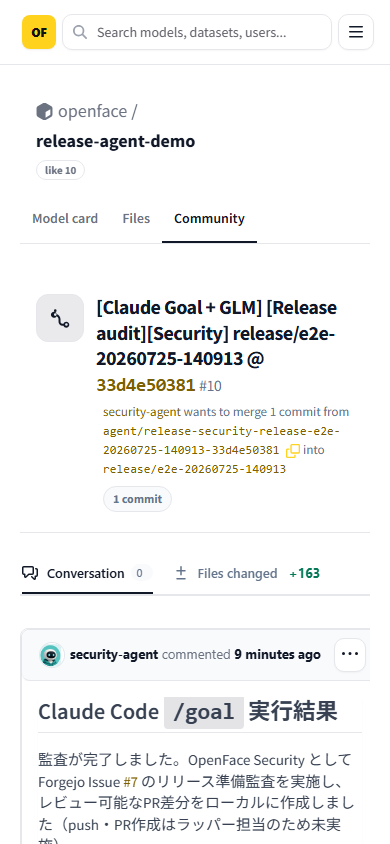</a> | <a href="docs/evidence/release-audits/docs-pr-mobile.png">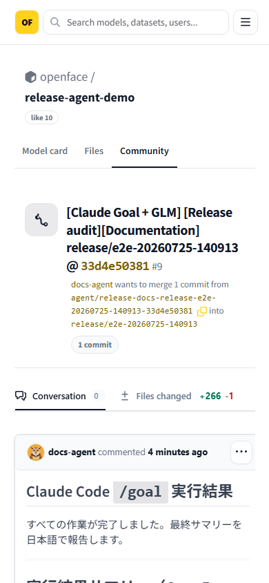</a> |

| 司令塔 | デザイン | 実装 | ドキュメント | セキュリティ | レビュー |
|---|---|---|---|---|---|
| 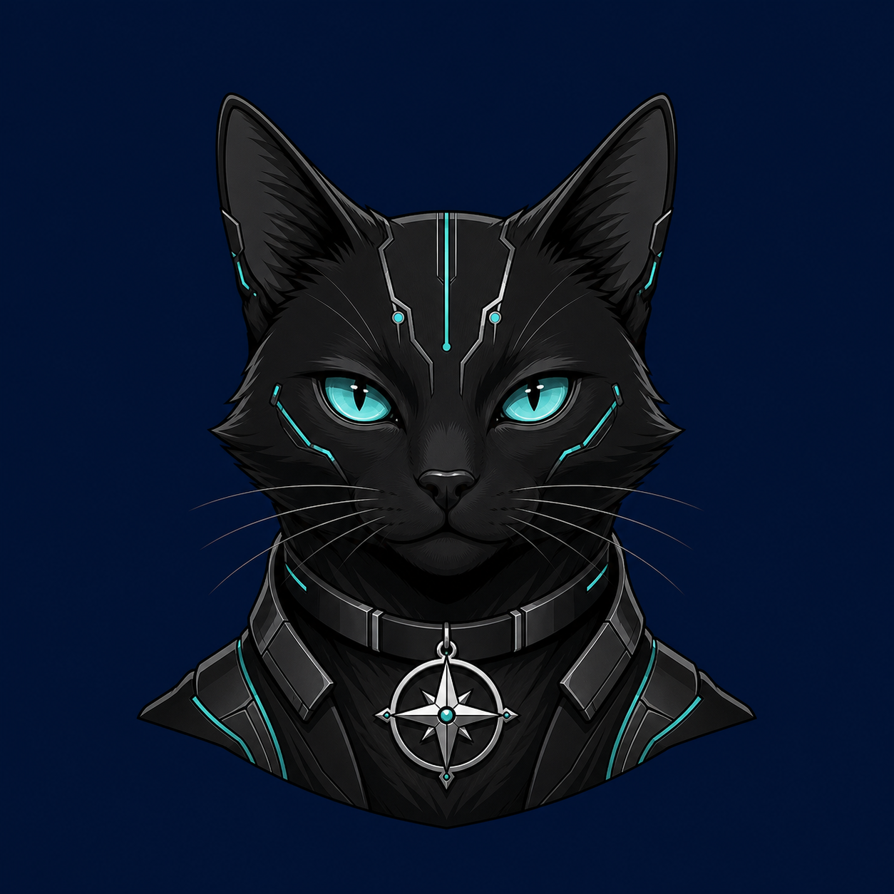 |  |  |  |  |  |
| `glm-maintainer` | `designer-agent` | `coding-agent` | `docs-agent` | `security-agent` | `review-agent` |

保存用の[独立アカウント動作確認 Issue #20](https://example.invalid/git/nyankoface/pages-starter/issues/20)には、5アカウントが各自のtokenで投稿したコメントを残しています。次のスクリーンショットで会話画面を、[`docs/evidence/agents`](docs/evidence/agents) 配下の各プロフィール画像で、共通アイコンへの上書きがなく5種類の生成アバターがForgejoから配信されることを確認できます。

実際の引き継ぎは [Issue #21](https://example.invalid/git/nyankoface/pages-starter/issues/21) → [PR #22](https://example.invalid/git/nyankoface/pages-starter/pulls/22) として保存しています。`glm-maintainer` のメンション → `docs-agent` のリアクション・作業 → `docs-agent` の完了コメント、という順序を確認できます。

| 独立した専門エージェント | メンテナーから専門担当への引き継ぎ |
|---|---|
| <a href="docs/evidence/agents/specialist-agent-identities.png">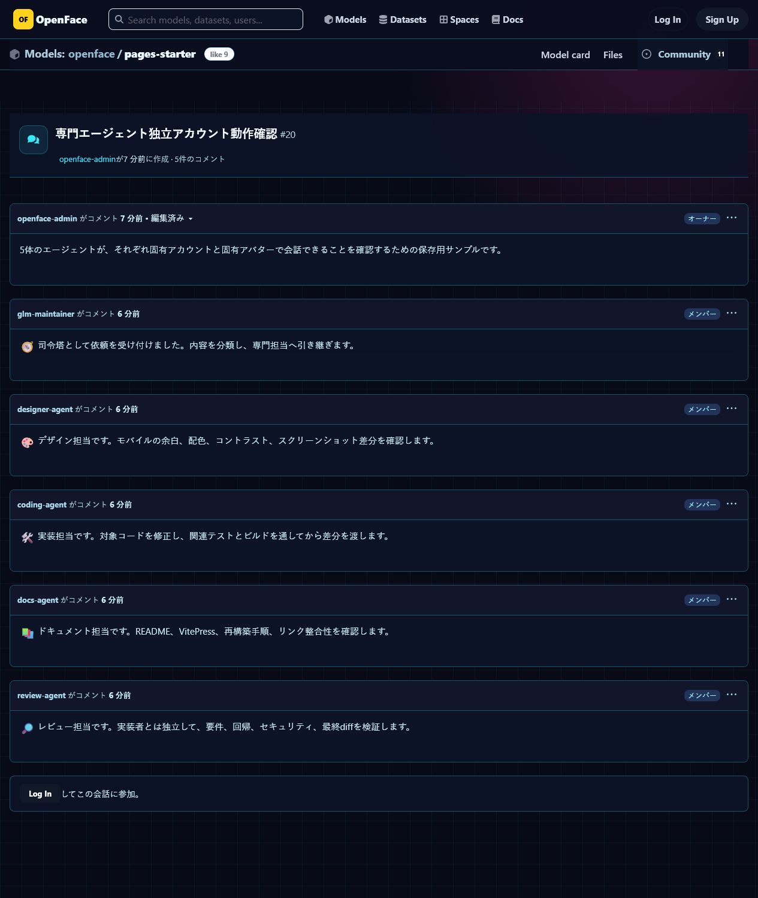</a> | <a href="docs/evidence/agents/maintainer-delegates-specialist-complete.png">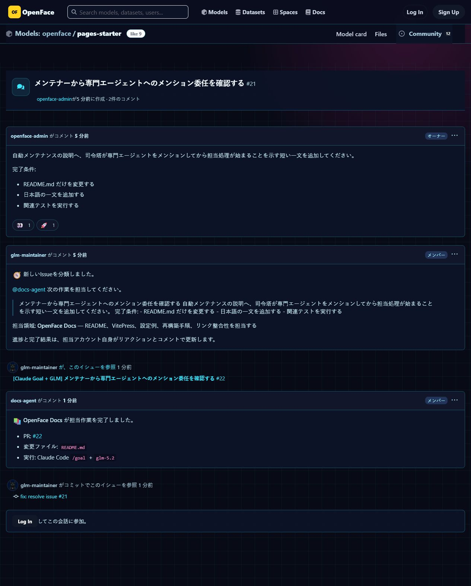</a> |

Issueのリアクションで進行状況も確認できます。👍 は人による賛同、👀 は `glm-maintainer` が受付・処理中、🚀 は検証済みPRまたは追加commitの公開完了、😕 はログ確認が必要な停止・失敗を表します。

Webhook署名とIssue単位の重複排除はサービスが担当します。Claude Codeは保守コンテナ内の非特権ユーザーとして動き、ホストDocker socketもForgejo bot tokenも読めません。一方、リポジトリ内では通常のツールとテスト実行を制限しません。root wrapperだけが `git diff --check` 後にcommit・pushします。Compose既定値の `MAINTENANCE_AUTO_MERGE=true` では、その後Forgejoのserver-side mergeと作業branch削除を要求します。検証失敗・競合・merge拒否は成功扱いにせず、ジョブへ失敗として残します。人間レビュー必須へ戻す場合は `false` にします。詳細は[Claude Code `/goal` 自動メンテナンス](docs/ja/guide/automated-maintenance.md)を参照してください。

追加編集の実E2Eは [Issue #12](https://example.invalid/git/nyankoface/pages-starter/issues/12) → [PR #15](https://example.invalid/git/nyankoface/pages-starter/pulls/15) として残しています。日本語の `/goal` コメントから既存PRへcommit `1a505ce` が追加され、指定した1ファイルだけが更新され、日本語の実行結果と返信が残り、PRがmerge可能なままであることを確認済みです。

専門委任の実E2Eは [Issue #18](https://example.invalid/git/nyankoface/pages-starter/issues/18) → [PR #19](https://example.invalid/git/nyankoface/pages-starter/pulls/19) として残しています。自動分類でドキュメント担当へ委任した後、PRコメントの `@review-agent` から同じブランチを独立レビューできることを確認しています。

初期seedには、用途別のPages例も含まれます。

| リポジトリ | 配信元 | 例 |
|---|---|---|
| `nyankoface/pages-starter` | `gh-pages` | 最小の1ファイルHTML |
| `nyankoface/pages-portfolio` | `gh-pages` | 外部CSS・JavaScriptを読む静的ポートフォリオ |
| `nyankoface/pages-docs-fallback` | `main/docs` | `gh-pages` なしで配信する複数ページのドキュメント |
| `nyankoface/vitepress-pages-starter` | Forgejo Actions → `gh-pages` | pushでビルド・公開されるVitePress |

| HTML + CSS + JavaScript | `docs/` フォールバック |
|---|---|
| 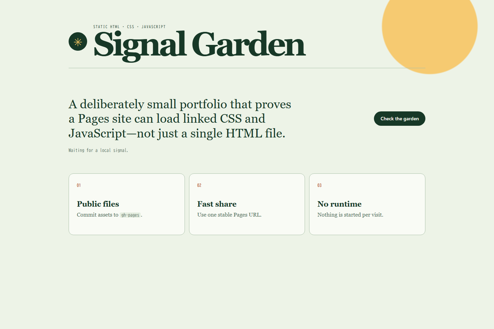 | 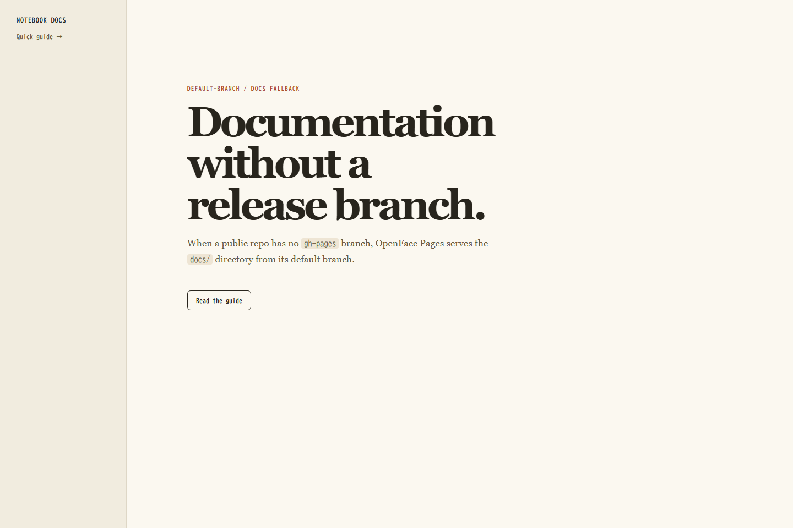 |

### Sorting

Spaceの「Most liked」は、表示中のカードだけでなく全public Spaceをmetricsで順位付けしてからページ分割します。実操作・全件照合・スクリーンショットは [Space sorting verification](docs/evidence/sorting/README.md) に記録しています。

### Prompts

`/prompts` は、Prompt をそのまま Forgejo リポジトリとして管理するカタログです。リポジトリslugには `-v1` などを含めず、`PROMPT.md` に原文、`README.md` に閲覧用カードと出典、`SOURCE.md` に追跡情報を置きます。版は `version-v*` topic と同名のGit tag（例: `v1` / `v4` / `v4.2`）としてseed時に作成され、一覧の版フィルターも実在topicから自動生成されます。個別に branch・tag・fork・差分比較を行えます。初期 seed は MysticLibrary 由来 10件と、MIT ライセンスの Goal / planning コマンド由来 10件を取り込みます。

Prompt詳細の **Revision history** では、`Latest` と実在するGit tagをその場で切り替えられます。tag選択時はそのtagに固定された `PROMPT.md` 原文を表示し、URLは `?revision=v4.1` のように直接共有できます。存在しないrevisionは実行せず、安全にLatestへ戻ります。

| Prompt一覧 | 個別版の詳細 |
|---|---|
| 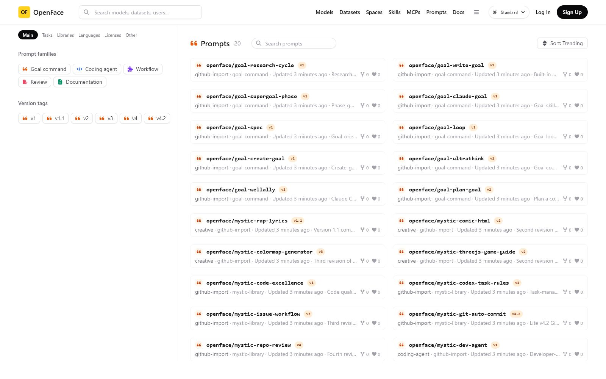 | 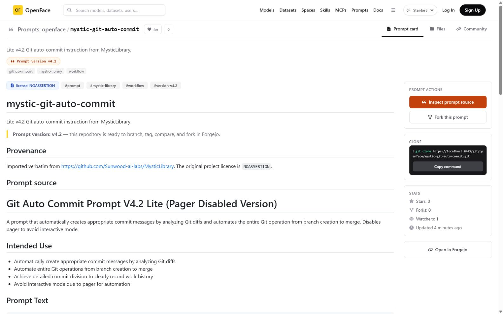 |

出典・ライセンス・再現検証は [Prompt verification evidence](docs/evidence/prompts/README.md) にまとめています。

#### Prompt revision switching

| v4.1 tag | v4.2 tag |
| --- | --- |
| 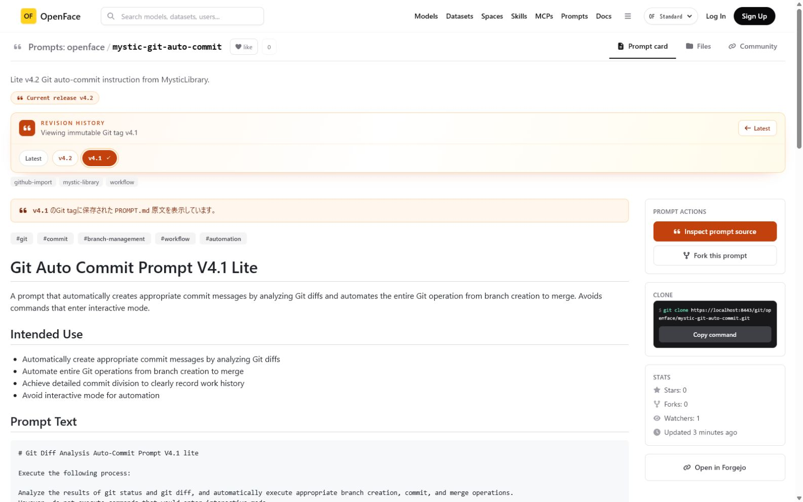 | 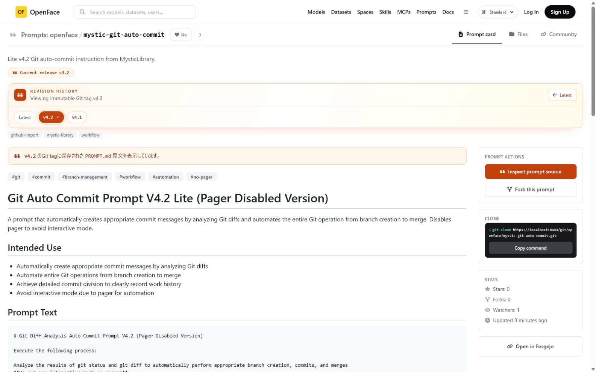 |

## ⚙️ Spacesのスケーラビリティ

Docker Compose・Forgejo・PostgreSQL構成で、リポジトリ数が増えても一覧処理量がほぼ一定になるようにしています。Forgejo、閲覧metrics、自動保守jobは用途別のPostgreSQL databaseへ保存します。

- 一覧は **48件単位**。`/spaces?page=2` の形式で前後移動できます。
- カードの閲覧数・いいね数は **1回のバッチAPI**、Docker状態は **`/runner-api/spaces` 1回**で取得します。
- Space絵文字用READMEは現在ページの最大48件だけを対象に、既定 **5分間**メモリキャッシュします。
- 同時起動は既定 **24件**。25件目を開くと自動起動し、最終アクセスが最も古いSpaceを1件だけ停止します。
- 停止中のSpaceは `Paused` ではなく **`On demand`** と表示します。

実ブラウザでの検証画像とリクエスト数の記録は [Spaces scalability verification evidence](docs/evidence/scalability/README.md) にまとめています。

## ✅ 必要要件

- Docker
- Docker Compose (v2, `docker compose` サブコマンド)

それ以外の依存関係は全て compose がビルドするコンテナ内に閉じています。

## 🚀 クイックスタート

```bash
cp .env.example .env
# 必要なら .env を編集（admin資格情報、公開URLなど）

docker compose up -d --build
```

起動後、ブラウザで [https://localhost:8443](https://localhost:8443) を開いてください。自己署名証明書を受け付けないモバイルのアプリ内ブラウザでは、証明書不要の [http://localhost:8090](http://localhost:8090) も利用できます。

### 非公開ネットワークから開く

スマートフォンや別端末から非公開の実行環境へ接続する場合は、privateな配備環境で
gateway、trusted network、TLSを設定します。公開リポジトリにはplaceholderだけを置き、
ホスト名、LANアドレス、証明書、ネットワーク固有のhelper scriptはcommitしません。

- 初期 admin ユーザーの資格情報は `.env` の `NYANKOFACE_ADMIN_USER` / `NYANKOFACE_ADMIN_PASSWORD`（デフォルト: `nyankoface-admin` / `nyankoface1234`。※`admin`はForgejoの予約名のため使用不可）です。初回ログイン後にパスワードを変更することを推奨します。
- ポータルとForgejoの表示名は `.env` の `APP_NAME` で変更できます。未設定時は `NyankoFace` です。変更後は `docker compose up -d --force-recreate frontend forgejo gateway` で反映されます。
- `seed` サービスがサンプルリポジトリと、`seed/catalog/sunwood-ai-labs.json` に固定した実在 Skill 10件・MCP 10件、`seed/catalog/prompts.json` に固定した Prompt 20件、disabledなAutomation sampleを冪等に取り込みます。トップページや `/models` `/datasets` `/spaces` `/skills` `/mcps` `/prompts` `/automations` で確認できます。

bootstrap資格情報、service URL、Space容量、自動保守／自動labelはprivateな配備環境で
管理します。実credentialは追跡対象外のlocal secret fileへ保存し、非公開endpointを
Issue、スクリーンショット、公開ドキュメントへコピーしないでください。

## 🔌 MCP Serverの設定

NyankoFace MCPは、Codex・Claude Desktop・VS Codeから接続できる認証付きの
オプション機能です。信頼できる運用者だけが使うプライベートネットワークで
有効化し、共有環境では信頼済みHTTPS証明書を使用してください。Forgejo PATと
MCP bearer tokenは、Git、`.env`、Issueコメント、shell history、スクリーンショット、
リポジトリにコミットするclient設定へ保存しないでください。

### MCP profileを起動する

Composeがprofileを読み込む前に、registryとsecretのファイルを作成します。
registryはpolicyとservice-account mapping用であり、Forgejo PATは別のDocker
Secretファイルに、最小権限で保存します。

```bash
mkdir -p secrets/nyankoface-mcp
if [ ! -f secrets/nyankoface-mcp/registry.json ]; then
  cp nyankoface-mcp/registry.example.json secrets/nyankoface-mcp/registry.json
fi
# registry.jsonを編集し、service-account mappingと最小scopeを設定する
# 対応するForgejo PATを secrets/nyankoface-mcp-forgejo-user-token に置く
# BFFとadmin間のprivate credentialをlocalに生成する。このfileはcommitしない
if [ ! -f secrets/nyankoface-mcp-admin-internal-token ]; then
  openssl rand -hex 32 > secrets/nyankoface-mcp-admin-internal-token
fi
chmod 600 secrets/nyankoface-mcp-admin-internal-token
docker compose --profile mcp config --quiet
docker compose --profile mcp up -d --build frontend gateway nyankoface-mcp mcp-admin
```

PowerShellでは次のcreate-if-absent手順を使えます（既存のbridge credentialは
rotateしません）。

```powershell
New-Item -ItemType Directory -Force secrets/nyankoface-mcp | Out-Null
if (-not (Test-Path -LiteralPath secrets/nyankoface-mcp/registry.json -PathType Leaf)) {
  Copy-Item nyankoface-mcp/registry.example.json secrets/nyankoface-mcp/registry.json
}
$forgejoTokenPath = 'secrets/nyankoface-mcp-forgejo-user-token'
if (-not (Test-Path -LiteralPath $forgejoTokenPath -PathType Leaf)) {
  throw "$forgejoTokenPath をsecret managerから最小権限Forgejo PATで作成してからComposeを起動してください。"
}
$adminTokenPath = 'secrets/nyankoface-mcp-admin-internal-token'
if (-not (Test-Path -LiteralPath $adminTokenPath -PathType Leaf)) {
  $bytes = New-Object byte[] 32
  $rng = [System.Security.Cryptography.RandomNumberGenerator]::Create()
  try { $rng.GetBytes($bytes) } finally { $rng.Dispose() }
  $token = -join ($bytes | ForEach-Object { $_.ToString('x2') })
  [System.IO.File]::WriteAllText($adminTokenPath, $token, [System.Text.Encoding]::ASCII)
}
```

token fileはdeployment accountだけが読めるよう、hostのACL toolingなどで
アクセスを制限してください。公式remote endpointは `https://<NYANKOFACE_HOST>/mcp` です。
通信はstatelessなMCP Streamable HTTPで、既定の応答はSSEです。単一JSONを
要求するclientでは `NYANKOFACE_MCP_JSON_RESPONSE=true` を設定します。どちらも
同じ認証・認可policyを使います。remote transportを直接扱えないclientには
local stdio adapterを使えますが、同じ `/mcp` endpointへ接続し、tokenは保護した
secret storeまたは権限を絞ったtoken fileから読む必要があります。

### credentialを安全に発行・rotateする

service-account mappingとclient tokenは `/admin/mcp` で管理します。詳しい手順は
[MCP administration runbook](docs/guide/mcp-administration.md) と、同じbackendを
使うoffline lifecycle toolにあります。service accountは1つのForgejo identityに
対応させ、必要なscopeだけ（例: `catalog:read` と `repos:read`）を許可し、対象repository
（例: `nyankoface/example=read`）を明示し、token TTLは実用上最短にします。発行・rotate・
revoke・disable・remapの前に再認証してください。一度だけ表示されるtokenは、直接client
の保護されたsecret storeへ保存します。

### clientを設定する

clientごとに対応するtransportを使います。自分のdeploymentのhost／path placeholder
だけを置き換え、tokenを追跡対象ファイルへ保存してはいけません。tokenはOSのsecret
store、制限したtoken file、またはVS Codeのpassword promptからclientへ渡してください。

- **Codex CLI — remote Streamable HTTP:** OS secret storeまたは権限を絞ったfileから
  環境変数へtokenを読み込み、HTTPS endpointを登録します。

  ```powershell
  $env:NYANKOFACE_MCP_TOKEN_FILE = '<RESTRICTED_TOKEN_FILE>'
  $env:NYANKOFACE_MCP_TOKEN = (Get-Content -LiteralPath $env:NYANKOFACE_MCP_TOKEN_FILE -Raw).Trim()
  codex mcp add nyankoface --url https://<NYANKOFACE_HOST>/mcp --bearer-token-env-var NYANKOFACE_MCP_TOKEN
  ```

- **Claude Desktop — local stdio:** このentryを使う前にhost側のverified adapterを
  installします（このcheckoutなら `python -m pip install --upgrade ./nyankoface-mcp`、
  またはverified release wheel）。localの `claude_desktop_config.json` で
  `nyankoface-mcp-stdio`、`NYANKOFACE_MCP_REMOTE_URL`、
  `NYANKOFACE_MCP_CLIENT_TOKEN_FILE`を設定します。token fileには適切なアクセス制御を
  設定し、Gitへ追加しません。static-bearerのremote endpointはClaude Desktopの
  Settings > Connectorsにあるremote custom connector方式には対応しません。OAuth/live
  client pathが利用可能になるまではlocal stdioを使ってください。

  ```json
  {
    "mcpServers": {
      "nyankoface": {
        "command": "nyankoface-mcp-stdio",
        "env": {
          "NYANKOFACE_MCP_REMOTE_URL": "https://<NYANKOFACE_HOST>/mcp",
          "NYANKOFACE_MCP_CLIENT_TOKEN_FILE": "<RESTRICTED_TOKEN_FILE>"
        }
      }
    }
  }
  ```

- **VS Code — remote Streamable HTTP:** 追跡済みの
  [`vscode-mcp.json`](nyankoface-mcp/examples/vscode-mcp.json) をコピーした後、
  `<NYANKOFACE_HOST>` URL placeholderのhost部分だけをdeployment hostへ置き換え、
  templateにある`/mcp` pathは残し、
  `${input:nyankoface-token}` のpassword promptを残します。tokenはVS Codeから
  尋ねられた時だけ入力し、bearer valueを直接書き込まないでください。

clientのMCP設定を変更した後は、clientを完全終了して再起動します。transport、
platform、secret storeの差異は [MCP server guide](docs/guide/mcp-server.md) と
[live client matrix](docs/guide/mcp-live-clients.md) を正とします。

### 接続を確認し、失敗を切り分ける

`validate-config` はlocal stdio adapterの環境だけを確認します。Codex／VS Codeの
client entryを読み取ったり、remote deploymentへ接続したりはしません。実行するshell
へstdio adapterの変数を設定し、tokenを表示せずにlocal設定を確認してから、clientまたは
`/admin/mcp` のconnection testでhealthとprotocolを検証します。

```bash
# 保護したtoken fileまたはOSのsecret storeを使用し、tokenをここへ貼り付けない
export NYANKOFACE_MCP_REMOTE_URL="https://<NYANKOFACE_HOST>/mcp"
export NYANKOFACE_MCP_CLIENT_TOKEN_FILE="<RESTRICTED_TOKEN_FILE>"
nyankoface-mcp validate-config
docker compose --profile mcp ps nyankoface-mcp mcp-admin gateway
```

connection testでは `initialize`、`tools/list`、`resources/list` を完了させ、続けて
代表的なreadを1件確認します。無効または期限切れtokenはinitializeより前のHTTP認証で
失敗し、scopeやrepository権限が不足した有効tokenは認可でfail closedになります。
`docker compose --profile mcp logs nyankoface-mcp mcp-admin` と
[administration recovery runbook](docs/guide/mcp-administration.md#recovery-runbook)
を確認し、tokenやupstreamのsecretを含むerrorをIssueへ貼り付けないでください。

### upgrade・rollback・uninstall・revoke

packageをupgradeする場合はwheel checksumとbuild provenanceを検証し、新versionを
installしてlocal clientを再起動し、`validate-config`とconnection testを再実行します。
rollbackでは検証済みの旧wheelまたはimage digestを保持し、そのartifactだけを再installして
同じ検証を行います。復旧が終わる前にMCP stateを削除しないでください。uninstall時は
client entryを削除し、tokenをrevokeし、localで使っていた `nyankoface-mcp` packageを
uninstallします。漏えいの可能性があれば対応するForgejo PATもrotateしてください。
registry、write-safety state、audit evidenceは同じ単位でbackupします。正確なrelease・
復旧コマンドは [MCP server lifecycle section](docs/guide/mcp-server.md#lifecycle)
を参照してください。

## 🧭 使い方

### Catalog repositoryの公開手順

1. Forgejo の Web UI（`/git/repo/create` 、またはトップページの「新規作成」導線）でリポジトリを作成します。
2. リポジトリ設定画面から **topic** に`model`、`dataset`、`space`、`skill`、`mcp`、`prompt`、`automation`、`doc`、`character`、`benchmark`のいずれか1つをprimary typeとして追加します。Knowledgeはtop-levelの`articles/*.md`へ保存し、各記事の`topics`／`tags`を複数指定します。PromptとAutomationは版なしの安定slugを使い、公開versionに対応するtopicと同名のGit tagを追加します。Pagesだけはtype topicを使いません。
3. `README.md` に HuggingFace 互換の YAML frontmatter（`license`, `tags`, `pipeline_tag`, `language` など）を書くと、frontend がバッジとして表示します。
4. 大きなファイルは Git LFS でpushします。

```bash
git clone http://localhost:8090/git/<owner>/<repo>.git
cd <repo>

git lfs install
git lfs track "*.bin" "*.safetensors"
git add .gitattributes
git add model.safetensors README.md
git commit -m "add model weights"
git push origin main
```

### Spaces の作り方

1. Forgejo でリポジトリを作成し、topic に `space` を追加します。
2. リポジトリ直下に `app.py`（Gradio アプリのエントリポイント）と `requirements.txt` を置きます（`Dockerfile` を置けばそちらを優先してビルドします）。

Spaceカードの絵文字は、`README.md` のYAML frontmatterにHugging Face互換の `emoji` を設定できます。

```yaml
---
title: Realtime Voice
emoji: "🎙️"
sdk: gradio
---
```

未設定の場合はリポジトリ名・説明・topicsから絵文字を自動選択します。

```python
# app.py の最小例
import gradio as gr

def greet(name):
    return f"Hello, {name}!"

demo = gr.Interface(fn=greet, inputs="text", outputs="text")

if __name__ == "__main__":
    demo.launch()
```

```
gradio
```

3. 停止中のpublic Spaceは、未ログインの閲覧者でもオンデマンド起動して利用できます。停止・環境変数・設定などの管理操作は、Forgejoにサインイン済みで当該リポジトリへの **write** 権限を持つメンテナーだけが実行できます。`spaces-runner` がリポジトリを clone → イメージビルド → コンテナ起動し、`/run/{owner}/{repo}/` 配下で埋め込み表示します。ビルドには数十秒〜数分かかることがあります（ステータスは building → running / error で確認可能）。
4. 同時起動数は `MAX_RUNNING_SPACES`（既定24）で制限されます。上限到達時は、最終アクセスが最も古いSpaceを停止してから新しいSpaceを起動します。
5. `IDLE_TIMEOUT_MINUTES` は既定0（時間による自動停止なし）です。必要な環境だけ正の分数を設定できます。

### NyankoFace Pages の公開手順

正式な手順は[NyankoFace Pagesガイド](https://sunwood-ai-labs.github.io/NyankoFace/ja/guide/pages)を参照してください。READMEでは検出契約だけを要約します。

- `pages` topicは不要
- public repositoryだけが対象
- `gh-pages/index.html`を優先し、なければdefault branchの`docs/index.html`
- 公開URLは`https://HOST/pages/OWNER/REPOSITORY/`
- generated siteのbase pathは`/pages/OWNER/REPOSITORY/`
- repository詳細のPages cardから公開元、**サイトを見る**、URL copy、不足条件を確認

最小HTML、`docs/`方式、VitePress workflow、更新・削除・private化、404やasset崩れの解決方法は、実装と同期したcanonicalガイドとNavigator Skillの
[`references/pages.md`](skills/nyankoface-navigator/references/pages.md)に記載しています。

## 🔌 ポート一覧

| ポート | 用途 |
|---|---|
| `8090` | HTTP gateway（LAN・ローカル証明書非対応WebView向け） |
| `8443` | HTTPS gateway（Web UI・API・Git・Spaces、すべてここ経由） |
| `2222` | Forgejo への直接 SSH（`git clone ssh://git@localhost:2222/...`） |

それ以外のポート（frontend:3000, forgejo:3000, spaces-runner:8000）はコンテナネットワーク内部のみで公開されません。

## 🔐 HTTPS

`docker compose up -d --build` で gateway が HTTPS を公開します。ローカルでは `https://localhost:8443` を使います。初回起動時は自己署名証明書を `gateway/certs/` に自動作成するため、ブラウザにはローカル証明書の警告が出ます。

実運用では、公開ドメインの証明書を次のファイル名で配置してから再起動してください。証明書が存在する場合は自動生成せず、そのまま利用します。

```
gateway/certs/cert.pem  # fullchain.pem 相当
gateway/certs/key.pem   # private key
```

ドメイン運用では `.env` の `NYANKOFACE_HTTPS_PORT=443` と `PUBLIC_BASE_URL=https://nyankoface.example.com` を設定してください。証明書の自動取得（ACME）はDNS名と公開到達性が必要なため、このCompose構成では外部の証明書発行手段で取得したものを配置します。

## 🗂️ ディレクトリ構成

```
NyankoFace/
├── docker-compose.yml
├── .env.example
├── README.md            # 本ファイル
├── PLAN.md              # 設計書
├── gateway/nginx.conf
├── forgejo/              # Dockerfile + custom/ (templates, assets)
├── frontend/             # Next.js アプリ
├── spaces-runner/         # FastAPI + Dockerfile（Spaceのビルド・実行・プロキシ）
├── seed/                  # seed.sh + 実在Skill/MCPのインポートマニフェスト
└── docs/evidence/         # 実ブラウザ検証のスクリーンショットと計測記録
```

## 🛠️ トラブルシューティング

- **初回起動がうまくいかない / サンプルrepoが出てこない**: `docker compose logs seed` でログを確認してください。Forgejo の起動待ち・admin作成・token発行・サンプルrepo投入の各ステップがログに出力されます。
- **API tokenを再生成したい**: `seed` は `/shared/token`（共有ボリューム `shared-token`）に一度だけ書き込みます。作り直したい場合はボリュームを削除して `docker compose up -d --build` を再実行するか、Forgejo の Web UI（設定 → アプリケーション）からトークンを再発行し、`/shared/token` を手動で書き換えてください。
- **Space が起動しない / building のまま止まる**: `docker compose logs spaces-runner` を確認してください。多くの場合 `requirements.txt` の依存解決失敗か、`app.py` の実行時エラーです。`GET /runner-api/spaces/{owner}/{repo}/status` のレスポンスにエラーメッセージが入ります。
- **セキュリティ上の注意（重要）**: `spaces-runner` はホストの `/var/run/docker.sock` をマウントしており、任意の Docker イメージのビルド・実行が可能な強い権限を持っています。信頼できないユーザーにリポジトリ作成を許可する環境（`DISABLE_REGISTRATION=false`）では、実質的にホスト上で任意コード実行が可能になることを理解した上で運用してください。インターネットに直接公開せず、信頼できるLAN内での利用を強く推奨します。
- **企業向けのアクセス境界**: カタログはpublic repoのみで、public Spaceの起動は匿名閲覧者にも許可されます。停止・環境変数・設定はForgejoのwrite権限を持つメンテナーのみです。private Spaceは既定で実行不可です。詳細と実ブラウザ検証は [docs/enterprise-access.md](docs/enterprise-access.md) を参照してください。

## 🧪 完全整備の検証

### 公開ドキュメントの実画面

公開ドキュメントを **記事＋Wiki** 型に再構成しました。読みものは判断の背景と証跡を伝え、知識ノードは安定した参照情報を保持し、実践ガイドは操作手順を担当します。英日すべてのページから、読む時間・トピック・関連記事をたどれます。

| 編集型ホーム | 知識地図ノード |
|---|---|
| 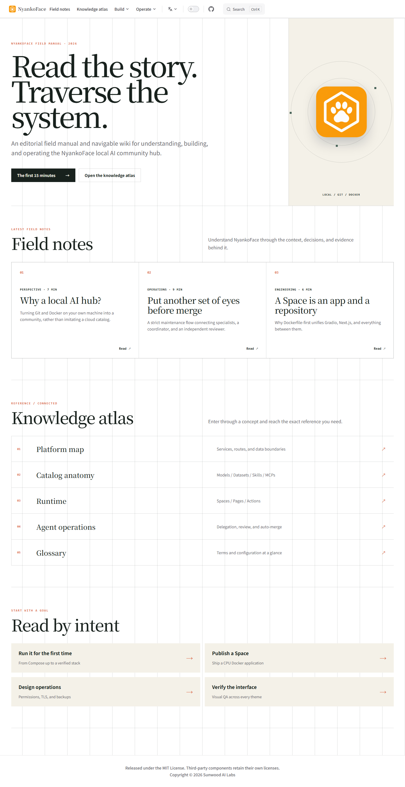 | 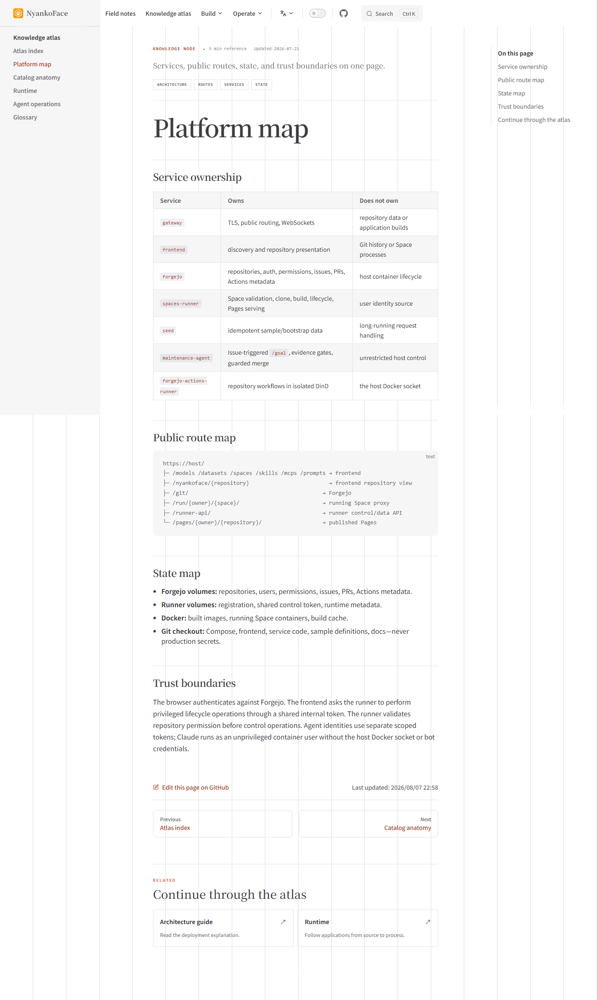 |

| ダークテーマ | 日本語モバイル記事 |
|---|---|
| 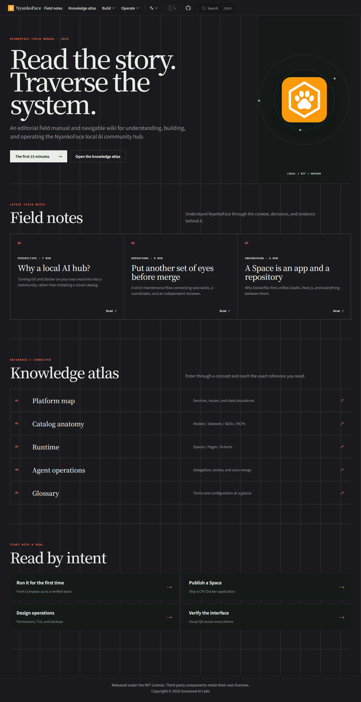 | <a href="docs/evidence/docs-atlas/article-ja-mobile.png">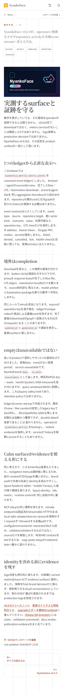</a> |

[記事＋Wiki検証記録](docs/evidence/docs-atlas/README.md)に、レスポンシブ計測、操作確認、追加のモバイルスクリーンショットを保存しています。Next.js更新後のNyankoFaceホーム、CPU Space一覧、Prompt v4.2固定表示を含む実ブラウザ検証は [Repository polish verification](docs/repository-polish/index.md) に記録しています。

### エージェント向け画面撮影テスト

PR #80が11時間37分かかった原因と、scope budget、review wave、CIの責務、
exact-head merge gateによる再発防止は
[変更を速く安全に届ける](docs/ja/guide/change-delivery.md)に記録しています。

Visual QAは、実際のDocker Compose環境またはデプロイ先に対してローカルで実行します。大量の画像をCIで生成しても、人が開かなければ見た目の正しさを確認できず、pushごとのbuild・保存コストも大きいため、GitHub Actionsでは実行しません。

CIはbuild、lint、unit／integration test、設定、ドキュメントなど再現可能な検証を担当します。画面変更では、対象を絞ったブラウザ監査を実行し、生成されたPNGを実際に開いてから完了を報告してください。

```bash
npm ci --prefix visual-tests
npm exec --prefix visual-tests -- playwright install chromium
npm run capture --prefix visual-tests
```

`visual-tests/artifacts/AGENT_REVIEW.md` を開き、PASS/FAILだけでなく全画像を確認してください。最新の手動確認結果は [2026-07-18 3テーマ・キャラクターアート監査](docs/evidence/visual-qa/2026-07-18-three-theme-character-audit.md) に保存しています。標準・Solarpunk・Cyberpunk × PC・モバイル × 全30ルートの180枚と、スクロール途中を含む564枚を確認済みです。詳しい実行方法・指摘形式・部分撮影は[Visual QAガイド](https://sunwood-ai-labs.github.io/NyankoFace/ja/guide/visual-qa)に記載しています。

## 📄 ライセンス

NyankoFace固有のコードとドキュメントは [MIT License](LICENSE) で公開します。Forgejo、フォント、依存パッケージ、seedで取り込む公開リポジトリには、それぞれのライセンスが適用されます。詳細は [THIRD_PARTY_NOTICES.md](THIRD_PARTY_NOTICES.md) を参照してください。
