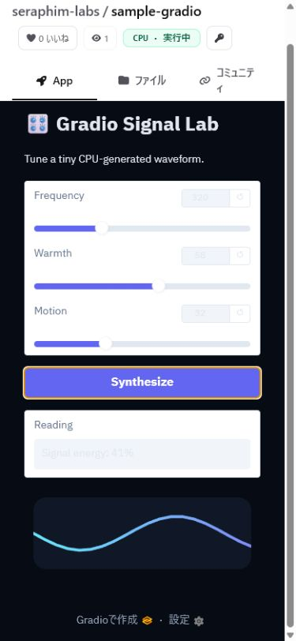

# Enterprise access control

NyankoFace uses Forgejo as the source of truth for repository visibility and membership. The public catalog only exposes public repositories. Public apps are consumable without an account, while management operations remain permission-gated.

| Use case | Expected result | Verification |
| --- | --- | --- |
| Visitor / unauthenticated employee | Can browse, start, and use public Spaces, but cannot stop or configure them. | Anonymous `POST /api/spaces/.../start` returns **200**; anonymous `stop` returns **401**. |
| Project viewer | Has the same public-app access as any visitor and no management access. | Start enters `building` / `running`; management endpoints remain denied. |
| Project maintainer | Can start, stop, and configure the public CPU Space attached to their project. | A collaborator with `write` access receives **200** from management endpoints. |
| Confidential project | Is not listed in NyankoFace's public catalog and cannot be executed by the shared runner. | Private Space start is rejected (**403** through control API, **404** at runner verification). |

The browser-facing start API first verifies through Forgejo that the target is a public repository carrying the `space` topic. It then forwards only the start request through the internal runner control token. Stop and environment controls additionally validate the Forgejo session through the new-file permission page; Forgejo's REST API intentionally does not accept browser session cookies.

Private Space execution is intentionally disabled by `NYANKOFACE_ALLOW_PRIVATE_SPACES=false`. For confidential code, keep the repository private and use Forgejo's native team/repository ACL. Enabling private execution needs an identity-aware app proxy and a dedicated runner isolation design; it is not enabled by this local deployment.

## Browser evidence

The stopped CPU Space now offers an anonymous **Start** action and clearly explains that public Spaces do not require sign-in. The second capture proves that the real Gradio app started inside the NyankoFace frame and accepted a synthesis operation.

| Anonymous on-demand screen | Running and interactive app |
| --- | --- |
|  |  |
