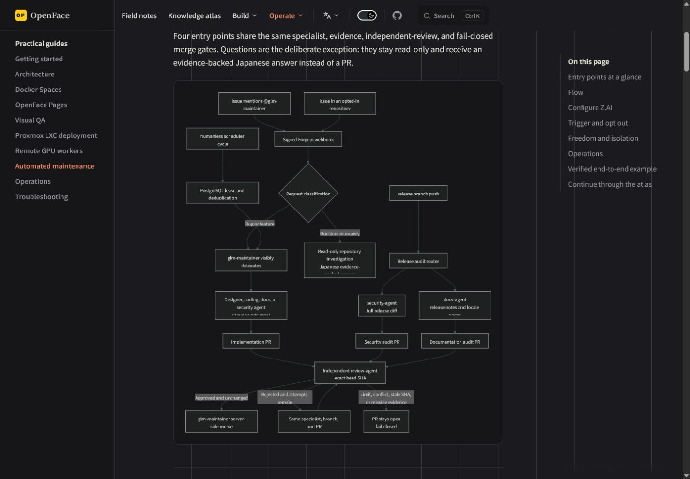
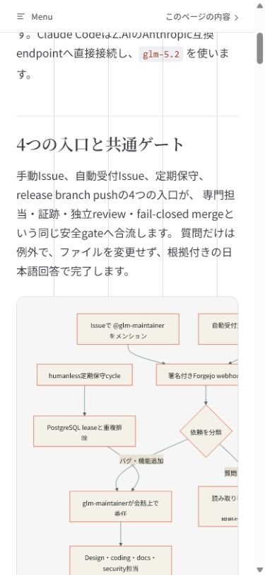

# Automated-maintenance Mermaid visual verification

This packet verifies that the automated-maintenance Mermaid sources are
rendered as real SVG diagrams in the public VitePress documentation.

## Browser matrix

| Route | Viewport | Theme | Result |
| --- | --- | --- | --- |
| `/guide/automated-maintenance` | 1440 × 1000 | dark | 5 diagrams rendered; no Mermaid code blocks; no page overflow |
| `/ja/guide/automated-maintenance` | 390 × 844 | light | 5 diagrams rendered; diagram containers scroll without page overflow |

Both routes reported zero console errors or warnings. The mobile diagrams keep
a 640 px internal canvas inside a horizontally scrollable 325 px container, so
labels remain readable without widening the page.

| Dark desktop overview | Japanese mobile overview |
| --- | --- |
|  |  |

## Mechanical verification

```text
npm run docs:check
Documentation validation passed

npm run docs:build
build complete
```

The rendered DOM contained five `.nyankoface-mermaid svg` elements and zero
`pre code.language-mermaid` elements on each locale route.
