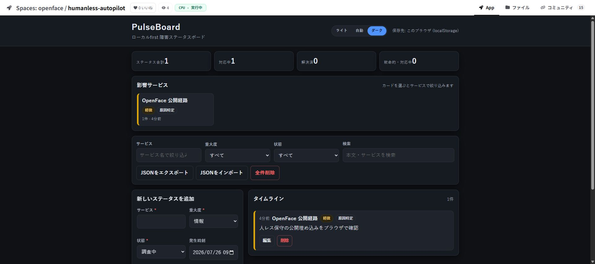
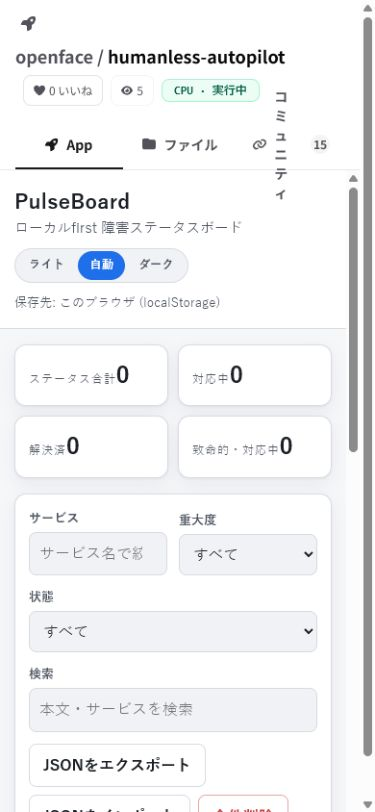

# Humanless autopilot production evidence

Captured on 2026-07-26 against a private deployment and the public
`nyankoface/humanless-autopilot` repository.

## Result

The post-fix scheduler is convergent. It keeps one active lease per repository,
does not create another cycle while that lease is alive, and schedules the next
successful run from the configured interval.

An earlier production defect did create empty superseded cycles 12–20. Repeated
scans were replacing the active row instead of preserving its lease. Commit
[`f3512c9`](https://github.com/Sunwood-ai-labs/NyankoFace/commit/f3512c9)
fixed that behavior and added regression coverage. Those old rows are kept as
audit evidence rather than deleted.

## Production cycles after the fix

| Cycle | Specialist | Result | Evidence |
|---|---|---|---|
| 21 | `coding-agent` | completed once | [Issue 18](https://example.invalid/git/nyankoface/humanless-autopilot/issues/18), [merged PR 19](https://example.invalid/git/nyankoface/humanless-autopilot/pulls/19), head `44334d3053c6157bfb476ddd4853146f9e25936e`, merge `50582c89dcf3596875cfc42f1240a557fc2af718` |
| 22 | `designer-agent` | completed once | [Issue 21](https://example.invalid/git/nyankoface/humanless-autopilot/issues/21), [merged PR 23](https://example.invalid/git/nyankoface/humanless-autopilot/pulls/23), head `b7c8e7097e48825da757b8e6a86562c5c30eb932`, merge `60b20f534726269ea9c8f5d556d4d813d0a4fd98` |
| 23 | `security-agent` | completed once | [Issue 24](https://example.invalid/git/nyankoface/humanless-autopilot/issues/24), [merged PR 25](https://example.invalid/git/nyankoface/humanless-autopilot/pulls/25), head `b5054dae4146d65ae4bfa9bc55196485ea9b110d`, merge `5f06dc315909c2211ee205a5e39448bd0e860dda` |

During cycle 23, `GET /api/humanless/cycles` reported a live lease updated on
every scan. `docker top` showed one specialist Claude process (plus its
`runuser` parent), not multiple workers for the repository. The specialist
published PR 25, the separate read-only `review-agent` approved that exact head
SHA after 94 unit tests, 11 build checks, 9/9 requirement checks, 22 browser
checks, and its own mobile/desktop screenshots. `glm-maintainer` then merged the
approved SHA. The completed row schedules the next run for
`2026-07-27T00:26:36Z`; no human comment or approval was supplied. The
five-minute production scan at `2026-07-26T00:30:45Z`, after completion and
merge, still reported cycle 23 as the latest cycle and did not create cycle 24.
This confirms that completed work is held until its daily reservation instead
of feeding an immediate maintenance loop.

Production uses:

```text
scan interval:          300 seconds
maintenance interval: 1440 minutes
retry interval:          60 minutes
maximum attempts:         3
stale lease timeout:    900 seconds
goal timeout:          3600 seconds
```

## Fail-closed review evidence

The public embed QA started at
[Issue 20](https://example.invalid/git/nyankoface/humanless-autopilot/issues/20).
The first independent review of
[PR 22](https://example.invalid/git/nyankoface/humanless-autopilot/pulls/22)
contained a failed Docker check. The wrapper rejected that review instead of
merging it. Commit
[`59738e3`](https://github.com/Sunwood-ai-labs/NyankoFace/commit/59738e3)
also ensures failed requirements and failed checks are included in retry
feedback.

The exact candidate was then built and run on the deployment Docker Engine:

```text
candidate head: 46d420ec...
image digest: sha256:df8a88c48a89b1700dd3fc4aca0698a991a5ba3abe666358c8c89d886b219390
container user: node
port: 7860/tcp
GET /healthz: 200 {"status":"ok","service":"pulseboard"}
embed headers: frame-ancestors 'self'; X-Frame-Options: SAMEORIGIN
```

After the repository recorded that evidence, the independent reviewer approved
head `8242911b3a4ea7c535d9043d36b2ff0fbd22a1d3`; `glm-maintainer` merged it as
`324ed8e697aa9d53911fa3c94c578afbd4007930`.

## Public browser verification

Public URL:
[NyankoFace Humanless Autopilot](https://example.invalid/nyankoface/humanless-autopilot)

The desktop browser test opened the real Space iframe, switched to dark mode,
created a Japanese incident entry, and reloaded the page. The timeline and
`localStorage` entry persisted; the public view counter increased from 1 to 4.
The separate 390 × 844 browser capture verified the mobile form and controls.

| Desktop, dark theme and persisted entry | Mobile, 390 × 844 |
|---|---|
|  |  |

## Repeatable checks

```powershell
docker compose exec -T maintenance-agent curl -fsS http://localhost:8010/api/humanless/cycles
docker compose logs --since=15m maintenance-agent
docker top nyankoface-maintenance-agent -eo pid,ppid,etime,args
```

Expected invariants:

- at most one `preparing`, `queued`, `running`, or `retrying` cycle per repository;
- repeated scans renew or preserve that cycle instead of inserting another;
- the next run is scheduled only after completion or bounded failure;
- merge requires an approval bound to the current head SHA;
- failed checks remain visible and are never converted into approval.
