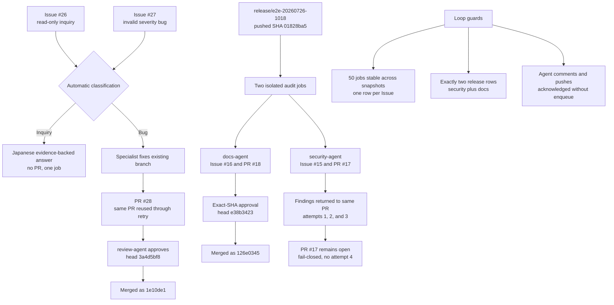

# Release and automatic Issue maintenance evidence

This evidence records the 2026-07-26 production verification of unattended
Issue intake and release-branch maintenance on a private deployment.

## Scope

- Forgejo: `https://example.invalid/git`
- Maintenance model: Claude Code `/goal` with `glm-5.2`
- Worker limit: `2`
- Automatic review / execution retry limit: `3`
- Humanless cycle interval: `1440` minutes
- Humanless retry limit: `3`

## Verified production flow

The diagram maps each retained fixture to the production path it actually
exercised. Green outcomes were merged or answered exactly once; the open
security PR is the intentional proof that an exhausted unsafe result does not
merge or enqueue a fourth attempt.



## Automatic Issue intake

| Scenario | Issue | Result |
| --- | --- | --- |
| Read-only inquiry | [`humanless-autopilot#26`](https://example.invalid/git/nyankoface/humanless-autopilot/issues/26) | Answered in Japanese from repository evidence; no PR was created |
| Bug report | [`humanless-autopilot#27`](https://example.invalid/git/nyankoface/humanless-autopilot/issues/27) | Reused and auto-merged [PR #28](https://example.invalid/git/nyankoface/humanless-autopilot/pulls/28) after a transient Z.AI disconnect and independent review feedback |

The bug fixture rejects an unknown imported severity without replacing the
previous valid backup. The specialist changed the existing agent branch instead
of opening another Issue or PR. The final reviewed head was
`3a4d5bf8c79be2b2ec71e809791f68a64a255051`; `review-agent` approved it with
focused logic tests, build checks, and browser behavior evidence. The wrapper
then produced merge commit `1e10de1cec154fdbc76dd7a22df55f3cb5ad5b8a`.

The E2E also exposed two review-boundary defects that were fixed in NyankoFace:

- a clean follow-up can now reuse the existing PR head without manufacturing a
  commit;
- a check failure proven identical on the comparison branch is represented as
  `baseline`, while focused checks for the Issue diff must still pass.

Missing project tooling is recorded as N/A in the summary rather than as a fake
pass or an invalid JSON result.

## Release audit

The functional release branch
`release/e2e-20260726-1018` was pushed at
`01828ba59c0e87d3fad57f26f398465ec54adbb9`. It contains an executable Python
release-summary helper and unit tests rather than a documentation-only marker.

| Gate | Issue | PR | Evidence |
| --- | --- | --- | --- |
| Security | [`release-agent-demo#15`](https://example.invalid/git/nyankoface/release-agent-demo/issues/15) | [PR #17](https://example.invalid/git/nyankoface/release-agent-demo/pulls/17) | Full default-to-release diff audit, executed security checks, residual-risk record |
| Documentation | [`release-agent-demo#16`](https://example.invalid/git/nyankoface/release-agent-demo/issues/16) | [PR #18](https://example.invalid/git/nyankoface/release-agent-demo/pulls/18) | Diff-backed `RELEASE_NOTES.md`, README update, versioned audit page, executed tests and Markdown checks |

The documentation PR targeted the release branch, was approved for exact head
`e38b3423d6bf484f09fc2f34bd7319d18ed65217`, and was auto-merged by
`glm-maintainer` as `126e0345290c72cbea0cec8780b647ba48b9ddae`.

The security review correctly rejected inaccurate evidence and later detected
accidentally committed Python bytecode. Both findings were returned to the same
Issue and PR. The third and final attempt removed the artifacts, added
`.gitignore`, and regenerated delivery-tree evidence. It then stopped with PR
#17 open because configured lint/type checks had not been executed and the
earlier bytecode commit remained reachable in PR history. This is the intended
fail-closed result: attempt 3/3 did not enqueue attempt 4.

## Loop-safety checks

- PostgreSQL contained exactly two audit rows for repository
  `release-agent-demo`, branch `release/e2e-20260726-1018`, and pushed SHA
  `01828ba59c...`: one `security-agent` row and one `docs-agent` row.
- Two production snapshots before and after the final runs, each 15 seconds
  apart, reported a stable 50 total jobs.
- Each of Issues #15, #16, and #27 had exactly one job row in both snapshots.
- Agent-authored comments and pushes returned accepted webhook responses but did
  not enqueue another run.
- Review rejection reused the same specialist, branch, and PR and exposed
  `attempt 2/3` and `attempt 3/3` visibly on Issue #15.
- The unit test
  `test_agent_authored_comment_cannot_requeue_its_own_issue` exercises the
  feedback-loop guard.
- Transient automatic failures and review rejections share one bounded retry
  counter. Exhaustion leaves the PR open and inspectable.

## Verification

```text
python -m unittest discover -s maintenance-agent/tests -q
Ran 65 tests
OK

cd docs
npm run docs:check
Documentation validation passed

npm run docs:build
build complete
```

Relevant CI runs:

- [`0e1c5b1` loop-guard CI](https://github.com/Sunwood-ai-labs/NyankoFace/actions/runs/30182178405)
- [`f062286` bounded-review-retry CI](https://github.com/Sunwood-ai-labs/NyankoFace/actions/runs/30182550397)
- [`de4dca9` subprocess-reaper CI](https://github.com/Sunwood-ai-labs/NyankoFace/actions/runs/30182875030)
- [`0726955` transient-retry CI](https://github.com/Sunwood-ai-labs/NyankoFace/actions/runs/30182946363)
- [`e8364f5` documentation CI](https://github.com/Sunwood-ai-labs/NyankoFace/actions/runs/30183173793)
- [`e8364f5` documentation build](https://github.com/Sunwood-ai-labs/NyankoFace/actions/runs/30183173802)
- [`94deb46` applicable-check policy CI](https://github.com/Sunwood-ai-labs/NyankoFace/actions/runs/30183925862)
- [`1119469` clean-follow-up CI](https://github.com/Sunwood-ai-labs/NyankoFace/actions/runs/30185537459)
- [`202e2a5` review-schema CI](https://github.com/Sunwood-ai-labs/NyankoFace/actions/runs/30186290034)
- [`08a8470` baseline-result CI](https://github.com/Sunwood-ai-labs/NyankoFace/actions/runs/30186705016)

## Runtime process hygiene

The maintenance service runs with Compose `init: true`. After the browser-heavy
Issue and release reviews completed:

```text
PID 1: docker-init
Zombie processes: 0
```

The health endpoint still reported `ok: true`, two workers, retry limit three,
all specialist tokens, database connectivity, and the Z.AI key.

## Diagram rendering evidence

The compact README overview and detailed English/Japanese guide diagrams are
verified in the
[Mermaid browser evidence packet](../flow-diagrams/README.md).
