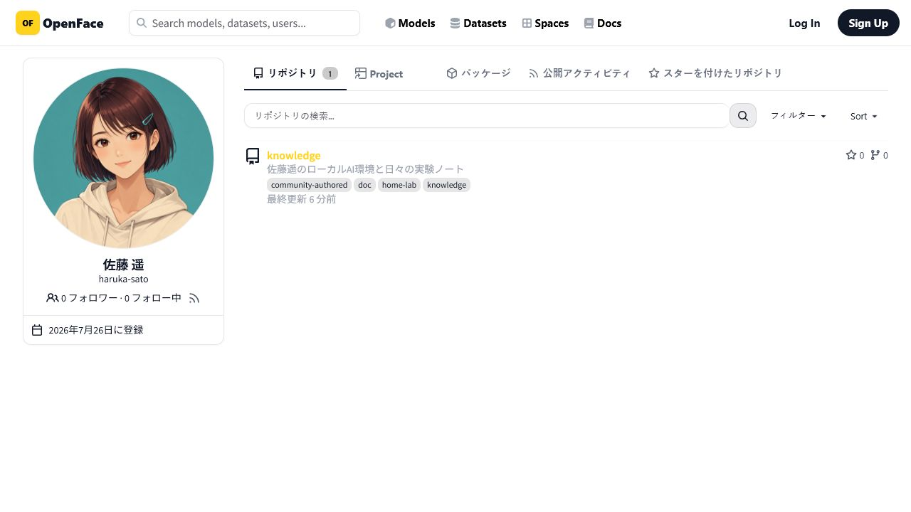
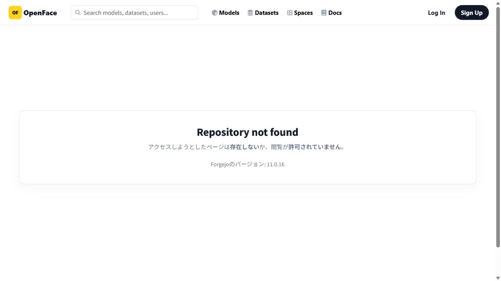

# Community user and private organization verification

This fixture models people using NyankoFace, rather than maintenance bots acting on repositories.

## Independent user accounts

| Account | Display name | Personal article |
|---|---|---|
| `haruka-sato` | 佐藤 遥 | 自宅GPUで始める小さな学習ログ |
| `takumi-endo` | 遠藤 匠 | SVG生成ベンチマークで確認したいこと |
| `nana-kurose` | 黒瀬 菜々 | はじめてDocker Spaceを公開した記録 |
| `rio-kanda` | 神田 理央 | ローカルAI読書会を続けるためのメモ |

Every account is `admin=false`. Each user owns a separate public `knowledge` repository, and the article commit is authored through that same user's protected API token. The seed fails if repository ownership or latest-commit attribution does not match.

Each account also has a distinct human community-member avatar rather than a maintenance-bot icon. The [avatar prompt record](avatar-prompts.md) documents the generated character directions and final asset location.

## Private community organization

The private `local-makers` organization has two invited members:

- `haruka-sato`: `Contributors` team, write access
- `nana-kurose`: `Readers` team, read access

Two other community accounts are intentionally excluded from every team:

- `takumi-endo`
- `rio-kanda`

The private repository is `local-makers/member-notes`; `haruka-sato` authored `articles/shared-home-lab-checklist.md`.

### Production ACL matrix

Verified on `https://example.invalid` on 2026-07-26.

| Identity | Organization | Repository | Article |
|---|---:|---:|---:|
| Anonymous | `404` | `404` | `404` |
| `haruka-sato` (member, write) | `200` | `200` | `200` |
| `nana-kurose` (member, read) | `200` | `200` | `200` |
| `takumi-endo` (non-member) | `404` | `404` | `404` |
| `rio-kanda` (non-member) | `404` | `404` | `404` |

The latest private article commit was `d010afa`, authored by `haruka-sato`. Tokens are read from the protected shared volume and never included in logs or repository files.

