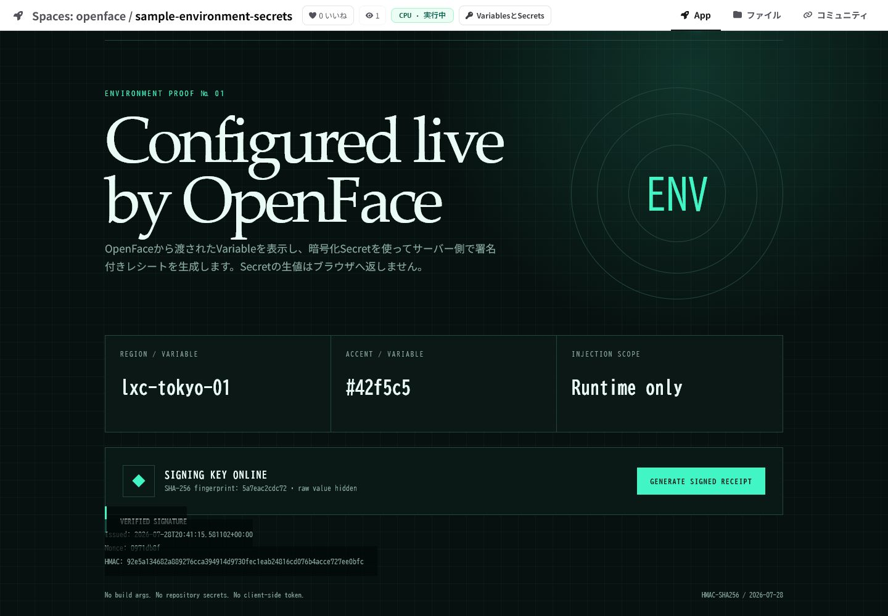
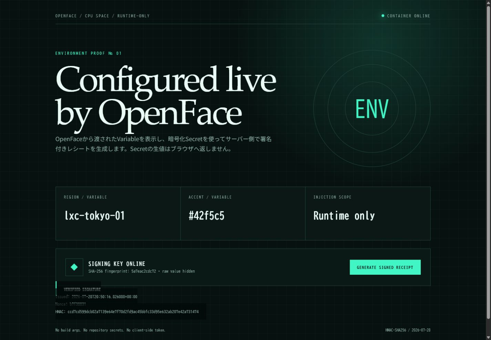
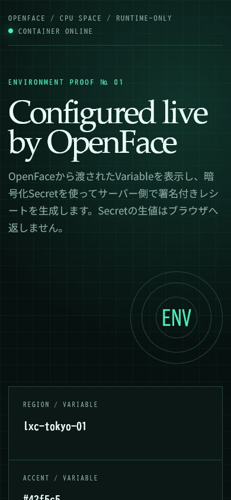
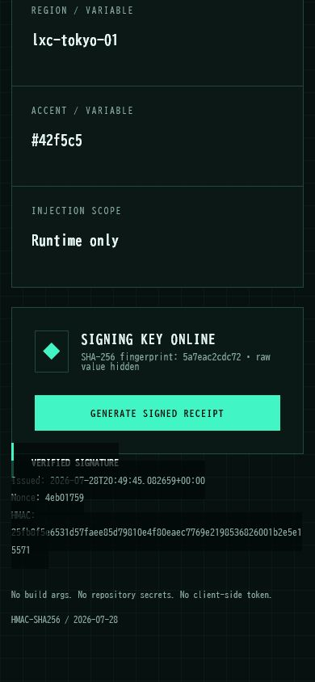

# Runtime environment Space verification

This record verifies the Dockerfile-based
[`nyankoface/sample-environment-secrets`](https://github.com/Sunwood-ai-labs/NyankoFace/tree/main/sample-spaces/sample-environment-secrets)
CPU Space against a private deployment.

- NyankoFace page:
  <https://example.invalid/nyankoface/sample-environment-secrets>
- Application:
  <https://example.invalid/run/nyankoface/sample-environment-secrets/>
- Runtime Variables: `DEMO_HEADLINE`, `DEMO_REGION`, `DEMO_ACCENT`
- Runtime Secret: `DEMO_API_TOKEN`

The Secret is used inside the Space container to create an HMAC-SHA256 receipt.
The browser receives only a configured flag, a 12-character SHA-256 fingerprint,
and the generated receipt signature. It never receives the raw Secret.

## Verified behavior

| Check | Result |
|---|---|
| Space status | CPU · running; container health check passed |
| Variable delivery | Headline, region, and accent match the NyankoFace runtime settings |
| Secret delivery | `configured: true`; signing produces a 64-character HMAC |
| Secret isolation | Raw Secret absent from `/api/runtime`, rendered HTML, and screenshots |
| Responsive layout | Desktop 1440 × 1000 and mobile 390 × 844 inspected |
| Source validation | `python -m py_compile main.py` and Docker build passed |

## Browser evidence

| NyankoFace Space page | Application desktop |
|---|---|
|  |  |

| Mobile top | Mobile signed receipt |
|---|---|
|  |  |

The mobile audit also caught an invalid CSS `min()` expression. It was corrected
to a valid `calc()` width before these final screenshots were captured.
