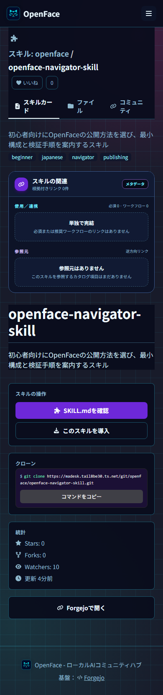

# Issues #12 and #13 verification

This packet verifies the NyankoFace Navigator Skill and non-destructive Pages
sharing metadata completion.

## Results

- Skill structure validation: passed
- Skill repository contract validation: passed
- Pages metadata unit tests: 3/3 passed in the Compose image
- Skill visual matrix: 12/12 passed across three themes, two OS color schemes,
  and desktop/mobile viewports
- Pages root and nested visual checks: 4/4 passed with no overflow, console
  errors, failed requests, or HTTP resource errors
- Live metadata checks retained repository titles, added missing OG/Twitter
  values, and produced an absolute nested-page `og:url`

## Key screenshots

| Navigator Skill | Pages root | Pages nested mobile |
|---|---|---|
|  |  |  |

See [the complete theme matrix](skill-themes/THEME_MATRIX.md) and
[the Pages review packet](pages/AGENT_REVIEW.md) for every capture and measured
result.
