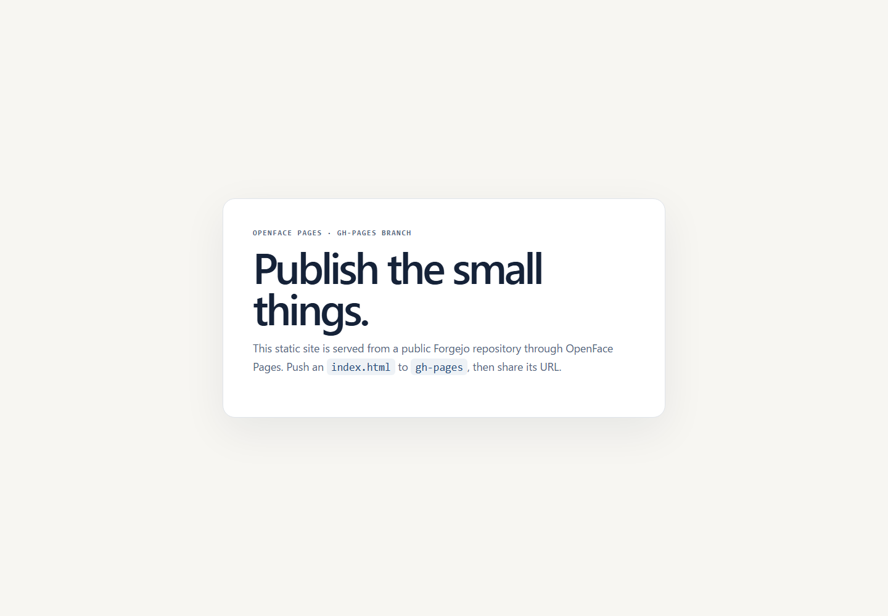
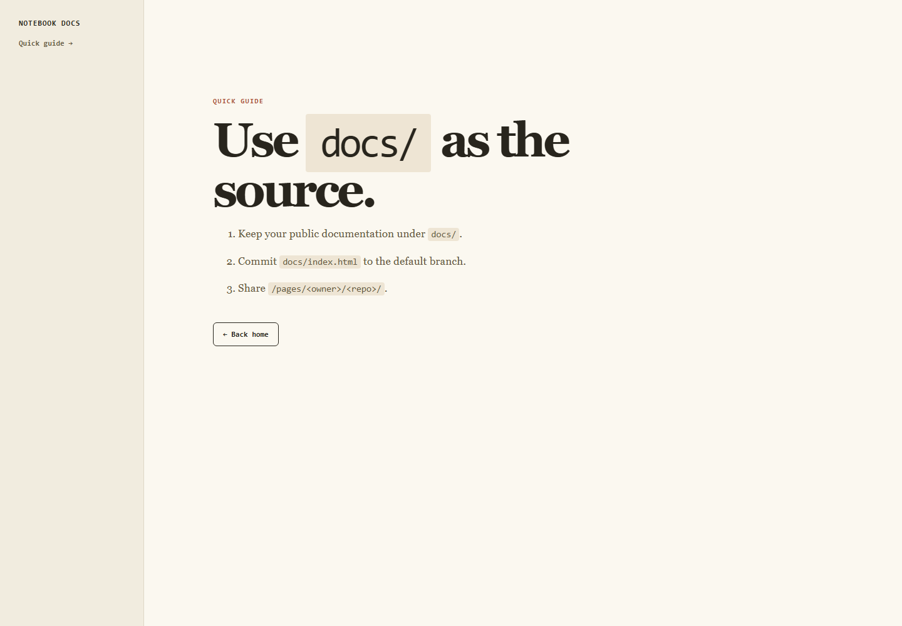
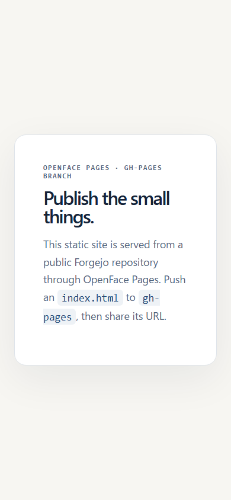
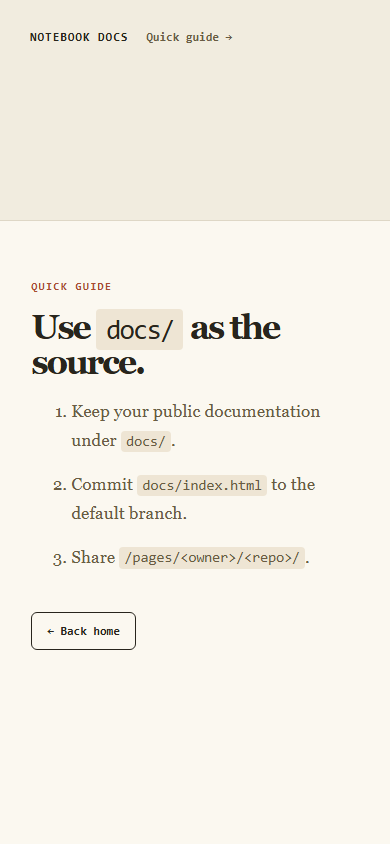

# NyankoFace visual QA — agent review packet

Generated: `2026-07-27T13:30:55.270Z`  
Base URL: `https://localhost:8443`  
Result: **4/4 passed**

## Agent review instructions

1. Open every screenshot below; do not infer visual quality from HTTP status alone.
2. Compare the screenshot with the stated review focus.
3. Report clipping, blur, overlap, broken assets, inconsistent spacing, wrong navigation, and misleading runtime state.
4. Use `manifest.json` for exact URLs, viewport sizes, console errors, failed requests, and overflow measurements.
5. For each issue, cite the screenshot filename and describe the visible evidence.

## Capture index

| Result | Viewport | Screen | HTTP | Overflow | Screenshot |
|---|---|---|---:|---:|---|
| PASS | desktop (1440×1000) | NyankoFace Pages site | 200 | 0px | [screenshots/desktop--pages-live.png](screenshots/desktop--pages-live.png) |
| PASS | desktop (1440×1000) | NyankoFace Pages nested site | 200 | 0px | [screenshots/desktop--pages-nested.png](screenshots/desktop--pages-nested.png) |
| PASS | mobile (390×844) | NyankoFace Pages site | 200 | 0px | [screenshots/mobile--pages-live.png](screenshots/mobile--pages-live.png) |
| PASS | mobile (390×844) | NyankoFace Pages nested site | 200 | 0px | [screenshots/mobile--pages-nested.png](screenshots/mobile--pages-nested.png) |

## Screenshots

### desktop / NyankoFace Pages site

- Route: `/pages/nyankoface/pages-starter/`
- Review focus: Published static page, asset loading, and gateway routing
- Automated defects: none
- Browser observations: 0 console error(s), 0 failed request(s), 0 HTTP resource error(s)

### desktop / NyankoFace Pages nested site

- Route: `/pages/nyankoface/pages-docs-fallback/guide.html`
- Review focus: Nested Pages document, linked assets, and completed sharing metadata
- Automated defects: none
- Browser observations: 0 console error(s), 0 failed request(s), 0 HTTP resource error(s)

### mobile / NyankoFace Pages site

- Route: `/pages/nyankoface/pages-starter/`
- Review focus: Published static page, asset loading, and gateway routing
- Automated defects: none
- Browser observations: 0 console error(s), 0 failed request(s), 0 HTTP resource error(s)

### mobile / NyankoFace Pages nested site

- Route: `/pages/nyankoface/pages-docs-fallback/guide.html`
- Review focus: Nested Pages document, linked assets, and completed sharing metadata
- Automated defects: none
- Browser observations: 0 console error(s), 0 failed request(s), 0 HTTP resource error(s)

