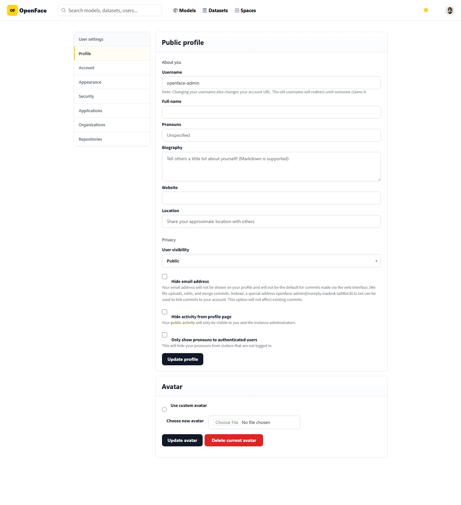
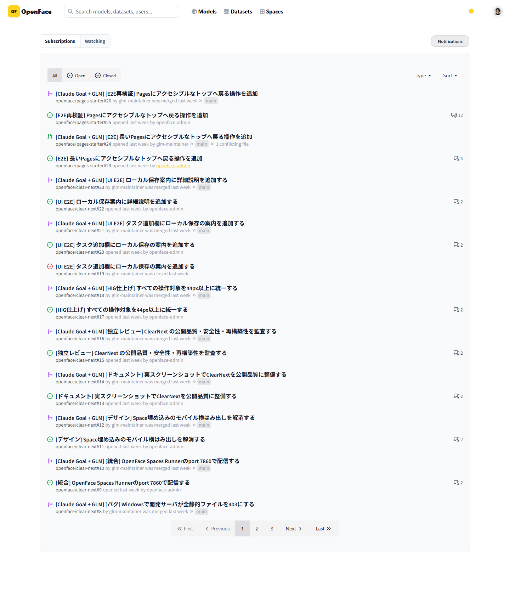
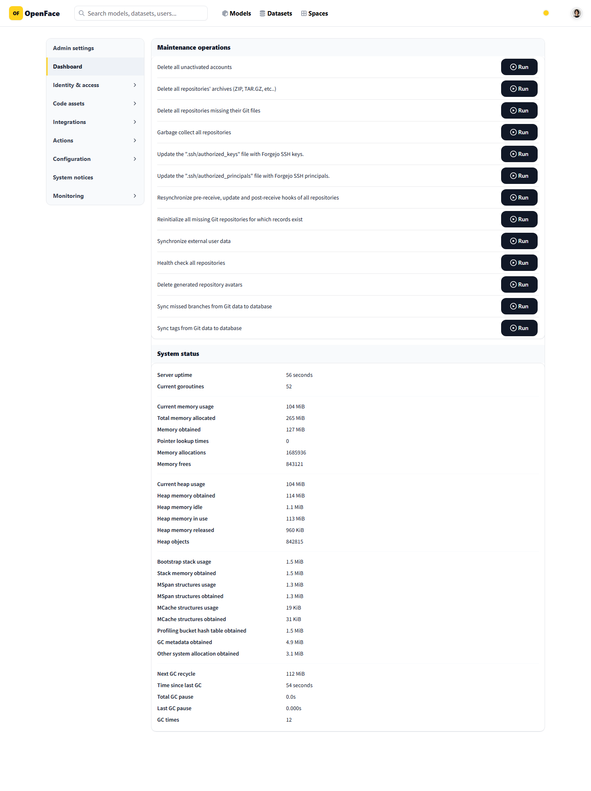

# Issue #14 desktop utility layout verification

Issue: [PC表示で設定・通知購読・管理画面のコンテンツ幅が崩れる](https://github.com/Sunwood-ai-labs/NyankoFace/issues/14)

## Root causes

1. The shared safe-area rule forced every direct `.ui.container` back to
   `max-width: 100%`, overriding the deliberate 980px settings rail.
2. `--nyankoface-page-gutter` continued growing inside a page already capped at
   1280px. The usable content width therefore shrank as the viewport grew:
   settings measured 1168px at a 1280px viewport but only 1120px at 1440px.
3. `/git/notifications/subscriptions` matched the generic
   `/git/{owner}/{repo}` regular expression. The enhancement script treated it
   as a model repository and appended an unrelated model card below the real
   notification list.

## Fix

- Settings, notifications, and administration now use a stable 32px desktop
  gutter.
- Settings restores its centered 980px rail.
- Notifications and administration use the full shared 1216px rail.
- Repository landing enhancement now requires an actual repository page and
  repository header before changing the DOM.
- `visual-tests/peripheral-layout-audit.mjs` authenticates and verifies both
  1280×900 and 1440×1000 viewports for all three routes.

## Result

All **6 / 6** desktop cases passed with no horizontal overflow, no unrelated
repository landing, centered rails, and at least 600px of usable main content.
The machine-readable measurements are in [`report.json`](report.json).

| Settings | Notification subscriptions | Administration |
| --- | --- | --- |
|  |  |  |

