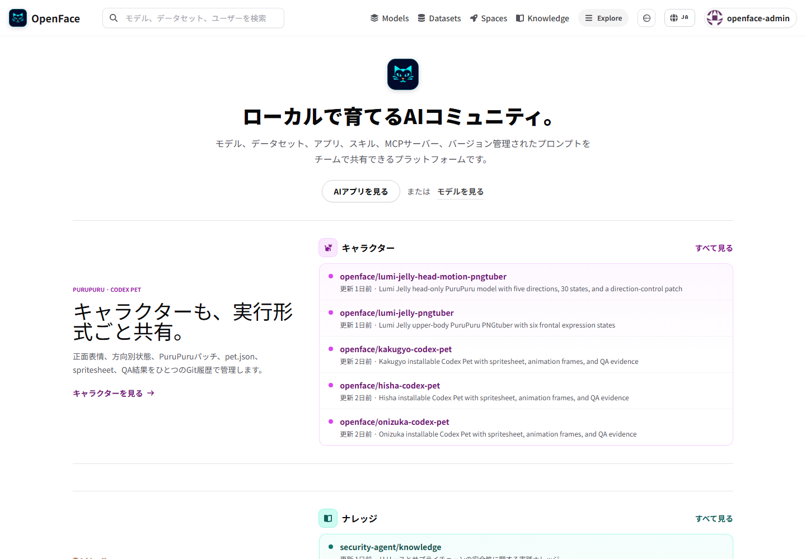
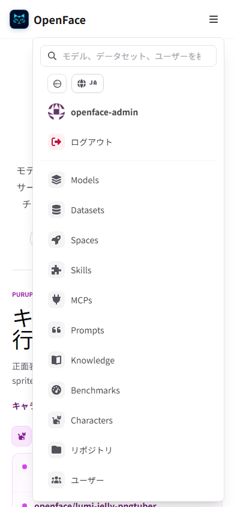
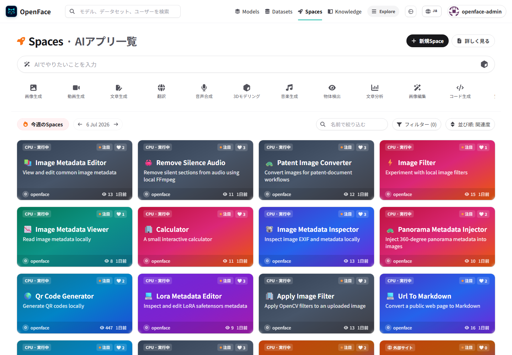
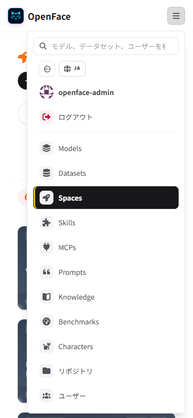

# Issue #25 — authenticated navbar session

Re-verified locally against the production Docker Compose stack on 2026-07-29.

## What changed

- The server-rendered layout reads the active Forgejo browser session before
  the first paint, so an authenticated request never starts with anonymous
  login controls.
- A shared client-side session provider refreshes the same state after route
  changes, reloads, focus, `pageshow`, and visibility changes.
- Forgejo profile detection no longer depends only on one English sentence:
  the parser also uses the authenticated profile avatar contract.
- Avatar paths are normalized beneath the `/git/` Forgejo mount.
- A signed-in user sees their username, profile, settings, and logout actions
  instead of the anonymous login and sign-up links.
- The account state is refreshed after route changes, page reloads, focus,
  `pageshow`, and visibility changes.
- Logout is proxied to Forgejo, clears the Forgejo session, and immediately
  restores the anonymous navbar.
- Desktop and mobile use the same session source while presenting controls
  appropriate to each viewport.

## Browser verification

| Check | Observed result |
|---|---|
| Sign in through Forgejo | The first portal response rendered `nyankoface-admin`; anonymous controls were absent even with JavaScript disabled. |
| Reload the portal | Both navbar variants remained `authenticated`. |
| Navigate from `/` to `/spaces` | The account name and authenticated state remained visible. |
| Open the mobile menu | The account name and logout action appeared above the catalog navigation. |
| Log out from the mobile menu | Both navbar variants changed to `anonymous`; login and sign-up returned immediately. |

## Screenshot evidence

| Desktop account menu | Mobile account menu |
|---|---|
|  |  |

Route persistence is also captured after moving to Spaces:

| Desktop Spaces | Mobile Spaces |
|---|---|
|  |  |

## Mechanical verification

- `npm run lint --prefix frontend`
- `npm run build --prefix frontend`
- `npm run audit:auth-session --prefix visual-tests`
- `git diff --check`
- desktop viewport: 1440 × 1000
- mobile viewport: 390 × 844

