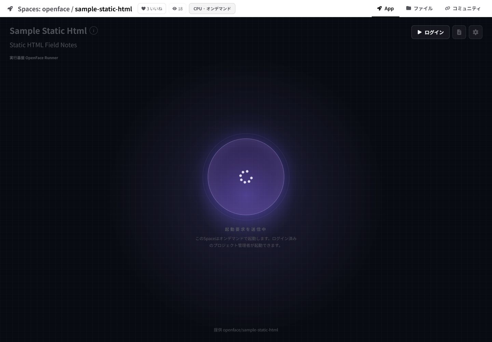
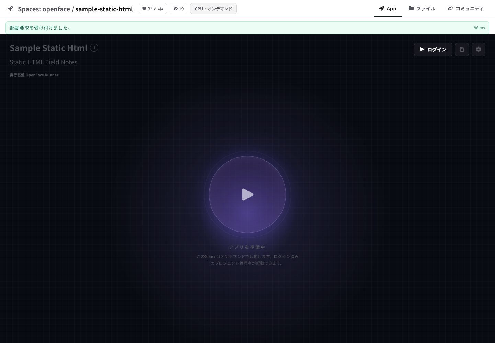
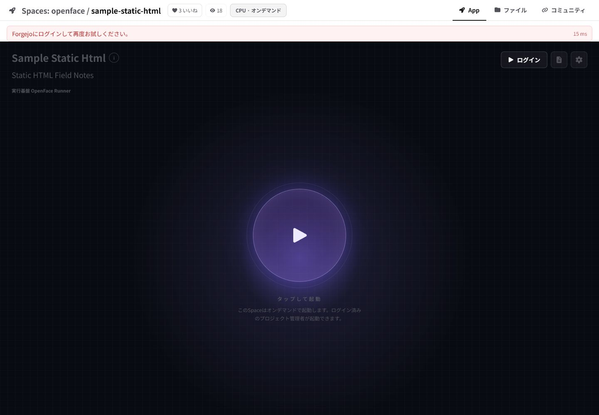

# Issue #26 — Space operation feedback and timing

Verified on a private deployment at
`https://example.invalid` on 2026-07-28.

## What changed

- Start and pause actions immediately set `aria-busy="true"` and expose
  `data-operation-state="start|stop"`.
- The action icon becomes a spinner, the operation label changes, and every
  Space control is disabled during the request to prevent duplicate submits.
- A 350 ms feedback window keeps the busy state perceptible even when the API
  answers faster than a human can comfortably notice.
- Success uses an `aria-live` status; authentication, permission, runner,
  network, and 30-second timeout failures use an alert.
- The operation response body updates the Space state directly. The former
  duplicate status request after every action has been removed.
- The control route reports `authorization`, `runner`, and `total` phases in
  the `Server-Timing` response header. The visible notice shows the measured
  server total, falling back to client elapsed time only when the header is
  unavailable.

## Browser verification

| Check | Observed result |
|---|---|
| Start request in progress | `aria-busy="true"`, `data-operation-state="start"`, all three controls disabled, spinner visible, and label changed to `起動要求を送信中`. |
| Authenticated success | `role="status"`, `data-feedback-kind="success"`, `起動要求を受け付けました。`, and measured response `86 ms`. |
| Anonymous failure | `role="alert"`, `data-feedback-kind="error"`, sign-in guidance, and measured response `15 ms`. |
| Duplicate status fetch | Removed; a valid action response updates status and execution directly. |

## Screenshot evidence

| Immediate busy state | Accepted request |
|---|---|
|  |  |

## Mechanical verification

- `npm run lint --prefix frontend`
- production `next build` during Docker Compose deployment
- `git diff --check`
- browser DOM assertions for busy, disabled, success, and error states
- desktop viewport: 1440 × 1000

