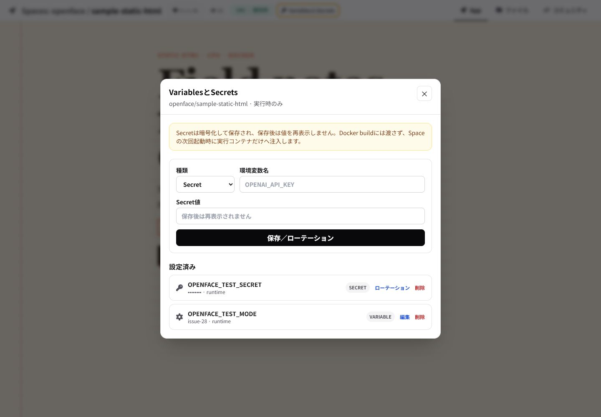
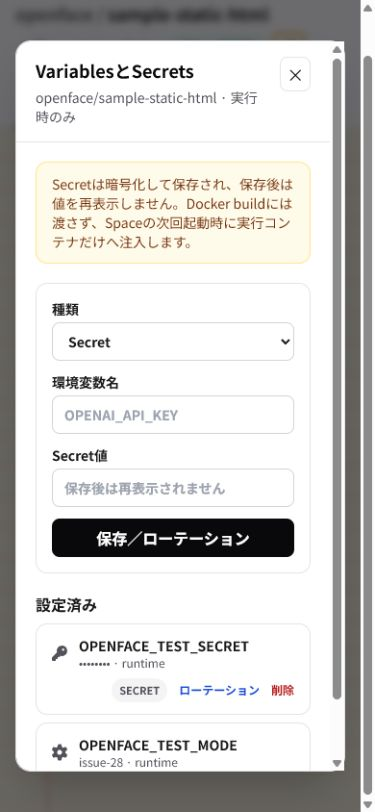
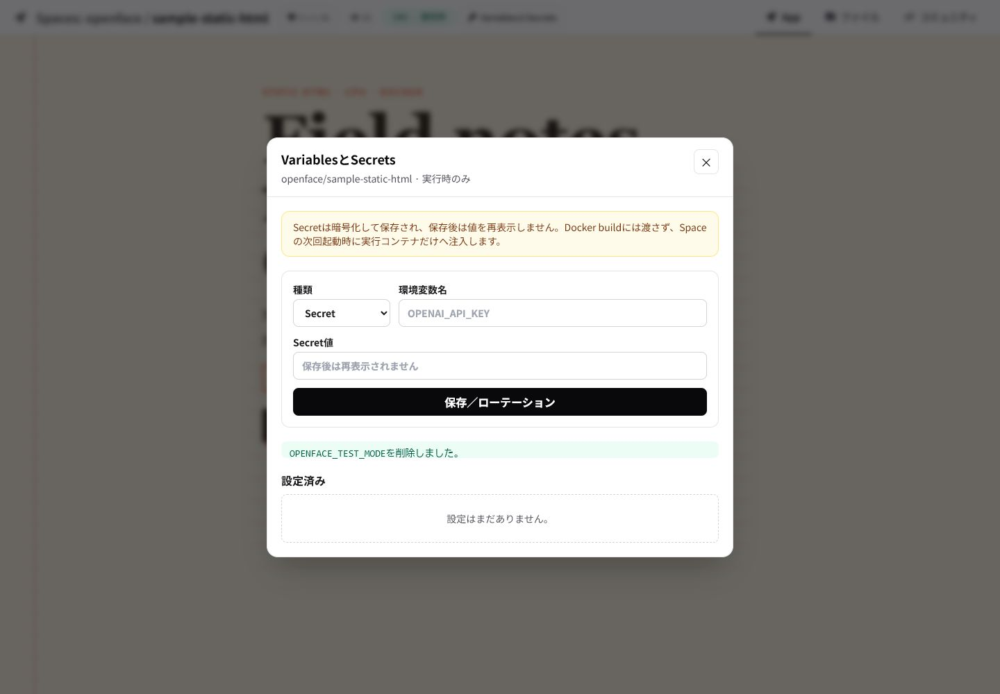

# Issue #28 — Space Variables and Secrets audit

This evidence verifies the owner-only runtime configuration added for [Issue #28](https://github.com/Sunwood-ai-labs/NyankoFace/issues/28).

## Browser verification

| Desktop configured state | Mobile configured state |
|---|---|
|  |  |

The desktop DOM contained `NYANKOFACE_TEST_SECRET` and the mask `••••••••`, but did not contain the submitted fake Secret value. The non-sensitive test Variable remained visible.

After a successful rotation, both settings were removed through the two-step confirmation flow:

## Runtime and storage assertions

| Assertion | Observed result |
|---|---|
| Secret list response contains a `value` property | `false` |
| Variable list response contains its value | `true` |
| Runtime container has the Secret | `true` |
| Runtime container has `NYANKOFACE_TEST_MODE=issue-28` | `true` |
| Built image contains either test setting | `false` |
| Runner logs contain the fake plaintext Secret | `0` matches |
| Persistent key permissions | `0600` |
| Audit contents | setting name, kind, action, actor only |

PostgreSQL reported ciphertext lengths of 120 bytes for the Secret and 100 bytes for the Variable. No plaintext value was selected or printed during the storage check.

## Responsive finding

The first mobile capture exposed overlap between the setting name and action controls. The final implementation moves actions onto their own mobile row, allows long environment names to wrap, and disables password-manager autofill for the configuration form.
