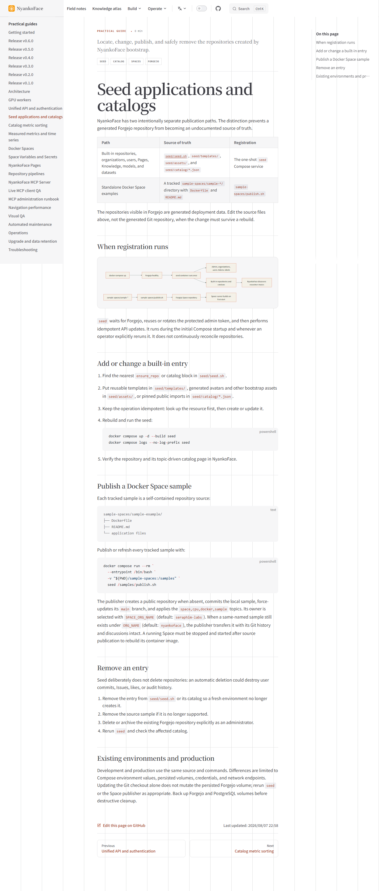
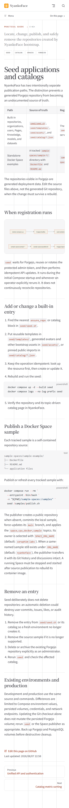
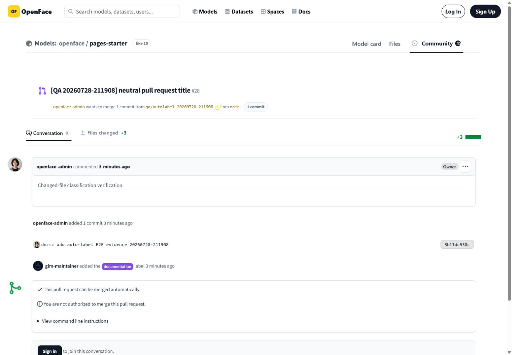
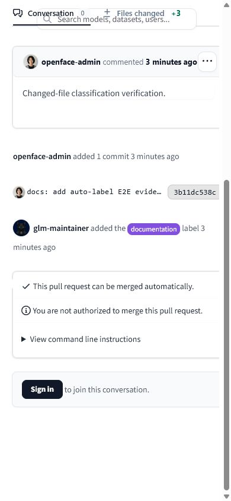

# Issues #37 and #38 verification

Verified on 2026-07-29 against a private production deployment at
`https://example.invalid`.

## Issue #37: seed application documentation

The English and Japanese guides identify both intentional sources of truth:

- generated repositories from `seed/seed.sh`, `seed/templates/`,
  `seed/assets/`, and `seed/catalog/*.json`;
- tracked Docker examples in `sample-spaces/sample-*`, published by
  `sample-spaces/publish.sh`.

They include registration timing, update, publish, removal, and existing
environment procedures. Both guides are linked from the VitePress sidebar and
the root README files.

| Desktop (1440 × 1000) | Mobile (390 × 844) |
|---|---|
|  |  |

The desktop capture shows the source-of-truth table, left navigation, and page
outline together. The mobile capture confirms that the title and source table
remain readable in the compact navigation layout.

## Issue #38: production auto-label E2E

The organization webhook was updated to subscribe to both `issues` and
`pull_request` events. The reproducible verifier
[`maintenance-agent/scripts/verify_autolabel_e2e.py`](https://github.com/Sunwood-ai-labs/NyankoFace/blob/main/maintenance-agent/scripts/verify_autolabel_e2e.py)
then created:

- [Issue #27](https://example.invalid/git/nyankoface/pages-starter/issues/27),
  which received `documentation` and `question`;
- [Pull Request #28](https://example.invalid/git/nyankoface/pages-starter/pulls/28),
  whose neutral title received `documentation` because its only changed file
  is Markdown.

The fixture script creates the target repository labels before the test. The
automatic labeler itself only intersects classified candidates with the
configured allowlist and labels already present in the repository.

| Surface | Desktop (1440 × 1000) | Mobile (390 × 844) |
|---|---|---|
| Pull Request (English UI/content) |  |  |

The captures were inspected after page load. They show the real
`glm-maintainer added the … label` timeline events, not manually composed
cards or seeded label text.

## Audit record

`GET /api/labels/audits?limit=10` inside the healthy maintenance container
returned one signed delivery record for each subject:

| Subject | Classification evidence | Applied |
|---|---|---|
| Issue #27 | README/guide wording at `0.95`; question wording at `0.86` | `documentation`, `question` |
| Pull Request #28 | every changed file is documentation at `0.98` | `documentation` |

Both records have `dry_run: false`, an empty skipped-label list, a delivery ID,
and a PostgreSQL timestamp. The service log independently recorded both
applications once.

## Reproduction

```bash
docker compose up -d --build --force-recreate seed maintenance-agent
docker exec nyankoface-maintenance-agent \
  python /app/scripts/verify_autolabel_e2e.py
docker exec nyankoface-maintenance-agent \
  python -c 'import json,urllib.request; print(json.dumps(json.load(urllib.request.urlopen("http://127.0.0.1:8010/api/labels/audits?limit=10")), indent=2))'
```

Local structural verification:

```text
74 maintenance-agent tests passed
python -m compileall -q maintenance-agent passed
docker compose config --quiet passed
npm run docs:build --prefix docs passed
git diff --check passed
```
