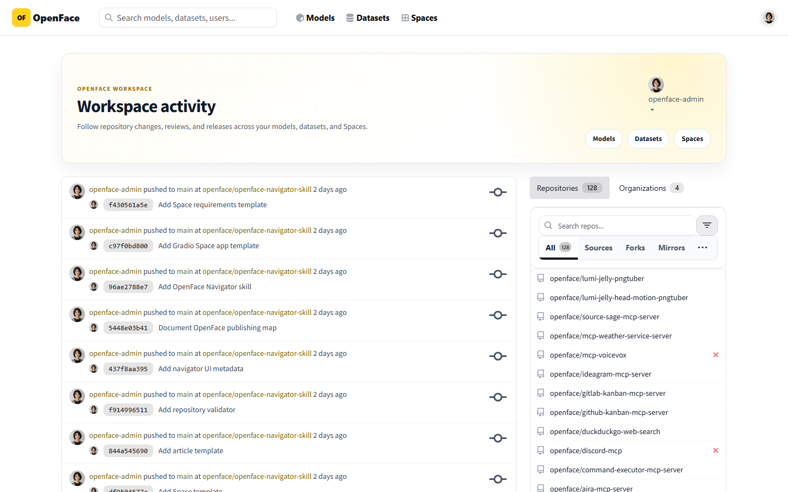
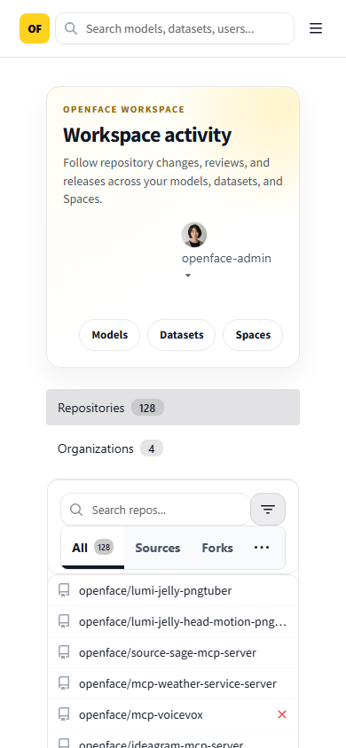

# Issue #42 — invisible navbar control removal

Forgejo includes an inactive time-tracker anchor next to the authenticated
profile controls. NyankoFace does not expose the tracker, so the control is now
removed from the DOM instead of being made transparent or hidden with CSS.

The automated browser audit verifies both desktop and mobile:

- no `.active-stopwatch-trigger` remains in the DOM;
- no `.header-stopwatch-dot` remains in the DOM;
- no visible navbar control is transparent or lacks visible content;
- the page has no horizontal overflow;
- mouse, touch, and keyboard users are not offered an invisible target.

| Desktop | Mobile (390 × 844) |
| --- | --- |
|  |  |

Run the audit with:

```bash
npm run audit:stopwatch-indicator --prefix visual-tests
```
