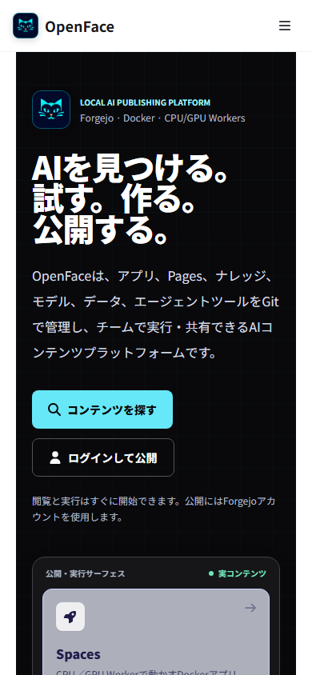

# Issue #43 — platform-first home

Verified against the production Docker Compose stack on 2026-07-29.

## What changed

- The first heading defines NyankoFace as an AI content platform for finding,
  trying, building, and publishing.
- The first viewport links to real Spaces, Pages, Knowledge, and application
  workloads, Models, Datasets, Skills, MCPs, Prompts, and Git repositories.
- Catalog counts come from the live Forgejo repository search API; no synthetic
  usage or popularity figures were added.
- Anonymous visitors can browse immediately or sign in to publish.
- Authenticated users receive direct creation and repository-publishing CTAs.

## Screenshot evidence

| State | Desktop | Mobile |
|---|---|---|
| Anonymous |  |  |
| Authenticated |  |  |

## Mechanical verification

- `npm run lint --prefix frontend`
- `npm run build --prefix frontend`
- `npm run audit:platform-home --prefix visual-tests`
- `git diff --check`
