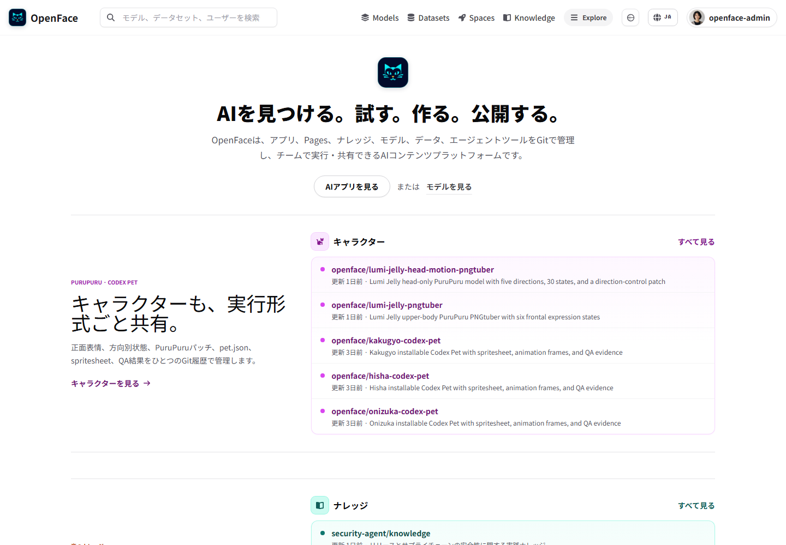
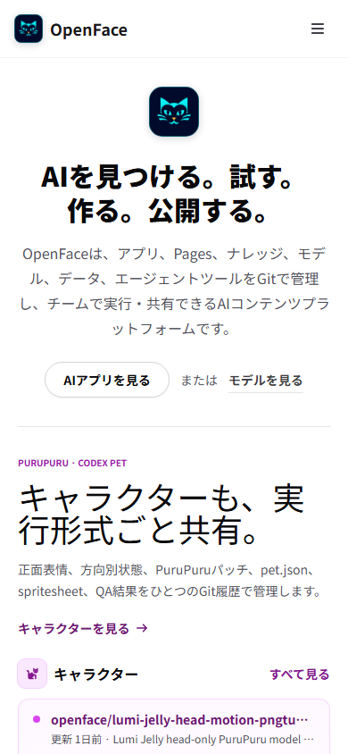
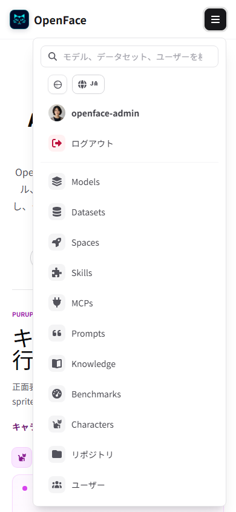

# Issue #47 visual evidence

The home keeps the established light Hugging Face-style color treatment while
updating only the platform copy. The authenticated navbar now uses the same
existing `lina-park` profile image that Forgejo uses for `nyankoface-admin`,
instead of Forgejo's generated identicon.

The automated audit covers desktop and mobile in both anonymous and
authenticated states. It verifies:

- the updated Japanese/English platform message and description;
- the classic light hero and its original Spaces/Models actions;
- the normalized authenticated profile image and successful image load;
- zero horizontal overflow.

See `report.json` and the four adjacent screenshots for the captured results.

## Desktop — signed in

## Mobile — home

## Mobile — signed-in menu

