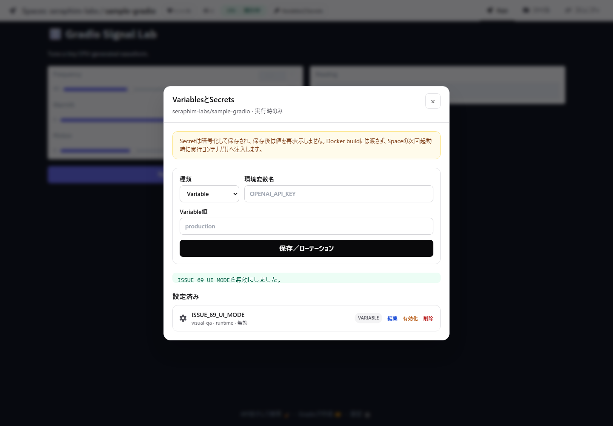
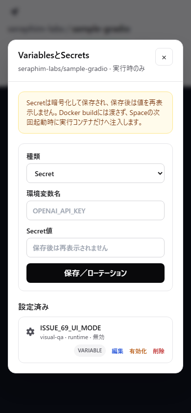
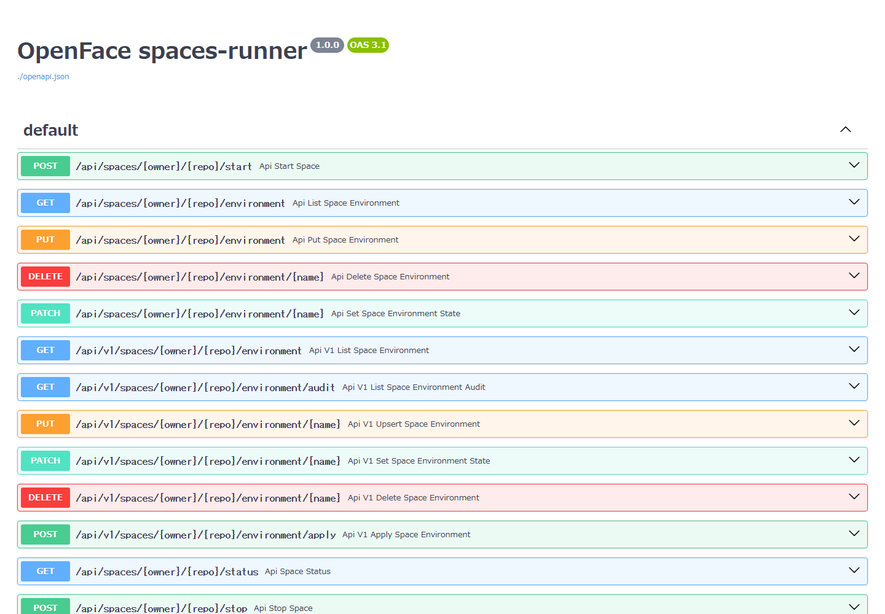

# Issue #69 — Space environment API evidence

Issue: [Space Variable / Secret Management API](https://github.com/Sunwood-ai-labs/NyankoFace/issues/69)

## Verified behavior

| Check | Evidence |
| --- | --- |
| Anonymous requests are rejected | `GET /runner-api/v1/spaces/.../environment` returned `401` |
| Forgejo PAT authorization | Live verifier used a repository-scoped Bearer token |
| Variable and secret create/rotate | Both `PUT` requests returned `200` |
| Metadata-only responses | Values were absent from create, list, update, and audit responses |
| Enable/disable | `PATCH` disabled a secret and the browser UI reflected the same state |
| Idempotent deletion | A repeated `DELETE` returned success with `deleted: false` |
| Audit safety | Audit records contained action metadata but no stored values |
| Rate limiting | Unit tests cover per-token `429` responses and `Retry-After` |
| OpenAPI | Swagger UI rendered the live OpenAPI 3.1 contract without parser errors |
| Responsive UI | Playwright measured `0px` horizontal overflow at 1440px and 390px |

The machine-readable visual report is
[`space-environment-api-audit.json`](./space-environment-api-audit.json).

## Screenshots

### Desktop — disabled variable



### Mobile — disabled variable



### OpenAPI



## Reproduction

```powershell
cd spaces-runner
uv run --with-requirements requirements-dev.txt python -m pytest -q

cd ..\frontend
npm run lint
npm run build

cd ..\visual-tests
npm run audit:space-environment-api

cd ..
docker compose exec -T spaces-runner python tests/verify_space_environment_api.py
docker compose config -q
docker compose exec -T gateway nginx -t
```

The live verifier creates temporary `ISSUE_69_*` entries and deletes them
before exiting. Its secret sentinel is asserted absent from every API response
and from the spaces-runner container logs.
