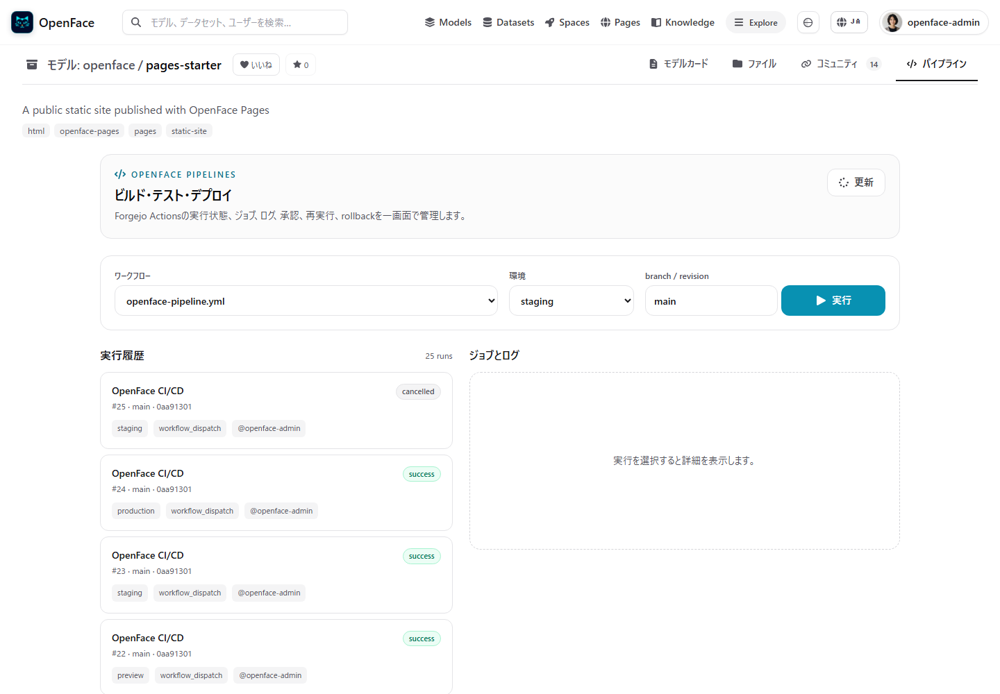
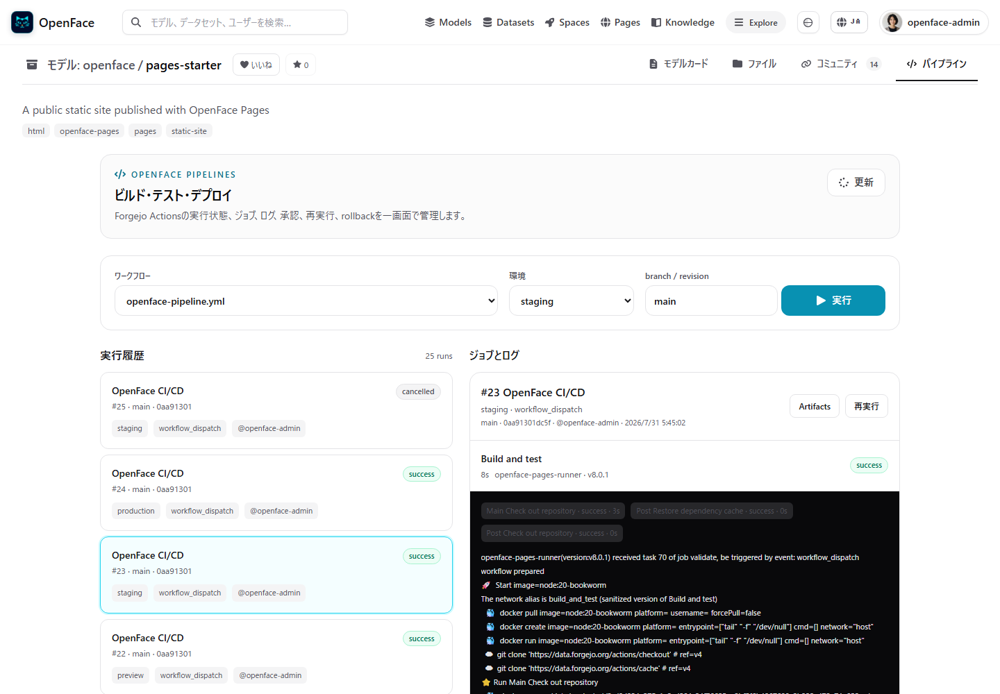
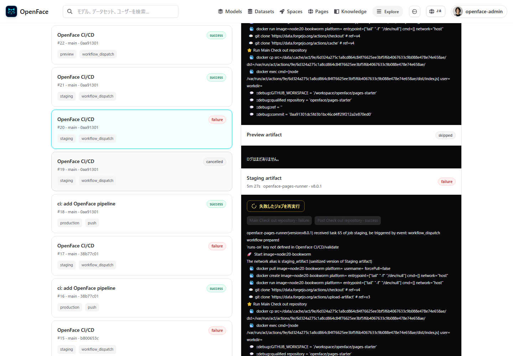
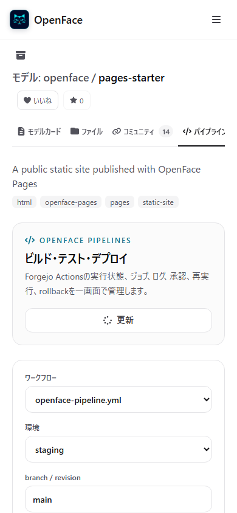
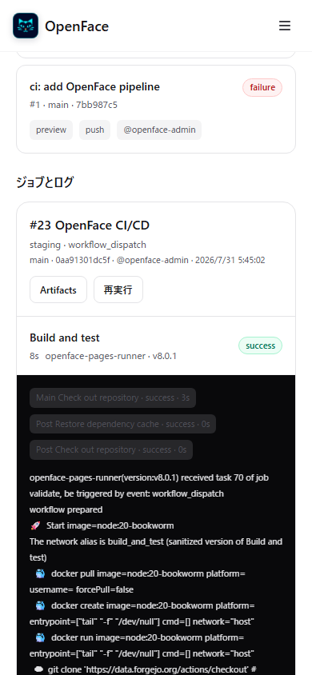

# Issue #70 — Repository Pipelines verification

This evidence set verifies the Forgejo Actions-backed NyankoFace Pipelines
control plane on the local Docker Compose deployment.

## Runtime evidence

The repository `nyankoface/pages-starter` was used for end-to-end verification
against Forgejo 16.0.1 and Forgejo Runner 8.0.1.

| Scenario | Evidence |
| --- | --- |
| Failed-job retry | Failed staging job 2 from Run #27 was retried with the signed-in browser route. Forgejo created `attempt/2`, which completed as `success` in 5 seconds. |
| Preview lifecycle | Local QA Pull Request #27 produced Preview Run #32 and `/previews/nyankoface/pages-starter/pr-27/` returned `200`. Closing the PR produced Run #35, removed the deployment, and the same URL returned `404` on repeated summary refreshes. |
| Staging artifact | Run #30 created Forgejo artifact ID 6 (`nyankoface-staging-site-09c93f…`, 3,820 bytes). The trusted controller verified its run metadata and SHA-256 digest before `/staging/nyankoface/pages-starter/` returned `200`. |
| Rollback | Successful production Run #26 was rolled back at recorded revision `42b756c…`; replacement Run #31 completed as `success` and retained that revision in run and audit metadata. |
| Production | Run #31 published the historical revision to `gh-pages`; `/pages/nyankoface/pages-starter/` returned `200`. |
| Cancellation | A delayed staging run reached `running`, was cancelled through the NyankoFace API, and settled as Run #25 (`cancelled`). |
| Agent API | A Forgejo PAT accessed `/runner-api/v1/pipelines/nyankoface/pages-starter` without a browser cookie and returned 30 runs plus audit history. |
| Resource isolation | The live Runner config uses capacity 2, CPU 2, memory 4 GiB, and PID limit 512 on the dedicated Docker-in-Docker daemon. |
| Runner availability | The control plane reports one online `node20` CPU Runner, disables the unregistered `gpu` target, and rejects unavailable targets before secret synchronization. |

Secrets were not printed during verification. Pipeline logs returned by
NyankoFace strip ANSI sequences, redact configured build secrets, and limit each
job response to the most recent 2,000 lines. Preview and staging responses use
`Cache-Control: no-store`, strip cookies at the gateway, and apply a restrictive
`Content-Security-Policy` sandbox.

## Desktop

The 1440 × 1000 viewport has no document-level horizontal overflow. The
pipeline form, run history, and job panel fit in a balanced two-column layout.

Selecting a successful staging run exposes jobs, measured duration, the
responsible Runner/version, terminal step states, masked logs, artifact
navigation, and rerun controls.

A failed staging job exposes the dedicated failed-job retry control.

## Mobile

The 390 × 844 viewport has no document-level horizontal overflow. Repository
tabs remain on one line, the active Pipelines tab remains visible, and the
dispatch form stacks into touch-friendly controls.

The run detail preserves readable duration/Runner metadata, step badges, and a
scrollable log surface. The job disclosure was closed and reopened through
touch input during QA.

## Theme and interaction matrix

The automated matrix signs in through Forgejo, then verifies all three NyankoFace
themes at 1440 × 1000 and 390 × 844. Each case selects a successful run,
requires a published Preview or staging environment link in both history and
run detail, confirms that completed jobs start collapsed, opens a job
disclosure, disables log wrapping, checks the internal horizontal log scroller,
measures step-chip contrast at 4.5:1 or greater, and captures the rendered
result. CPU and GPU options are also checked against the live Forgejo Runner
registry.

| Theme | Desktop history | Mobile job log |
| --- | --- | --- |
| Standard | [screenshot](theme-matrix/screenshots/standard--desktop--history.png) | [screenshot](theme-matrix/screenshots/standard--mobile--job-log.png) |
| Solarpunk | [screenshot](theme-matrix/screenshots/solarpunk--desktop--history.png) | [screenshot](theme-matrix/screenshots/solarpunk--mobile--job-log.png) |
| Cyberpunk | [screenshot](theme-matrix/screenshots/cyberpunk--desktop--history.png) | [screenshot](theme-matrix/screenshots/cyberpunk--mobile--job-log.png) |

The machine-readable measurements and the complete 18-screenshot index are in
[`theme-matrix/report.json`](theme-matrix/report.json).

## Automated checks

- `frontend`: `npm run lint`, `npm run build`
- `spaces-runner`: 84 tests passed
- `docs`: locale/frontmatter validation and VitePress production build
- `docker compose config --quiet`
- `git diff --check`
