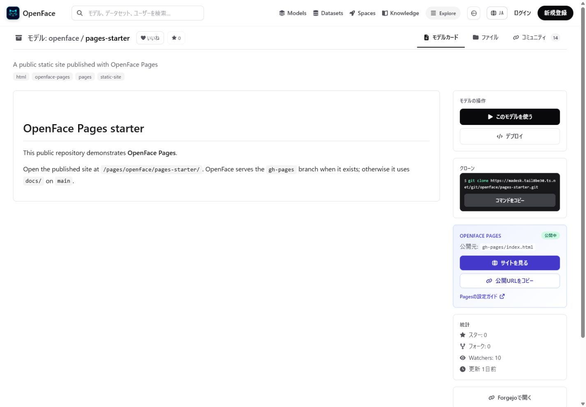
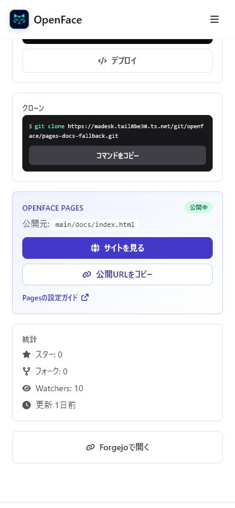
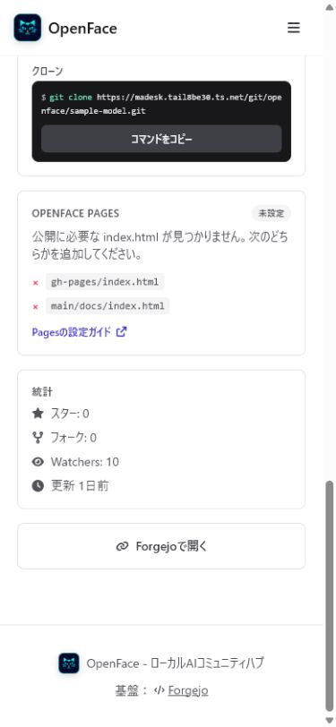

# Issue #71 — Pages detection and repository card

NyankoFace now uses one Pages inspection contract for detection and delivery:

1. verify that the repository is public;
2. fetch `gh-pages/index.html`;
3. if it is absent, fetch `<default-branch>/docs/index.html`;
4. report `published`, `missing`, `private`, or `error` without caching the
   repository-detail result.

## Browser evidence

| Published from `gh-pages` (desktop, 1440×1000) | Published from `main/docs` (mobile, 390×844) | Missing sources (mobile, 390×844) |
| --- | --- | --- |
|  |  |  |

The browser checks also confirmed:

- the Pages card exposes the correct `Visit site` URL;
- the copy button changes to its copied state after writing the public URL;
- the setup guide links to the matching English or Japanese documentation;
- missing repositories list both accepted `index.html` locations.

## Runtime and automated checks

```text
GET  /pages/nyankoface/pages-starter/       -> 200 text/html; charset=utf-8
HEAD /pages/nyankoface/pages-starter/       -> 200
GET  /pages/nyankoface/pages-docs-fallback/ -> 200 text/html; charset=utf-8
HEAD /pages/nyankoface/pages-docs-fallback/ -> 200
```

The runner inspection endpoint selected `gh-pages` for `pages-starter`,
`main/docs` for `pages-docs-fallback`, and returned both failed file checks for
`sample-model`.

```powershell
$env:PYTHONPATH = "$(Resolve-Path 'spaces-runner');$(Resolve-Path 'spaces-runner/tests')"
python -c "import test_pages_inspection as t; ..."
cd frontend
npm run lint
npm run build
```
