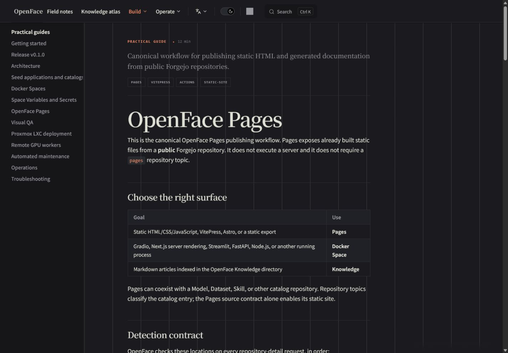
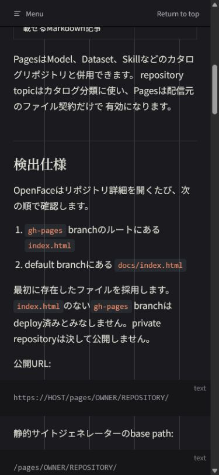

# Issue #72 verification evidence

This directory records the implementation and visual verification for the
canonical NyankoFace Pages documentation and Navigator Skill workflow.

## Automated verification

```text
python -m unittest skills/nyankoface-navigator/scripts/test_validate_repo.py -v
Ran 8 tests — OK

python -m unittest skills/nyankoface-navigator/scripts/test_verify_pages.py -v
Ran 3 tests — OK

python skills/nyankoface-navigator/scripts/verify_pages.py \
  http://localhost:8090/pages/nyankoface/pages-docs-fallback/ \
  --asset styles.css \
  --nested guide.html \
  --json
root:   200 text/html
asset:  200 text/css
nested: 200 text/html

cd docs
npm run docs:build
Build complete

copy skills/nyankoface-navigator/assets/pages-vitepress TEMP_DIRECTORY
cd TEMP_DIRECTORY
npm install --no-audit --no-fund
VITEPRESS_BASE=/pages/nyankoface/example/ npm run docs:build
Build complete; generated CSS and JavaScript URLs use
/pages/nyankoface/example/
```

The Navigator Skill source and seeded template were also compared file by
file, excluding generated Python cache files; all 21 tracked files matched.

## Visual verification

The rendered VitePress site was inspected at desktop and mobile breakpoints.
The screenshots cover the English guide overview, the Japanese mobile guide,
and the Japanese detection specification after scrolling.

### English desktop guide



### Japanese mobile guide


### Japanese mobile detection specification


