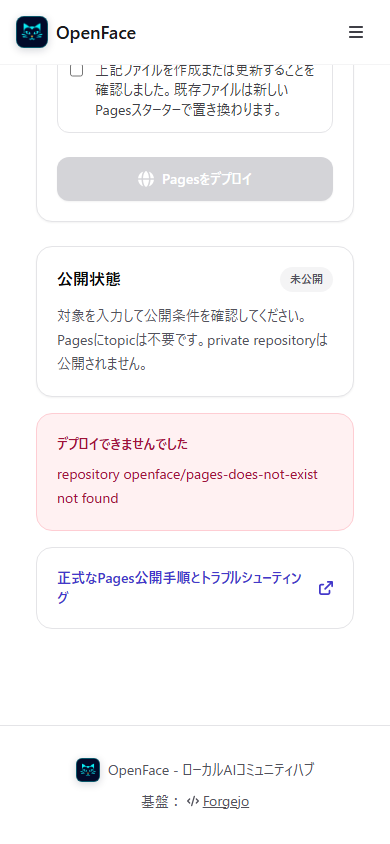

# Issue #73 — Pages deployment evidence

NyankoFace Pages の公開導線を、実際の Forgejo リポジトリへ書き込む E2E と
デスクトップ／モバイルのスクリーンショットで確認した記録です。

## Covered scenarios

- 未ログイン状態のデプロイ API が `401` を返す
- デスクトップ（1440 × 1000）で `default branch/docs/` 方式を公開する
- モバイル（390 × 844）で `gh-pages` 方式を公開する
- 公開結果にログ、Commit SHA、公開サイトへのリンクが表示される
- 公開URLが `200` を返し、Pagesスターター本文を配信する
- 存在しないリポジトリで、操作可能な日本語エラーを表示する
- 各画面に実用上の横スクロールがなく、主要見出しとフォームが表示される

機械可読な結果は
[`pages-deploy-audit.json`](./pages-deploy-audit.json) に保存しています。

## Desktop

### Method selection and explicit confirmation


### Published result


## Mobile

### Pages directory


### Published result


### Missing repository



## Reproduce

```bash
cd visual-tests
npm run audit:pages-deploy
```
