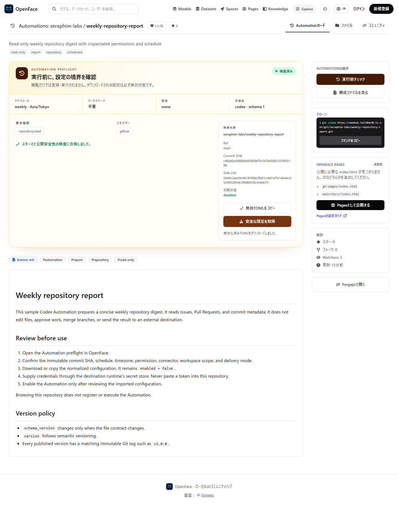
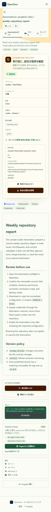
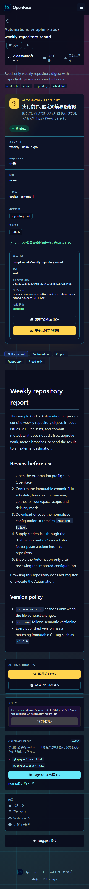

# Issue #74 — Automation publishing and preflight evidence

This packet records the local Compose verification for the public
`seraphim-labs/weekly-repository-report` Automation. The checked release is
the immutable `v1.0.0` tag.

## Safety and API results

| Check | Result |
| --- | --- |
| Public preflight | `200`, schema compatible |
| Reviewed commit | `c4bb6ba586bbb9260faf761b7b0000c355903196` |
| Reviewed SHA-256 | `2049c2aa29c4618789a2fb87cc6d1d701ab4ec052465285dc39d8053bcbdeb72` |
| Export state | `enabled = false` / `importState: disabled` |
| Missing or non-public repository | `404` |
| Mutable bundle revision (`main`) | rejected with `400` |
| Clipboard export | disabled TOML copied |
| File export | `weekly-repository-report-automation.toml` downloaded |
| Browsing behavior | no registration and no execution |

The machine-readable output is in [report.json](report.json).

## Screenshot matrix

All captures use the real HTTPS Compose runtime. Each page was checked for
horizontal overflow, browser errors, the selected theme, and required
Automation content. The expanded contrast matrix also covers light and dark
OS color schemes for every theme and viewport.

| Theme | Desktop list | Desktop detail | Mobile list | Mobile detail |
| --- | --- | --- | --- | --- |
| Standard | [list](standard-desktop-list.png) | [detail](standard-desktop-detail.png) | [list](standard-mobile-list.png) | [detail](standard-mobile-detail.png) |
| Solarpunk | [list](solarpunk-desktop-list.png) | [detail](solarpunk-desktop-detail.png) | [list](solarpunk-mobile-list.png) | [detail](solarpunk-mobile-detail.png) |
| Cyberpunk | [list](cyberpunk-desktop-list.png) | [detail](cyberpunk-desktop-detail.png) | [list](cyberpunk-mobile-list.png) | [detail](cyberpunk-mobile-detail.png) |

### Standard desktop



### Solarpunk mobile



### Cyberpunk mobile



## Reproduction

```bash
docker compose up --build -d gateway seed
docker compose wait seed
npm ci --prefix visual-tests --no-audit --no-fund
VISUAL_QA_BASE_URL=https://localhost:8443 \
AUTOMATION_QA_OUTPUT_DIR=docs/evidence/issues/74 \
npm run audit:automation --prefix visual-tests
```

Focused theme and contrast audit:

```bash
VISUAL_QA_BASE_URL=https://localhost:8443 \
VISUAL_QA_ROUTES=automations,automation-detail \
VISUAL_QA_THEMES=standard,solarpunk,cyberpunk \
VISUAL_QA_VIEWPORTS=desktop,mobile \
VISUAL_QA_COLOR_SCHEMES=light,dark \
npm run capture:themes --prefix visual-tests
```
