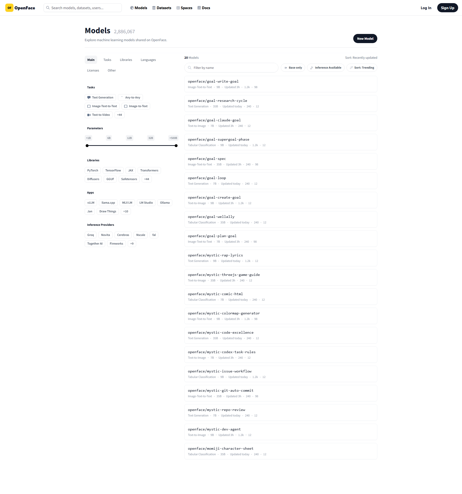
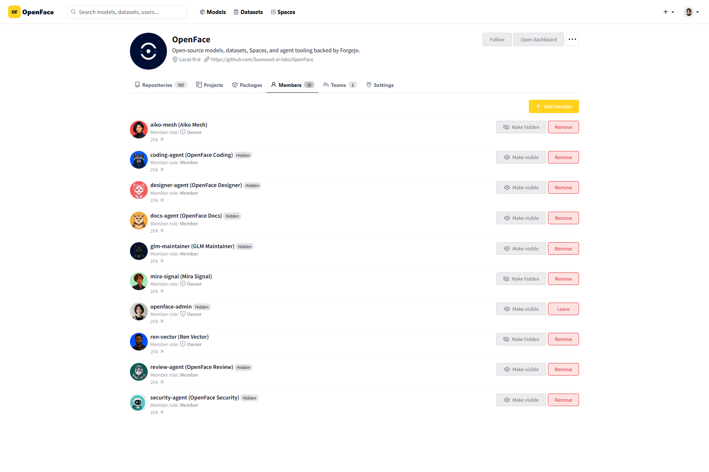
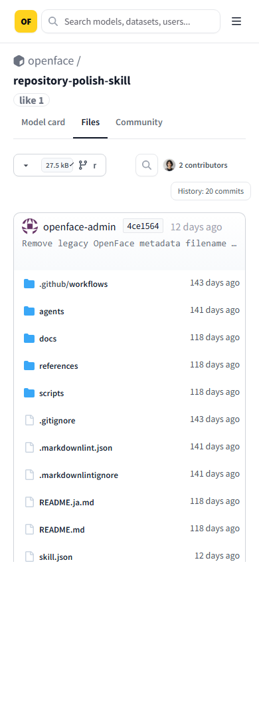

# Issue #75 — responsive desktop container rails

Forgejo-backed pages use one centered outer rail and one fixed 32px desktop
inner gutter. The audit guards against the former regression where a 1920px
viewport reapplied a 320px viewport gutter inside a capped 1280px page and
reduced the usable content width to 640px.

The automated matrix covers anonymous and authenticated routes at 390, 1280,
1440, and 1920 pixels. It checks HTTP status, page and container bounds,
monotonic width growth, horizontal overflow, the intentional 980px Settings
measure, and the screen-reader-only file-table header.

| Desktop · 1920px Explore | Desktop · 1920px organization members |
| --- | --- |
|  |  |

| Mobile · 390px Explore | Mobile · 390px repository files |
| --- | --- |
|  |  |

Run the same 56-case check locally with:

```bash
npm run audit:container-width --prefix visual-tests
```

The machine-readable result is stored in [`report.json`](report.json).
