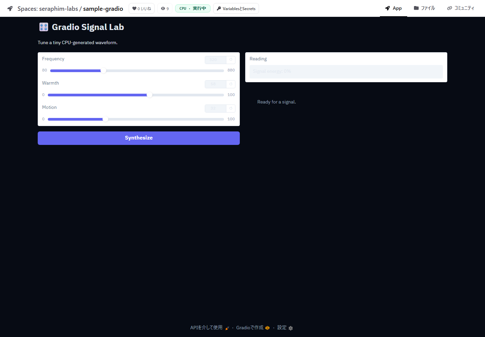
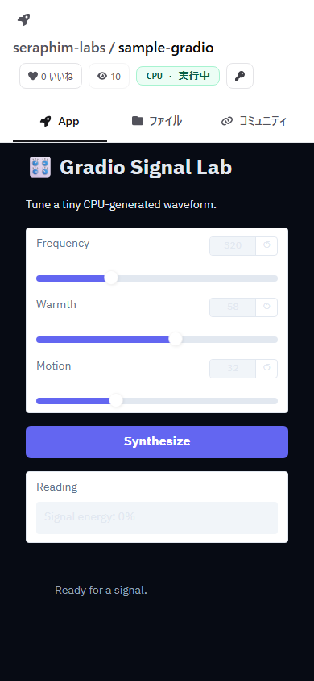

# Issue #81 — anonymous public Space launch

Public Spaces must be usable without a Forgejo session. The regression audit
starts `seraphim-labs/sample-gradio` through the public Next.js control route,
waits for the runner, and then opens the Space in fresh anonymous desktop and
mobile browser contexts.

The audit fails if the route requests Forgejo sign-in, the application iframe
is absent or empty, or the page introduces horizontal overflow.

| Desktop · 1440 × 1000 | Mobile · 390 × 844 |
| --- | --- |
|  |  |

Run the same check locally with:

```bash
npm run audit:public-space --prefix visual-tests
```
