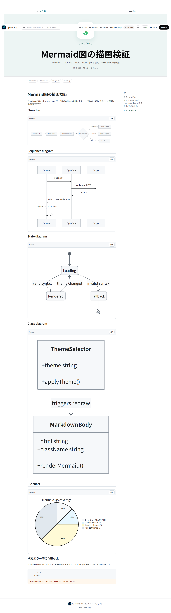
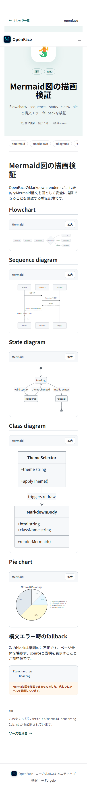
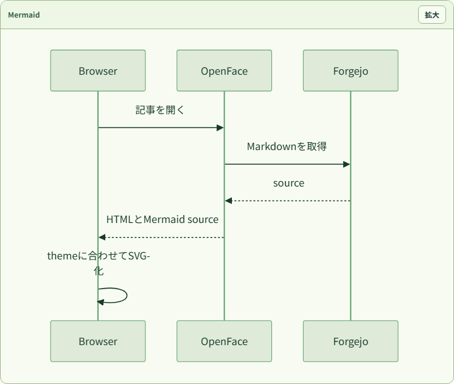
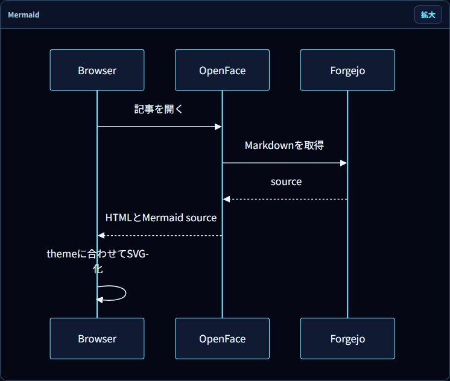
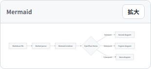
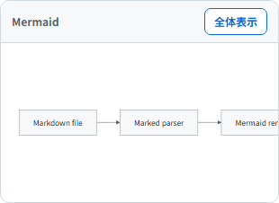
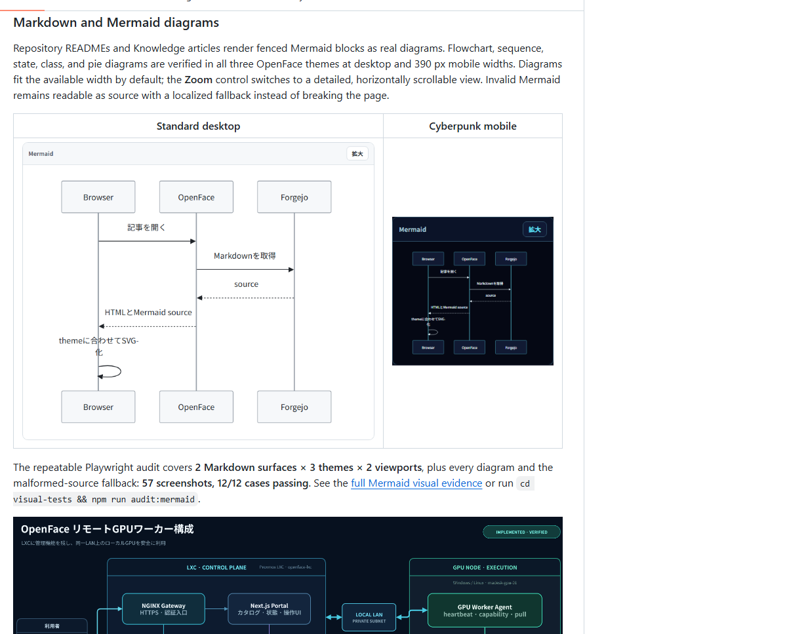

# Markdown and Mermaid rendering evidence

NyankoFace renders fenced `mermaid` blocks in both repository README views and
Knowledge articles. The client renderer uses Mermaid with strict security,
redraws when the NyankoFace theme changes, fits diagrams to narrow screens by
default, and provides a real **Zoom / Fit diagram** control for detailed mobile
inspection. Invalid syntax never breaks the article: the source and a localized
fallback message remain visible.

## Verified coverage

- Markdown surfaces: repository README and Knowledge article
- Themes: Standard, Solarpunk, Cyberpunk
- Viewports: 1440 × 1000 desktop and 390 × 844 mobile
- Diagram types: flowchart, sequence, state, class, and pie
- Failure path: one intentionally invalid diagram
- Interaction: mobile zoom mode, `aria-pressed`, internal horizontal scrolling,
  and return to fitted view
- Structural checks: no raw Mermaid blocks after hydration, no page-level
  horizontal overflow, no figure outside the viewport, no page errors

The repeatable audit generated **57 screenshots across 12 full-page cases** and
finished with **12/12 passing**. Machine-readable results are in
[report.json](./2026-07-25/report.json), with the concise run result in
[REPORT.md](./2026-07-25/REPORT.md).

```bash
cd visual-tests
npm ci
VISUAL_QA_BASE_URL=http://localhost:8090 npm run audit:mermaid
```

## Runtime screenshots

| Standard desktop | Standard mobile |
|---|---|
|  |  |

| Solarpunk | Cyberpunk |
|---|---|
|  |  |

| Responsive fit | Mobile detail zoom |
|---|---|
|  |  |

The source fixture is a real seeded Knowledge repository:
`nyankoface/nyankoface-knowledge/articles/mermaid-rendering-lab.md`.

## README publication check

After pushing, the public GitHub README was opened in Chromium. Both referenced
screenshots loaded at their natural dimensions and the full-evidence link
resolved to this file. The Japanese README was checked separately with the same
two image and link assertions.


