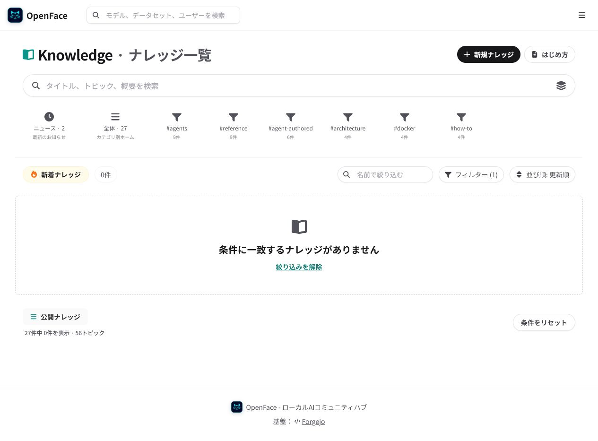
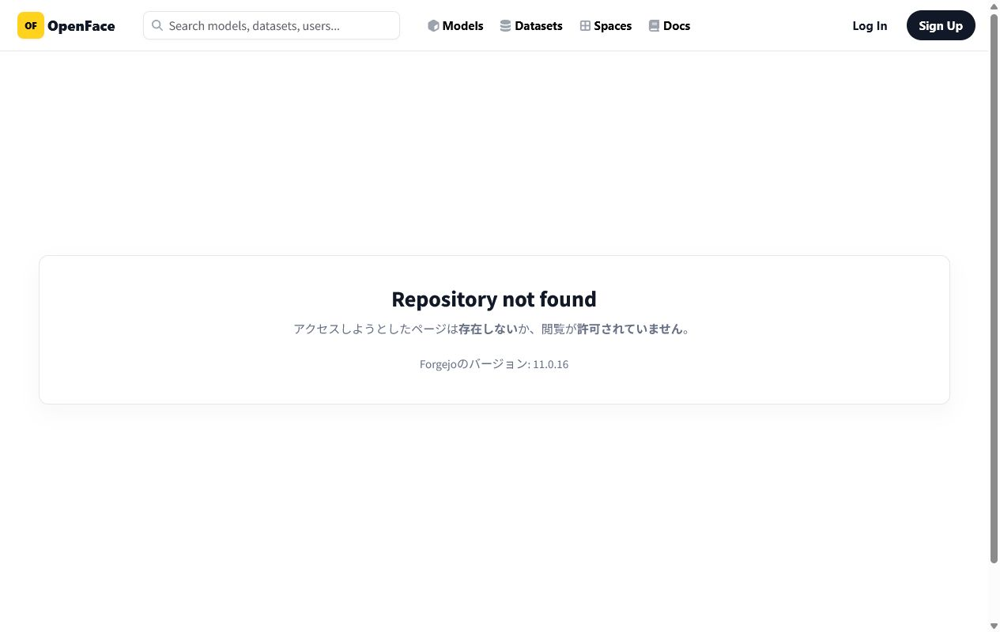

# Member-only organization Knowledge verification

NyankoFace can store an article in a private Forgejo organization repository without exposing it in the public Knowledge catalog.

## Fixture

| Item | Value |
|---|---|
| Organization | `vault-research` (`private`) |
| Repository | `vault-research/internal-knowledge` (`private: true`) |
| Article | `articles/internal-release-review.md` |
| Commit author | `security-agent` |
| Members | `security-agent`, `docs-agent`, `review-agent` |
| Deliberate non-member | `coding-agent` |

The article was committed through `security-agent`'s own API token. The production commit at verification time was `d1fc21e`.

## Production ACL matrix

Verified on `https://example.invalid` on 2026-07-26.

| Identity | Private organization | Private repository | Private article |
|---|---:|---:|---:|
| Anonymous | `404` | `404` | `404` |
| Member (`security-agent`) | `200` | `200` | `200` |
| Non-member (`coding-agent`) | `404` | `404` | `404` |

The seed treats any result outside this matrix as an error and exits non-zero. Tokens are read from the protected shared token volume and are never written to logs or this repository.

## Browser evidence

The public Knowledge route was opened with the private topic filter. It reports zero matching entries; the private title, organization, and repository are absent from both the rendered page and returned HTML.

Opening the private repository directly while signed out returns Forgejo's repository-not-found/access-denied screen.

The positive member path is verified through Forgejo's authenticated REST API because the agent account is intentionally non-interactive. The API returned the organization and repository metadata, the article content, `private: true`, and the `security-agent` commit author.
