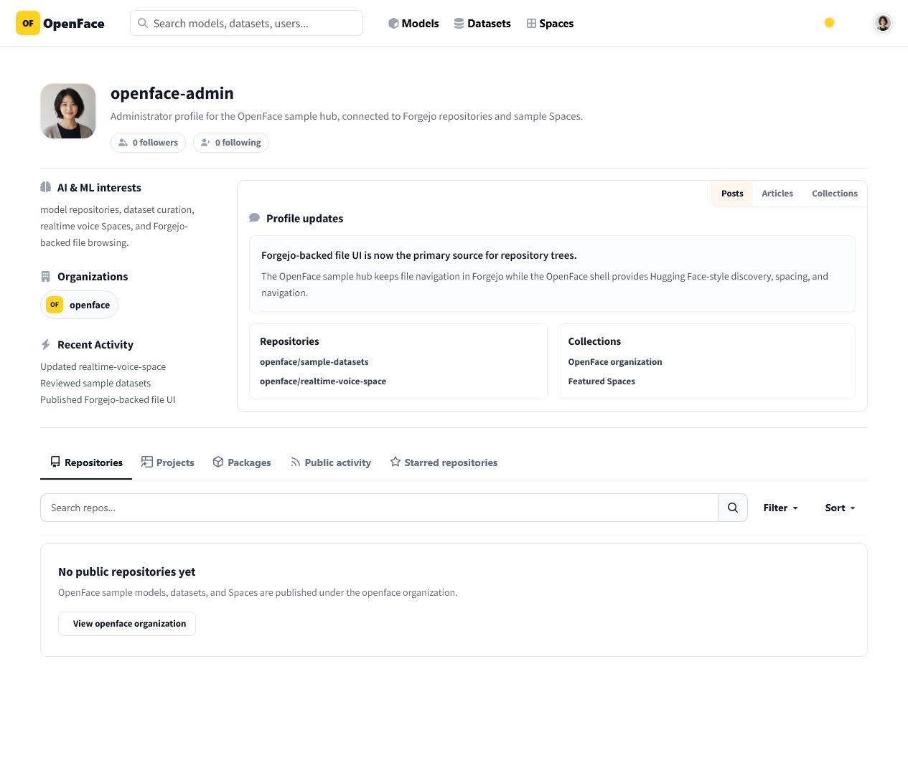
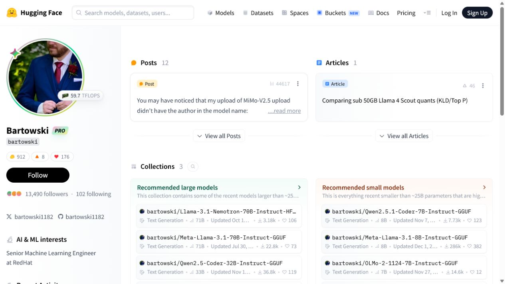
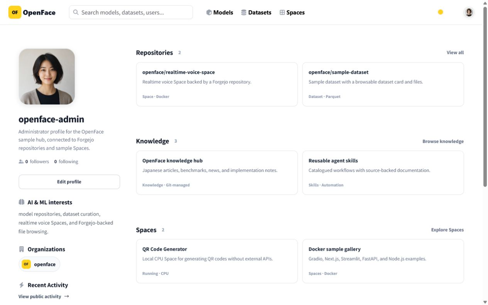
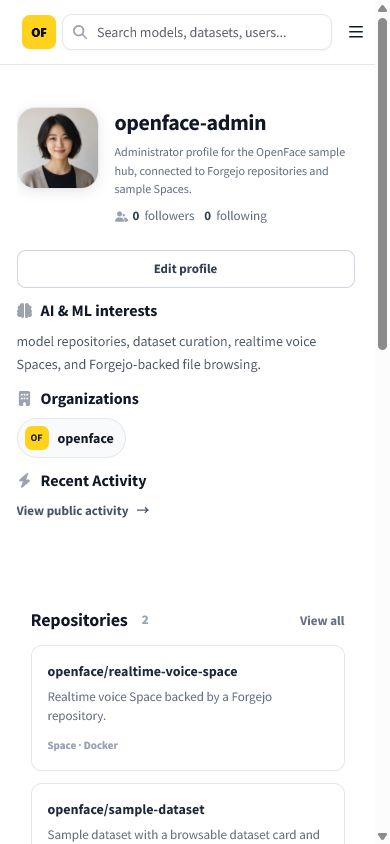
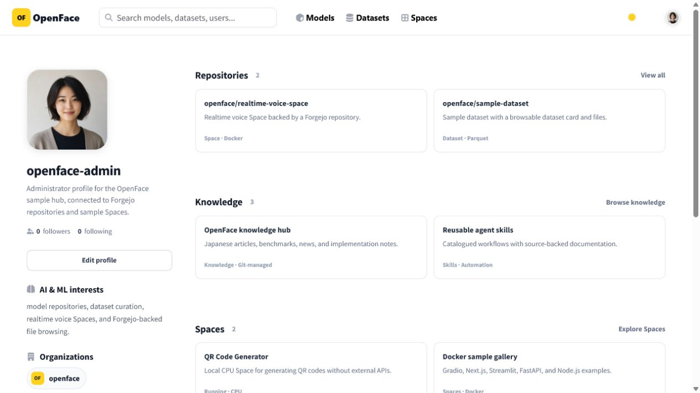
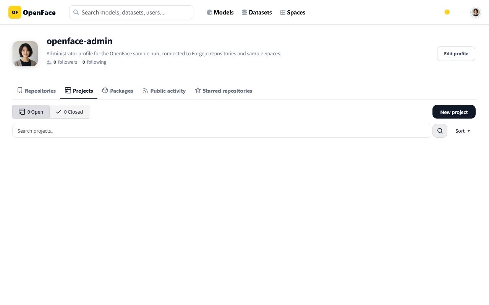
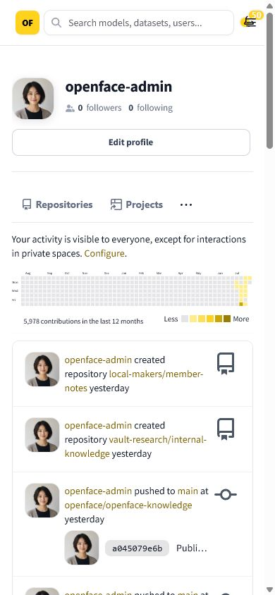
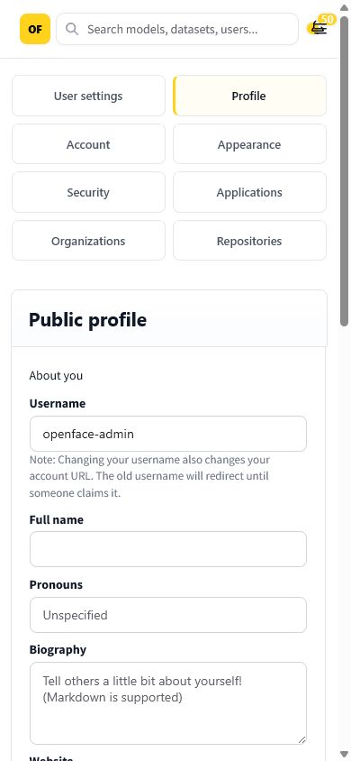

# Logged-in profile visual audit

Captured on 2026-07-27 with the Docker Compose production topology and the
`nyankoface-admin` account. The audit uses the current Hugging Face profile
layout as its structural reference: a persistent identity rail, real asset
sections, compact subpage identity, and dedicated repository listing routes.

Reference: [Hugging Face profile and repository listing update](https://huggingface.co/changelog/org-profiles-repository-listing-pages)

## Before and reference

| NyankoFace before | Hugging Face reference |
| --- | --- |
|  |  |

The previous overview repeated a full profile introduction above a second
card, exposed non-interactive `Posts / Articles / Collections` labels, and
repeated the same overview on Activity, Stars, Followers, and Following.

## Verified result

| Desktop | Mobile (390 × 844) |
| --- | --- |
|  |  |

The profile now has:

- one identity rail with working Followers, Following, Edit profile,
  Organization, and Activity links;
- real Repositories, Knowledge, and Spaces sections;
- cards whose whole surface is a real link;
- no inert tab-shaped labels;
- a compact identity header on profile subpages;
- no horizontal overflow at 390 px.

## Production verification

The same logged-in account was verified after deployment at
`https://example.invalid`. These are fresh production captures,
not local Docker screenshots.

| Logged-in desktop | Logged-in mobile (390 × 844) |
| --- | --- |
|  |  |

The production smoke test visited all 20 routes in the matrix below. Every
route rendered without an internal-server-error state. The mobile profile had
a 390 px viewport and 390 px document width, zero overflowing descendants,
one right-aligned menu button, and no overlapping notification control.

## Profile-linked route matrix

| Surface | Route | Desktop | Mobile | Result |
| --- | --- | --- | --- | --- |
| Overview | `/git/nyankoface-admin` | ✅ | ✅ | Identity rail and asset sections |
| Repositories | `/git/nyankoface-admin?tab=repositories` | ✅ | ✅ | Same overview; native repository controls follow |
| Activity | `/git/nyankoface-admin?tab=activity` | ✅ | ✅ | Compact identity; activity is not pushed down by duplicate cards |
| Starred | `/git/nyankoface-admin?tab=stars` | ✅ | ✅ | Compact identity and native empty state |
| Followers | `/git/nyankoface-admin?tab=followers` | ✅ | ✅ | Working destination from follower link |
| Following | `/git/nyankoface-admin?tab=following` | ✅ | ✅ | Working destination from following link |
| Projects | `/git/nyankoface-admin/-/projects` | ✅ | ✅ | Correct profile navigation; no repository-tab misclassification |
| Packages | `/git/nyankoface-admin/-/packages` | ✅ | ✅ | Correct profile navigation and empty state |
| Profile settings | `/git/user/settings` | ✅ | ✅ | Logged-in form layout |
| Account | `/git/user/settings/account` | ✅ | ✅ | Settings route rendered |
| Appearance | `/git/user/settings/appearance` | ✅ | ✅ | Settings route rendered |
| Security | `/git/user/settings/security` | ✅ | ✅ | Settings route rendered |
| Applications | `/git/user/settings/applications` | ✅ | ✅ | Settings route rendered |
| Organizations | `/git/user/settings/organization` | ✅ | ✅ | Settings route rendered |
| Repository settings | `/git/user/settings/repos` | ✅ | ✅ | Settings route rendered |
| NyankoFace organization | `/git/nyankoface` | ✅ | ✅ | Organization profile rendered |
| Knowledge | `/docs` | ✅ | ✅ | Profile Knowledge destination rendered |
| Skills | `/skills` | ✅ | ✅ | Profile Skills destination rendered |
| Spaces | `/spaces` | ✅ | ✅ | Profile Spaces destination rendered |
| QR Space | `/seraphim-labs/qr-code-generator` | ✅ | ✅ | Linked CPU Space rendered |

## Subpage evidence

| Projects | Activity | Settings |
| --- | --- | --- |
|  |  |  |

The audit captured both the top and bottom of long pages. Those files use the
`after-<route>-desktop-top.png` and `after-<route>-desktop-bottom.png` naming
scheme in this directory.

## Automated checks

- desktop viewport: 1280 × 800;
- mobile viewport: 390 × 844;
- document width equals viewport width on Overview, Projects, Packages,
  Activity, and Settings;
- the logged-in mobile header exposes one menu button without the notification
  badge and menu button occupying the same coordinates;
- all profile asset cards contain a concrete `href`;
- Projects and Packages are excluded from repository route normalization.
