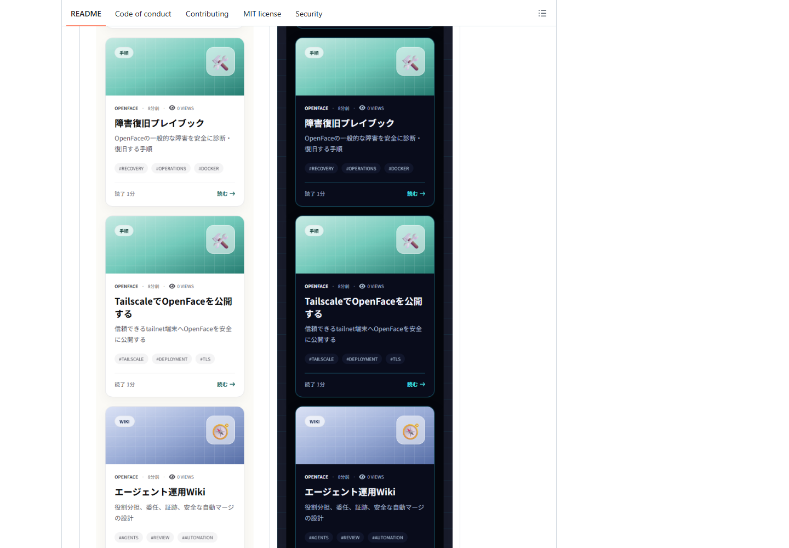
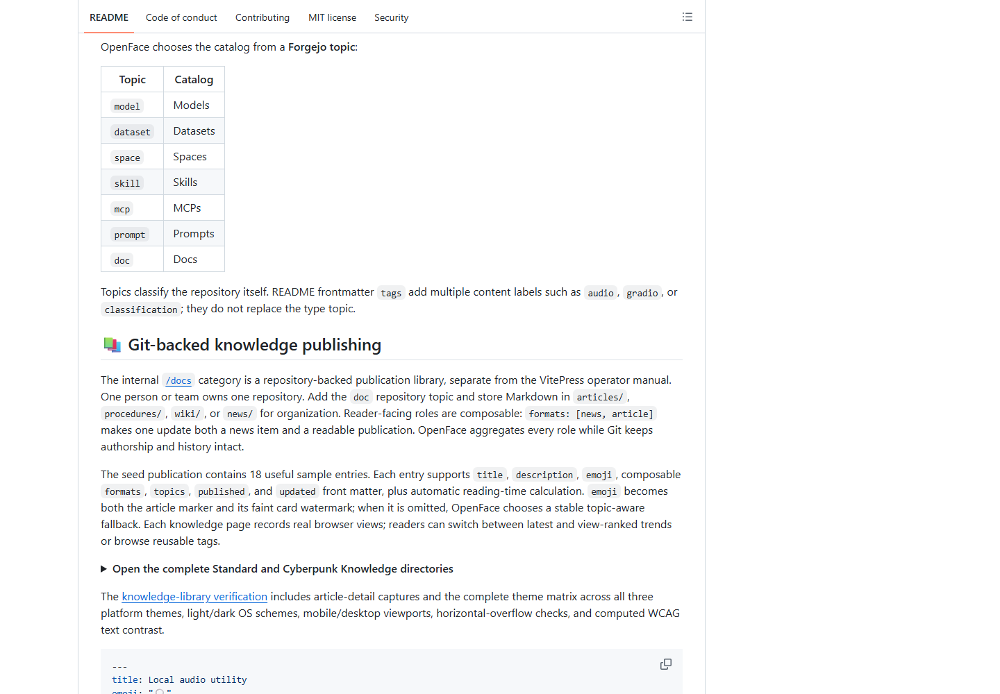
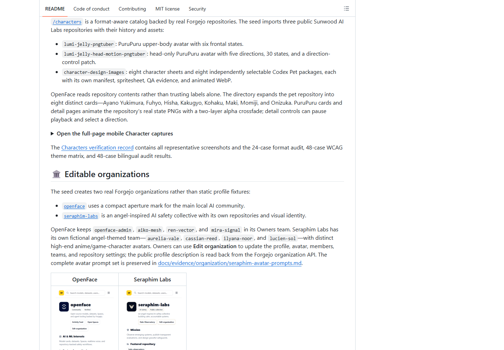
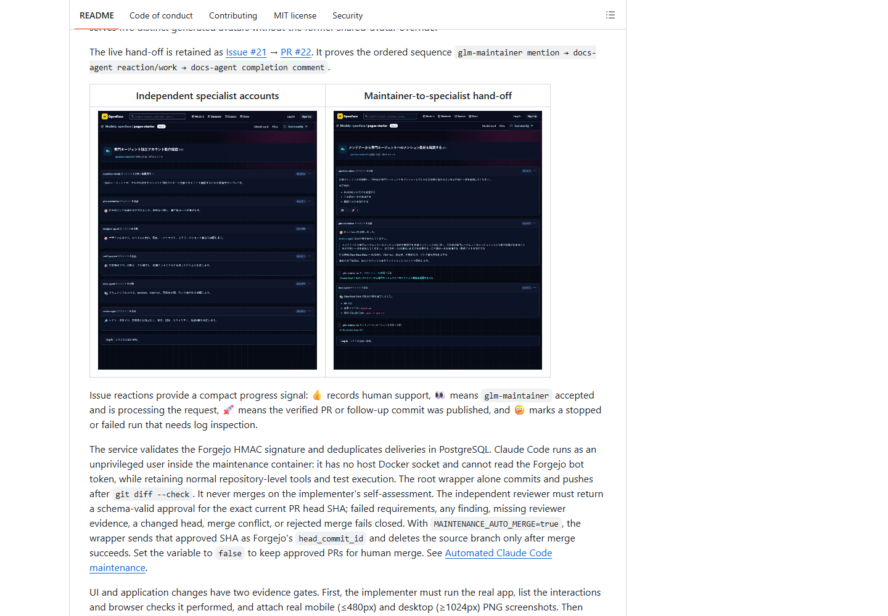
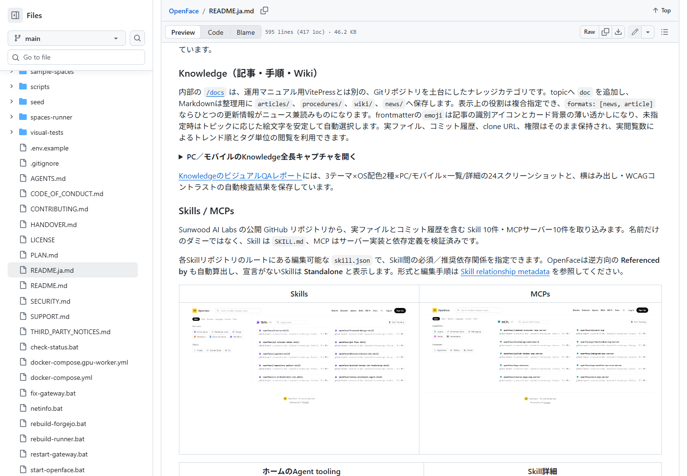

# README desktop image-layout verification

The public English and Japanese GitHub README pages were inspected at
`1440 × 1000`. The audit treats a visible image as a problematic portrait when
its rendered height exceeds `420 px` and its height-to-width ratio exceeds
`1.1`.

## Result

- Before: the tallest visible Knowledge capture rendered at `8,347 px`.
- After: `0` oversized visible portraits in both READMEs.
- Full-page Character, Knowledge, organization-settings, and Skill-graph
  captures remain available inside collapsed disclosure sections.
- Visible mobile and discussion evidence is capped at `360–420 px` and links to
  the original full-resolution image.

Run the repeatable public-render audit:

```bash
npm run audit:readme-layout --prefix visual-tests
```

## Screenshot evidence

| Before | After |
|---|---|
|  |  |

| Organization evidence | Agent discussion evidence |
|---|---|
|  |  |


