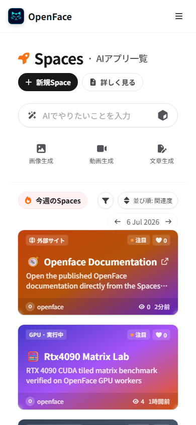

# Space interaction evidence

## External-link Space

`seraphim-labs/nyankoface-documentation` uses:

```yaml
external_url: https://sunwood-ai-labs.github.io/NyankoFace/
```

The production catalog was verified at 1,440 px desktop and 390 px mobile
widths. Both cards show the **External site** badge and external-link icon
without horizontal page overflow.

| Desktop catalog | Mobile catalog |
| --- | --- |
|  |  |

Functional browser checks:

- clicking or tapping the card navigates directly to
  `https://sunwood-ai-labs.github.io/NyankoFace/`;
- the same real tap increased persisted `browser_views` from `0` to `1`
  before navigation completed;
- the destination contains no NyankoFace iframe;
- `/seraphim-labs/nyankoface-documentation` responds with HTTP 307 and the same
  external `Location`;
- a regular embedded Space detail URL still responds with HTTP 200.
