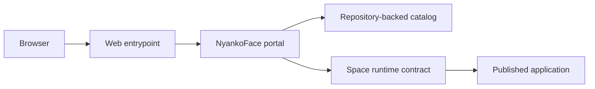

# Architecture

This page describes the public product contracts only. Deployment topology,
hostnames, network addresses, hardware nodes, and management-plane details are
intentionally omitted from this public snapshot.

## Public request flow

NyankoFace keeps the browser-facing entrypoint, repository metadata, catalog
surfaces, and Space runtime contract separate. The exact deployment arrangement
is an operator concern and is not part of the public repository contract.

## Trust boundaries

- Repository content is treated as untrusted input.
- Secrets and credentials stay in local secret stores or deployment-managed
  files, never in tracked examples.
- Runtime access is authorized before a published application is embedded.
- Public documentation avoids naming private hosts, addresses, or internal
  verification endpoints.

## Further reading

See [Docker Spaces](./spaces.md) and [Space Variables and Secrets](./space-environment.md)
for the supported public-facing contracts. Review the repository's security policy
before enabling any deployment-specific capability.
