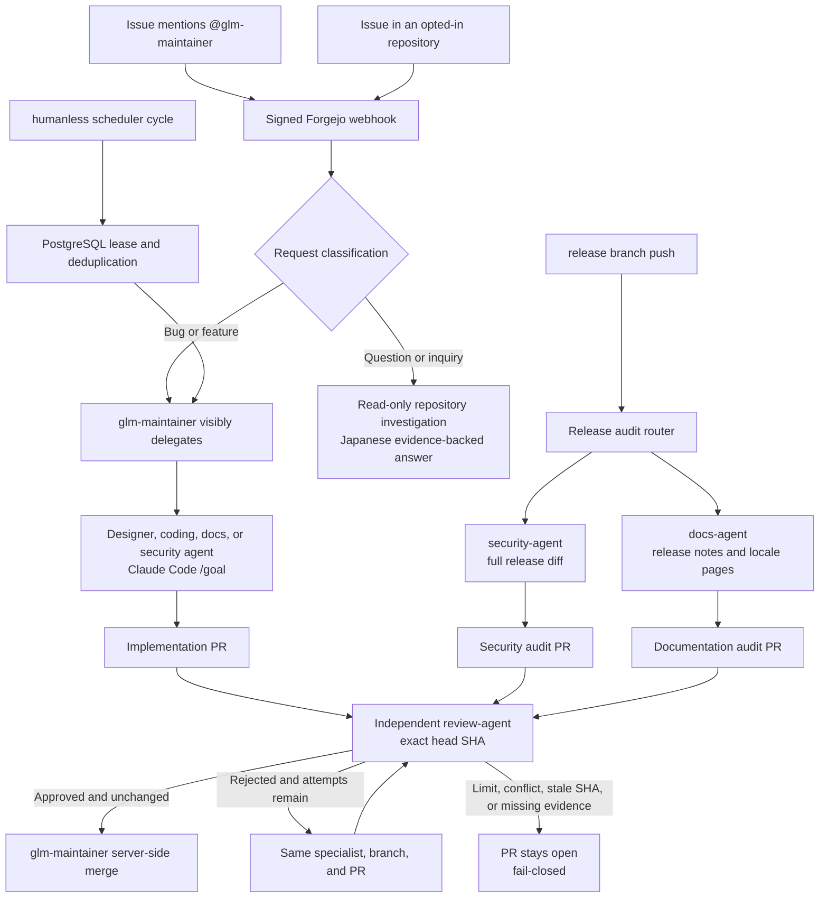
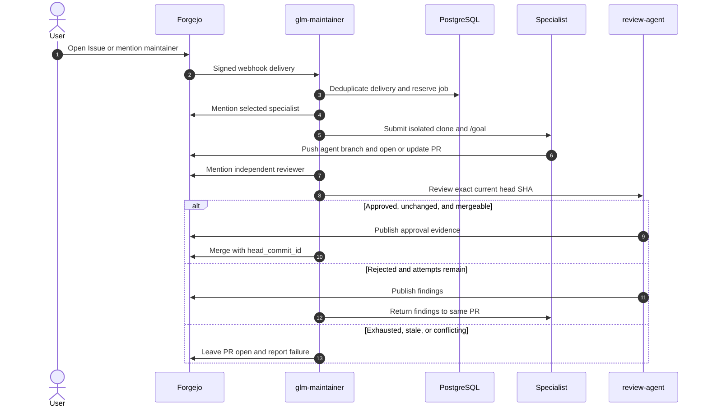
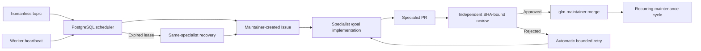
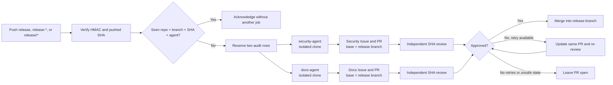
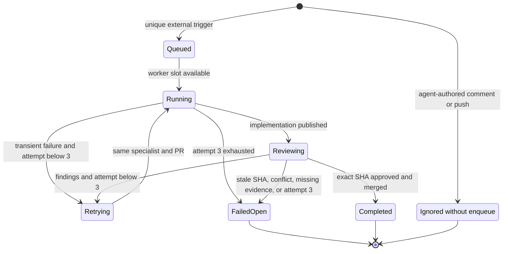

# Automated Claude Code `/goal` maintenance

NyankoFace can turn a Forgejo Issue addressed to `@glm-maintainer` into a verified, automatically merged Pull Request by running Claude Code's built-in `/goal` command against the cloned repository. Claude Code connects directly to Z.AI's Anthropic-compatible endpoint and uses `glm-5.2`.

## Entry points at a glance

Four entry points share the same specialist, evidence, independent-review, and
fail-closed merge gates. Questions are the deliberate exception: they stay
read-only and receive an evidence-backed Japanese answer instead of a PR.



## Flow

1. Forgejo signs and sends the organization `push`, `issues`, `issue_comment`, `pull_request`, or `pull_request_comment` webhook.
2. `maintenance-agent` validates the HMAC signature and records the delivery in PostgreSQL.
3. `glm-maintainer` classifies the request and posts a visible `@specialist` delegation comment.
4. Only after that comment succeeds, the service clones the repository and creates `agent/issue-N`.
5. Claude Code 2.1.205 receives `/goal` followed by the Issue, the selected specialist contract, and explicit completion conditions.
6. Claude Code inspects local instructions and source, edits any required repository files, runs relevant commands and tests, reviews its diff, and keeps working until the goal evaluator finishes.
7. The root wrapper verifies repository containment, required UI evidence, and `git diff --check`. The specialist identity commits, pushes, and posts the completion reply with status `independent review pending`.
8. `glm-maintainer` visibly mentions `@review-agent` with the PR URL and review contract.
9. A second Claude Code `/goal` run checks the exact PR head SHA read-only. It traces every Issue requirement, reads the full diff, reruns relevant checks, records severity/location/remediation for findings, and emits an `approved` or `rejected` report.
10. UI/app reviews must independently start and operate the app and attach reviewer-owned mobile and desktop captures. The implementer's screenshots alone cannot satisfy this gate.
11. Only a schema-valid approval for the unchanged head SHA permits server-side merge. The merge request also supplies Forgejo's `head_commit_id`; rejection, missing evidence, reviewer edits, timeout, stale SHA, or merge conflict leaves the PR open.

This is deliberately not a fixed planner/coder JSON pipeline. There is no file-count or changed-line cap; `/goal` retains Claude Code's repository-level freedom.

## Configure Z.AI

Keep the Z.AI API key in a protected env file outside the repository. Compose reads that file at container creation; the credential is never committed to Git.

```dotenv
ZAI_AGENT_CONFIG=C:/Users/you/AppData/Local/NyankoFace/zai.env
ZAI_ANTHROPIC_BASE_URL=https://api.z.ai/api/anthropic
MAINTENANCE_MODEL=glm-5.2
MAINTENANCE_GOAL_TIMEOUT_SECONDS=3600
MAINTENANCE_MAX_WORKERS=2
MAINTENANCE_AUTO_MERGE=true
MAINTENANCE_HUMANLESS_ENABLED=false
MAINTENANCE_HUMANLESS_TOPIC=humanless
MAINTENANCE_HUMANLESS_SCAN_SECONDS=300
MAINTENANCE_HUMANLESS_INTERVAL_MINUTES=1440
MAINTENANCE_HUMANLESS_RETRY_MINUTES=60
MAINTENANCE_HUMANLESS_MAX_ATTEMPTS=3
MAINTENANCE_HUMANLESS_STALE_SECONDS=900
MAINTENANCE_AUTO_ISSUE_ENABLED=true
MAINTENANCE_AUTO_ISSUE_TOPIC=humanless-issues
MAINTENANCE_AUTOMATIC_RETRY_MAX_ATTEMPTS=3
MAINTENANCE_AUTO_LABEL_ENABLED=true
MAINTENANCE_AUTO_LABEL_DRY_RUN=false
MAINTENANCE_AUTO_LABEL_ALLOWED=bug,enhancement,documentation,question,good first issue
MAINTENANCE_AUTO_LABEL_CONFIDENCE=0.85
```

Then rebuild the idempotent seed and service:

```powershell
docker compose up -d --build seed
docker compose up -d --build maintenance-agent
docker compose exec maintenance-agent claude --version
docker compose exec maintenance-agent python -c "import urllib.request; print(urllib.request.urlopen('http://localhost:8010/health').read().decode())"
```

The seed creates the non-admin orchestrator and specialist users, their write-only organization team, separate Forgejo tokens, a random webhook HMAC secret, and the push/Issue/Pull Request/comment webhook.

## Automatic Issue and Pull Request labels

The signed webhook also classifies newly opened or edited Issues and Pull
Requests. Classification is deterministic, so the same title, body, and PR
file list always produce the same confidence and reason.

- only labels in `MAINTENANCE_AUTO_LABEL_ALLOWED` are considered;
- a label must already exist in the target repository;
- existing manual labels are never removed or replaced;
- `MAINTENANCE_AUTO_LABEL_CONFIDENCE` rejects weak matches;
- repeated deliveries are idempotent, and label-generated webhook events are
  ignored;
- every decision is stored in PostgreSQL and exposed by
  `GET /api/labels/audits`.

Use the preview endpoint before enabling writes:

```powershell
curl.exe -X POST http://localhost:8010/api/labels/preview `
  -H "Content-Type: application/json" `
  -d '{"title":"README is unclear","body":"Please document the setup.","changed_files":[]}'
```

Set `MAINTENANCE_AUTO_LABEL_DRY_RUN=true` to keep the same webhook and audit
flow while returning `would_apply` without changing Forgejo. Set
`MAINTENANCE_AUTO_LABEL_ENABLED=false` to stop classification completely.
Rules initially cover `bug`, `enhancement`, `documentation`, `question`, and
an explicitly beginner-friendly `good first issue`.

## Trigger and opt out

Mention `@glm-maintainer` in a newly opened Issue to start maintenance. Users do not address specialists directly; the maintainer owns classification and delegation.

For unattended intake, set `MAINTENANCE_AUTO_ISSUE_ENABLED=true` and add either the `humanless-issues` or `humanless` repository topic. A new Issue then follows one of two fail-safe paths without a mention:

- a bug, regression, or vulnerability is assigned to the matching specialist, fixed on `agent/issue-N`, independently reviewed at the exact SHA, and auto-merged only after approval;
- a question, inquiry, support request, or unclassified report is investigated read-only. The specialist posts a Japanese answer with repository paths and confidence, and the wrapper rejects the run if tracked files changed.

When a bug-fix review is rejected or an automatic run hits a transient execution failure, the work returns to the same specialist and existing PR automatically. The specialist can update and re-review that PR up to `MAINTENANCE_AUTOMATIC_RETRY_MAX_ATTEMPTS`; reaching the limit leaves the PR open and the job inspectably failed instead of looping.

`humanless-paused` suspends unattended intake and scheduled maintenance. Add either opt-out marker when automation is inappropriate:

- label: `agent:skip`
- body marker: `<!-- nyankoface-maintenance:skip -->`

Repeated deliveries produce one job and one PR per Issue. The stable branch is `agent/issue-N`.

### Issue-to-merge sequence



### Humanless mode

Humanless mode replaces the human-authored Issue with a PostgreSQL-backed scheduler while preserving the same specialist, evidence, independent-review, and guarded-merge gates.

1. Set `MAINTENANCE_HUMANLESS_ENABLED=true`.
2. Add the `humanless` repository topic. Add `humanless-ui` when real browser evidence is mandatory.
3. On the first scan, `glm-maintainer` creates a bootstrap Issue from the repository description, README, and existing files.
4. `coding-agent` completes an actually usable first product. A separate `review-agent` reviews the exact head SHA before `glm-maintainer` can merge.
5. After the configured interval, maintenance cycles rotate through design, security, documentation, and coding. Each cycle selects and completes one highest-value improvement from the current repository state.
6. A rejected review automatically returns its findings to the same specialist and PR, up to `MAINTENANCE_HUMANLESS_MAX_ATTEMPTS`.
7. Exhausted, stale, conflicting, or failed work remains fail-closed and becomes input to a later recovery cycle. It is never silently reported as complete.

Only one cycle per repository can be preparing, queued, running, or retrying. The `humanless_cycles` PostgreSQL table survives restarts and records the phase, specialist, Issue, attempt, state, PR, and next eligible run. An active worker renews its lease every minute; if the service disappears and no heartbeat arrives for `MAINTENANCE_HUMANLESS_STALE_SECONDS`, the next scan marks that lease failed. Before creating new work, recovery checks both PostgreSQL and Forgejo for the newest open `agent/humanless-*` PR newer than the last completed cycle. It supersedes later abandoned cycles and resumes that exact branch at independent review. If review rejects it, the same specialist edits the same PR; if review infrastructure stops, the next scan retries review without rebuilding the product. Add `humanless-paused` to suspend future cycles without deleting evidence. Inspect state at `GET /api/humanless/cycles`.

See the
[production humanless-autopilot evidence](../evidence/automated-maintenance/humanless-autopilot/README.md)
for completed cycles, the duplicate-cycle regression, a fail-closed review,
Docker proof, and public browser captures.

All agent-invoked test, lint, build, and preview commands are instructed to use a finite command timeout. The wrapper also applies a process-group timeout to the complete Claude run and terminates descendant preview or test processes on exit. A hung command therefore becomes inspectable failed work rather than holding a repository lease forever.



### Release branch push audits

A push to `release`, `release-*`, or `release/*` starts two isolated jobs without requiring an Issue mention:

| Agent | Required release inspection | Output |
|---|---|---|
| `security-agent` | Full default-branch-to-release diff; authn/authz, validation, secrets, dependencies, CI/container boundaries, and supply chain | Security fixes when needed plus an evidence-backed `docs/release-audits/` report |
| `docs-agent` | README/VitePress, examples, migration and reconstruction steps, release-facing behavior, links, commands, actual diff, changed files, and tag history | Documentation fixes, diff-backed `RELEASE_NOTES.md`, versioned pages for every existing locale, and an evidence-backed `docs/release-audits/` report |

The maintainer creates one visible audit Issue per agent and runs both jobs within `MAINTENANCE_MAX_WORKERS`. Their deterministic branches include the agent, normalized release branch, and pushed SHA. Each PR targets the pushed release branch—not the default branch. PostgreSQL deduplicates repository + branch + SHA + agent so webhook retries do not create duplicate work. Agent-authored pushes and release-branch deletion events are ignored.

Every release audit receives the separate, SHA-bound `review-agent` gate. Release notes cannot claim checks that were not run or infer shipped behavior from commit subjects alone. A rejected implementation is returned to the same agent and PR for at most `MAINTENANCE_AUTOMATIC_RETRY_MAX_ATTEMPTS` total attempts. With `MAINTENANCE_AUTO_MERGE=true`, `glm-maintainer` merges only a PR whose exact current head SHA is approved with every requirement and check passed and no findings. Exhausted, stale, conflicting, or incomplete reviews remain open. Inspect persisted release state at `GET /api/releases/audits`.



### Bounded retry and loop safety



### Continue editing from a comment

On the source Issue or its agent-created PR, mention the maintainer followed by the additional instruction:

```text
@glm-maintainer 見出しも日本語にしてください。ほかのファイルは変更しないでください。
```

The agent checks out the existing `agent/issue-N` branch, runs the Japanese completion prompt, verifies the new diff, and pushes a new commit to the same PR. Ordinary discussion comments do not trigger a model run. A currently queued or running Issue cannot be queued again; edit or post the follow-up after the active run finishes.

### Maintainer-led specialist delegation

New Issues and follow-up comments are classified automatically by `glm-maintainer`. Direct `@designer-agent`, `@coding-agent`, `@docs-agent`, `@security-agent`, or `@review-agent` mentions do not start a run and do not override routing. The maintainer selects one specialist, announces that assignment in the conversation, and only then submits that specialist's worker. `/api/agents` lists the persona contracts, while `/api/jobs` records the selected username and job state. A PR-triggered job keeps the source Issue branch but posts reactions and the completion reply back to the PR conversation where it was requested.

The coordinator and five specialists are independent Forgejo users. Seed assigns each account its own least-privilege token and a separately generated, centered character avatar on a plain role color. Before a worker can start, `glm-maintainer` must successfully post a comment that mentions the selected specialist. If that announcement fails, the queued database reservation is removed and no hidden specialist run starts. The retained [Issue #21](https://example.invalid/git/nyankoface/pages-starter/issues/21) demonstrates this ordered hand-off through completion; profile and discussion screenshots are kept in [`docs/evidence/agents`](../evidence/agents/README.md).

The Issue reaction trail is intentionally small: 👍 for human support, 👀 while the maintenance agent is working, 🚀 after successful publication, and 😕 when a run fails or stops before publication.

### UI and application evidence gate

UI/app work cannot auto-merge from code inspection alone. The specialist must start the real app, exercise the changed interaction, and produce `.nyankoface-maintenance/ui-report.json` plus real PNG captures. The wrapper requires all listed tests to be `passed`, at least one mobile capture at 480px or below, and at least one desktop capture at 1024px or above. It validates PNG signatures and dimensions, removes the private evidence directory from the commit, uploads the files to the Forgejo completion comment, and renders a Markdown table describing exactly what was tested. The maintenance image includes Chromium, Japanese CJK fonts, and color emoji so Japanese screenshots remain readable.

That implementer report is not approval. After the PR is pushed, `glm-maintainer` assigns `@review-agent`. The reviewer uses a distinct Forgejo token and a read-only prompt, validates the exact current head SHA, and writes `.nyankoface-maintenance/review-report.json`. Approval requires every requirement and executed check to pass and the findings list to be empty. For UI work, the reviewer must independently capture at least one real PNG at 480px or below and one at 1024px or above; those images are uploaded from the reviewer account. A malformed report, missing image, changed tracked file, failed check, any finding, or stale head SHA blocks merge.

The retained [ClearNext Issue #22](https://example.invalid/git/nyankoface/clear-next/issues/22) demonstrates the complete contract: human `@glm-maintainer` request, maintainer-to-designer hand-off, real disclosure interaction, mobile/desktop evidence, explicit overflow and browser-error checks, and verified auto-merge.

| Forgejo completion comment | Opened mobile attachment |
|---|---|
|  |  |

Up to `MAINTENANCE_MAX_WORKERS` Issues run concurrently. Each job has its own clone and `agent/issue-N` branch; overlapping edits can still produce normal Git conflicts between the resulting PRs. Values are bounded to 1–4 to avoid exhausting the host or the model provider.

## Freedom and isolation

- Claude Code runs as the unprivileged `maintainer` user inside the dedicated maintenance container.
- The cloned repository is writable and normal Claude Code tools, local instructions, builds, tests, and linters are available.
- The container has no host Docker socket, so repository commands cannot control the host Docker daemon.
- Forgejo bot credentials and the webhook secret are root-only (`0600`) and unreadable by Claude Code.
- The model API credential is necessarily available to the Claude Code process for inference.
- The wrapper rejects paths that resolve outside the clone and requires `git diff --check` before publication.
- Only the root wrapper receives Forgejo authentication for commit publication. Claude Code is instructed not to push or open PRs.
- With `MAINTENANCE_AUTO_MERGE=true` (the Compose default), the root wrapper requests a server-side Forgejo merge only after independent approval of the unchanged head SHA, then deletes the work branch. Set it to `false` when an additional human merge is mandatory.

This boundary permits repository code execution inside the maintenance container. Treat third-party repositories and Issue automation accordingly; it is not a host security sandbox for arbitrary untrusted code.

## Operations

```powershell
docker compose ps maintenance-agent
docker compose logs -f maintenance-agent
docker compose exec maintenance-agent python -c "import urllib.request; print(urllib.request.urlopen('http://localhost:8010/api/jobs').read().decode())"
```

Interrupted `queued` or `running` jobs are marked `interrupted` on service restart instead of remaining falsely active.

## Verified end-to-end example

[Issue #22](https://example.invalid/git/nyankoface/clear-next/issues/22) produced and auto-merged [PR #23](https://example.invalid/git/nyankoface/clear-next/pulls/23). The retained evidence confirms:

- the human request mentions only `@glm-maintainer`;
- `glm-maintainer` visibly assigns `@designer-agent` before the worker starts;
- Claude Code `/goal` uses `glm-5.2` and returns a Japanese completion summary;
- the specialist's own account posts an 18-row UI-test table and four PNG attachments;
- click, Enter, Space, light/dark, 390px/1440px, overflow, console errors, and page errors are explicitly tested;
- the attached mobile screenshot contains readable Japanese CJK glyphs;
- Forgejo reports the PR closed and merged at commit `22430240bf329d67da36636f7ba58a63002350ea`.

### End-to-end app delivery

Starting from an empty public repository, the workflow designed, implemented, containerized, and independently reviewed ClearNext through eight specialist stages with verified auto-merge. The [ClearNext maintenance evidence](../evidence/automated-maintenance/clear-next/README.md) preserves live Runner screenshots, Issue and PR links, merge commits, and the 103-test result.
