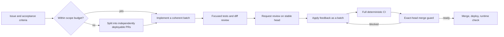

# Deliver changes quickly and safely

## The complete 22-hour window

This was not only a PR #80 incident. From PR #76 opening at 20:30 JST on July
30 to PR #80 merging at 17:58 the next day, GitHub records 21 hours and 29
minutes. Pre-PR implementation and post-merge production work extend the
user-visible duration beyond 22 hours.

Nine PRs (#76, #77, #78, #79, #80, #82, #84, #85, and #86) contained 90
commits, 265 changed-file entries, and 25,930 changed lines. They triggered 88
Actions runs, including 27 failures and 14 cancellations, with about 476.6
minutes of cumulative workflow elapsed time.

There was no durable checkpoint for 8 hours and 18 minutes between 22:03 and
06:21. Four other PRs were also handled while PR #80 remained active.

## PR #80 breakdown

[PR #80](https://github.com/Sunwood-ai-labs/NyankoFace/pull/80) itself took 11
hours and 37 minutes from creation to merge on July 31, 2026.

| Metric | Measured value |
|---|---:|
| Commits | 77 |
| Changed files | 87 |
| Additions / deletions | 14,964 / 455 |
| Review submissions | 78 |
| Codex reviews | 23 |
| Review threads | 57 (28 P1, 29 P2) |
| GitHub Actions runs | 49 |
| Successful / failed / cancelled | 22 / 13 / 14 |
| Runner time | about 216.4 minutes |

The 13 failures comprised six visual-capture failures, five shared `/data`
test-state failures, and two shared SQLite or mutable fake-response failures.
The final Codex review on head `d7ca1b5c4809` arrived 22 seconds after merge
and opened two P2 threads. The process did not verify review completion on the
exact current head.

## Root causes

1. Nine PRs ran as one open-ended effort without a fixed stop condition.
2. An 8-hour, 18-minute implementation block had no durable checkpoint.
3. CI/CD, Pages, previews, Space deployment, secrets, runner isolation, and UI
   were combined in PR #80.
4. Four other PRs caused context switching while PR #80 was active.
5. Trust boundaries and state transitions were discovered serially in review.
6. Reviews were requested after micro-commits instead of stable feedback waves.
7. Slow visual capture was mixed into deterministic CI.
8. Tests shared `/data`, SQLite files, and mutable fakes.
9. No gate combined exact-head review, unresolved threads, checks, and scope.

A terminal Codeberg Container Registry HTTP 503 added delay, but the official
Forgejo mirror resolved it and it was not the primary cause.

## Preventive workflow



The default scope budget is 25 files, 2,000 changed lines, and 20 commits.
Split work that exceeds any limit. Use an explicit exception only for work
that cannot be safely separated.

Create a validated coherent checkpoint within 45 minutes of starting
implementation. If that is unsafe, record the blocker and next decision point
instead of continuing silently. Diagnose after the same failure occurs twice.
Keep one active implementation PR per workstream unless repositories, branches,
acceptance criteria, and merge order are demonstrably independent.

### One worktree per issue

Start normal file-changing issues in a dedicated branch and worktree. This
`origin/develop` path is for normal Issue, feature, and bugfix work:

```powershell
git fetch origin develop
git worktree add ../NyankoFace-issue-123 -b fix/issue-123 origin/develop
```

For an emergency production hotfix, do not use the normal Issue path. Start a
dedicated hotfix worktree from `origin/main`, target the hotfix PR at `main`,
and back-merge the same fix to `develop` after the production merge, tag, and
verification:

```powershell
git fetch origin main
git worktree add ../NyankoFace-hotfix-123 -b hotfix/issue-123 origin/main
```

Reserve the main worktree for synchronizing main, integration tests, and
post-merge deployment. Keep each issue worktree limited to one issue, one set
of acceptance criteria, and one PR. Do not implement issues concurrently when
they modify the same files or state schema; merge the prerequisite PR first,
then update the dependent worktree from develop. Move newly discovered unrelated
work into another issue and worktree.

After merge and production verification, confirm there are no unpushed commits
or user-owned changes before removing the worktree and local branch.

CI owns builds, lint, unit and integration tests, configuration checks, and
documentation builds. Tests use isolated temporary directories. Visual QA
stays outside CI: capture the real Compose or production runtime and have a
person open the images.

Before merge, run:

```powershell
python scripts/check_pr_merge_readiness.py `
  --repo Sunwood-ai-labs/NyankoFace `
  --pr 87
```

The guard blocks drafts, stale or missing Codex reviews, unresolved threads,
pending or failed checks, and unexplained scope-budget violations. Review
requests, reactions, and approvals on older commits never authorize merge.
Use `gh pr merge --match-head-commit <verified-sha>` so the merge itself cannot
silently accept a newer head.
