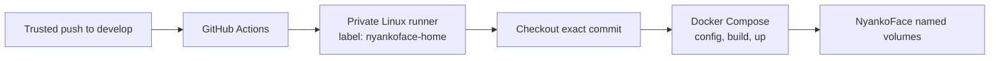

# Home deployment

A push to the trusted `develop` branch can deploy NyankoFace to a private
Docker host through a GitHub Actions self-hosted runner. The runner makes an
outbound connection to GitHub, so the Docker host does not need to expose SSH
or the application to the internet.



## Before enabling it

- Create the `develop` branch and protect it like a deployment branch. Only
  trusted maintainers should be able to push to it.
- Use a dedicated Linux self-hosted runner on the Docker host, or on a private
  host that can reach the same Docker daemon. Do not reuse a runner shared with
  unrelated repositories.
- Give the runner service account permission to access Docker and the private
  deployment files. Keep those files outside the Actions checkout.
- Keep a backup and recovery plan for the database, Forgejo data, credentials,
  and gateway certificates before the first automated deployment.

The workflow intentionally deploys only `develop`; pull requests never deploy.
The repository's normal CI should remain a required check before changes are
allowed into `develop`.

## Register the runner

1. Open the repository's **Settings → Actions → Runners** page and create a new
   self-hosted runner for Linux x64.
2. Follow GitHub's displayed installation instructions on the private Docker
   host. Install the runner as a service under a dedicated account.
3. Add the custom label `nyankoface-home`, then start or restart the runner
   service and confirm that it is online.
4. Provide the following environment variables to the runner service account.
   The values below are placeholders; replace them with private paths on the
   host.

```dotenv
NYANKOFACE_DEPLOY_ENV_FILE=/srv/nyankoface-private/.env
NYANKOFACE_GATEWAY_CERT_DIR=/srv/nyankoface-private/gateway-certs
# Keep this only when the MCP profile is part of the running stack.
COMPOSE_PROFILES=mcp
```

`NYANKOFACE_DEPLOY_ENV_FILE` and `NYANKOFACE_GATEWAY_CERT_DIR` must be absolute
paths. Restart the runner service after changing its environment; an already
running service will not automatically see new variables.

The deployment script also normalizes NyankoFace's path-valued settings. For
example, a relative `NYANKOFACE_MCP_STATE_DIR=./secrets/nyankoface-mcp` in the
private `.env` is resolved relative to the `.env` directory rather than the
temporary Actions checkout. Absolute values are recommended for credentials
and other sensitive files.

## What a deployment does

When `develop` receives a push, the workflow:

1. checks out the exact pushed commit with credentials removed from the
   checkout;
2. validates the Docker Compose configuration;
3. runs `docker compose up -d --build` for the `nyankoface` project; and
4. waits for every configured service to be running and healthy. The one-shot
   `seed` service may finish successfully.

The workflow does not run `down`, `down --volumes`, or `--remove-orphans`.
NyankoFace's named volumes therefore remain in place, and unrelated Compose
services are not removed by a deployment. The private `.env`, certificates,
tokens, and host-specific files are never checked out from Git.

Use the workflow's **Run workflow** button on `develop` for a controlled
manual deployment. Before doing that, confirm that the runner is online and
that the private paths are readable by its service account.

## Validate without restarting the stack

On the runner host, from an Actions checkout, run:

```bash
NYANKOFACE_DEPLOY_ENV_FILE=/srv/nyankoface-private/.env \
NYANKOFACE_GATEWAY_CERT_DIR=/srv/nyankoface-private/gateway-certs \
bash scripts/deploy-home.sh --validate-only
```

This checks Docker access, the private paths, the selected Compose profiles,
and the rendered Compose configuration without building or restarting any
container.

## Rollback

Prefer a normal Git revert so the deployed state remains auditable:

```bash
git switch develop
git revert <bad-commit>
git push origin develop
```

The revert starts another deployment of the resulting `develop` commit. Do not
delete named volumes during rollback. If a migration or data corruption needs
recovery, stop and use the private backup runbook rather than improvising a
Compose volume command in the workflow.

## Troubleshooting

- **The job is queued:** check that the runner is online and has the exact
  `nyankoface-home` label.
- **A private path is missing:** inspect the runner service environment and
  restart the service after changing it. Do not put the path's secret contents
  into GitHub variables or workflow logs.
- **A service stays unhealthy:** inspect `docker compose ps -a` and the service
  logs on the private host. The workflow deliberately fails after its wait
  timeout instead of reporting a partial deployment as successful.
- **MCP services are not updated:** set `COMPOSE_PROFILES=mcp` in the runner
  service environment when the MCP profile is enabled in the running stack.

Keep hostnames, addresses, SSH details, tokens, certificates, and private
runbook paths out of this public documentation and out of workflow output.
