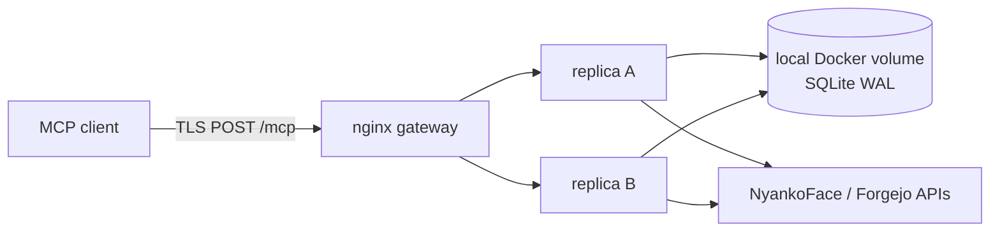

# MCP single-host high availability

NyankoFace runs two independent `nyankoface-mcp` containers behind the TLS nginx
gateway. Requests are stateless and need no session cookie, MCP session ID, or
sticky routing.



## Supported topology

This is deliberately a **single Docker host** design. The local named volume is
the coordination boundary for confirmation, idempotency, policy, and audit
state. SQLite WAL supports the two local processes. NFS, multi-host Compose,
Kubernetes replicas, and copying the database between hosts are not supported.
A future multi-host design must first move state to a transactional shared
service such as PostgreSQL.

```bash
docker compose --profile mcp up -d --build nyankoface-mcp gateway
docker compose --profile mcp ps nyankoface-mcp gateway
```

Both containers must be healthy. `X-NyankoFace-MCP-Instance` identifies the
serving container without exposing credentials or request content.

## Retry and stream contract

- JSON is one terminal JSON-RPC document. SSE contains discrete `message`
  events and terminates when that POST completes.
- NyankoFace retains no resumable event log. `Last-Event-ID` is rejected with
  `400 last_event_id_not_supported` rather than pretending to resume.
- Retry a disconnected read as a new POST. Retry a disconnected write with the
  same payload and `idempotency_key`; never substitute a new key.
- nginx does not retry POSTs (`proxy_next_upstream off`) and buffers a complete
  request before dispatch, preventing partial JSON-RPC upload dispatch.

nginx keeps every Docker DNS address in a dynamically resolved upstream group.
It marks a connection failure against the selected peer but never replays that
POST to another peer. If the selected container disappears before dispatch, the
client can receive one transport error; its next retry converges to a live peer
within the one-second resolver TTL. A returned replica rejoins rotation without
moving client state. No session ID is required.

## Bounds, observation, and recovery

The gateway enforces a 1 MiB body, per-IP rate, 3-second connect, 15-second send,
and 30-second read timeout. SSE response buffering is off. Invalid Origin/Host
and Bearer credentials fail before tool execution. An upstream timeout is a
terminal error; write safety classifies it as retryable or indeterminate.

Monitor nginx `413`, `429/503`, `499`, `502`, and `504`, the instance header,
and sanitized policy/audit events. Never log Authorization, confirmation, or
idempotency values. Stop one replica at a time, verify gateway calls, then return
it before touching the other. Preserve the named volume. If SQLite integrity is
uncertain, stop both replicas and restore one coherent backup; never run copied
or divergent databases together.

The hermetic E2E builds two real MCP containers and TLS nginx, then verifies
alternating traffic, Origin and `Last-Event-ID` refusal, cross-process
exactly-once write replay, stop/return, slow-SSE termination, upload disconnect,
oversize rejection, and rate limiting:

```bash
python nyankoface-mcp/scripts/run_ha_e2e.py
python nyankoface-mcp/scripts/run_production_ha_e2e.py
```

Each run generates a unique Compose project and Docker-assigned loopback port,
then removes only that namespace's containers, network, and volume in `finally`.
Parallel CI jobs and worktrees therefore cannot delete each other's test state.
The production E2E layers only test isolation onto `docker-compose.yml`, builds
the shipped gateway with `gateway/nginx.conf`, stops the replica identified by
the response header, and proves repeated public and internal retries across both
rolling-restart orders.
