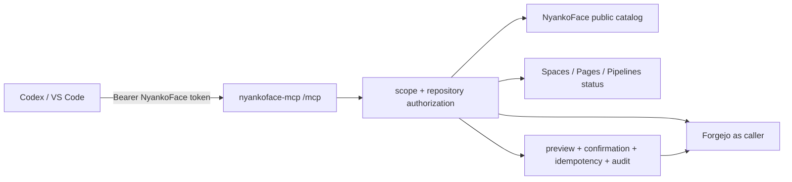

# NyankoFace MCP Server

The official MCP Server presents NyankoFace through one authenticated Streamable
HTTP endpoint. Reads remain stateless. Issue writes follow the #111 unified API
security contract through a narrow caller-identity adapter; the MCP client never
receives an administrator PAT.



## MCP contract

| Primitive | Names / URI templates | Scope |
|---|---|---|
| Tools | `search_catalog`, `get_knowledge` | `catalog:read` |
| Tools | `list_repositories`, `get_repository`, `get_file`, `get_tree` | `repos:read` |
| Tools | `list_issues`, `get_issue` | `issues:read` |
| Tools | `create_issue`, `update_issue`, `comment_issue` | `issues:write` + `repos:read` |
| Tools | `start_space`, `stop_space`, `restart_space` | `spaces:run` + `repos:read` |
| Tools | `set_space_variable`, `delete_space_variable` | `variables:write` + `repos:read` |
| Tools | `set_space_secret`, `delete_space_secret` | `secrets:write` + `repos:read` |
| Tool | `apply_space_environment` | `spaces:run` + `repos:read` |
| Tool | `deploy_pages` | `pages:deploy` + `repos:read` |
| Tools | `dispatch_pipeline`, `cancel_pipeline`, `rollback_pipeline` | `pipelines:write` + `repos:read` |
| Tool / Resource | `get_operation`, `nyankoface://operations/{operation_id}` | owning subject + `repos:read` + current repository access |
| Tool | `reconcile_operation` | owning subject + original write scope + `repos:read` + current push access |
| Tool | `get_space_status` | `spaces:read` |
| Tool | `get_pages_status` | `pages:read` |
| Tool | `get_space_environment_metadata` | `spaces:read` |
| Tools | `list_pipeline_runs`, `get_pipeline_run` | `pipelines:read` |
| Tool | `get_metrics` | `metrics:read` |
| Resource | `nyankoface://catalog/{kind}` | `catalog:read` |
| Resource | `nyankoface://repos/{owner}/{repo}` | `repos:read` |
| Resource | `nyankoface://repos/{owner}/{repo}/tree/{ref_b64}` | `repos:read` |
| Resource | `nyankoface://knowledge/{owner}/{slug}` | `catalog:read` |
| Resource | `nyankoface://issues/{owner}/{repo}/{number}` | `issues:read` |
| Resources | `nyankoface://spaces/{owner}/{repo}/status`, `nyankoface://pages/{owner}/{repo}/status` | matching read scope |
| Resource | `nyankoface://pipelines/{owner}/{repo}/runs` | `pipelines:read` |
| Resource | `nyankoface://api/openapi` | `catalog:read` |

Catalog kinds are Models, Datasets, Spaces, Pages/Knowledge (`doc`), Skills,
MCPs, Prompts, Automations, Characters, and Benchmarks. Tool pagination is
bounded to 100 items and file reads to 256 KiB UTF-8 text. Only tabled writes are exposed.

## Safe Issue write workflow

1. Call the chosen Issue Tool with `preview: true` (or `dry_run: true`) and the
   complete intended payload. The server checks `issues:write`, `repos:read`,
   and the caller's current repository push permission, then returns a
   short-lived confirmation.
2. Review the canonical target and payload fingerprint. Never edit or share the
   confirmation.
3. Repeat the exact payload with `preview: false`, that confirmation, and a
   unique `idempotency_key`.
4. Reusing the same key and payload returns the first result without another
   mutation. A changed payload is rejected, and an in-flight duplicate cannot
   start another mutation.

Confirmations are bound to the verified subject, Tool, repository target, and
payload. They expire after five minutes by default and are single-use. Before
every preview, execution, and result replay, NyankoFace rechecks the caller's
current repository permission. Unauthorized and absent private repositories
remain indistinguishable.

If the upstream connection is lost after dispatch, the result is
`upstream_outcome_unknown` and `retry_safe: false`; the idempotency record is
terminal so a retry cannot duplicate a mutation. Definite responses remain
distinguishable as `upstream_rejected`, `upstream_http_error`, or
`invalid_upstream_response`, with an explicit `retry_safe` value. Confirmation,
idempotency, and non-secret audit records live in the `nyankoface-mcp-state`
volume. Audit records
contain identity, Tool, canonical target, result, request ID, timestamp, and a
payload fingerprint—never Issue text, Bearer tokens, PATs, or Secret values.

If the MCP process terminates before it can persist a terminal result, the
expired `pending` claim is retained and remains non-dispatchable. Operators may
inspect and reconcile that namespace, but automatic expiry never converts an
unknown upstream outcome into permission to repeat the write.
Persisted terminal results whose `retry_safe` value is `false` receive the same
retention treatment and remain replayable but never dispatchable after the
normal idempotency TTL. Startup also migrates matching terminal rows written by
the preceding database format before retention cleanup runs.

## Safe Space environment writes

Variable and Secret tools share the preview, confirmation, idempotency, audit, and operation-lease workflow. Preview/result metadata never contains values;
delete is kind-bound. Variable, Secret, and apply operations respectively need
`variables:write`, `secrets:write`, or `spaces:run`, plus `repos:read` and push access. Stage a batch before apply; same-target writes serialize, unknown
outcomes require reconciliation, and timeouts are 120s for set/delete and 720s
for apply. Load Secrets directly from a trusted store, never chat/Issues/source or shell history. Keep the HMAC `.hmac-key` owner-only beside the write-safety
database on shared storage, and back up/restore both together.

### Operational result contract

Environment metadata is intentionally narrower than the Runner response: each
item contains only `name`, `configured`, and `updated_at`. It never returns a
variable or secret value, kind, scope, or runtime trace. Pipeline listings are
upstream-paginated and bounded to 50 items per page. Pipeline detail returns an
explicit allowlist of run and job status fields; it excludes logs, steps, traces,
and arbitrary action output. Pipeline detail and repository metrics use the same
current-permission check as other repository reads.

New operational tools and resources return `{ data, _meta }`. `_meta` contains
`mime_type: application/json`, a weak SHA-256 ETag, private cache guidance, and
the newest `updated_at` supplied by the upstream. Listings add `pagination`
with `page`, `limit`, `total_count`, and `total_pages`. The ETag is JSON contract
metadata for MCP clients, not an HTTP response header; compare it before
reprocessing a repeated result.

Operational failures use a structured JSON error with `code`, `message`,
`retryable`, and `action`. A stopped Forgejo or Runner returns
`upstream_unavailable` and an explicit retry action without exposing an
upstream body, internal address, log/trace text, or credential. Unauthorized
and absent repositories intentionally remain indistinguishable.
Every catalog/list/tree/Knowledge result includes `_meta` with MIME type,
effective `updated_at`, ETag, and cache policy. A tree request always names and
returns one validated ref; encoded or literal traversal is rejected before an
upstream request. Resources call the same adapter and scope checks as Tools, so
they cannot bypass caller repository authorization or redaction.

`ref_b64` is the unpadded UTF-8 base64url form of the ref, which keeps refs with
slashes inside one Resource URI segment. `main` becomes `bWFpbg`, while
`refs/heads/release` becomes `cmVmcy9oZWFkcy9yZWxlYXNl`. Pass the plain ref to
the `get_tree` Tool.

## Official prompts

`diagnose_space`, `publish_pages`, `analyze_pipeline_failure`,
`validate_topics`, and `publish_content` provide reusable read-only workflows.
They instruct the client to collect Resource/Tool evidence and never claim a
write occurred. Prompt arguments are repository identities and content kind,
not credentials.

## Transport and retries

The endpoint follows the MCP 2025-11-25 Streamable HTTP contract. Every JSON-RPC
message is a new `POST /mcp`; clients advertise `application/json` and
`text/event-stream`. `NYANKOFACE_MCP_JSON_RESPONSE=false` provides SSE and `true`
provides one JSON response. No server-side session is created, no
`Mcp-Session-Id` is returned, and any instance can handle the next request.

Read operations can be retried as a complete request after a disconnect. Issue
retries must keep the original `idempotency_key`. Partial SSE replay
remains out of scope.

## Threat model

| Threat | Control |
|---|---|
| Stolen/replayed bearer token | hashed registry, expiry, revocation by deleting its record, TLS |
| Privilege escalation through an admin PAT | no admin PAT; optional caller-specific Forgejo token file only |
| Private repository enumeration | repository lookup uses caller identity; unauthorized and absent share one error |
| Secret disclosure | credential paths denied; nested secret-shaped keys, known token formats, and secret assignments in text redacted; bounded text only |
| DNS rebinding/browser abuse | SDK Host/Origin validation; gateway pins the internal Host; configure allowed Origins explicitly |
| Cross-instance session confusion | `stateless_http=True`; no sticky session or process-local conversation state |
| Replayed/modified write | subject/Tool/target/payload-bound confirmation and durable idempotency namespace |
| Upstream outage | sanitized terminal result without token, response body, or internal credential |

Do not collect Secret values through a conversational prompt. A trusted client
may pass a value directly to `set_space_secret` after loading it from its secret
store/environment. Mount authentication and upstream identity tokens as files
readable only by the service account.

## Deploy and connect

Prepare `secrets/nyankoface-mcp/registry.json` from the committed
`nyankoface-mcp/registry.example.json` schema and place the caller's
least-privileged PAT at `secrets/nyankoface-mcp-forgejo-user-token`. Compose
mounts the PAT as a Docker Secret and the registry directory read-only, allowing
atomic rotation/revocation to become visible without recreating the service.
Write safety state is stored on a named volume. Give each subject a stable
`subject_id` and only the required scopes; token rotation may temporarily keep
multiple token records mapped to that same subject. Then run:

```bash
docker compose --profile mcp up -d --build nyankoface-mcp gateway
```

The public endpoint is `https://YOUR_NYANKOFACE_HOST/mcp`. Client snippets are in
[`nyankoface-mcp/README.md`](https://github.com/Sunwood-ai-labs/NyankoFace/blob/main/nyankoface-mcp/README.md).
For browser clients, configure an exact `NYANKOFACE_MCP_ALLOWED_ORIGINS` allowlist.

The remote static-Bearer endpoint does not claim Claude Desktop connector
compatibility. Claude Desktop's current
[remote custom connector](https://support.claude.com/en/articles/11175166-get-started-with-custom-connectors-using-remote-mcp)
is configured in **Settings > Connectors**, not `claude_desktop_config.json`,
and expects authless or OAuth authorization. The local stdio baseline below is
the static-Bearer compatibility path; OAuth and live Claude Desktop client
verification are tracked in #116.

## Package and local stdio compatibility

The official remote transport remains Streamable HTTP. `nyankoface-mcp` 0.1.0
also ships a local stdio adapter for clients that only start command-based MCP
servers. It translates each newline-delimited JSON-RPC message into a new
authenticated HTTP request. It never forwards `Mcp-Session-Id`, stores no
conversation/session state, and needs no sticky load-balancer route.

Release artifacts contain `nyankoface_mcp-0.1.0-py3-none-any.whl`, the matching
sdist, and `SHA256SUMS`. Python 3.11, 3.12, and 3.13 are supported. Verify and
install from a clean environment:

```bash
sha256sum --check SHA256SUMS
python -m pip install ./nyankoface_mcp-0.1.0-py3-none-any.whl
nyankoface-mcp --version
```

The package pins direct dependency versions. The container additionally uses
`requirements.lock` and a digest-pinned Python base image. Its
`org.opencontainers.image.version` label must equal `nyankoface-mcp --version`.
Tagged package builds carry GitHub provenance:

```bash
gh attestation verify nyankoface_mcp-0.1.0-py3-none-any.whl \
  -R Sunwood-ai-labs/NyankoFace
```

### Safe configuration

The adapter reads only environment/file-backed configuration:

| Variable | Purpose |
|---|---|
| `NYANKOFACE_MCP_REMOTE_URL` | HTTPS `/mcp` endpoint; HTTP is loopback-only |
| `NYANKOFACE_MCP_TOKEN` | bearer injected by a client/OS secret store |
| `NYANKOFACE_MCP_CLIENT_TOKEN_FILE` | alternative restricted token file; mutually exclusive with the token variable |
| `NYANKOFACE_MCP_CLIENT_TIMEOUT_SECONDS` | request timeout, greater than 0 and at most 300 seconds |
| `NYANKOFACE_MCP_CA_BUNDLE` | optional private CA bundle path |

Run `nyankoface-mcp validate-config` before registering the client. Validation
reports the endpoint and token *source*, never the token. Credentials are not
accepted as CLI arguments and must not appear in examples, argv, stdout, or
error text.

Environment proxy discovery is deliberately disabled for the
bearer-authenticated adapter. `HTTP_PROXY`, `HTTPS_PROXY`, `ALL_PROXY`, and
their lowercase forms are ignored so a process-level proxy cannot receive the
Authorization header. Use a directly reachable endpoint and
`NYANKOFACE_MCP_CA_BUNDLE` for a private trust root.

The adapter bounds every in-memory forwarding queue. Ordinary requests receive
a JSON-RPC overload error when their queue is full. Responses cannot be safely
dropped or answered with another response, so exceeding their reserved capacity
stops the adapter immediately; the MCP client must restart it and reconnect.
Cancellation is best-effort across independent Streamable HTTP requests because
the protocol provides no cross-request admission acknowledgement. The adapter
locally drops not-yet-forwarded work, forwards active cancellation through
reserved capacity, and suppresses every late JSON or SSE response for the
cancelled ID. Exhausted cancellation capacity fails the adapter rather than
silently dropping the notification. Confirmation and idempotency remain the
independent safety boundary for write tools.

### Client baseline

For Codex, export the variables from the OS secret store and register the
inherited-environment command:

```bash
codex mcp add nyankoface -- nyankoface-mcp-stdio
```

For Claude Desktop, use a secret-store launcher to inject the token and put
only the non-secret endpoint in `claude_desktop_config.json`:

```json
{
  "mcpServers": {
    "nyankoface": {
      "command": "nyankoface-mcp-stdio",
      "env": { "NYANKOFACE_MCP_REMOTE_URL": "https://nyankoface.example/mcp" }
    }
  }
}
```

For VS Code, a password input can populate the child environment without
committing the value:

```json
{
  "servers": {
    "nyankoface": {
      "type": "stdio",
      "command": "nyankoface-mcp-stdio",
      "env": {
        "NYANKOFACE_MCP_REMOTE_URL": "https://nyankoface.example/mcp",
        "NYANKOFACE_MCP_TOKEN": "${input:nyankoface-token}"
      }
    }
  },
  "inputs": [{
    "id": "nyankoface-token",
    "type": "promptString",
    "description": "NyankoFace MCP token",
    "password": true
  }]
}
```

These schemas are the configuration baseline; live client certification is a
separate acceptance gate.

### Lifecycle

- **Upgrade:** verify the new checksum/provenance, run
  `python -m pip install --upgrade ./NEW_WHEEL`, and restart the client.
- **Rollback:** retain the prior artifact and reinstall it with
  `--force-reinstall`; deploy the image with the same prior version/digest.
- **Uninstall:** run `python -m pip uninstall nyankoface-mcp`, remove the client
  entry, and revoke the bearer.

Do not diagnose a failed upgrade by printing the environment. Rotate any token
that may have entered a shell transcript.

## Token operations and emergency revocation

NyankoFace credentials use a version 2 lifecycle registry with separate subject
mappings and token records. Tokens carry a minimum scope set, explicit
repository constraints, expiry, immutable mapping version, and the
`nyankoface-api-v1` audience. Service accounts always require at least one
repository constraint and a dedicated non-admin Forgejo identity.

Create the service-account mapping first, then issue the token with
`PYTHONPATH=nyankoface-mcp NYANKOFACE_MCP_REGISTRY_READER_GID=10001 python -m nyankoface_mcp.admin`
from the repository root as the lifecycle-store owner; exact commands are in
[`nyankoface-mcp/README.md`](https://github.com/Sunwood-ai-labs/NyankoFace/blob/main/nyankoface-mcp/README.md). Issue and rotation
return the 256-bit token only once. Enumeration omits both the digest and
Forgejo secret path. Every mutation requires administrator authorization plus
reauthentication no older than 300 seconds.

For normal rotation, run `rotate-token TOKEN_ID`; the previous credential is
revoked atomically before the new credential is returned. For suspected
compromise, run `revoke-token TOKEN_ID` immediately. To fence all credentials
for an automation identity, use `disable-service-account SUBJECT_ID`. Remapping
also revokes all credentials bound to the old mapping. Confirm the audit JSONL
contains the actor, target ID, operation and result, but no token, digest, PAT,
or secret-file path. Each mutation atomically stores a secret-free audit outbox
entry with the registry transition. If the JSONL sink is temporarily unavailable,
the operation remains successful and the next mutation retries delivery. The
writer lock is owned by the operating system and is released automatically when
an operator process terminates. The operator keeps the registry root-owned with
mode `0640` in a `0750` directory whose read-only group is the MCP runtime GID;
do not grant that group write access. Every NyankoFace token authentication also
resolves the mounted PAT through Forgejo `/user` and requires its user ID to
equal the mapped subject ID.

## Tool policy and audit operations

Every Tool is **default deny** until an operator adds an explicit allow rule.
Rules are stored in the shared policy SQLite database and are evaluated on
every request, without a process-local decision cache. Precedence is global,
repository, service-account (wildcard then exact), then subject; a more
specific rule wins. A read-only rule is a hard ceiling: it rejects every write
Tool before authorization or upstream dispatch even when another rule allows
that Tool. Newly registered Tools also fail closed until they are classified.

Operators change rules through `PolicyAdminService`, using `set_tool_policy`,
`delete_tool_policy`, or `set_read_only` as the audited mutation. A policy
change committed by one instance is visible to the next request on every
instance sharing `NYANKOFACE_MCP_POLICY_STATE_PATH`. Keep this database on the
durable `/data` volume and provision the minimum per-subject rules before
enabling a client.

Provision a fresh deployment from the same durable Compose volume, for example:

```bash
docker compose --profile mcp run --rm nyankoface-mcp python -m nyankoface_mcp.policy_admin \
  --actor-subject user:admin allow global '*' get_repository
```

The CLI also supports `deny`, `delete`, `read-only`, and `read-write`.

`NYANKOFACE_MCP_AUDIT_STATE_PATH` stores searchable `allowed`, `denied`,
`failed`, `replayed`, and `policy_change` events with cursor pagination, a hash
chain, and a 90-day default retention window. Filters include subject, client,
Tool, repository, request, operation, outcome, reason, and time. Token, PAT,
Secret, and idempotency values are never stored: sensitive metadata is
redacted and idempotency keys are one-way fingerprints.

Policy-backend failure denies every Tool. If the audit backend fails before a
write, the write is denied before side effects. An explicitly allowed read may
continue with degraded audit after a runtime audit outage; failure while
opening either state database prevents server startup. Result-audit failure
after a dispatched write does not falsely report the upstream mutation as
failed. Alert on backend errors and restore the durable volume before changing
policy.

## Verify

```bash
python -m pip install -r nyankoface-mcp/requirements-dev.txt
PYTHONPATH=nyankoface-mcp python -m pytest -q nyankoface-mcp/tests
SOURCE_DATE_EPOCH=1767225600 python nyankoface-mcp/scripts/build_distribution.py --out-dir dist
docker compose --profile mcp config --quiet
```

The suite exercises protocol initialization, capability and tool schemas,
JSON/SSE modes, a retry landing on a second instance, invalid tokens, private
repository/other-subject denial, ref/path traversal, pagination/cache metadata,
official prompts, secret redaction, and the bounded read/write exposure. Issue
write tests cover all three tools, confirmation rebinding, idempotency
collision/concurrency, cancellation, timeout, and disconnect behavior. CI runs
the same contract tests; client connection is finally checked against the
deployed HTTPS endpoint with an intentionally least-privileged token.

## Phase boundary

This control and stdio package slice does not close #113 or #115.
Policy administration UI, resumable events,
OAuth/live-client certification, and multi-instance load testing remain
independent follow-ups.
