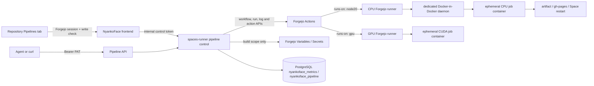

# Repository pipelines

NyankoFace Pipelines is a repository-scoped control plane over Forgejo Actions.
The workflow remains ordinary repository content, while NyankoFace adds a
responsive run dashboard, a cookie-free API, build-secret synchronization, and
an audit trail.

Open a repository and select **Pipelines**, or append `?tab=pipelines`:

```text
https://NYANKOFACE/OWNER/REPOSITORY?tab=pipelines
```

Only a signed-in Forgejo user with write access can use the browser controls.
Read and write API operations require a Forgejo personal access token with the
corresponding repository scope.

## Architecture



For an existing installation, this is a storage migration rather than an
automatic upgrade. The new runner never imports the legacy SQLite file: stop
the runner, back up and verify that source, and complete
[the explicit migration](#migrate-an-existing-sqlite-audit-file) before
starting the PostgreSQL write path. Do not accept new pipeline writes until
that migration succeeds.

Pipeline audit history and production reconciliation state are stored in the
`nyankoface_pipeline` schema of the existing `nyankoface_metrics` PostgreSQL
database. `PIPELINE_DATA_DIR` is reserved for deployment and preview
artifacts; it is not a pipeline state database.

## Migrate an existing SQLite audit file

An existing installation may still have legacy history at
`/data/agents/pipelines/pipeline-audit.db`. Normal `spaces-runner` startup
does not discover or import this file. Before letting the upgraded runner
accept pipeline writes, stop the runner, back up the source, verify it, and
then run the explicit migration once:

```bash
docker compose stop spaces-runner
docker compose up -d postgres

# Keep a byte-for-byte backup in the same persistent volume. Do not overwrite
# an existing backup without verifying it first.
docker compose run --rm --no-deps --build --entrypoint sh spaces-runner -c \
  'set -eu; test ! -e /data/agents/pipelines/pipeline-audit.db.pre-postgres-migration; cp -p /data/agents/pipelines/pipeline-audit.db /data/agents/pipelines/pipeline-audit.db.pre-postgres-migration; cmp /data/agents/pipelines/pipeline-audit.db /data/agents/pipelines/pipeline-audit.db.pre-postgres-migration'

# Read-only source validation; this does not change PostgreSQL.
docker compose run --rm --no-deps --build --entrypoint python spaces-runner \
  pipeline_migration.py --source /data/agents/pipelines/pipeline-audit.db --verify-only

# Import the validated source using the DATABASE_URL and schema supplied by Compose.
docker compose run --rm --no-deps --build --entrypoint python spaces-runner \
  pipeline_migration.py --source /data/agents/pipelines/pipeline-audit.db

# Only after the migration succeeds, start the new PostgreSQL write path.
docker compose up -d --build spaces-runner
```

`--source` is required; there is no automatic legacy-file search. The
verification checks SQLite integrity, the expected `pipeline_audit` schema,
required row fields, timestamps, and reconciliation payloads. Invalid or
conflicting data fails closed with a non-zero exit and is not imported. Keep
the original and its backup for rollback/audit; the command reads the source
without changing or deleting it. The migration also carries over the
reconciliation state and cursor, not only audit rows.

If the migration has already succeeded, rerunning the same command against
the unchanged source is safe: PostgreSQL records the source digest and
row-count, re-verifies the imported rows and state, and reports that the
migration is already verified without duplicating events. A changed source is
not the same migration; preserve the original file and investigate any
failure rather than editing it and retrying.

The bundled CPU runner never receives the host Docker socket. Its dedicated Docker daemon
and egress network can reach Forgejo but not PostgreSQL, the Space runner, or
other NyankoFace internal services. The configurable runner capacity defaults to
two concurrent jobs; each starter job also has an explicit timeout. Job
containers default to two CPUs, 4 GiB of memory, and 512 processes.

The runner reaches that daemon through a named-volume Unix socket. The socket
is mounted into the runner but never into workflow job containers; the daemon
does not listen on unauthenticated TCP port 2375. Consequently a job using the
daemon's host network cannot use `localhost:2375` or a leaked socket to create
sibling containers and bypass its configured resource limits.

## Install the starter

Select **Install starter pipeline**. NyankoFace writes:

```text
.forgejo/workflows/nyankoface-pipeline.yml
```

The reproducible source is
[`seed/templates/nyankoface-pipeline/nyankoface-pipeline.yml`](../../seed/templates/nyankoface-pipeline/nyankoface-pipeline.yml).
The API-installed and seeded copies are checked for byte-for-byte equality by
the test suite.

The starter includes:

- push, pull request, tag, release, weekly schedule, manual, API, and webhook
  entry points;
- build, test, lint, Python compile, dependency audit, cache, timeout, and
  concurrency cancellation;
- pull-request preview and staging artifacts;
- VitePress, `dist/`, `docs/`, or static HTML publication to `gh-pages`;
- production Space restart when `NYANKOFACE_BASE_URL` and
  `NYANKOFACE_DEPLOY_TOKEN` are configured;
- optional status webhook delivery;
- preview, staging, and production separation;
- an explicit confirmation input for manually dispatched production runs.

The Preview job never references deployment Secrets. Production credentials
are referenced only by production-only jobs. Forgejo's approval gate remains
available for untrusted pull-request workflows.

Preview and staging jobs upload a site archive plus a manifest containing the
repository, source SHA, run ID, run number, and archive digest. The trusted
NyankoFace controller downloads the artifact from Forgejo, verifies every field
against native run metadata, verifies SHA-256, rejects traversal, links,
devices, privileged modes, oversized archives, and excessive file counts, then
publishes it atomically. Only public repositories are eligible.

Published environments appear in the run history and as **Open environment**:

```text
/previews/OWNER/REPOSITORY/pr-NUMBER/
/staging/OWNER/REPOSITORY/
```

Closing a pull request expires its Preview. Reconciliation considers only the
latest run for each Preview key, so an older open event cannot republish a
closed Preview. The gateway strips cookies and `Set-Cookie`, sends
`Cache-Control: no-store`, and applies a restrictive CSP sandbox. For stronger
origin isolation in an internet-facing deployment, route these paths through a
dedicated untrusted-content hostname as well.

## Variables and Secrets

The **Variables & Secrets** dialog now has three scopes:

| Scope | Space container | Forgejo Actions |
| --- | --- | --- |
| `runtime` | yes | no |
| `build` | no | yes |
| `both` | yes | yes |

Enabled `build` and `both` values are synchronized to native repository
Variables or Secrets immediately and again before a manual dispatch. Changing
the kind, disabling the setting, moving it to runtime-only, or deleting it also
removes the obsolete native value. Secret plaintext is never returned by the
NyankoFace list, audit, or pipeline APIs and is redacted from fetched logs.

For production Space deployment configure:

- Variable `NYANKOFACE_BASE_URL`, for example
  `https://example.invalid`;
- Secret `NYANKOFACE_DEPLOY_TOKEN`, a write-scoped Forgejo PAT.

Optional webhook delivery uses Variable `NYANKOFACE_PIPELINE_WEBHOOK_URL` and
Secret `NYANKOFACE_PIPELINE_WEBHOOK_TOKEN`.

## Run and monitor

Choose a workflow, runner target, environment, and branch or revision. The
starter maps the UI's `CPU · Node.js 20` option to the `node20` label and
`GPU · CUDA` to the `gpu` label. A GPU dispatch stays queued until a separately
registered Forgejo runner advertises the `gpu` label; NyankoFace never silently
falls back to CPU.

Production dispatch shows a confirmation dialog and sends
`approve_production=true`. This confirms operator intent; it is not a substitute
for Forgejo's untrusted-pull-request approval. For a blocked pull request,
**Review PR trust** opens the native Forgejo trust panel for that pull request.
Active runs and logs refresh every four seconds. A run exposes:

- status, event, environment, branch, commit SHA, and triggering actor;
- job and step status, duration, and the most recent 2,000 redacted log lines
  per job;
- a direct link to the native Forgejo run and its artifacts;
- a direct link to a verified Preview or staging environment when available;
- native Forgejo cancellation, full-run retry, failed-job-only retry, and PR
  trust-review controls;
- an audit history containing actor, action, environment, revision, and time.

The NyankoFace browser routes perform retries with the current user's Forgejo
session. They forward the native same-origin action to Forgejo, so repository
permissions and attribution remain attached to that user. NyankoFace does not
store an administrator password or impersonate an administrator for retry
operations.

**Rollback** is intentionally restricted to a successful production run. It
reruns the workflow at the historical commit. Pages checks out that exact SHA,
and the Space deployment API fetches and checks out the same SHA before
building the replacement container. The rollback action and revision are both
recorded in the audit trail.

## API

The public paths are available under `/runner-api/v1/pipelines`. Read,
dispatch, cancel, and rollback operations authenticate with a scoped Forgejo
PAT and never depend on browser cookies.

Forgejo 16 does not expose full-run or job-only retry through its REST API.
For those two operations, the Pipeline API validates the requested run and
returns `status: "native_action_required"`, `method: "POST"`, and a
`native_action_url`. A browser client must submit that native URL with the
current Forgejo session. The NyankoFace repository UI does this automatically;
an unattended agent must not treat the returned URL as a completed retry or
substitute an administrator credential.

```bash
export NYANKOFACE_URL="https://nyankoface.example"
export FORGEJO_PAT="replace-with-a-scoped-token"
export REPO="nyankoface/pages-starter"

# Summary: workflows, runs, environments, limits, and audit history
curl -fsS \
  -H "Authorization: Bearer ${FORGEJO_PAT}" \
  "${NYANKOFACE_URL}/runner-api/v1/pipelines/${REPO}"

# Idempotently install or update the starter
curl -fsS -X POST \
  -H "Authorization: Bearer ${FORGEJO_PAT}" \
  "${NYANKOFACE_URL}/runner-api/v1/pipelines/${REPO}/install"

# Dispatch staging
curl -fsS -X POST \
  -H "Authorization: Bearer ${FORGEJO_PAT}" \
  -H "Content-Type: application/json" \
  -d '{"workflow":"nyankoface-pipeline.yml","ref":"main","environment":"staging","inputs":{"runner":"node20"}}' \
  "${NYANKOFACE_URL}/runner-api/v1/pipelines/${REPO}/dispatch"

# Read jobs, steps, and redacted logs
curl -fsS \
  -H "Authorization: Bearer ${FORGEJO_PAT}" \
  "${NYANKOFACE_URL}/runner-api/v1/pipelines/${REPO}/runs/12"

# Cancel a run
curl -fsS -X POST \
  -H "Authorization: Bearer ${FORGEJO_PAT}" \
  "${NYANKOFACE_URL}/runner-api/v1/pipelines/${REPO}/runs/12/cancel"

# Open the native PR trust review. The response contains approval_url.
curl -fsS -X POST \
  -H "Authorization: Bearer ${FORGEJO_PAT}" \
  "${NYANKOFACE_URL}/runner-api/v1/pipelines/${REPO}/runs/12/approve"

# Request the native action URL for a full-run retry
curl -fsS -X POST \
  -H "Authorization: Bearer ${FORGEJO_PAT}" \
  "${NYANKOFACE_URL}/runner-api/v1/pipelines/${REPO}/runs/12/rerun"

# Request the native action URL for one failed job.
# The response is not success evidence until a signed-in Forgejo user submits
# native_action_url and a new attempt is visible in run history.
curl -fsS -X POST \
  -H "Authorization: Bearer ${FORGEJO_PAT}" \
  "${NYANKOFACE_URL}/runner-api/v1/pipelines/${REPO}/runs/12/jobs/34/rerun"
```

Interactive OpenAPI documentation is available at
`/runner-api/docs`. The default Pipeline API allowance is 60 requests per PAT
per minute and returns `429` with `Retry-After: 60` when exceeded.

## Operations

Set these values in `.env` when needed:

```dotenv
NYANKOFACE_ACTIONS_RUNNER_CAPACITY=2
NYANKOFACE_ACTIONS_JOB_CPUS=2
NYANKOFACE_ACTIONS_JOB_MEMORY=4g
NYANKOFACE_ACTIONS_JOB_PIDS_LIMIT=512
NYANKOFACE_PIPELINE_API_RATE_LIMIT_PER_MINUTE=60
NYANKOFACE_PIPELINE_RECONCILE_INTERVAL_SECONDS=60
PUBLIC_BASE_URL=https://nyankoface.example
# Optional explicit override; defaults to ${PUBLIC_BASE_URL}/git/
FORGEJO_ROOT_URL=https://nyankoface.example/git/
```

The runner reconciles every repository that has used the Pipeline control
plane in the background. It scans all Actions run pages every 60 seconds by
default, so publishing artifacts and expiring closed-PR previews do not depend
on anyone opening the Pipeline panel.

When `FORGEJO_ROOT_URL` is omitted, Compose derives it as
`${PUBLIC_BASE_URL}/git/`. The resulting URL must be reachable from both the
user's browser and Actions
job containers. Forgejo uses `LOCAL_ROOT_URL=http://forgejo:3000/` for its own
workers, but the v3 artifact protocol returns the configured public root URL to
the upload action. A split-DNS or reverse-proxy deployment should therefore
route the public hostname back to the same Forgejo instance.

Apply runner or network changes with:

```bash
docker compose up -d --build forgejo forgejo-actions-dind forgejo-actions-runner
docker compose up -d --build spaces-runner frontend gateway
```

See the upstream [Forgejo Actions user guide](https://forgejo.org/docs/latest/user/actions/)
and [runner administration guide](https://forgejo.org/docs/latest/admin/actions/)
for the native workflow and runner model.
