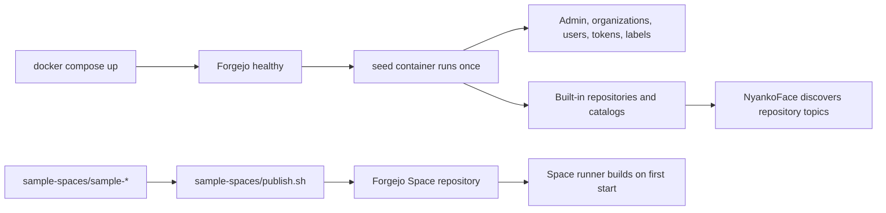

# Seed applications and catalogs

NyankoFace has two intentionally separate publication paths. The distinction
prevents a generated Forgejo repository from becoming an undocumented source
of truth.

| Path | Source of truth | Registration |
|---|---|---|
| Built-in repositories, organizations, users, Pages, Knowledge, models, and datasets | [`seed/seed.sh`](https://github.com/Sunwood-ai-labs/NyankoFace/blob/main/seed/seed.sh), `seed/templates/`, `seed/assets/`, and `seed/catalog/*.json` | The one-shot `seed` Compose service |
| Standalone Docker Space examples | A tracked `sample-spaces/sample-*/` directory with `Dockerfile` and `README.md` | `sample-spaces/publish.sh` |

The repositories visible in Forgejo are generated deployment data. Edit the
source files above, not the generated Git repository, when the change must
survive a rebuild.

## When registration runs



`seed` waits for Forgejo, reuses or rotates the protected admin token, and then
performs idempotent API updates. It runs during the initial Compose startup and
whenever an operator explicitly reruns it. It does not continuously reconcile
repositories.

## Add or change a built-in entry

1. Find the nearest `ensure_repo` or catalog block in `seed/seed.sh`.
2. Put reusable templates in `seed/templates/`, generated avatars and other
   bootstrap assets in `seed/assets/`, or pinned public imports in
   `seed/catalog/*.json`.
3. Keep the operation idempotent: look up the resource first, then create or
   update it.
4. Rebuild and run the seed:

   ```powershell
   docker compose up -d --build seed
   docker compose logs --no-log-prefix seed
   ```

5. Verify the repository and its topic-driven catalog page in NyankoFace.

## Publish a Docker Space sample

Each tracked sample is a self-contained repository source:

```text
sample-spaces/sample-example/
├── Dockerfile
├── README.md
└── application files
```

Publish or refresh every tracked sample with:

```powershell
docker compose run --rm `
  --entrypoint /bin/bash `
  -v "${PWD}/sample-spaces:/samples" `
  seed /samples/publish.sh
```

The publisher creates a public repository when absent, commits the local
sample, force-updates its `main` branch, and applies the
`space,cpu,docker,sample` topics. Its owner is selected with
`SPACE_ORG_NAME` (default: `seraphim-labs`). When a same-named sample still
exists under `ORG_NAME` (default: `nyankoface`), the publisher transfers it with
its Git history and discussions intact. A running Space must be stopped and
started after source publication to rebuild its container image.

## Remove an entry

Seed deliberately does not delete repositories: an automatic deletion could
destroy user commits, Issues, likes, or audit history.

1. Remove the entry from `seed/seed.sh` or its catalog so a fresh environment
   no longer creates it.
2. Remove the source sample if it is no longer supported.
3. Delete or archive the existing Forgejo repository explicitly as an
   administrator.
4. Rerun `seed` and check the affected catalog.

## Existing environments and production

Development and production use the same source and commands. Differences are
limited to Compose environment values, persisted volumes, credentials, and
network endpoints. Updating the Git checkout alone does not mutate the
persisted Forgejo volume; rerun `seed` or the Space publisher as appropriate.
Back up Forgejo and PostgreSQL volumes before destructive cleanup.
