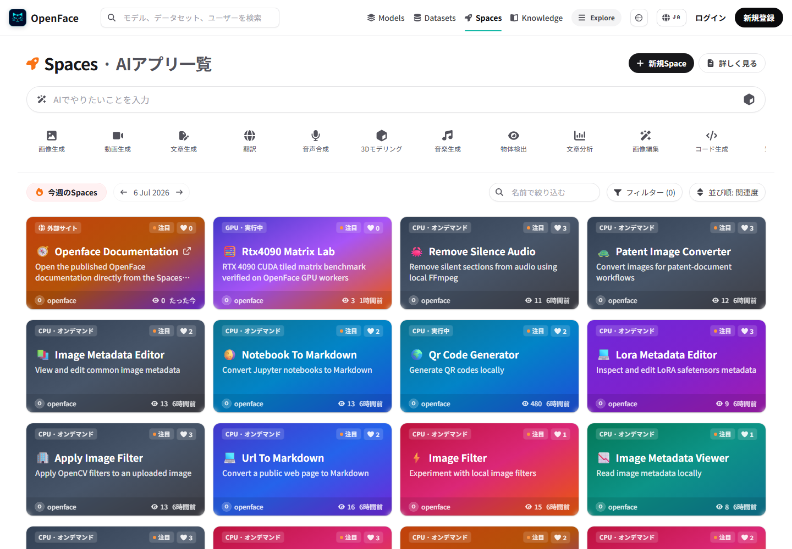

# Spaces

Every Space is a public Forgejo repository with the `space` topic. A Space can
either run and embed a Docker application or open a configured website
directly.

## Supported application styles

The seed catalog demonstrates Gradio, static HTML, React, Vue, Next.js, Streamlit, FastAPI, and Node.js. These are examples rather than a hard allowlist: a CPU-capable web server that can be containerized and proxied can work.

## Repository metadata

Use README frontmatter for the card title, emoji, SDK label, and tags:

```yaml
---
title: Local audio utility
emoji: "🎧"
sdk: docker
tags:
  - audio
  - utility
---
```

The Forgejo `space` topic selects the catalog type. README `tags` classify the project inside its card; they do not replace the topic.

## Link-type Spaces

Set `external_url` to an absolute HTTP or HTTPS URL when the Space should open
an existing website instead of building and embedding a container:

```yaml
---
title: Product documentation
emoji: "🧭"
external_url: https://docs.example.com/
---
```

The Spaces card shows an **External site** badge and opens that URL directly.
The default repository page redirects to the same destination. Files and
settings remain available in Forgejo. Invalid URLs and non-HTTP schemes are
ignored, so the repository falls back to a normal Docker Space.

The seed catalog includes `seraphim-labs/nyankoface-documentation` as a working
example. Seeded CPU Spaces live under the angel-themed `seraphim-labs`
organization; NyankoFace itself remains the platform organization.



The [desktop and mobile browser evidence](../evidence/spaces/README.md) records the
rendered card, direct navigation, redirect response, and overflow checks.

## Docker Spaces

Docker Spaces use a root `Dockerfile`. The container must listen on port `7860`
and accept the path prefix supplied by NyankoFace when the framework supports
one.

## Runtime behavior

- CPU Spaces can stay running when `IDLE_TIMEOUT_MINUTES=0`.
- The default running limit is 24 and can be changed with `MAX_RUNNING_SPACES`.
- At capacity, starting another Space stops the least recently accessed Space.
- Stopped public Spaces appear as **On demand** and can be started and used without signing in.
- Stop, environment-variable, and settings controls still require a signed-in maintainer with write access.
- Browser views and agent API actions feed the same persisted metrics store.

## Security warning

The runner mounts `/var/run/docker.sock`. A malicious Dockerfile can control the Docker host. Review every Space repository and keep repository creation restricted to trusted users unless the runner host is disposable and isolated.
