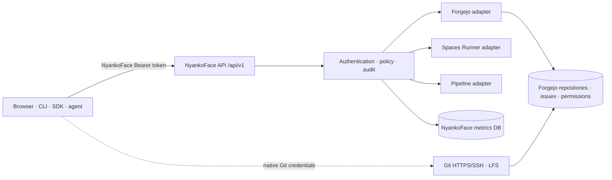

# Unified API and authentication

**Status:** Proposed · **Decision:** use `/api/v1` and an NyankoFace token for the public management control plane.

This ADR defines the target contract from [Issue #111](https://github.com/Sunwood-ai-labs/NyankoFace/issues/111). It does not replace Git transport. Forgejo, the Spaces Runner, Pipeline control, and the metrics database remain internal systems behind an NyankoFace facade.

## Why this decision exists

The current code has four independent caller contracts:

| Surface today | Credential | Verified behavior |
|---|---|---|
| `/runner-api/v1/spaces/.../environment` and `/pipelines/...` | Forgejo PAT | `space_api_auth.py` asks Forgejo for the token user, scopes, repository permissions, and Space topic |
| `/runner-api/agent/v1/...` | Agent API key | `agent_metrics.py` stores a hash and authenticates likes/views independently |
| Browser control routes | Forgejo session + internal control token | Next.js checks the signed-in user, then calls the Runner without exposing the service token |
| GPU workers and maintenance hooks | enrollment/runtime credential or HMAC | machine-to-machine credentials with narrow internal routes |

These are valid internal mechanisms, but clients should not have to implement all of them.

## Target boundary

The gateway publishes `/api/v1` and `/api/v1/openapi.json`. Internal service paths and service credentials are not public contracts. A native Forgejo link is an explicit escape hatch for unsupported operations.

### Public resource ownership

| v1 family | NyankoFace responsibility | Internal authority |
|---|---|---|
| `/tokens` | issue, list metadata, rotate, revoke | NyankoFace identity store |
| `/admin/subjects/{subject_id}/scope-grants` | read and replace a human subject's issuer scope grant | versioned NyankoFace identity store |
| `/admin/service-account-resource-grants` | create and list immutable service-account resource grants | versioned NyankoFace identity store + current Forgejo repository authority |
| `/admin/service-account-resource-grants/{grant_id}` | read or revoke one resource grant | versioned NyankoFace identity store + dispatch fence |
| `/repos` | repository metadata and safe management operations | Forgejo permission and repository state |
| `/repos/{owner}/{repo}/issues` | Issue CRUD and reactions | Forgejo Issue state and permission |
| `/spaces/{owner}/{repo}` | status, start/stop, environment metadata and Secret writes | Forgejo permission + Spaces Runner |
| `/pipelines/{owner}/{repo}` | workflow install, dispatch, run details/actions | Forgejo permission + Pipeline adapter |
| `/metrics` and `/reactions` | views, aggregate metrics, likes/reactions | NyankoFace metrics database after repository visibility check |

Routes expose domain resources, not upstream Forgejo URL shapes. An adapter may change without changing v1 as long as the public behavior remains compatible.

## NyankoFace tokens

Tokens are opaque Bearer credentials generated by a cryptographically secure random source with at least 256 bits of entropy. Common stored metadata is limited to a one-way digest, immutable token ID, subject ID, audience (`nyankoface-api-v1`), scopes, creation time, expiry, and revocation state. Service-account token metadata additionally stores exactly one immutable `resource_grant_id`; human token metadata does not. The audience is checked before scope or adapter evaluation. The default lifetime is 30 days and the maximum is 90 days. Rotation creates a distinct token ID. An overlap may last no more than 300 seconds; the previous token is force-revoked when that window expires. Manual revocation or disabling the subject ends the overlap immediately.

Human token issuance requires a trusted local NyankoFace session established by a prior Forgejo exchange plus bound recent-reauthentication proof no older than 300 seconds. An expired proof requires reauthentication before issuance or any token-management action continues. Human tokens are scope-only global credentials: their scopes are the intersection of requested scopes and the issuer's current scope grants, with no repository binding or target-permission lookup during issue or rotation. Those grants come only from a versioned, server-side, per-subject NyankoFace authority; the default grant is empty, and requested token scopes are input rather than authority. Only a current NyankoFace administrator using a local server-side session and bound reauthentication proof no older than 300 seconds may read or replace a grant through `/api/v1/admin/subjects/{subject_id}/scope-grants`, and only declared scopes are accepted. An expired proof requires reauthentication before any grant-store read or mutation continues. Every create, replacement, reduction, and revocation records the actor, subject, old/new versions, and scope diff. A reduction atomically increments the grant version and revokes all subject tokens whose scopes are no longer a subset before the update returns. Issue, rotation, and every resource request read the current version and use compare-and-swap or the same transaction to bind the token mutation or authorization decision to it. A stale version retries without mutation; an unavailable or invalid authority fails closed with an audited, target-independent `503` before token mutation or a resource adapter call. Every resource request also resolves the mapped human and checks that user's current Forgejo permission on the requested repository, so gaining or losing repository access takes effect dynamically. A caller cannot mint a broader token. Service-account tokens use a different resource model: they can be created only by a current administrator who currently owns an explicit immutable resource grant, and each service account maps to a dedicated non-admin Forgejo user. Grant `allowed_scopes` cap issued scopes, while every immutable repository target records an exact derived `required_permission`. Issue atomically stores that selected active grant's ID on the token; rotation preserves the same ID and cannot move a token to a replacement grant. Issue, rotation, and resource use require the dedicated user to meet every target record. Deleting, disabling, or unlinking the subject revokes its tokens. Revocation must take effect before the next adapter call; caches may retain only negative-safe metadata and must be actively invalidated.

Service-account resource grants have an explicit bootstrap path. `POST /api/v1/admin/service-account-resource-grants` does not require a pre-existing grant, but does require a current NyankoFace administrator session, reauthentication no older than 300 seconds, and the actor's current Forgejo owner or administrator permission on every canonical target repository. The grant stores immutable `allowed_scopes` and target records shaped as `{repository_id, required_permission}`. `required_permission` is `read` or `write`, derived at creation as the highest Forgejo level in the action-permission matrix for every action enabled by `allowed_scopes`; it is never caller-selected free text. Before creation, the dedicated non-admin Forgejo user must meet each target's derived level. The grant permanently binds its ID, owner subject, service-account subject, dedicated Forgejo user, allowed scopes, and target records; changing any binding requires creating a replacement and revoking the old grant. Tokens bound to the old grant never adopt or resolve to the replacement. List/read and ordinary token management require the current administrator to remain the immutable owner and a current Forgejo owner or administrator of every target. Revocation also permits a successor current NyankoFace administrator with fresh reauthentication and current Forgejo owner or administrator permission on every target, so a departed owner cannot leave an unrevokable grant. A successor override records the former owner and reason. Revocation atomically marks the grant revoked, increments its version, selects every token whose immutable `resource_grant_id` exactly matches the revoked grant, revokes those tokens, and takes an exclusive dispatch fence that waits for already admitted old-version calls and prevents any new adapter call before returning. Creation and revocation are audited with verified IDs and version changes. Authority failure returns an audited, target-independent `503` before grant or token mutation.

The `/tokens` family is session-managed rather than authorized by the token being managed. A prior server-side Forgejo exchange establishes a local NyankoFace session and binds recent-reauthentication proof to it. `issue`, `list`, `rotate`, and `revoke` validate that trusted session subject and proof locally without an adapter call. Human issue and rotation apply the scope ceiling locally and do not perform a target-repository lookup. Service-account issue runs only after the post-authentication rate limit, validates the selected active grant and its current version, requires the dedicated Forgejo user's current level to meet every immutable target record's `required_permission`, and atomically persists that grant ID with the token mutation. Rotation resolves only the existing token's immutable `resource_grant_id`, performs the same checks against that exact active grant and current version, and preserves the ID on the new token. Human users can manage only their own tokens within their scope ceiling. A service-account token can be managed only when the session subject is still a current NyankoFace administrator and still owns its explicit resource grant. An NyankoFace Bearer token cannot call token-management routes.

Scopes are additive and deny by default:

- `repos:read`, `repos:write`
- `issues:read`, `issues:write`
- `spaces:read`, `spaces:run`
- `secrets:read-metadata`, `secrets:write`
- `pipelines:read`, `pipelines:write`
- `metrics:read`, `reactions:write`

There is no public `admin` or wildcard scope in v1.

### Action scope matrix

Every listed scope is required (`AND`), in addition to the current Forgejo repository permission check.

| Action | Required scopes | Forgejo permission |
|---|---|---|
| Repository read / write | `repos:read` / `repos:write` | `read` / `write` |
| Issue read / write | `issues:read` + `repos:read` / `issues:write` + `repos:read` | `read` / `write` |
| Space status / run control | `spaces:read` + `repos:read` / `spaces:run` + `repos:read` | `read` / `write` |
| Environment metadata / Secret write | `secrets:read-metadata` + `spaces:read` + `repos:read` / `secrets:write` + `spaces:run` + `repos:read` | `read` / `write` |
| Pipeline read / mutation | `pipelines:read` + `repos:read` / `pipelines:write` + `repos:read` | `read` / `write` |
| Metrics read / reaction write | `metrics:read` + `repos:read` / `reactions:write` + `repos:read` | `read` / `write` |

## Authorization algorithm

Every Bearer-authenticated repository request follows the same order:

1. Apply a pre-authentication limit keyed by source-address class and route class before digest lookup, denial-audit writes, or any upstream/service adapter call. Missing credentials, unsupported authorization schemes, malformed/random Bearer credentials, and valid Bearer credentials consume this limit. The first rejection for a bounded audit key is emitted before `429`; repeated rejections increment only the bounded aggregate described below.
2. If the pre-authentication limit admits the request and the `Authorization` credentials are missing or use a scheme other than Bearer, emit an authentication-denial audit before returning `401` with `WWW-Authenticate: Bearer` and no `error` parameter. Do not parse unsupported-scheme payloads as tokens. If a Bearer credential is present, validate digest lookup, entropy/version metadata, expiry, revocation, and audience. On malformed, unknown, expired, or revoked Bearer credentials, audit before returning `401` with `WWW-Authenticate: Bearer error="invalid_token"`; never invent a token ID.
3. Immediately after successful token validation, apply the post-authentication limit keyed by verified token ID and route class. This happens before scope evaluation, denial-audit writes, or any upstream/service adapter call; record rejection through the bounded rate-limit audit path before returning `429`.
4. If both earlier limits admit the request, require every scope in the action matrix. When absent, emit an authorization-denial audit using only verified identity fields before returning `403` with a `WWW-Authenticate: Bearer error="insufficient_scope"` challenge and the required `scope` value.
5. For a human token, acquire a version-bound read fence on the authoritative issuer grant, read its current version, and require the token scopes to remain a subset. Revalidate that version immediately before adapter dispatch. A grant update takes the exclusive fence, advances the version with compare-and-swap, and cannot return until dispatches already admitted under the old version finish; no new old-version adapter call can begin after the reduction returns. A stale version retries without dispatch, and authority failure returns the audited `503` before an adapter call.
6. For a service-account token, resolve only its immutable `resource_grant_id`, then acquire a version-bound read fence on that exact grant's current version. Require the grant to be active, the token scopes to remain a subset of immutable `allowed_scopes`, and the requested target to remain a member. For **every** bound target, require the dedicated user's current Forgejo level to be at least that target record's immutable `required_permission`; on the requested target, also require the level from the action-permission matrix for this request. Revalidate the same grant ID and version immediately before adapter dispatch and hold the read fence through dispatch. Revocation takes the exclusive side of this same fence, so after `DELETE` returns no request admitted under the old version can resume into an adapter call. A stale version retries without dispatch; authority failure returns the audited `503`.
7. Resolve the immutable subject to a Forgejo user ID. If the mapping is missing or disabled, emit the denial audit before failing closed.
8. Ask Forgejo for that user's current permission on the target repository. Read and write checks happen on every request, and a denial is audited before returning.
9. Apply resource policy, such as requiring a `space` topic for a Space operation. Audit rejection before returning.
10. Call the adapter with a constrained delegated credential or perform a checked service call while retaining the applicable grant-version dispatch fence. A service/admin PAT is never evidence that the caller is authorized.
11. Emit the successful result audit and every mutation audit with verified identifiers, never the credential.

Session-managed `/tokens` routes use two limits so an invalid session cannot bypass throttling and session validation cannot violate the no-upstream-call rule:

1. Apply a pre-authentication limit keyed by source-address class and route class before local session validation or any upstream/service adapter call. Missing and invalid sessions consume this limit; record rejection through the bounded rate-limit audit path before returning `429`.
2. Validate only the NyankoFace-owned server-side session subject locally. Do not validate its bound recent-reauthentication proof yet. Subject validation does not call the Forgejo adapter.
3. Apply a post-authentication limit keyed by verified local-session subject ID, route class, and source-address class before recent-reauthentication validation, a token-store, or any upstream/service adapter call; record rejection through the bounded rate-limit audit path before returning `429`.
4. Validate the bound recent-reauthentication proof locally, then enforce token ownership and the human scope ceiling. Human issue and rotation have no target-repository lookup because these credentials are not resource-bound; each later resource request performs the current Forgejo permission check. For service-account issue, select exactly one active owned resource grant; for rotation, resolve only the existing token's immutable `resource_grant_id`. Require requested scopes to be a subset of that exact grant's immutable `allowed_scopes`, require the current administrator role plus current ownership, then require the dedicated Forgejo user's current permission to meet each immutable target record's `required_permission`. Bind the issue or rotation mutation atomically to that grant's current version, persisting or preserving its immutable ID. This authorization adapter runs only after the post-authentication limit and before the token-store mutation. Audit every denial and mutation.

Session-managed `/api/v1/admin/subjects/{subject_id}/scope-grants` routes have their own two-stage limits. The pre-authentication limit uses source-address class and route class before local session validation, denial-audit writes, grant-store reads, or any adapter call; missing, invalid, and valid sessions consume it. After local session validation, the post-authentication limit uses verified local-session subject ID, route class, and source-address class before administrator authorization, recent-reauthentication validation, grant-store access, or any adapter call. A rejection uses the bounded rate-limit audit path and returns `429` with the standard metadata before protected work begins.

The service-account resource-grant administration routes use the same ordering with their own policy: pre-authentication before local session validation, denial audit, resource-grant-store reads, or adapters; post-authentication before administrator/owner authorization, recent reauthentication, repository permission checks, resource-grant-store access, or adapters. Missing, invalid, and valid sessions consume the pre-authentication quota.

Concrete deployment-wide policies use non-overlapping 60-second windows plus token buckets. Bearer routes allow pre-auth `60/window`, burst 10, refill 1/s; post-auth `600/window`, burst 50, refill 10/s. Session-managed token routes allow pre-auth `30/window`, burst 5, refill 0.5/s; post-auth `120/window`, burst 10, refill 2/s. Issuer-scope-grant and service-account-resource-grant administration each allow pre-auth `20/window`, burst 5, refill 0.333333/s; post-auth `30/window`, burst 5, refill 0.5/s. Both the window quota and burst bucket must admit a request. Counters use authoritative-store time and atomic updates in one shared store across every API worker and replica. If that authority is unavailable, fail closed with `503` before digest lookup, a protected store, or an adapter call.

For private repositories, denial and absence use the same not-found response where disclosure would reveal existence.

## Shared HTTP contract

- Errors use `application/problem+json` with `type`, `title`, `status`, `code`, and `request_id`. Field errors live in `errors`; retry guidance uses `retry_after`. When the applicable earlier rate limits admit the request, RFC 6750 responses apply: missing credentials or an unsupported authorization scheme receive `401` and `WWW-Authenticate: Bearer` without an `error` parameter; a presented invalid Bearer credential uses `error="invalid_token"`, and insufficient scope uses `error="insufficient_scope"` with the required scope. A pre- or post-authentication rate-limit rejection takes precedence and returns `429` instead.
- Collections use opaque `cursor` and bounded `limit` parameters, returning `items` and `next_cursor`. Offset internals are not exposed.
- Mutating `POST`, `PUT`, `PATCH`, and `DELETE` routes require `Idempotency-Key`. The server namespaces a record by verified subject ID, HTTP method, canonical target, and key, and retains it for 24 hours. A payload fingerprint is used only to detect a mismatch inside that namespace. Except for the credential-bearing exception below, the same namespace and payload returns the first result without another mutation; a different payload returns `422` without mutation, while a concurrent duplicate returns `409`. A record is never replayed across subjects, methods, or targets. Token issue and rotation are non-replayable: plaintext is delivered only in the successful initial response with `Cache-Control: no-store` and is never persisted. A same-key retry performs no second mutation and returns `409 idempotency_result_not_replayable` plus only token ID and non-secret operation metadata.
- Bearer and session-managed token, issuer-scope-grant, and service-account-resource-grant routes apply the concrete shared policies above. Local session validation needs no Forgejo adapter, and all applicable limits run before token-store, grant-store, resource-grant-store, or upstream/service adapter calls. Missing and invalid sessions consume the first limit; the token being managed is never a key. Rejection returns `429`, `Retry-After`, `RateLimit`, and `RateLimit-Policy` metadata.
- CORS is deny-by-default. Deployments list exact trusted origins. Wildcard origin is never combined with credentials. Browser session exchange is server-side only; cookies are `Secure`, `HttpOnly`, and `SameSite`, and state-changing requests require an origin check plus a CSRF token. Tokens are not stored in URL parameters or application storage.
- Authentication and authorization denials, plus every mutation, audit target, operation, result, request ID, source address class, timestamp, and whether a credential was present. Actor subject, token ID, and effective scope are recorded only after verification; unknown Bearer text is never copied or used as an identifier. Rate-limit denials use non-overlapping, Unix-epoch-aligned 60-second fixed windows and bounded aggregation keyed only by limiter stage, source-address class, route class, and window. A shared authoritative store atomically claims the deployment-wide first rejection, increments repeat counters, claims the single summary, and enforces a global—not per-worker—4096-key cap. At rollover, enqueue at most one summary per key with no per-request retry and coalesce overflow into one stage/window summary. Retain only the current and immediately previous window; discard previous-window state after its single summary-enqueue attempt. Raw addresses and credentials are forbidden from keys and summaries.

The machine-readable baseline is [`docs/contracts/nyankoface-api-v1-security.json`](https://github.com/Sunwood-ai-labs/NyankoFace/blob/main/docs/contracts/nyankoface-api-v1-security.json). Its tests make the security requirements stable before endpoint implementation begins.

## Secret contract

Secret plaintext is write-only. A successful read can return only metadata such as `name`, `scope`, `enabled`, `updated_at`, `updated_by`, and `has_value`. `value`, plaintext, ciphertext, tokens, or authorization headers must never appear in response models.

If the current Forgejo permission lookup times out, fails, or cannot be parsed, authorization fails closed before the resource adapter. The response is the same target-independent `503 repository_authority_unavailable` for any requested repository and the failure is audited. Positive permission decisions are never cached, so stale access cannot survive a permission change.

Except for the one-time `token` field in a successful initial token-issue or token-rotation response, plaintext and credentials are redacted from every success/error body, application log, reverse-proxy log, trace, metric, and audit record. That one-time credential is never logged, audited, traced, measured, or persisted. OpenAPI marks ordinary secret input as `writeOnly: true` and uses a separate response schema without that property; token issue and rotation use a dedicated one-time credential response schema. Contract, unit, integration, and log-capture tests must cover all `SEC-001` through `SEC-026` requirements in the machine-readable contract.

## What remains native to Forgejo

Git HTTPS/SSH clone and push, Git LFS, and unsupported advanced Forgejo APIs remain on the Forgejo data plane. They use native Git credentials and are documented as such. The facade must not proxy packfiles, SSH, or LFS objects, and must not imply that an NyankoFace API token is a Git password.

## Migration

1. **Inventory and facade:** keep existing routes, publish the v1 OpenAPI document, token issuer, policy checks, audit, and adapters. No old route silently changes identity semantics.
2. **Dual client support:** SDK and CLI prefer NyankoFace tokens, while documented legacy PAT and Agent-key flows continue. Responses include deprecation and successor links only after equivalent v1 routes exist.
3. **Client migration:** update the portal, automation Skill, samples, and agents. Measure legacy-route use by route and non-secret token fingerprint.
4. **Deprecation:** announce at least one minor-release compatibility window and a removal date. Return `Sunset` and `Link: rel="successor-version"` headers.
5. **Removal:** remove a legacy entry only when telemetry shows no required client, parity tests pass, and rollback is documented.

Git transport is outside this lifecycle.

### Legacy compatibility map

| Current entry | v1 successor | Transition rule |
|---|---|---|
| `/runner-api/v1/spaces/.../environment` with Forgejo PAT | `/api/v1/spaces/.../environment` | Preserve old route until Secret and permission parity tests pass |
| `/runner-api/v1/pipelines/...` with Forgejo PAT | `/api/v1/pipelines/...` | Preserve payload semantics; translate errors only on the successor route |
| `/runner-api/agent/v1/...` with Agent key | `/api/v1/metrics/...` and `/api/v1/reactions/...` | Map the service account to NyankoFace scopes before deprecating the key |
| Next.js browser control routes | same `/api/v1` domain contract using session exchange | Move server-side first; never expose the internal control token |
| Forgejo REST escape hatch | safe v1 operation or explicit native link | No generic admin-PAT proxy endpoint |

Legacy and v1 credentials are intentionally not interchangeable. A migration adapter validates the credential according to the legacy route, then applies its existing authorization; it does not mint a broader NyankoFace subject implicitly.

## OpenAPI, SDK, CLI, and Skill policy

- OpenAPI is the source for request/response types and is served from one versioned URL. Handwritten routes need parity tests against it.
- Generate TypeScript and Python SDK models in release automation; review generated diffs and never commit credentials or deployment URLs.
- The `nyankoface` CLI uses the same SDK, stores tokens in the OS credential store, supports `auth login/status/logout`, and prints request IDs on errors.
- `nyankoface-navigator` must select the unified API for management automation, request the narrowest scopes, use idempotency keys, and direct Git clone/push to native Forgejo instructions.
- Breaking fields, scope semantics, or error codes require `/api/v2`; additive fields are allowed in v1.

## Acceptance evidence

The contract test fixes the schema and selected invariant values for namespace, action scopes, subject authorization, secret response exclusions, replay/rate/CORS controls, stable security IDs, and the native Git boundary. It is not an endpoint behavior test. Endpoint implementation PRs must turn each assertion into unit, integration, and E2E behavior tests without weakening this baseline.

## Standards references

Checked on 2026-08-01 against primary specifications:

- [RFC 6750: Bearer Token Usage](https://www.rfc-editor.org/rfc/rfc6750.html) — `Authorization: Bearer`, TLS, `401 invalid_token`, and `403 insufficient_scope`.
- [RFC 7009: Token Revocation](https://www.rfc-editor.org/rfc/rfc7009.html) — revocation semantics.
- [RFC 9457: Problem Details for HTTP APIs](https://www.rfc-editor.org/rfc/rfc9457.html) — the common error media type and members.
- [RFC 8594: The Sunset HTTP Header Field](https://www.rfc-editor.org/rfc/rfc8594.html) — endpoint retirement signaling.
- [WHATWG Fetch Living Standard](https://fetch.spec.whatwg.org/) — normative browser CORS processing.
- [OpenAPI Specification 3.2.0](https://spec.openapis.org/oas/v3.2.0.html) — API description and `writeOnly`/response schema behavior.
- [RFC 9651: Structured Field Values for HTTP](https://www.rfc-editor.org/rfc/rfc9651.html) supplies the published Structured Fields syntax used by the RateLimit draft; it does **not** define the RateLimit fields themselves.
- [IETF Idempotency-Key draft -07](https://datatracker.ietf.org/doc/html/draft-ietf-httpapi-idempotency-key-header-07) is expired. [RateLimit draft -11](https://datatracker.ietf.org/doc/html/draft-ietf-httpapi-ratelimit-headers-11), dated 2026-05-23 and expiring 2026-11-24, remains the active field-semantics draft and has no RFC number. NyankoFace records the exact revisions, tests its chosen behavior, and must re-review them before implementation or release.
