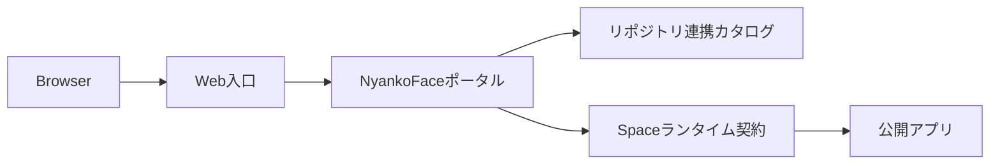

# アーキテクチャ

このページでは公開プロダクトの契約だけを説明します。配備トポロジー、
ホスト名、ネットワークアドレス、ハードウェア構成、管理プレーンの詳細は、
公開版から意図的に除外しています。

## 公開リクエストフロー

NyankoFaceでは、ブラウザ向けの入口、リポジトリメタデータ、カタログ画面、
Spaceのランタイム契約を分離します。具体的な配備方法は運用者の責務であり、
公開リポジトリの契約には含めません。

## 信頼境界

- リポジトリの内容は信頼できない入力として扱います。
- credentialやsecretはローカルのsecret storeまたは配備環境で管理し、追跡対象の例には入れません。
- 公開アプリを埋め込む前にランタイムへのアクセスを認可します。
- 公開ドキュメントでは、非公開ホスト、アドレス、内部検証エンドポイントを記載しません。

## 関連資料

[Docker Spaces](./spaces.md)と[SpaceのVariables／Secrets](./space-environment.md)を
参照してください。配備固有の機能を有効にする前に、repositoryのsecurity policyを確認してください。
