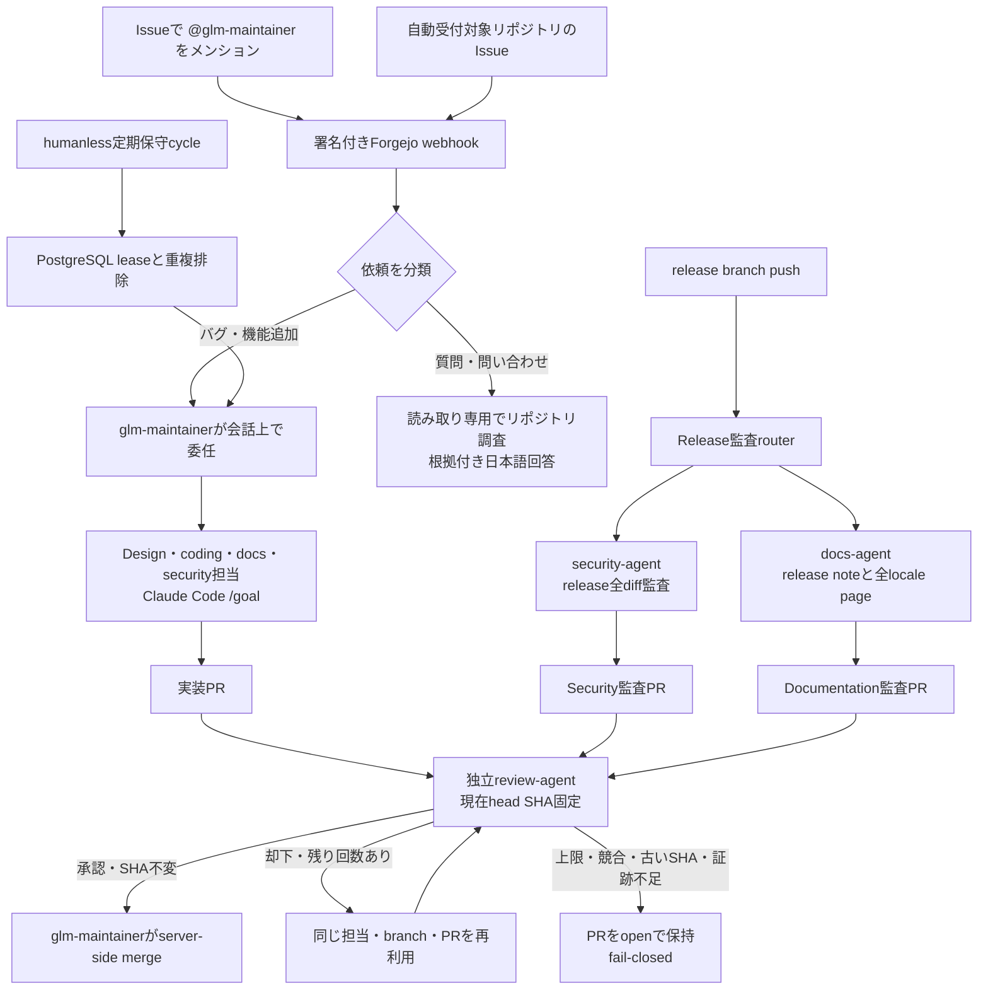
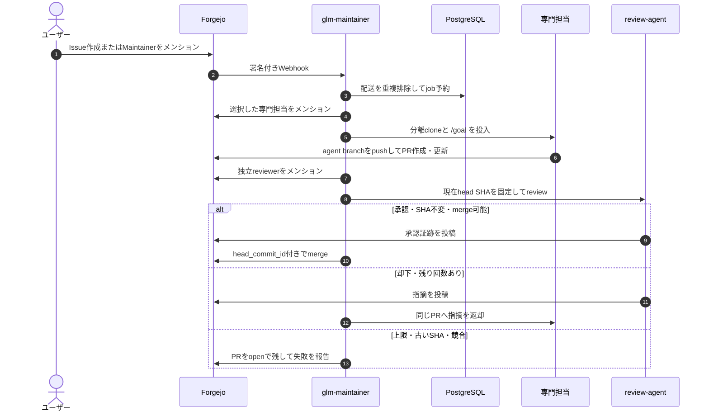
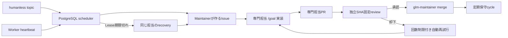
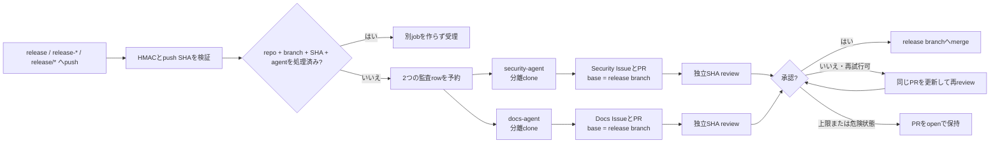
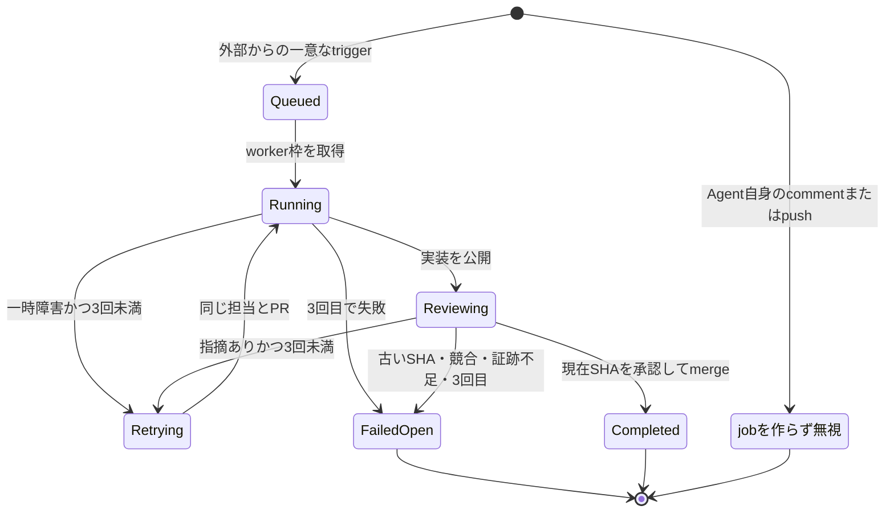

# Claude Code `/goal` による自動メンテナンス

NyankoFaceは `@glm-maintainer` 宛てのForgejo IssueをClaude Code組み込みの `/goal` へ渡し、専門担当の実装と独立レビュワーの承認を経たPull Requestへ変換できます。Claude CodeはZ.AIのAnthropic互換endpointへ直接接続し、`glm-5.2` を使います。

## 4つの入口と共通ゲート

手動Issue、自動受付Issue、定期保守、release branch pushの4つの入口が、
専門担当・証跡・独立review・fail-closed mergeという同じ安全gateへ合流します。
質問だけは例外で、ファイルを変更せず、根拠付きの日本語回答で完了します。



## 処理の流れ

1. Forgejoが組織の `push`、`issues`、`issue_comment`、`pull_request`、`pull_request_comment` webhookへHMAC署名を付けて送信します。
2. `maintenance-agent` が署名を検証し、配送IDをPostgreSQLへ記録します。
3. `glm-maintainer` が内容を分類し、`@designer-agent`、`@coding-agent`、`@docs-agent` のいずれかへ会話上で指名します。
4. 対象リポジトリをcloneし、`agent/issue-N` ブランチを作り、Claude Code 2.1.205へIssueと完了条件を含む本物の `/goal` を渡します。
5. Claude Codeがローカル指示・ソースを調査し、必要なファイルを編集し、テストやbuildを実行し、diffを再確認して、goal evaluatorが完了するまで作業します。
6. root wrapperがclone外への逸脱がないことと `git diff --check` を確認します。
7. 担当エージェントがcommit・pushし、テスト結果と証跡を自分のForgejoアカウントから返信します。この時点ではマージしません。
8. `glm-maintainer` が別アカウントの `@review-agent` を明示的にメンションします。
9. レビュワーが対象SHAを固定し、コードを変更せず、要件・全diff・テスト・回帰・securityを独立評価します。UIでは実アプリを再起動し、独自のモバイル／デスクトップ画像も提出します。
10. 全要件と検証が成功し、指摘が0件で、承認SHAが現在headと一致した場合だけ自動マージします。却下・証跡不足・不正JSON・タイムアウト・古いSHA・競合はfail-closedでPRをopenのまま残します。

固定のplanner/coder JSON pipelineではありません。ファイル数・変更行数の上限を設けず、Claude Code `/goal` の自由度を維持します。

## Z.AIの設定

```dotenv
ZAI_AGENT_CONFIG=C:/Users/you/AppData/Local/NyankoFace/zai.env
ZAI_ANTHROPIC_BASE_URL=https://api.z.ai/api/anthropic
MAINTENANCE_MODEL=glm-5.2
MAINTENANCE_GOAL_TIMEOUT_SECONDS=3600
MAINTENANCE_MAX_WORKERS=2
MAINTENANCE_AUTO_MERGE=true
MAINTENANCE_HUMANLESS_ENABLED=false
MAINTENANCE_HUMANLESS_TOPIC=humanless
MAINTENANCE_HUMANLESS_SCAN_SECONDS=300
MAINTENANCE_HUMANLESS_INTERVAL_MINUTES=1440
MAINTENANCE_HUMANLESS_RETRY_MINUTES=60
MAINTENANCE_HUMANLESS_MAX_ATTEMPTS=3
MAINTENANCE_HUMANLESS_STALE_SECONDS=900
MAINTENANCE_AUTO_ISSUE_ENABLED=true
MAINTENANCE_AUTO_ISSUE_TOPIC=humanless-issues
MAINTENANCE_AUTOMATIC_RETRY_MAX_ATTEMPTS=3
MAINTENANCE_AUTO_LABEL_ENABLED=true
MAINTENANCE_AUTO_LABEL_DRY_RUN=false
MAINTENANCE_AUTO_LABEL_ALLOWED=bug,enhancement,documentation,question,good first issue
MAINTENANCE_AUTO_LABEL_CONFIDENCE=0.85
```

```powershell
docker compose up -d --build seed
docker compose up -d --build maintenance-agent
docker compose exec maintenance-agent claude --version
docker compose exec maintenance-agent python -c "import urllib.request; print(urllib.request.urlopen('http://localhost:8010/health').read().decode())"
```

seedは非管理者 `glm-maintainer`、write専用組織team、専用Forgejo token、Webhook HMAC secret、push／Issue／PR comment webhookを冪等に作成します。

## Issue／Pull Requestの自動ラベル

署名付きwebhookは、新規作成・編集されたIssueとPull Requestも分類します。
同じタイトル、本文、PR変更ファイルからは常に同じ確信度と判定理由を得る、
再現可能な決定ルールです。

- `MAINTENANCE_AUTO_LABEL_ALLOWED`のallowlistだけを候補にします。
- 対象repositoryに実在しないlabelは作成も付与もしません。
- 手動で付けた既存labelは削除・置換しません。
- `MAINTENANCE_AUTO_LABEL_CONFIDENCE`未満の曖昧な判定は付与しません。
- 同じdeliveryの再送は重複せず、label付与によるwebhookは再分類しません。
- 候補、理由、付与、skip、dry-runをPostgreSQLへ記録し、
  `GET /api/labels/audits`で確認できます。

書き込み前の判定確認にはpreview APIを使います。

```powershell
curl.exe -X POST http://localhost:8010/api/labels/preview `
  -H "Content-Type: application/json" `
  -d '{"title":"READMEが分かりにくい","body":"設定手順を明文化してください","changed_files":[]}'
```

`MAINTENANCE_AUTO_LABEL_DRY_RUN=true`では、webhookと監査記録を維持したまま
Forgejoへ書き込まず`would_apply`だけ返します。完全停止は
`MAINTENANCE_AUTO_LABEL_ENABLED=false`です。初期ruleは`bug`、`enhancement`、
`documentation`、`question`、明示的に初心者向けの`good first issue`です。

## 専門エージェントへの委任

ユーザーは専門担当ではなく、必ずメンテナーだけを呼びます。

```text
@glm-maintainer モバイル画面をスクリーンショット比較して余白を修正してください
```

| メンション | 担当 |
|---|---|
| `@designer-agent` | UI/UX、テーマ、レスポンシブ、アクセシビリティ、スクリーンショット比較 |
| `@coding-agent` | 実装、リファクタリング、テスト、ビルド |
| `@docs-agent` | README、VitePress、設定例、再構築手順、リンク |
| `@security-agent` | 脅威分析、認証認可、秘密情報、依存関係、入力検証、サプライチェーン |
| `@review-agent` | diff、テスト、セキュリティ、回帰、要件充足の独立レビュー |

専門担当への直接メンションはジョブを起動せず、ルーティングも上書きしません。同じIssueが処理中の間は追加ジョブを投入せず、別Issueは `MAINTENANCE_MAX_WORKERS` の範囲で並列処理します。担当一覧は `GET /api/agents`、担当を含むジョブ状態は `GET /api/jobs` で確認できます。

司令塔と5体の専門担当は、それぞれ独立したForgejoユーザーです。seedはアカウントごとに最小権限tokenを発行し、役割ごとに個別生成したキャラクターを無地背景の中央に配置した専用アバターを設定します。workerを開始する前に、`glm-maintainer` は選択した専門担当へのメンションコメントを必ず投稿します。投稿に失敗した場合はDBのジョブ予約も取り消すため、会話に現れない裏側だけの実行は始まりません。保存用の[Issue #21](https://example.invalid/git/nyankoface/pages-starter/issues/21)では、司令塔のメンションから専門担当の完了返信までを順番に確認できます。各プロフィールと会話の撮影結果は [`docs/evidence/agents`](../../evidence/agents/README.md) にあります。

## 起動条件と除外

通常は新規Issueで `@glm-maintainer` をメンションすると処理を開始します。

人レス受付では `MAINTENANCE_AUTO_ISSUE_ENABLED=true` を設定し、対象リポジトリへ `humanless-issues` または `humanless` topicを付けます。メンションのない新規Issueも次の安全側の経路で処理します。

- バグ、回帰、脆弱性：該当専門担当が `agent/issue-N` で修正し、現在SHAへの独立review承認後だけ自動マージします。
- 質問、問い合わせ、support、判定不能な報告：読み取り専用で調査し、リポジトリ内pathと確信度を含む日本語回答を投稿します。tracked fileが変化した場合はwrapperが失敗にします。

バグ修正がreviewで却下された場合、または自動実行が一時的な通信障害などで失敗した場合は、同じ専門担当と既存PRへ自動返却します。`MAINTENANCE_AUTOMATIC_RETRY_MAX_ATTEMPTS` 回まで修正と再reviewを行い、上限到達時はループせずPRをopenのまま確認可能な失敗として残します。

`humanless-paused` は人レスIssue受付と定期保守を停止します。対象外にする場合は作成時に次のいずれかを付けます。

- `agent:skip` ラベル
- `<!-- nyankoface-maintenance:skip -->` マーカー

同じ配送が再送されてもIssueごとにジョブとPRは一つです。ブランチ名は `agent/issue-N` です。

### Issue受付から自動マージまで



### 人レスmode

人レスmodeは、人間が作成するIssueをPostgreSQL-backed schedulerへ置き換えます。専門担当、実画面証跡、独立review、SHA固定mergeという安全gateは省略しません。

1. `MAINTENANCE_HUMANLESS_ENABLED=true` を設定します。
2. 対象リポジトリへ `humanless` topicを付けます。実ブラウザ証跡が必要な製品には `humanless-ui` も付けます。
3. 初回scanで、`glm-maintainer` がリポジトリ説明、README、既存ファイルからbootstrap Issueを作成します。
4. `coding-agent` が実際に利用できる初期製品を完成させ、別アカウントの `review-agent` が現在head SHAを承認した場合だけ `glm-maintainer` がマージします。
5. 指定間隔後、design、security、documentation、codingを巡回し、現在の製品から最も価値が高い改善を1件選んで完遂します。
6. Review却下時は指摘を同じ専門担当とPRへ自動返却し、`MAINTENANCE_HUMANLESS_MAX_ATTEMPTS` 回まで再実装します。
7. 上限到達、古い承認、競合、失敗はfail-closedで残し、後続のrecovery cycleへ根拠として引き継ぎます。成功へ偽装しません。

リポジトリごとに `preparing`、`queued`、`running`、`retrying` は同時に1cycleだけです。PostgreSQLの `humanless_cycles` は再起動後もphase、担当、Issue、試行回数、状態、PR、次回時刻を保持します。実行中workerは1分ごとにleaseを更新し、service停止後に `MAINTENANCE_HUMANLESS_STALE_SECONDS` を超えてheartbeatが届かなければ、次のscanがそのleaseを失敗として回収します。新しい作業を作る前に、最後の完了cycleより新しい公開済み `agent/humanless-*` PRをPostgreSQLとForgejoの両方から探します。該当PRがあれば後続の放棄cycleをsupersededにし、そのbranchを独立reviewから再開します。review却下時だけ同じ専門担当が同じPRを修正し、review基盤だけが停止した場合は製品を作り直さずreviewを再試行します。証跡を消さず停止するには `humanless-paused` topicを追加します。状態は `GET /api/humanless/cycles` で確認できます。

完走した本番cycle、重複cycleの回帰修正、fail-closed review、Docker実行証拠、公開画面の撮影結果は
[humanless-autopilot本番証跡](../../evidence/automated-maintenance/humanless-autopilot/README.md)
で確認できます。

Agentが実行するtest、lint、build、preview commandには有限のtimeoutを必須化しています。wrapperもClaude全体へprocess-group timeoutを適用し、終了時に子preview／test processを停止します。commandがhangしてもleaseを永久保持せず、確認可能な失敗として回復対象になります。



### release branch push監査

`release`、`release-*`、`release/*` のいずれかへpushすると、Issueのメンションなしで次の2ジョブを分離実行します。

| Agent | 必須確認 | 出力 |
|---|---|---|
| `security-agent` | default branchからreleaseまでの全diff、認証認可、入力検証、secret、依存関係、CI／container境界、supply chain | 必要なsecurity修正と `docs/release-audits/` の根拠付き記録 |
| `docs-agent` | README／VitePress、example、移行・再構築手順、link、command、実diff、変更ファイル、tag履歴 | 必要な文書修正、diff根拠の `RELEASE_NOTES.md`、既存全localeのversion別ページ、`docs/release-audits/` の根拠付き記録 |

Maintainerはagentごとに監査Issueを1件作り、`MAINTENANCE_MAX_WORKERS` の範囲で同時処理します。決定的な作業branchにはagent、正規化したrelease branch、push SHAが含まれ、PRのbaseはdefault branchではなくpushされたrelease branchです。リポジトリ・branch・SHA・agentの組をPostgreSQLで重複排除するため、webhook再送でも二重実行しません。Agent自身のpushとrelease branch削除eventは無視します。

各監査は別アカウントの `review-agent` によるSHA固定reviewを受けます。リリースノートは未実行checkを成功と記載せず、commit件名だけから出荷内容を推測しません。却下時は同じ担当とPRへ自動返却し、`MAINTENANCE_AUTOMATIC_RETRY_MAX_ATTEMPTS` 回を上限に修正と再reviewを行います。`MAINTENANCE_AUTO_MERGE=true` の場合、全要件とcheckが成功し、指摘がなく、現在head SHAへの承認であるPRだけを `glm-maintainer` が自動マージします。上限到達・古い承認・競合・証跡不足はopenのまま残します。状態は `GET /api/releases/audits` で確認できます。



### 再試行上限と無限ループ防止



### コメントから追加編集する

元Issueまたはエージェントが作成したPRへ、`@glm-maintainer` に続けて追加指示を投稿します。

```text
@glm-maintainer 見出しも日本語にしてください。ほかのファイルは変更しないでください。
```

エージェントは既存の `agent/issue-N` ブランチをcheckoutし、日本語の完了プロンプトで追加編集と検証を行い、同じPRへ新しいcommitをpushします。通常の議論コメントはモデルを起動しません。同じIssueが `queued` または `running` の間は再投入せず、完了後のコメントだけを受け付けます。

PRで起動した場合も作業ブランチは元Issueの `agent/issue-N` を維持し、処理中リアクションと完了返信は指示を投稿したPR側へ返します。これにより依頼と結果が同じ会話内に残ります。

Issueのリアクションは、👍 が人による賛同、👀 が保守エージェントの処理中、🚀 が公開成功、😕 が公開前の失敗・停止を示します。

最大 `MAINTENANCE_MAX_WORKERS` 件のIssueを並列処理します。ジョブごとにcloneと `agent/issue-N` ブランチを分離しますが、同じ箇所を編集したPR同士では通常のGit競合が発生し得ます。ホストやモデルproviderの過負荷を避けるため、設定値は1〜4に制限されます。

## 自由度と隔離境界

- Claude Codeは専用保守コンテナ内の非特権 `maintainer` ユーザーで動きます。
- clone内は書き込み可能で、通常のClaude Code tool、ローカル指示、build、test、lintを利用できます。
- ホストDocker socketを渡さないため、リポジトリのコマンドからホストDocker daemonは操作できません。
- Forgejo bot tokenとWebhook secretはroot専用の `0600` で、Claude Codeから読めません。
- 推論に必要なモデルAPI credentialだけはClaude Code processへ渡します。
- wrapperはclone外に解決されるパスを拒否し、公開前に `git diff --check` を要求します。
- Forgejo認証を持つのは公開処理を行うroot wrapperだけです。
- Claude Code自身はForgejo認証情報を持ちません。自動マージはroot wrapperが検証成功後だけForgejo APIへ要求し、競合・拒否・失敗は成功扱いにしません。

この方式は保守コンテナ内でリポジトリのコードを実行します。任意の第三者コードに対するホストsecurity sandboxではありません。

## 運用確認

```powershell
docker compose ps maintenance-agent
docker compose logs -f maintenance-agent
docker compose exec maintenance-agent python -c "import urllib.request; print(urllib.request.urlopen('http://localhost:8010/api/jobs').read().decode())"
```

サービス再起動時に未完了だった `queued` / `running` ジョブは、誤って実行中表示を残さず `interrupted` になります。

## 確認済み実E2E

[Issue #12](https://example.invalid/git/nyankoface/pages-starter/issues/12) の日本語 `/goal` コメントから既存の [PR #15](https://example.invalid/git/nyankoface/pages-starter/pulls/15) を更新しました。次をAPIとログで照合済みです。

- job detailとClaudeの完了summary: 日本語、モデル `glm-5.2`
- author: `glm-maintainer`
- branch: `agent/issue-12` → `main`
- 重複PRではなく、既存PRへcommit `1a505ce` を追加
- 追加commitの変更: `docs/concurrency-probe-a.md` の1ファイルだけ
- 日本語のIssue返信からPR #15への逆リンク
- Forgejoのmergeable判定: `true`

### 新規アプリを完成させるE2E

空の公開リポジトリから ClearNext を設計・実装・Docker化し、8段階の専門エージェント処理と独立レビューを経て自動マージしました。実Runnerのモバイル／デスクトップ／ライト／ダーク画面、Issue・PR・merge commit、103件のテスト結果は [ClearNext 自動メンテナンス E2E](../../evidence/automated-maintenance/clear-next/README.md) に保存しています。
