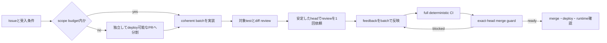
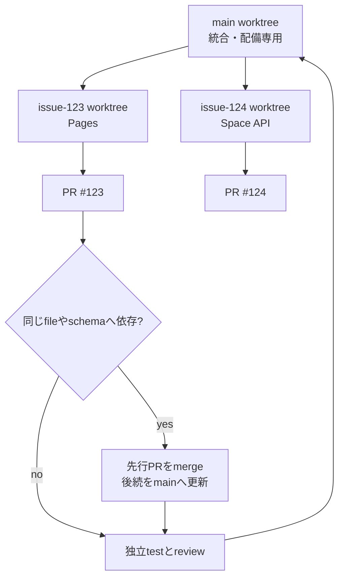

# 変更を速く安全に届ける

## 約22時間の全体像

PR #80だけの障害ではありません。2026年7月30日20:30（JST）のPR #76作成から
翌17:58のPR #80 mergeまで、GitHub上だけでも21時間29分かかりました。PR作成前の
調査・実装とmerge後の本番確認を含めると、ユーザーが指摘した約22時間を超えます。

この間にPR #76、#77、#78、#79、#80、#82、#84、#85、#86の9本を扱いました。

| 全工程の指標 | 実測 |
|---|---:|
| PR | 9 |
| PR内commit合計 | 90 |
| 変更file延べ | 265 |
| 変更行合計 | 25,930 |
| GitHub Actions run | 88 |
| failure / cancel | 27 / 14 |
| workflow経過時間合計 | 約476.6分 |

22:03から翌06:21までは8時間18分にわたり中間commitがなく、pipeline controlの
最初の大きな実装を作業中のまま保持していました。さらにPR #80の処理中に#82、
#84、#85、#86を並行させ、worktree、CI、reviewのcontext switchを増やしました。

## PR #80内部の内訳

[PR #80](https://github.com/Sunwood-ai-labs/NyankoFace/pull/80) 単体は2026年7月31日
06:21:46（JST）に作成され、17:58:48にmergeされました。所要時間は11時間37分です。

| 指標 | 実測 |
|---|---:|
| commit | 77 |
| 変更file | 87 |
| 追加／削除 | 14,964 / 455 |
| review submission | 78 |
| Codex review | 23 |
| review thread | 57（P1: 28、P2: 29） |
| GitHub Actions run | 49 |
| success / failure / cancel | 22 / 13 / 14 |
| runner消費時間 | 約216.4分 |

失敗13件の内訳は、画面capture CIが6件、共有`/data`に依存したtestが5件、
共有SQLite／fake response状態が2件でした。画面captureは1回あたり最大約28分を使い、
見た目を人が確認できないまま時間だけを消費しました。

最終head `d7ca1b5c4809` に対するCodex reviewはmergeの22秒後に投稿され、P2が2件
残りました。絵文字や「review開始」を完了条件にして、current headのreview完了を
機械判定しなかったことが直接原因です。

## 根本原因

1. 9本のPRを1つの連続作業として扱い、終了条件と優先順位を固定しなかった。
2. 8時間18分、中間checkpointなしで実装を抱え、早期の設計検証ができなかった。
3. PR #80へCI/CD、Pages、preview、Space deploy、secret、runner分離、UIを集約した。
4. PR #80中にも別PRを4本並行させ、context switchとmain側CIを増やした。
5. trust boundaryと状態遷移を先に固定せず、reviewで設計問題を1件ずつ発見した。
6. 小さな追補commitごとにreviewを再依頼し、feedback waveを直列化した。
7. 視覚確認をdeterministic CIへ混ぜ、遅く不安定なcaptureを繰り返した。
8. testが一時directoryではなく共有`/data`、SQLite、mutable fakeへ依存した。
9. exact-head review、未解決thread、check、scopeを一括判定するmerge gateがなかった。

Codeberg Container RegistryのHTTP 503も最後に発生しましたが、公式Forgejo mirrorへ
切り替えて解消できたため、11時間超の主因ではありません。

## 再発防止フロー



### Scope budget

通常のPRは次のいずれも超えないようにします。

- 25 files
- 2,000 additions + deletions
- 20 commits

超える場合はPRを分割します。生成migrationなど分割不能な場合だけ、理由を
`--allow-large-scope`へ明記します。単に「関連している」は理由になりません。

### Review wave

reviewはmicro-commitごとではなく、受入条件を満たすcoherent batchと対象testが揃った
安定headで依頼します。指摘は一度分類し、同じ原因の修正をまとめてから再依頼します。
新しいcommitをpushした時点で以前のreviewは古くなります。

### 時間とcheckpoint

実装開始から45分以内に、検証可能なcoherent checkpointをcommitします。安全に
commitできない場合は、無言で継続せずblockerと次の判断点をIssueへ記録します。
同じ失敗が2回続いたら、3回目の再実行前に原因を切り分けます。別機能や別障害は
現在のPRへ足さず、別Issueへ分離します。

1つのworkstreamでactiveな実装PRは原則1本です。並行化する場合もrepository、
branch、受入条件、merge順序が独立していることを先に確認します。

### Issue単位のworktree

ファイル変更を伴うIssueは、専用branchと専用worktreeへ分離します。

```powershell
git fetch origin
git worktree add ..\NyankoFace-issue-123 -b fix/issue-123 origin/main
```

main worktreeは最新mainの同期、統合test、merge後の本番反映だけに使います。
feature実装はIssue worktreeで行い、1 worktreeを1 Issue、1受入条件set、1 PRに
限定します。



同じfileや状態schemaを触るIssueは並行実装しません。依存する基盤PRを先にmergeし、
後続worktreeを最新mainへ更新します。途中で見つけた別問題は別Issue・別worktreeへ
移します。mergeと本番確認後、未push commitやユーザー所有変更がないことを確認して
worktreeを削除します。

```powershell
git worktree remove ..\NyankoFace-issue-123
git branch -d fix/issue-123
```

### CIとVisual QAの境界

CIで実行するのはbuild、lint、unit／integration test、設定検証、docs buildなど、
同じ入力から同じ結果になる検証だけです。testは`tmp_path`など専用一時directoryを使い、
共有`/data`や前testのSQLiteを参照しません。local commandとCI commandを一致させます。

画面captureはCIへ戻しません。実Composeまたは本番URLをbrowserで開き、対象route、
viewport、themeをcaptureして、人がPNGを開いて確認します。

## Merge guard

merge直前に、GitHub上のcurrent headへ対して次をまとめて確認します。

```powershell
python scripts/check_pr_merge_readiness.py `
  --repo Sunwood-ai-labs/NyankoFace `
  --pr 87
```

このcommandは次のどれか1つでも満たさなければexit code 1で停止します。

- draftではない
- current head SHAへCodex reviewが投稿済み
- unresolved review threadが0
- checkがすべて完了しsuccess／skipped／neutral
- scope budget内、または例外理由が明記済み

review request、リアクション、古いheadへの承認はmerge許可として扱いません。
実際のmergeも、guardが表示したSHAを固定します。

```powershell
gh pr merge 87 --repo Sunwood-ai-labs/NyankoFace `
  --squash --match-head-commit <verified-head-sha>
```

## Container registry障害

canonical registryが失敗したときは、同じreleaseの公式mirrorをpullしてcanonical名へ
tagしてからdeployします。mirrorも失敗する場合は、稼働中imageを壊さず停止します。
registry障害を理由にsource、secret、workflowの変更を同じPRへ追加しません。
