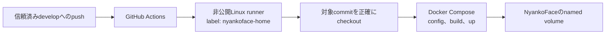

# 自宅環境への自動配備

信頼済みの `develop` ブランチへpushすると、GitHub Actionsのself-hosted
runnerを経由して、非公開のDockerホストへNyankoFaceを自動配備できます。
runnerはGitHubへ外向きに接続するため、DockerホストでSSHやアプリケーションを
インターネットへ公開する必要はありません。



## 有効化する前に

- `develop` ブランチを作成し、配備用ブランチとして保護します。pushできる人は
  信頼できるmaintainerに限定してください。
- Dockerホスト上、または同じDocker daemonへ接続できる非公開Linux
  self-hosted runnerを専用に用意します。無関係なリポジトリとrunnerを共有しないでください。
- runnerのservice accountにDockerと非公開の配備ファイルを読む権限を与えます。
  これらのファイルはActionsのcheckout外に置きます。
- 初回の自動配備前に、database、Forgejo data、credential、gateway証明書のbackupと
  復旧手順を用意します。

workflowは意図的に `develop` だけを配備対象にしており、pull requestでは配備しません。
通常のCIを `develop` へ入れる前のrequired checkとして維持してください。

## runnerを登録する

1. リポジトリの **Settings → Actions → Runners** を開き、Linux x64の
   self-hosted runnerを追加します。
2. 非公開Dockerホストで、GitHubが表示するインストール手順を実行します。
   専用accountでserviceとして起動してください。
3. custom label `nyankoface-home` を追加し、runner serviceを起動または再起動して
   onlineになることを確認します。
4. runner service accountへ次の環境変数を設定します。値は例なので、ホスト上の
   非公開パスへ置き換えてください。

```dotenv
NYANKOFACE_DEPLOY_ENV_FILE=/srv/nyankoface-private/.env
NYANKOFACE_GATEWAY_CERT_DIR=/srv/nyankoface-private/gateway-certs
# 稼働中のstackでMCP profileを使う場合だけ残します。
COMPOSE_PROFILES=mcp
# ホスト専用のCompose overrideがある場合は維持します。
NYANKOFACE_COMPOSE_OVERRIDE_FILE=/srv/nyankoface-private/docker-compose.override.yml
# 意図的に未設定のserviceだけ、明示的にhealth待ちから除外します。
NYANKOFACE_DEPLOY_IGNORE_HEALTH_SERVICES=maintenance-agent
```

`NYANKOFACE_DEPLOY_ENV_FILE` と `NYANKOFACE_GATEWAY_CERT_DIR` は絶対パスにします。
環境変数を変更したらrunner serviceを再起動してください。起動済みserviceは新しい値を
自動では読み込みません。

配備scriptはNyankoFaceのpath設定も正規化します。たとえば非公開 `.env` の
`NYANKOFACE_MCP_STATE_DIR=./secrets/nyankoface-mcp` は、一時的なActions checkoutではなく
`.env` のディレクトリを基準に解決されます。credentialなど機密ファイルは絶対パスにすることを
推奨します。

非公開 `.env` と同じディレクトリに `docker-compose.override.yml` があれば、配備時に自動で
読み込みます。別の場所に置く場合だけ `NYANKOFACE_COMPOSE_OVERRIDE_FILE` を設定してください。
これにより、既存配備のホスト専用port mappingなどを維持できます。

`NYANKOFACE_DEPLOY_IGNORE_HEALTH_SERVICES` は慎重に使います。指定serviceのhealthが正常になるわけではなく、
配備の待機だけを止めない設定です。不足しているcredentialや設定を直したら、例外を削除してください。

## 配備で実行されること

`develop` にpushされると、workflowは次を行います。

1. credentialをcheckoutへ残さず、pushされたcommitを正確にcheckoutする。
2. Docker Compose設定を検証する。
3. `nyankoface` projectに対して `docker compose up -d --build` を実行する。
4. 設定済みserviceがrunningかつhealthyになるまで待つ。one-shotの `seed` serviceは
   正常終了して構いません。

workflowは `down`、`down --volumes`、`--remove-orphans` を実行しません。
そのためNyankoFaceのnamed volumeは維持され、無関係なCompose serviceも配備によって削除されません。
非公開 `.env`、証明書、token、ホスト固有ファイルをGitからcheckoutすることもありません。

`develop` を選択したworkflowの **Run workflow** から、手動配備を実行することもできます。
その前にrunnerがonlineで、service accountが非公開パスを読めることを確認してください。

## stackを再起動せずに検証する

runnerホスト上のActions checkoutで次を実行します。

```bash
NYANKOFACE_DEPLOY_ENV_FILE=/srv/nyankoface-private/.env \
NYANKOFACE_GATEWAY_CERT_DIR=/srv/nyankoface-private/gateway-certs \
bash scripts/deploy-home.sh --validate-only
```

Docker access、非公開パス、選択されたCompose profile、生成後のCompose設定を確認します。
containerのbuildや再起動は行いません。

## rollback

配備状態を追跡可能にするため、通常のGit revertを使います。

```bash
git switch develop
git revert <bad-commit>
git push origin develop
```

revert後の `develop` commitで、もう一度配備が始まります。rollbackでnamed volumeを削除しないでください。
migrationやdata corruptionの復旧が必要な場合は、workflow内でCompose volume commandを試さず、
非公開のbackup runbookを使います。

## トラブルシューティング

- **jobがqueuedのまま:** runnerがonlineで、正確に `nyankoface-home` labelを持つか確認します。
- **非公開パスが見つからない:** runner serviceの環境変数を確認し、変更後にserviceを再起動します。
  secretの内容をGitHub変数やworkflow logへ入れないでください。
- **serviceがunhealthyのまま:** 非公開ホストで `docker compose ps -a` とservice logを確認します。
  workflowはpartial deploymentを成功扱いにせず、待機timeout後に失敗します。
- **MCP serviceが更新されない:** 稼働中のstackでMCP profileを有効にしている場合は、runner
  service環境変数に `COMPOSE_PROFILES=mcp` を設定します。

ホスト名、address、SSH情報、token、証明書、非公開runbookのパスは、この公開ドキュメントと
workflow outputへ記録しないでください。
