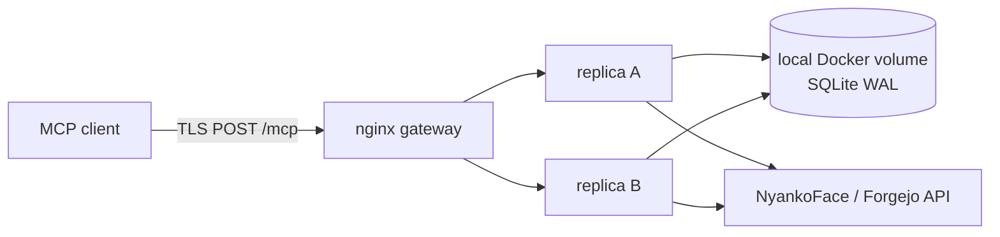

# MCPシングルホスト高可用構成

NyankoFaceはTLS nginx gatewayの背後で独立した`nyankoface-mcp` containerを2つ
稼働させます。request境界はstatelessで、session cookie、MCP session ID、sticky
routingは不要です。



## 対応topology

これは明示的に**単一Docker host専用**です。confirmation、idempotency、policy、
auditはlocal named volumeをcoordination境界とし、同じhost上の2 processがSQLite
WALで共有します。NFS、multi-host Compose、Kubernetes replica、DB fileのhost間
copyは非対応です。multi-host化する場合は、先にstateをPostgreSQL等のtransactional
shared serviceへ移行する必要があります。

```bash
docker compose --profile mcp up -d --build nyankoface-mcp gateway
docker compose --profile mcp ps nyankoface-mcp gateway
```

2 containerがhealthyであることを確認します。`X-NyankoFace-MCP-Instance`でcredentialや
request本文を露出せず、担当instanceを識別できます。

## retryとstream契約

- JSONは1つのterminal JSON-RPC documentです。SSEは分離した`message` eventを返し、
  そのPOST完了時に終了します。
- resumable event logは保持しません。`Last-Event-ID`は偽のresumeをせず
  `400 last_event_id_not_supported`で拒否します。
- read切断後は新しいPOSTで再実行します。write切断後は同じpayloadと同じ
  `idempotency_key`で再実行し、新しいkeyへ置換しません。
- nginxはPOSTをretryせず（`proxy_next_upstream off`）、完全なrequestをbuffer後に
  dispatchするためpartial JSON-RPCを送りません。

nginxはDocker DNSの全addressを動的解決するupstream groupとして保持します。選択peerの
connection失敗は記録しますが、そのPOSTを別peerへ代理retryしません。dispatch前に選択
containerが消えた場合、clientは1回transport errorを受ける可能性がありますが、次のretryは
1秒のresolver TTL内にlive peerへ収束します。復帰replicaはclient state移動なしでrotationへ
戻ります。session IDは不要です。

## 上限・監視・復旧

gatewayは1 MiB body、IP別rate、3秒connect、15秒send、30秒read timeoutを適用し、
SSE response bufferingは無効です。不正Origin／Host／Bearerはtool実行前に拒否します。
upstream timeoutはterminal errorで、write safetyがretryable／indeterminateを判定します。

nginxの`413`、`429/503`、`499`、`502`、`504`、instance header、sanitize済み
policy/audit eventを監視します。Authorization、confirmation、idempotency値は記録しません。
一度に停止するreplicaは1つだけとし、gateway成功を確認して復帰後にもう一方を扱います。
named volumeを保持し、SQLite integrity不明時は両方を止めて整合した単一backupをrestoreします。

hermetic E2Eは実MCP container 2つとTLS nginxをbuildし、交互配信、Origin／
`Last-Event-ID`拒否、cross-process exactly-once write、停止・復帰、slow-SSE終了、
upload切断、oversize拒否、rate limitを検証します。

```bash
python nyankoface-mcp/scripts/run_ha_e2e.py
python nyankoface-mcp/scripts/run_production_ha_e2e.py
```

runごとに固有のCompose projectとDocker割当loopback portを生成し、失敗時も`finally`で
そのnamespaceのcontainer、network、volumeだけを削除します。並列CI／worktree同士で
test stateを削除し合いません。
production E2Eは`docker-compose.yml`へtest隔離設定だけを重ね、出荷するgatewayを
`gateway/nginx.conf`でbuildします。response headerで担当replicaを特定して停止し、公開／
内部retryが両rolling restart順序で継続することを証明します。
