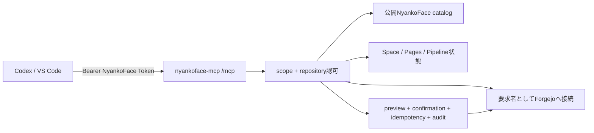

# NyankoFace MCP Server

公式MCP Serverは、認証付きStreamable HTTP endpoint 1つでNyankoFaceを提供します。
readはstatelessです。Issue writeは#111の統一API security契約に沿う要求者identity
専用Adapterを通り、MCP clientへadministrator PATを公開しません。



## MCP契約

| Primitive | 名前／URI template | scope |
|---|---|---|
| Tools | `search_catalog`, `get_knowledge` | `catalog:read` |
| Tools | `list_repositories`, `get_repository`, `get_file`, `get_tree` | `repos:read` |
| Tools | `list_issues`, `get_issue` | `issues:read` |
| Tools | `create_issue`, `update_issue`, `comment_issue` | `issues:write` + `repos:read` |
| Tools | `start_space`, `stop_space`, `restart_space` | `spaces:run` + `repos:read` |
| Tools | `set_space_variable`, `delete_space_variable` | `variables:write` + `repos:read` |
| Tools | `set_space_secret`, `delete_space_secret` | `secrets:write` + `repos:read` |
| Tool | `apply_space_environment` | `spaces:run` + `repos:read` |
| Tool | `deploy_pages` | `pages:deploy` + `repos:read` |
| Tools | `dispatch_pipeline`, `cancel_pipeline`, `rollback_pipeline` | `pipelines:write` + `repos:read` |
| Tool／Resource | `get_operation`, `nyankoface://operations/{operation_id}` | 同じsubject + `repos:read` + 現在のrepository access |
| Tool | `reconcile_operation` | 同じsubject + 元操作のwrite scope + `repos:read` + 現在のpush権限 |
| Tool | `get_space_status` | `spaces:read` |
| Tool | `get_pages_status` | `pages:read` |
| Tool | `get_space_environment_metadata` | `spaces:read` |
| Tools | `list_pipeline_runs`, `get_pipeline_run` | `pipelines:read` |
| Tool | `get_metrics` | `metrics:read` |
| Resource | `nyankoface://catalog/{kind}` | `catalog:read` |
| Resource | `nyankoface://repos/{owner}/{repo}` | `repos:read` |
| Resource | `nyankoface://repos/{owner}/{repo}/tree/{ref_b64}` | `repos:read` |
| Resource | `nyankoface://knowledge/{owner}/{slug}` | `catalog:read` |
| Resource | `nyankoface://issues/{owner}/{repo}/{number}` | `issues:read` |
| Resources | `nyankoface://spaces/{owner}/{repo}/status`, `nyankoface://pages/{owner}/{repo}/status` | 対応するread scope |
| Resource | `nyankoface://pipelines/{owner}/{repo}/runs` | `pipelines:read` |
| Resource | `nyankoface://api/openapi` | `catalog:read` |

Models、Datasets、Spaces、Pages／Knowledge（`doc`）、Skills、MCPs、Prompts、
Automations、Characters、Benchmarksを検索できます。paginationは最大100件、
ファイルは最大256 KiBのUTF-8 textだけです。表にないwrite surfaceは公開しません。

## 安全なIssue write手順

1. 完全な予定payloadと`preview: true`（または`dry_run: true`）で対象Toolを呼びます。
   serverは`issues:write`、`repos:read`、要求者の現在のrepository push権限を確認し、
   短期限のconfirmationを返します。
2. canonical targetとpayload fingerprintを確認します。confirmationを編集・共有しません。
3. 同じpayload、`preview: false`、confirmation、固有`idempotency_key`で再実行します。
4. 同じkey／同じpayloadの再送は最初の結果を返し、二重writeしません。payload変更は
   拒否し、処理中の同時再送も別mutationを開始できません。

confirmationはverified subject、Tool、repository target、payloadへ束縛され、標準5分で
失効するsingle-use値です。preview、実行、結果replayのたびに現在のrepository権限を
再確認します。権限不足とprivate repository未存在は区別できません。

dispatch後に上流接続が失われた場合は`upstream_outcome_unknown`と
`retry_safe: false`を返し、idempotency recordをterminalにして二重mutationを防ぎます。
明確な応答は`upstream_rejected`、`upstream_http_error`、
`invalid_upstream_response`として区別し、`retry_safe`を明示します。
confirmation／idempotency／非Secret auditは`nyankoface-mcp-state` volumeへ保存します。
auditはidentity、Tool、canonical target、結果、request ID、時刻、payload fingerprintだけを
持ち、Issue本文、Bearer token、PAT、Secret値を保存しません。

MCP processがterminal結果の保存前に停止した場合も、期限切れの`pending` claimは
削除せず再dispatch不可のまま保持します。operatorはnamespaceを調査・照合できますが、
自動期限切れによってupstream結果不明のwriteを再実行可能にはしません。
保存済みterminal結果でも`retry_safe: false`なら同様に保持し、通常のidempotency TTL
経過後も結果replayだけを許可してmutationは再dispatchしません。起動時にはretention
cleanupより先に、旧database形式で保存された該当terminal rowも移行します。

## 安全なSpace環境変数write

Variable／Secret Toolにもpreview、confirmation、idempotency、audit、operation leaseを適用し、preview／resultへ値を出さず、deleteをkindへ束縛します。Variable、Secret、applyは
それぞれ`variables:write`、`secrets:write`、`spaces:run`に加え`repos:read`とpush権限が必要です。
batchをstageしてからapplyし、同一targetは直列化、不明な結果はreconciliationを要求します。
timeoutはset/deleteが120秒、applyが720秒です。Secretはchat／Issue／source／shell historyへ貼らず、信頼済みStoreから直接渡します。HMAC `.hmac-key`はwrite-safety database隣の共有
storageでowner-onlyにし、databaseと一緒にbackup／restoreしてください。

### 運用readの返却契約

環境metadataはRunnerの応答より意図的に狭く、各itemは`name`、`configured`、
`updated_at`だけを返します。変数／Secretの値、kind、scope、runtime traceは
返しません。Pipeline一覧は上流でpaginationし、1 page最大50件です。Pipeline
detailはrun／job状態の明示的なallowlistだけを返し、log、step、trace、任意の
action出力を除外します。Pipeline detailとrepository metricsも、他のrepository
readと同様に現在のread権限を毎回確認します。

新しい運用Tool／Resourceは`{ data, _meta }`を返します。`_meta`は
`mime_type: application/json`、weak SHA-256 ETag、private cache指針、上流が
提供した最新`updated_at`を含みます。一覧には`page`、`limit`、`total_count`、
`total_pages`も含まれます。ETagはHTTP response headerではなくMCP JSON内の
再検証metadataです。同じ結果を再処理する前にclient側で比較してください。

運用失敗は`code`、`message`、`retryable`、`action`を持つ構造化JSON errorです。
Forgejo／Runner停止時は`upstream_unavailable`と再試行手順を返し、上流body、
内部address、log／trace、credentialは返しません。未認可と未存在は引き続き
区別しません。
catalog／repository一覧、tree、Knowledgeの各結果は、MIME type、実効
`updated_at`、ETag、cache policyを`_meta`に含めます。treeは検証済みrefを必須とし、
literal／encoded traversalを上流request前に拒否します。ResourceもToolと同じAdapter・
scope checkを通るため、要求者のrepository認可やredactionを迂回できません。

`ref_b64`はrefをUTF-8のunpadded base64urlにした値です。スラッシュを含むrefも
Resource URIの1 segmentに収まります。`main`は`bWFpbg`、
`refs/heads/release`は`cmVmcy9oZWFkcy9yZWxlYXNl`です。`get_tree` Toolには
通常のrefをそのまま渡します。

## 公式Prompt

`diagnose_space`、`publish_pages`、`analyze_pipeline_failure`、
`validate_topics`、`publish_content`を提供します。いずれもResource／Toolから根拠を
集めるread-only workflowで、書き込み完了を偽りません。引数はrepository identityと
content kindであり、credentialを渡してはいけません。

## Transportと再試行

MCP 2025-11-25のStreamable HTTP契約に従い、JSON-RPC messageごとに新しい
`POST /mcp`を使います。`NYANKOFACE_MCP_JSON_RESPONSE=false`はSSE、`true`は単一JSONです。
server-side sessionを作らず、`Mcp-Session-Id`を返しません。

read操作は切断後にrequest全体を安全に再試行できます。Issue write再試行では元の
`idempotency_key`を使います。SSE途中位置からのreplayは保証しません。

## 脅威モデル

| 脅威 | 対策 |
|---|---|
| Bearer tokenの盗難／再送 | hash registry、有効期限、record削除による失効、TLS |
| admin PATによる権限昇格 | admin PAT不使用。要求者固有Forgejo token fileだけを任意mount |
| private repository列挙 | 要求者identityで確認し、未存在と権限不足を同じerrorにする |
| Secret漏洩 | credential path拒否、secretらしいkey／token形式／代入のredact、size制限 |
| DNS rebinding／browser悪用 | Host／Origin検証、gatewayの内部Host固定、Origin allowlist |
| instance間session混線 | `stateless_http=True`、sticky sessionとprocess内会話状態なし |
| write再送／改変 | subject／Tool／target／payload束縛confirmationと永続idempotency namespace |
| 上流停止 | token、上流body、内部credentialを含めないterminal result |

会話promptでSecret値を収集しないでください。信頼済みclientはSecret Store／環境変数から
値を読み、`set_space_secret`へ直接渡せます。認証tokenと上流identity tokenは
service accountだけが読めるfileでmountします。

## 配備と接続

commit済み`nyankoface-mcp/registry.example.json` schemaを元に
`secrets/nyankoface-mcp/registry.json`を用意し、要求者の最小権限PATを
`secrets/nyankoface-mcp-forgejo-user-token`へ保存します。ComposeはPATをDocker Secret、
registry directoryをread-only mountにします。これによりatomicなrotation／失効が
service再作成なしで次requestから見えます。
安全stateはnamed volumeへ保存します。各主体へ安定した`subject_id`と必要最小scopeを
設定してください。token rotation中は、同じ主体へ一時的に複数token recordを紐付けられます。

```bash
docker compose --profile mcp up -d --build nyankoface-mcp gateway
```

公開endpointは`https://YOUR_NYANKOFACE_HOST/mcp`です。CodexとVS Codeの設定例は
[`nyankoface-mcp/README.md`](https://github.com/Sunwood-ai-labs/NyankoFace/blob/main/nyankoface-mcp/README.md)にあります。
browser clientは`NYANKOFACE_MCP_ALLOWED_ORIGINS`へ完全一致Originを設定します。

### TLS終端reverse proxy

gatewayは、credentialなしHTTP listenerの`/mcp`に対して意図的に
`426 Upgrade Required`を返します。これはbearer credentialを平文で送らないためです。
外側のproxyでclient TLSを終端する場合は、upstreamをgatewayのHTTPS listener
（`NYANKOFACE_HTTPS_PORT`。local defaultは`8443`）へ向けてください。
`NYANKOFACE_PORT`（local defaultは`8090`）へ向けてはいけません。local self-signed
certificateを使うTailscale Serveなら次のように設定します。

```bash
tailscale serve --bg --https=443 https+insecure://127.0.0.1:8443
```

routeを変更した後は、最小権限tokenでsecret-safeなlive protocol checkを実行します。
これは実際のJSON-RPC `initialize`を送り、`426`、`502`、redirect、未対応Content-Type、
不正なMCP responseを失敗にします。

```bash
python nyankoface-mcp/scripts/run_live_client_protocol.py \
  --url https://YOUR_NYANKOFACE_HOST/mcp \
  --token-file /restricted/nyankoface-mcp.token \
  --client codex \
  --client-version verified
```

外側のproxyから`/mcp`をcredentialなしHTTP listenerへ転送しないでください。
そのrouteを通すためにHTTP側の`426` guardを弱めないでください。

remote static Bearer endpointはClaude Desktop connector互換を保証しません。現在のClaude Desktopの
[remote custom connector](https://support.claude.com/en/articles/11175166-get-started-with-custom-connectors-using-remote-mcp)は
`claude_desktop_config.json`ではなく**Settings > Connectors**から設定し、authless
またはOAuth対応serverを要求します。下記local stdioがstatic Bearer互換経路の基礎です。
OAuthとClaude Desktop実機検証は#116で扱います。

## Packageとlocal stdio互換

公式remote transportは引き続きStreamable HTTPです。`nyankoface-mcp` 0.1.0は、
command型MCP serverしか起動できないclient向けにlocal stdio adapterも提供します。
newline区切りJSON-RPC messageごとに新しい認証付きHTTP requestへ変換し、
`Mcp-Session-Id`を転送しません。会話／session状態を保存せず、sticky routingも不要です。

release artifactは`nyankoface_mcp-0.1.0-py3-none-any.whl`、同versionのsdist、
`SHA256SUMS`です。対応Pythonは3.11、3.12、3.13です。clean環境で検証してinstallします。

```bash
sha256sum --check SHA256SUMS
python -m pip install ./nyankoface_mcp-0.1.0-py3-none-any.whl
nyankoface-mcp --version
```

packageは直接依存versionを固定します。containerはさらに`requirements.lock`とdigest固定の
Python base imageを使い、`org.opencontainers.image.version` labelは
`nyankoface-mcp --version`と一致しなければなりません。tag付きbuildのprovenanceは次で検証します。

```bash
gh attestation verify nyankoface_mcp-0.1.0-py3-none-any.whl \
  -R Sunwood-ai-labs/NyankoFace
```

### 安全な設定

adapterが読むのは環境変数／file-backed設定だけです。

| 変数 | 用途 |
|---|---|
| `NYANKOFACE_MCP_REMOTE_URL` | HTTPS `/mcp` endpoint。HTTPはloopbackだけ許可 |
| `NYANKOFACE_MCP_TOKEN` | client／OS Secret Storeが注入するbearer |
| `NYANKOFACE_MCP_CLIENT_TOKEN_FILE` | 代替の制限付きtoken file。token変数とは排他 |
| `NYANKOFACE_MCP_CLIENT_TIMEOUT_SECONDS` | 0秒より大きく300秒以下のrequest timeout |
| `NYANKOFACE_MCP_CA_BUNDLE` | 任意のprivate CA bundle path |

client登録前に`nyankoface-mcp validate-config`を実行します。表示するのはendpointと
tokenの**供給元**だけで、値は表示しません。credentialをCLI引数として受け取らず、
example、argv、stdout、error textへも出してはいけません。

Bearer認証adapterでは環境proxyの自動検出を意図的に無効化します。
`HTTP_PROXY`、`HTTPS_PROXY`、`ALL_PROXY`と各lowercase形式を無視し、process-level
proxyへAuthorization headerが渡ることを防ぎます。直接到達できるendpointを使用し、
private trust rootが必要なら`NYANKOFACE_MCP_CA_BUNDLE`を設定してください。

adapterはすべてのin-memory forwarding queueを固定容量にします。通常requestの
queueが満杯ならJSON-RPC overload errorを返します。responseは安全に破棄できず、
responseへ別のresponseも返せないため、予約容量を超えた場合はadapterを即時終了し、
MCP clientが再起動して再接続します。
独立したStreamable HTTP request間にはprotocol上のadmission acknowledgementが
ないため、cancelはbest-effortです。adapterは未転送の処理をlocalで破棄し、実行中の
cancelを予約容量で転送し、cancel済みIDへの後着JSON/SSE responseをstdoutへ成功として
出しません。cancel予約容量が尽きた場合はnotificationを黙って破棄せずadapterを終了
します。write toolはこれとは独立してconfirmationとidempotencyで保護します。

### Client設定の基礎

CodexはOS Secret Storeから環境変数を設定し、継承するstdio commandを登録します。

```bash
codex mcp add nyankoface -- nyankoface-mcp-stdio
```

Claude DesktopはSecret Store launcherでtokenを注入し、
`claude_desktop_config.json`には非Secret endpointだけを書きます。

```json
{
  "mcpServers": {
    "nyankoface": {
      "command": "nyankoface-mcp-stdio",
      "env": { "NYANKOFACE_MCP_REMOTE_URL": "https://nyankoface.example/mcp" }
    }
  }
}
```

VS Codeはpassword inputからchild process環境へ渡せます。

```json
{
  "servers": {
    "nyankoface": {
      "type": "stdio",
      "command": "nyankoface-mcp-stdio",
      "env": {
        "NYANKOFACE_MCP_REMOTE_URL": "https://nyankoface.example/mcp",
        "NYANKOFACE_MCP_TOKEN": "${input:nyankoface-token}"
      }
    }
  },
  "inputs": [{
    "id": "nyankoface-token",
    "type": "promptString",
    "description": "NyankoFace MCP token",
    "password": true
  }]
}
```

ここでは設定schemaの基礎だけを保証し、client実機認定は別の受入gateで扱います。

### Lifecycle

- **upgrade:** 新artifactのchecksum／provenanceを確認し、
  `python -m pip install --upgrade ./NEW_WHEEL`後にclientを再起動します。
- **rollback:** 保持した旧artifactを`--force-reinstall`し、imageも同じ旧version／digestへ戻します。
- **uninstall:** `python -m pip uninstall nyankoface-mcp`後、client登録を削除してbearerを失効します。

失敗調査で環境変数一覧を出力しないでください。shell transcriptへ入った可能性があるtokenはrotateします。

## Token運用と緊急失効

NyankoFace credentialは、主体mappingとtoken recordを分離したversion 2 lifecycle
registryで管理します。tokenには最小scope、明示的なrepository制約、有効期限、変更不能な
mapping version、`nyankoface-api-v1` audienceがあります。service accountには1件以上の
repository制約と専用の非admin Forgejo主体が必須です。

最初にservice account mappingを作り、その後repository rootからlifecycle store ownerとして
`PYTHONPATH=nyankoface-mcp NYANKOFACE_MCP_REGISTRY_READER_GID=10001 python -m nyankoface_mcp.admin`でtokenを
発行します。正確なcommandは[`nyankoface-mcp/README.md`](https://github.com/Sunwood-ai-labs/NyankoFace/blob/main/nyankoface-mcp/README.md)を
参照してください。発行／rotation時だけ256-bit token平文を一度返します。列挙APIは
digestとForgejo Secret pathも返しません。全mutationでadmin権限と300秒以内の再認証が
必要です。

通常rotationは`rotate-token TOKEN_ID`を実行し、旧credentialを原子的に失効してから
新credentialを返します。漏洩が疑われる場合は直ちに`revoke-token TOKEN_ID`を実行します。
automation主体全体を止める場合は`disable-service-account SUBJECT_ID`を使います。remapも
旧mappingへ紐づいた全credentialを失効します。audit JSONLにactor、target ID、operation、
resultがあり、token、digest、PAT、Secret file pathがないことを確認してください。各mutationは
registryの状態遷移とSecretを含まないaudit outboxを原子的に保存します。JSONL sinkが一時的に
使えなくてもoperationは成功として結果を返し、次のmutationで配信を再試行します。writer lockは
OSが所有するため、operator processが異常終了しても自動的に解放されます。
operatorはregistryをroot所有の`0640`、親directoryを`0750`に保ち、read-only groupをMCP runtime
GIDにします。このgroupへwrite権限を付けないでください。NyankoFace token認証のたびにmount済み
PATをForgejo `/user`で解決し、そのuser IDがmapping済みsubject IDと一致することも検証します。

## Toolポリシーと監査運用

全Toolは、operatorが明示的なallow ruleを追加するまで**default deny**です。ruleは共有
SQLiteへ保存し、process内decision cacheを使わずrequestごとに評価します。優先順位は
global、repository、service account（wildcard→exact）、subjectです。より具体的なruleが
優先されます。read-only ruleはhard ceilingで、別ruleがallowでもauthorization／上流dispatch
より前に全write Toolを拒否します。新規Toolもaccess分類されるまでfail closedです。

operatorは`PolicyAdminService`から`set_tool_policy`、`delete_tool_policy`、
`set_read_only`を監査付きで実行します。1 instanceがcommitした変更は、同じ
`NYANKOFACE_MCP_POLICY_STATE_PATH`を共有する全instanceの次requestから反映されます。
databaseは永続`/data` volumeに置き、client有効化前に主体ごとの最小ruleを設定します。

fresh deploymentは同じ永続Compose volumeを使って設定します。

```bash
docker compose --profile mcp run --rm nyankoface-mcp python -m nyankoface_mcp.policy_admin \
  --actor-subject user:admin allow global '*' get_repository
```

CLIは`deny`、`delete`、`read-only`、`read-write`にも対応します。

`NYANKOFACE_MCP_AUDIT_STATE_PATH`には`allowed`、`denied`、`failed`、`replayed`、
`policy_change` eventを保存します。cursor pagination、hash chain、既定90日retentionがあり、
主体、client、Tool、repository、request、operation、outcome、reason、時刻で検索できます。
token／PAT／Secret／idempotency値は保存せず、metadataはredact、idempotency keyは一方向
fingerprintにします。

policy backend停止時は全Toolを拒否します。audit backendがwrite前に停止した場合、side effect
前にwriteを拒否します。明示allow済みreadはruntime audit停止中もdegraded auditとして継続可能
ですが、いずれかのstate databaseを起動時に開けない場合はserverを起動しません。dispatch済み
writeのresult auditだけが失敗した場合、上流mutationを誤って失敗扱いにはしません。backend
errorを監視し、policy変更前に永続volumeを復旧してください。

## 検証

```bash
python -m pip install -r nyankoface-mcp/requirements-dev.txt
PYTHONPATH=nyankoface-mcp python -m pytest -q nyankoface-mcp/tests
SOURCE_DATE_EPOCH=1767225600 python nyankoface-mcp/scripts/build_distribution.py --out-dir dist
docker compose --profile mcp config --quiet
```

protocol初期化、capability／Tool schema、JSON／SSE、別instanceへのretry、無効token、
private／別主体repository拒否、ref／path traversal、pagination／cache metadata、
公式Prompt、Secret redact、制限されたread／write公開範囲を検証します。Issue writeは
3つのTool、confirmation流用拒否、idempotency衝突／並行実行、cancel、timeout／切断を
検証します。CIでも同じ契約testを実行し、最後に最小scope tokenで配備済みHTTPS
endpointへ接続します。

## Phase境界

このcontrol／stdio package sliceだけでは#113／#115をcloseしません。
policy管理UI、resumable event、OAuth／client実機認定、
multi-instance負荷testは独立follow-upです。
