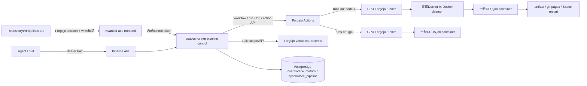

# Repository Pipelines

NyankoFace Pipelinesは、Forgejo Actionsを利用するrepository単位のCI/CD管理画面です。
workflow自体は通常のrepositoryファイルとして保持し、NyankoFaceがレスポンシブな
実行画面、cookie不要のAPI、build Secret同期、監査履歴を追加します。

repositoryで **Pipelines** を選ぶか、URLへ`?tab=pipelines`を追加します。

```text
https://NYANKOFACE/OWNER/REPOSITORY?tab=pipelines
```

browser操作にはForgejoへのログインとrepositoryのwrite権限が必要です。
APIのread／write操作には、対応するrepository scopeを持つForgejo PATを使います。

## Architecture



既存installでは、これはautomatic upgradeではなくstorage migrationです。
新しいrunnerはlegacy SQLiteを自動importしません。runnerを停止し、移行元をbackup・
検証して、[明示的な移行手順](#既存sqlite監査履歴の移行)を完了してから、
PostgreSQLのwrite pathを起動します。migrationが成功するまで新しいpipeline writeを
受け付けないでください。

Pipelineの監査履歴とproduction reconcile stateは、既存の
`nyankoface_metrics` PostgreSQL database内にある`nyankoface_pipeline` schemaへ保存します。
`PIPELINE_DATA_DIR`はdeployment／preview artifact専用であり、pipeline state database
としては使用しません。

## 既存SQLite監査履歴の移行

既存installでは、legacy履歴が
`/data/agents/pipelines/pipeline-audit.db`に残っている場合があります。
通常の`spaces-runner` startupはこのファイルを自動検索・importしません。
upgrade後のrunnerを新しいPostgreSQL書き込み経路で稼働させる前に、runnerを停止し、
移行元をbackupし、検証してから、同梱の明示的なmigrationを1回実行してください。

```bash
docker compose stop spaces-runner
docker compose up -d postgres

# 同じ永続volume内にbyte単位のbackupを残します。既存backupは先に検証し、上書きしません。
docker compose run --rm --no-deps --build --entrypoint sh spaces-runner -c \
  'set -eu; test ! -e /data/agents/pipelines/pipeline-audit.db.pre-postgres-migration; cp -p /data/agents/pipelines/pipeline-audit.db /data/agents/pipelines/pipeline-audit.db.pre-postgres-migration; cmp /data/agents/pipelines/pipeline-audit.db /data/agents/pipelines/pipeline-audit.db.pre-postgres-migration'

# 移行元だけをread-only検証します。PostgreSQLは変更しません。
docker compose run --rm --no-deps --build --entrypoint python spaces-runner \
  pipeline_migration.py --source /data/agents/pipelines/pipeline-audit.db --verify-only

# Composeが渡すDATABASE_URLとschemaを使って、検証済みの移行元をimportします。
docker compose run --rm --no-deps --build --entrypoint python spaces-runner \
  pipeline_migration.py --source /data/agents/pipelines/pipeline-audit.db

# migration成功後にだけ、新しいPostgreSQL書き込み経路を起動します。
docker compose up -d --build spaces-runner
```

`--source`は必須で、legacy fileの自動検索機能はありません。検証ではSQLiteの
integrity、想定された`pipeline_audit` schema、必須row field、timestamp、reconcile
payloadを確認します。不正またはconflictするデータはfail-closedでnon-zero終了し、
importされません。元ファイルとbackupはrollback／監査のため保持してください。
commandは移行元を変更・削除せず、audit rowだけでなくreconcile stateとcursorも移行します。

移行済みの同じ内容のsourceに対して同じcommandを再実行するのは安全です。PostgreSQLに
source digestとrow countを記録し、import済みのrowとstateを再検証するため、eventを重複
作成せず「migration already verified」として終了します。sourceを変更したものは同じ
migrationではありません。元ファイルを編集して再試行せず、失敗内容を確認してください。

同梱CPU runnerへhost Docker socketは渡しません。専用Docker daemonと専用egress networkは
Forgejoへ到達できますが、PostgreSQL、Space runner、その他のNyankoFace内部service
へは接続しません。同時実行数の初期値は2で、各jobにもtimeoutがあります。
job containerの初期上限はCPU 2個、memory 4 GiB、process 512個です。

Runnerはnamed volume上のUnix socketだけで専用daemonへ接続します。このsocketは
Runnerにだけmountし、workflow job containerへはmountしません。daemonは認証なしの
TCP 2375で待受しないため、daemonのhost networkを使うjobからも
`localhost:2375`や漏洩socketを使ってsibling containerを作成し、resource上限を
迂回することはできません。

## Starterを追加する

**Starter pipelineを追加** を選ぶと、次のファイルを作成・更新します。

```text
.forgejo/workflows/nyankoface-pipeline.yml
```

再構築用の正本は
[`seed/templates/nyankoface-pipeline/nyankoface-pipeline.yml`](../../../seed/templates/nyankoface-pipeline/nyankoface-pipeline.yml)
です。API導入版とseed版がbyte単位で一致することをtestで検証します。

Starterの対象:

- push、Pull Request、tag、release、週次schedule、手動、API、webhook;
- build、test、lint、Python compile、dependency audit、cache、timeout、
  concurrency cancel;
- Pull Request Previewとstaging artifact;
- VitePress、`dist/`、`docs/`、静的HTMLの`gh-pages`公開;
- `NYANKOFACE_BASE_URL`と`NYANKOFACE_DEPLOY_TOKEN`設定時のproduction Space再起動;
- 任意のstatus webhook;
- preview／staging／production分離;
- 手動production実行時の明示的な確認input。

Preview jobはdeploy用Secretを参照しません。production credentialを参照するのは
production専用jobだけです。信頼できないPull RequestにはForgejo nativeの承認gate
も利用できます。

Preview／staging jobはsite archiveとmanifestをartifactとしてuploadします。manifest
にはrepository、source SHA、run ID、run number、archive digestを記録します。
信頼済みNyankoFace controllerがForgejoからartifactを取得し、native run metadataとの
一致、SHA-256、path traversal、link／device、特権mode、展開size、file数を検証して
からatomicに公開します。対象はpublic repositoryだけです。

公開済み環境はrun履歴と **環境を開く** に表示します。

```text
/previews/OWNER/REPOSITORY/pr-NUMBER/
/staging/OWNER/REPOSITORY/
```

Pull RequestをcloseするとPreviewを失効します。PRごとの最新runだけをreconcileする
ため、古いopen eventがclose済みPreviewを再公開しません。gatewayはCookie／
`Set-Cookie`を除去し、`Cache-Control: no-store`と制限付きCSP sandboxを付与します。
Internet公開環境でさらに強いorigin分離が必要な場合は、これらのpathを未信頼content
専用hostnameへrouteしてください。

## Variables／Secrets

**VariablesとSecrets** では3種類のscopeを選べます。

| Scope | Space container | Forgejo Actions |
| --- | --- | --- |
| `runtime` | 利用する | 利用しない |
| `build` | 利用しない | 利用する |
| `both` | 利用する | 利用する |

有効な`build`／`both`値はnative repository Variable／Secretへ即時同期し、
手動dispatch前にも再同期します。kind変更、無効化、runtime-onlyへの変更、削除時は
古いnative値も削除します。Secret平文はNyankoFaceの一覧、監査、pipeline APIへ返さず、
取得したlogからも置換します。

production Spaceを配備する場合:

- Variable `NYANKOFACE_BASE_URL`
- Secret `NYANKOFACE_DEPLOY_TOKEN`（write scopeのForgejo PAT）

任意のwebhookにはVariable `NYANKOFACE_PIPELINE_WEBHOOK_URL`と
Secret `NYANKOFACE_PIPELINE_WEBHOOK_TOKEN`を使います。

## 実行・監視

workflow、runner、環境、branch／revisionを選択します。`CPU · Node.js 20`は
`node20` labelへ、`GPU · CUDA`は`gpu` labelへ対応します。`gpu` labelを公開する
Forgejo runnerを別途登録していない場合、GPU実行はCPUへfallbackせずqueuedのままです。

productionでは確認dialogを表示し、`approve_production=true`を送ります。これは
operatorの配備意思を確認するinputであり、信頼できないPull Requestの承認とは別です。
blocked Pull Requestの **PRの信頼を確認** は、そのPull RequestのForgejo native
trust panelを開きます。active runとlogは4秒ごとに更新します。

- status、event、環境、branch、commit SHA、開始者;
- job／step status、duration、jobごとの直近2,000行のmask済みlog;
- Forgejo native run／artifactへのlink;
- 検証済みPreview／staging環境がある場合の直接link;
- Forgejo nativeのcancel、全体再試行、失敗job単体再試行、PR trust確認、rollback;
- actor、action、環境、revision、時刻を含む監査履歴。

NyankoFaceのbrowser routeは、現在のユーザーのForgejo sessionでnative再試行を
送信します。これによりrepository権限と操作主体をそのユーザーへ保持します。
再試行のために管理者passwordを保存したり、管理者を偽装したりしません。

**Rollback** は成功済みproduction runだけを対象にします。workflowを元のcommitで
再実行し、PagesはそのSHAをcheckoutします。Space配備APIも同じSHAをfetch／checkout
してからreplacement containerをbuildします。rollback actionとrevisionは監査へ
記録します。

## API

公開pathは`/runner-api/v1/pipelines`です。参照、dispatch、cancel、rollbackは
scope付きForgejo PATで認証し、browser cookieを必要としません。

Forgejo 16のREST APIには、run全体／失敗job単体の再試行endpointがありません。
この2操作ではPipeline APIが対象runを検証し、
`status: "native_action_required"`、`method: "POST"`、
`native_action_url`を返します。browser clientは現在のForgejo sessionでそのnative
URLを送信する必要があります。NyankoFaceのrepository UIは自動的に送信します。
無人agentはURLが返っただけで再試行完了とみなしたり、管理者credentialで代行
したりしてはいけません。

```bash
export NYANKOFACE_URL="https://nyankoface.example"
export FORGEJO_PAT="scope付きtokenへ置換"
export REPO="nyankoface/pages-starter"

# workflow、run、環境、limit、監査履歴
curl -fsS \
  -H "Authorization: Bearer ${FORGEJO_PAT}" \
  "${NYANKOFACE_URL}/runner-api/v1/pipelines/${REPO}"

# Starterを冪等に追加・更新
curl -fsS -X POST \
  -H "Authorization: Bearer ${FORGEJO_PAT}" \
  "${NYANKOFACE_URL}/runner-api/v1/pipelines/${REPO}/install"

# stagingを実行
curl -fsS -X POST \
  -H "Authorization: Bearer ${FORGEJO_PAT}" \
  -H "Content-Type: application/json" \
  -d '{"workflow":"nyankoface-pipeline.yml","ref":"main","environment":"staging","inputs":{"runner":"node20"}}' \
  "${NYANKOFACE_URL}/runner-api/v1/pipelines/${REPO}/dispatch"

# job、step、mask済みlog
curl -fsS \
  -H "Authorization: Bearer ${FORGEJO_PAT}" \
  "${NYANKOFACE_URL}/runner-api/v1/pipelines/${REPO}/runs/12"

# runをcancel
curl -fsS -X POST \
  -H "Authorization: Bearer ${FORGEJO_PAT}" \
  "${NYANKOFACE_URL}/runner-api/v1/pipelines/${REPO}/runs/12/cancel"

# Forgejo native PR trust確認。responseのapproval_urlを開く
curl -fsS -X POST \
  -H "Authorization: Bearer ${FORGEJO_PAT}" \
  "${NYANKOFACE_URL}/runner-api/v1/pipelines/${REPO}/runs/12/approve"

# run全体再試行のnative action URLを要求
curl -fsS -X POST \
  -H "Authorization: Bearer ${FORGEJO_PAT}" \
  "${NYANKOFACE_URL}/runner-api/v1/pipelines/${REPO}/runs/12/rerun"

# 失敗jobのnative action URLを要求する。
# signed-in Forgejo userがnative_action_urlを送信し、run履歴に新attemptが
# 現れるまでは再実行成功の証拠ではない。
curl -fsS -X POST \
  -H "Authorization: Bearer ${FORGEJO_PAT}" \
  "${NYANKOFACE_URL}/runner-api/v1/pipelines/${REPO}/runs/12/jobs/34/rerun"
```

OpenAPI UIは`/runner-api/docs`です。Pipeline APIはPATごとに初期値60回／分で、
超過時は`Retry-After: 60`付きの`429`を返します。

## 運用値

必要に応じて`.env`へ設定します。

```dotenv
NYANKOFACE_ACTIONS_RUNNER_CAPACITY=2
NYANKOFACE_ACTIONS_JOB_CPUS=2
NYANKOFACE_ACTIONS_JOB_MEMORY=4g
NYANKOFACE_ACTIONS_JOB_PIDS_LIMIT=512
NYANKOFACE_PIPELINE_API_RATE_LIMIT_PER_MINUTE=60
NYANKOFACE_PIPELINE_RECONCILE_INTERVAL_SECONDS=60
PUBLIC_BASE_URL=https://nyankoface.example
# 明示override。省略時は ${PUBLIC_BASE_URL}/git/
FORGEJO_ROOT_URL=https://nyankoface.example/git/
```

Pipeline control planeを利用したリポジトリは、runnerがバックグラウンドで
照合します。初期値では60秒ごとにActions runの全ページを確認するため、
artifactの公開やclose済みPR previewの失効はPipeline画面の閲覧に依存しません。

`FORGEJO_ROOT_URL`を省略すると、Composeは`${PUBLIC_BASE_URL}/git/`を使います。
このURLはbrowserとActions job containerの両方から到達できるURLにします。
Forgejo自身のworkerには`LOCAL_ROOT_URL=http://forgejo:3000/`を使いますが、
v3 artifact protocolはupload actionへpublic root URLを返します。split DNSまたは
reverse proxy環境ではpublic hostnameを同じForgejo instanceへ戻してください。

反映:

```bash
docker compose up -d --build forgejo forgejo-actions-dind forgejo-actions-runner
docker compose up -d --build spaces-runner frontend gateway
```

native workflow／runnerの仕様は
[Forgejo Actions user guide](https://forgejo.org/docs/latest/user/actions/)と
[runner administration guide](https://forgejo.org/docs/latest/admin/actions/)
も参照してください。
