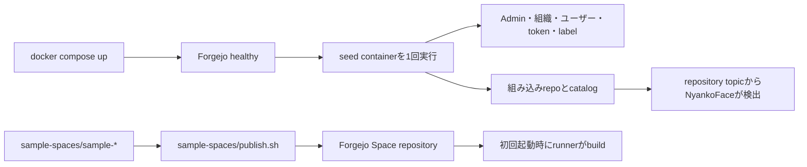

# seedアプリとカタログ

NyankoFaceには、意図的に分離した2種類の公開経路があります。Forgejo上に
生成されたリポジトリを、誤って唯一の編集元にしないための構成です。

| 経路 | 生成元 | 登録処理 |
|---|---|---|
| 組み込みリポジトリ、組織、ユーザー、Pages、Knowledge、モデル、データセット | [`seed/seed.sh`](https://github.com/Sunwood-ai-labs/NyankoFace/blob/main/seed/seed.sh)、`seed/templates/`、`seed/assets/`、`seed/catalog/*.json` | one-shotのCompose `seed`サービス |
| 単体Docker Spaceサンプル | `Dockerfile`と`README.md`を持つ、追跡対象の`sample-spaces/sample-*/` | `sample-spaces/publish.sh` |

Forgejoに表示されるリポジトリは配備後の生成データです。別環境で再構築
しても残す変更は、Forgejo上ではなく上表の生成元へ加えます。

## 登録されるタイミング



`seed`はForgejoの起動を待ち、保護されたadmin tokenを再利用または更新して、
APIによる冪等更新を実行します。Composeの初回起動時と、運用者が明示的に
再実行したときに動きます。常時reconcileするserviceではありません。

## 組み込み項目を追加・変更する

1. `seed/seed.sh`で最も近い`ensure_repo`またはcatalog処理を探します。
2. 再利用する雛形は`seed/templates/`、生成アバターなどのbootstrap assetは
   `seed/assets/`、固定した外部importは`seed/catalog/*.json`へ置きます。
3. 必ず既存resourceを検索してからcreate／updateする冪等処理にします。
4. seedをbuildして再実行します。

   ```powershell
   docker compose up -d --build seed
   docker compose logs --no-log-prefix seed
   ```

5. Forgejoのrepositoryと、topicで分類されたNyankoFaceのcatalog画面を確認します。

## Docker Spaceサンプルを公開する

追跡対象sampleは、単独repositoryとして成立する構成にします。

```text
sample-spaces/sample-example/
├── Dockerfile
├── README.md
└── application files
```

次のコマンドで公開・更新します。

```powershell
docker compose run --rm `
  --entrypoint /bin/bash `
  -v "${PWD}/sample-spaces:/samples" `
  seed /samples/publish.sh
```

publisherは未作成ならpublic repositoryを作り、sampleをcommitして`main`を
更新し、`space,cpu,docker,sample` topicを付けます。公開先は
`SPACE_ORG_NAME`（既定値: `seraphim-labs`）で指定します。同名sampleが
`ORG_NAME`（既定値: `nyankoface`）に残っている場合は、Git履歴とdiscussionを
保持したまま移管します。すでに実行中のSpaceは、source公開後に停止・再起動して
container imageを再buildします。

## 削除する

seedはrepositoryを自動削除しません。ユーザーcommit、Issue、like、監査履歴を
誤って失わないためです。

1. `seed/seed.sh`またはcatalogから項目を除き、新規環境で作られないようにします。
2. 不要になったsample sourceを削除します。
3. 既存Forgejo repositoryはadminが明示的にarchiveまたは削除します。
4. seedを再実行し、関連catalogを確認します。

## 既存環境と本番環境

開発・本番とも生成元と実行コマンドは同じです。違うのはComposeの環境値、
永続volume、credential、network endpointです。Git checkoutを更新するだけでは
Forgejoの永続volumeは変わりません。対象に応じてseedまたはSpace publisherを
再実行してください。破壊的な整理の前にはForgejoとPostgreSQL volumeを
backupします。
