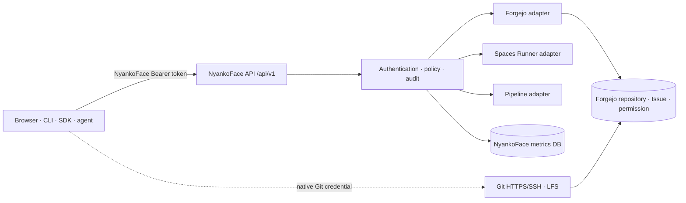

# 統一APIと認証

**状態:** Proposed · **決定:** 公開管理control planeを`/api/v1`とNyankoFace Tokenへ統一します。

これは[Issue #111](https://github.com/Sunwood-ai-labs/NyankoFace/issues/111)のADRです。Git転送は置き換えません。Forgejo、Spaces Runner、Pipeline制御、metrics databaseはNyankoFace Facadeの内側に残します。

## 現状監査

実コードには4つのcaller契約があります。

| 現在のsurface | Credential | 確認した挙動 |
|---|---|---|
| `/runner-api/v1/spaces/.../environment`、`/pipelines/...` | Forgejo PAT | `space_api_auth.py`がtoken user、scope、repository権限、Space topicをForgejoへ照会 |
| `/runner-api/agent/v1/...` | Agent API key | `agent_metrics.py`がhashを保存し、like/viewを独立認証 |
| Browser制御route | Forgejo session＋内部control token | Next.jsがlogin userを検査してから、service tokenをbrowserへ出さずRunnerを呼ぶ |
| GPU worker／maintenance hook | enrollment/runtime credentialまたはHMAC | 狭い内部route向けmachine credential |

内部方式としては有効ですが、外部clientへ複数方式を強いるべきではありません。

## Target境界

gatewayが`/api/v1`と`/api/v1/openapi.json`を公開します。内部service pathとservice credentialは公開契約にしません。未対応操作のみ、明示したForgejo escape hatchへ案内します。

### 公開resourceの責務

| v1 family | NyankoFaceの責務 | 内部authority |
|---|---|---|
| `/tokens` | 発行、metadata一覧、rotation、失効 | NyankoFace identity store |
| `/admin/subjects/{subject_id}/scope-grants` | human subjectのissuer scope grantの参照／置換 | version付きNyankoFace identity store |
| `/admin/service-account-resource-grants` | immutable service-account resource grantの作成／一覧 | version付きNyankoFace identity store＋現在のForgejo repository authority |
| `/admin/service-account-resource-grants/{grant_id}` | resource grantの参照／失効 | version付きNyankoFace identity store＋dispatch fence |
| `/repos` | repository metadataと安全な管理操作 | Forgejoのpermission／repository state |
| `/repos/{owner}/{repo}/issues` | Issue CRUDとreaction | ForgejoのIssue state／permission |
| `/spaces/{owner}/{repo}` | status、start/stop、environment metadata、Secret write | Forgejo permission＋Spaces Runner |
| `/pipelines/{owner}/{repo}` | workflow install、dispatch、run detail／action | Forgejo permission＋Pipeline adapter |
| `/metrics`、`/reactions` | view、集計、like／reaction | repository visibility確認後のNyankoFace metrics DB |

routeはupstream Forgejo URL形状ではなくdomain resourceを公開します。公開behaviorを保つ限り、adapterはv1を変えずに交換できます。

## NyankoFace Token

Tokenはcryptographically secure random sourceで生成する256 bit以上のentropyを持つopaque Bearer credentialです。共通で保存するmetadataは一方向digest、immutable token ID、subject ID、audience（`nyankoface-api-v1`）、scope、作成日時、期限、失効状態だけです。service-account tokenだけは、さらにimmutableな`resource_grant_id`を正確に1つ保存し、human tokenには保存しません。scope／adapter評価の前にaudienceを検証します。default 30日、最大90日とします。rotationでは別token IDを発行します。重複期間は最大300秒とし、期限到達時に旧tokenを強制失効します。手動失効またはsubject無効化時は重複期間を即座に終了します。

human tokenの発行には、事前のForgejo exchangeで確立した信頼済みNyankoFace local sessionと、それにbindした最大300秒以内の直近再認証proofが必要です。proofが期限切れなら、token発行または管理操作を続行する前に再認証を要求します。human tokenはscope-onlyのglobal credentialです。付与scopeはrequested scopeと発行者の現在のscope grantの積集合とし、発行／rotation時のrepository bindingやtarget permission照会は行いません。このgrantのauthorityはNyankoFace server-sideのversion付きper-subject storeだけです。default grantは空で、token requestのscopeをauthorityとして扱いません。現在のNyankoFace administratorだけが、local server-side sessionへbindした最大300秒以内の再認証proofを使い、`/api/v1/admin/subjects/{subject_id}/scope-grants`から宣言済みscopeを参照／置換できます。proofが期限切れなら、grant-store read／mutationを続ける前に再認証が必要です。create／replace／reduce／revokeはactor、subject、old/new version、scope diffを必ずauditします。grant縮小時はversionをatomically incrementし、新grantのsubsetでない当該subjectの全tokenをupdate完了前に失効します。issue、rotation、resource requestは毎回current versionを読み、compare-and-swapまたは同一transactionでtoken mutation／authorization decisionをそのversionへbindします。stale versionはmutationせずretryし、authorityがunavailable／invalidならtoken mutationまたはresource adapter callより前に、audit付きのtarget-independent `503`でfail closedします。resource requestごとにmapped humanを解決し、そのuserの対象repositoryへの現在のForgejo permissionも必ず確認するため、repository権限の取得・喪失は動的に反映されます。より広いtokenはmintできません。service-account tokenだけは別のresource modelを使い、現在もadministratorで、明示したimmutable resource grantを現在も所有するsubjectだけが作成できます。各service accountは専用のnon-admin Forgejo userへ対応付けます。grantのimmutable `allowed_scopes`がtoken scopeを制限し、全repository targetには導出済みの正確な`required_permission`を保存します。issue時に選択したactive grantのIDをtokenへatomicallyに保存し、rotationでは同じIDを保持してreplacement grantへ移動させません。発行、rotation、resource利用では専用userが全target recordを満たすことを確認します。subjectの削除、無効化、unlinkでtokenを失効します。失効は次のadapter callより前に反映し、cacheも能動的に無効化します。

service-account resource grantには明示的なbootstrap経路があります。`POST /api/v1/admin/service-account-resource-grants`は既存grantを要求しませんが、現在のNyankoFace administrator session、300秒以内の再認証、全canonical target repositoryに対するactorの現在のForgejo owner／administrator権限が必要です。grantはimmutable `allowed_scopes`と`{repository_id, required_permission}`形式のtarget recordを保存します。`required_permission`は`read`／`write`のいずれかで、`allowed_scopes`が有効にする全actionについてaction-permission matrixの最大Forgejo levelを作成時に導出します。callerが自由文字列で指定する値ではありません。作成前に専用non-admin Forgejo userが各targetの導出levelを満たすことを確認します。grant ID、owner subject、service-account subject、専用Forgejo user、allowed scope、target recordは作成後immutableです。binding変更はreplacement grant作成とold grant失効で行い、old grantへbindしたtokenがreplacement grantを採用または参照することはありません。list／readと通常のtoken管理は、current administratorがimmutable ownerであり、全targetへの現在のForgejo owner／administrator権限を持つ場合に限ります。revokeだけは、fresh reauthentication済みで全targetへの現在のForgejo owner／administrator権限を持つsuccessor administratorも実行できるため、former owner離脱後もgrantを失効できます。successor overrideではformer ownerとreasonをauditします。grantをatomically失効しversionをincrementし、immutable `resource_grant_id`が失効対象grantと正確に一致する全tokenを選択して失効します。exclusive dispatch fenceでold-version callの終了を待ち、新しいadapter callを開始不能にしてからreturnします。create／revokeは検証済みIDとversion changeをauditし、authority障害はgrant／token mutation前にaudit付きtarget-independent `503`でfail closedします。

`/tokens` familyは管理対象token自身ではなくsessionで認可します。事前のserver-side Forgejo exchangeでNyankoFace local sessionを確立し、直近の再認証proofをそのsessionへbindします。`issue`、`list`、`rotate`、`revoke`は、この信頼済みsession subjectとproofをadapterなしでlocal検証します。human tokenのissue／rotationはscope ceilingをlocal適用し、target repository照会は行いません。service-accountのissueはpost-authentication rate limitの後に選択したactive grantとcurrent versionを検証し、専用Forgejo userの現在のlevelが全immutable target recordの`required_permission`を満たすことを確認してから、そのgrant IDをtoken mutationとatomicallyに保存します。rotationは既存tokenのimmutable `resource_grant_id`だけを解決し、その正確なactive grantとcurrent versionへ同じ検証を行い、新tokenでもIDを保持します。human userが管理できるのはそのscope ceiling内の自分のtokenだけです。service-account tokenは、session subjectが現在もNyankoFace administratorで、明示resource grantも現在所有する場合だけ管理できます。NyankoFace Bearer tokenからtoken-management routeは呼べません。

scopeは加算式かつdefault denyです。

- `repos:read`, `repos:write`
- `issues:read`, `issues:write`
- `spaces:read`, `spaces:run`
- `secrets:read-metadata`, `secrets:write`
- `pipelines:read`, `pipelines:write`
- `metrics:read`, `reactions:write`

v1に公開`admin`／wildcard scopeは設けません。

### Action scope matrix

表内のscopeはすべて`AND`で必須とし、さらに現在のForgejo repository permissionも確認します。

| Action | 必須scope | Forgejo permission |
|---|---|---|
| Repository read / write | `repos:read` / `repos:write` | `read` / `write` |
| Issue read / write | `issues:read` + `repos:read` / `issues:write` + `repos:read` | `read` / `write` |
| Space status / run control | `spaces:read` + `repos:read` / `spaces:run` + `repos:read` | `read` / `write` |
| Environment metadata / Secret write | `secrets:read-metadata` + `spaces:read` + `repos:read` / `secrets:write` + `spaces:run` + `repos:read` | `read` / `write` |
| Pipeline read / mutation | `pipelines:read` + `repos:read` / `pipelines:write` + `repos:read` | `read` / `write` |
| Metrics read / reaction write | `metrics:read` + `repos:read` / `reactions:write` + `repos:read` | `read` / `write` |

## 認可手順

Bearer認証を使うrepository requestごとに同じ順序で判定します。

1. digest lookup、denial-audit write、upstream／service adapter callより前に、source-address class＋route class単位のpre-authentication limitを適用します。missing credential、非対応のauthorization scheme、malformed／random Bearer、valid Bearerのすべてが消費します。bounded audit keyの初回拒否だけを`429`前にemitし、繰り返し拒否は後述のbounded aggregateだけをincrementします。
2. pre-authentication limitがrequestを許可し、`Authorization` credentialがない、またはBearer以外のschemeを使う場合はauthentication-denial auditを先に記録し、`error` parameterなしの`WWW-Authenticate: Bearer`と`401`を返します。非対応schemeのpayloadをtokenとしてparseしません。Bearer credentialがある場合はdigest照合、entropy/version metadata、期限、失効、audienceを検証します。malformed、unknown、expired、revokedなら安全なunknown-credential contextでauditを先に記録し、token IDを捏造せず、`401`と`WWW-Authenticate: Bearer error="invalid_token"`を返します。
3. token検証成功直後、scope評価、denial-audit write、upstream／service adapter callより前に、検証済みtoken ID＋route class単位のpost-authentication limitを適用します。拒否はbounded rate-limit audit pathへ記録してから`429`を返します。
4. 前段の両limitがrequestを許可した場合にaction matrixの全scopeを検証します。不足時は検証済みidentity fieldだけでauthorization-denial auditを先に記録し、adapterを呼ぶ前に`403`とrequired `scope`を含む`WWW-Authenticate: Bearer error="insufficient_scope"` challengeを返します。
5. human tokenではauthoritative issuer grantのversion-bound read fenceを取得し、current versionを読み、token scopeが引き続きsubsetであることを確認します。adapter dispatch直前にversionを再検証します。grant updateはexclusive fenceを取得し、compare-and-swapでversionを進め、old versionで許可済みのdispatchが完了するまでreturnしません。縮小return後に新たなold-version adapter callは開始できません。stale versionはdispatchせずretryし、authority障害はadapter callより前にaudit付き`503`を返します。
6. service-account tokenではimmutable `resource_grant_id`だけを解決し、その正確なgrantのcurrent versionに対するversion-bound read fenceを取得します。grantがactive、token scopeがimmutable `allowed_scopes`のsubset、requested targetがmemberであることを確認します。全bound targetについて、専用userの現在のForgejo levelがtarget recordのimmutable `required_permission`以上であることを要求し、requested targetでは今回actionに対するaction-permission matrixのlevelも要求します。adapter dispatch直前に同じgrant IDとversionを再検証し、dispatch完了までread fenceを保持します。revokeは同じfenceのexclusive側を取得するため、`DELETE` return後にold-version requestがadapter callへ再開できません。stale versionはdispatchせずretryし、authority障害はaudit付き`503`を返します。
7. immutable subjectをForgejo user IDへ解決し、missing／disabledならdenial auditを記録してからfail closed。
8. 対象repositoryに対する当該userの現在の権限をForgejoへ毎回照会し、拒否時はreturn前にaudit。
9. Space topicなどresource policyを適用し、拒否時はreturn前にaudit。
10. 該当するgrant-version dispatch fenceを保持したまま、制約付き委任credentialまたは認可済みservice callでadapterを実行。admin PATの強い権限をcaller権限の根拠にしない。
11. success resultと全mutationを、検証済みidentifierだけでauditし、credentialは記録しない。

session管理の`/tokens` routeは、invalid sessionがthrottlingを回避せず、session検証がno-upstream-call ruleと矛盾しないよう、2段階で制限します。

1. local session検証やupstream／service adapter callより前に、source-address class＋route class単位のpre-authentication limitを適用します。missing／invalid sessionもこのlimitを消費し、拒否はbounded rate-limit audit pathへ記録してから`429`を返します。
2. NyankoFaceが所有するserver-side session subjectだけをlocalで検証し、bind済みrecent-reauthentication proofはまだ検証しません。subject検証ではForgejo adapterを呼びません。
3. recent-reauthentication検証、token store、upstream／service adapter callより前に、検証済みlocal-session subject ID＋route class＋source-address class単位のpost-authentication limitを適用します。拒否はbounded rate-limit audit pathへ記録してから`429`を返します。
4. bind済みrecent-reauthentication proofをlocal検証してから、token ownershipとhuman scope ceilingを検証します。human tokenはresource-boundではないため、issue／rotationでtarget repositoryを照会せず、後続のresource requestごとに現在のForgejo permissionを確認します。service-accountのissueではactiveかつ所有中のresource grantを正確に1つ選択し、rotationでは既存tokenのimmutable `resource_grant_id`だけを解決します。requested scopeをその正確なgrantのimmutable `allowed_scopes`のsubsetに制限し、現在のadministrator role＋current ownershipを要求して、専用Forgejo userの現在のpermissionが各immutable target recordの`required_permission`を満たすことを確認します。issue／rotation mutationはそのgrantのcurrent versionへatomically bindし、immutable IDを保存または保持します。このauthorization adapterはpost-authentication limitの後、token store mutationの前だけで実行します。全拒否とmutationをauditします。

session管理の`/api/v1/admin/subjects/{subject_id}/scope-grants` routeには独立した2段階limitを適用します。pre-authentication limitはsource-address class＋route classをkeyとし、local session検証、denial-audit write、grant-store read、adapter callより前に実行します。missing／invalid／valid sessionのすべてが消費します。local session検証後のpost-authentication limitはverified local-session subject ID＋route class＋source-address classをkeyとし、administrator認可、recent-reauthentication検証、grant-store access、adapter callより前に実行します。拒否はbounded rate-limit audit pathへ記録し、保護対象処理を始める前に標準metadata付き`429`を返します。

service-account resource-grant管理routeも専用policyで同じ順序を使います。pre-authenticationはlocal session検証、denial audit、resource-grant-store read、adapterより前、post-authenticationはadministrator／owner認可、recent reauthentication、repository permission確認、resource-grant-store access、adapterより前です。missing／invalid／valid sessionはすべてpre-authentication quotaを消費します。

具体的なdeployment-wide policyは重複しない60秒window＋token bucketです。Bearer routeはpre-auth `60/window`・burst 10・refill 1/s、post-auth `600/window`・burst 50・refill 10/s。session token routeはpre-auth `30/window`・burst 5・refill 0.5/s、post-auth `120/window`・burst 10・refill 2/s。issuer-scope-grant／service-account-resource-grant管理はそれぞれpre-auth `20/window`・burst 5・refill 0.333333/s、post-auth `30/window`・burst 5・refill 0.5/sです。window quotaとburst bucketの両方がrequestを許可する必要があります。全API worker／replicaが1つのshared authoritative storeで、store時刻とatomic updateを使います。authority障害はdigest lookup、protected store、adapter callより前に`503`でfail closedします。

private repositoryの存在を漏らす場合、未存在と権限拒否は同じnot-found responseにします。

## 共通HTTP契約

- errorは`application/problem+json`で、`type`、`title`、`status`、`code`、`request_id`を必須化。field errorは`errors`、再試行情報は`retry_after`。適用対象となる前段rate limitがrequestを許可した場合にRFC 6750 responseを返し、credentialがない場合または非対応のauthorization schemeなら`401`と`error` parameterなしの`WWW-Authenticate: Bearer`、提示されたBearerが無効なら`error="invalid_token"`、scope不足ならrequired scope付きの`error="insufficient_scope"`とします。pre-authentication／post-authentication rate limitが拒否した場合は、これらより`429`を優先します。
- collectionはopaque `cursor`と上限付き`limit`を受け、`items`と`next_cursor`を返す。
- mutationの`POST`、`PUT`、`PATCH`、`DELETE`は`Idempotency-Key`必須。serverは検証済みsubject ID、HTTP method、canonical target、keyでrecordをnamespace化し、24時間保持します。payload fingerprintは同じnamespace内のmismatch検出だけに使います。下記のcredential response例外を除き、同一namespace＋同一payloadは二重mutationせず初回結果、異なるpayloadは副作用なしで`422`、同時実行中の重複は`409`です。subject、method、targetをまたいだresponse replayは禁止です。token issue／rotationだけはnon-replayableとし、plaintextは`Cache-Control: no-store`付きの初回成功responseで一度だけ渡して保存しません。同一keyの再試行は二重mutationせず、token IDと非secret operation metadataだけを含む`409 idempotency_result_not_replayable`を返します。
- Bearer、session token、issuer-scope-grant、service-account-resource-grant routeは上記の具体的なshared policyを適用します。local session検証はForgejo adapterを必要とせず、全limitをtoken store、grant store、resource-grant store、upstream／service adapter callより前に実行します。missing／invalid sessionも最初のlimitを消費し、管理対象tokenはkeyに使いません。拒否時は`429`、`Retry-After`、`RateLimit`、`RateLimit-Policy`を返します。
- CORSはdefault denyでexact originを列挙。credential付きwildcard originは禁止。browser session exchangeはserver-sideだけで行い、cookieは`Secure`、`HttpOnly`、`SameSite`とし、state-changing requestではorigin checkとCSRF tokenを要求します。tokenをURL parameterやapplication storageへ置きません。
- authentication／authorization拒否と全mutationで、target、operation、result、request ID、source address class、timestamp、credentialの有無をauditします。actor subject、token ID、effective scopeは検証後にだけ記録し、未知のBearer文字列をcopyしたりidentifierに使ったりしません。rate-limit拒否はUnix epochに揃えた重複しない60秒fixed windowを使い、limiter stage、source-address class、route class、fixed windowだけをkeyにbounded aggregationします。shared authoritative storeがdeployment全体のfirst rejection claim、repeat counter increment、single summary claim、worker単位ではないglobal 4096-key capをatomicに処理します。rollover時にkey/windowあたり最大1 summaryをper-request retryなしでqueueし、overflowはstage/window単位の1 summaryへcoalesceします。保持するのはcurrent windowと直前windowだけで、直前stateは1回のsummary enqueue試行後に破棄します。raw address／credentialをkeyやsummaryへ含めません。

機械可読baselineは[`docs/contracts/nyankoface-api-v1-security.json`](https://github.com/Sunwood-ai-labs/NyankoFace/blob/main/docs/contracts/nyankoface-api-v1-security.json)です。endpoint実装前からsecurity要件を固定します。

## Secret契約

Secret plaintextはwrite-onlyです。read成功時は`name`、`scope`、`enabled`、`updated_at`、`updated_by`、`has_value`などmetadataだけを返します。`value`、plaintext、ciphertext、token、authorization headerをresponse modelへ含めません。

現在のForgejo permission照会がtimeout、失敗、parse不能なら、resource adapterの前でfail closedします。対象repositoryの有無に関係なく同じ`503 repository_authority_unavailable`を返し、failureをauditします。positive permission decisionはcacheせず、権限変更後にstale accessを残しません。

token issue／rotationの初回成功responseに一度だけ含める`token` fieldを除き、plaintext／credentialはすべてのsuccess/error body、application／reverse-proxy log、trace、metrics、auditからredactします。この一度限りのcredentialもlog、audit、trace、metrics、永続storageには一切残しません。OpenAPIの通常secret inputは`writeOnly: true`とし、そのpropertyを持たない別response schemaを使います。token issue／rotationだけは専用のone-time credential response schemaを使います。契約にある`SEC-001`〜`SEC-026`をcontract／unit／integration／log capture testで網羅します。

## Forgejoに残すdata plane

Git HTTPS/SSH clone・push、Git LFS、未対応の高度なForgejo APIはForgejo native data planeに残します。native Git credentialを使用し、NyankoFace API TokenがGit passwordであるようには見せません。Facadeはpackfile、SSH、LFS objectをproxyしません。

## 移行

1. **棚卸しとFacade:** 既存routeを維持し、v1 OpenAPI、token issuer、policy、audit、adapterを追加。既存routeのidentity semanticsを暗黙変更しない。
2. **client併存:** SDK／CLIはNyankoFace Tokenを優先し、legacy PAT／Agent keyも文書化して継続。同等v1 route完成後のみdeprecation情報を返す。
3. **client移行:** portal、automation Skill、sample、agentを移行。legacy利用をrouteとsecretでないtoken fingerprint単位で計測。
4. **非推奨化:** 最低1 minor releaseの互換期間と削除日を告知。`Sunset`と`Link: rel="successor-version"`を返す。
5. **削除:** 必須clientが残らず、parity testとrollback手順が揃った入口だけを削除。

Git transportはこの廃止cycleの対象外です。

### Legacy互換map

| 現在の入口 | v1 successor | 移行rule |
|---|---|---|
| Forgejo PATを使う`/runner-api/v1/spaces/.../environment` | `/api/v1/spaces/.../environment` | Secret／permission parity test通過まで旧routeを維持 |
| Forgejo PATを使う`/runner-api/v1/pipelines/...` | `/api/v1/pipelines/...` | payload semanticsを維持し、error変換はsuccessor routeだけで実施 |
| Agent keyを使う`/runner-api/agent/v1/...` | `/api/v1/metrics/...`、`/api/v1/reactions/...` | service accountをNyankoFace scopeへ対応付けてからkeyを非推奨化 |
| Next.js browser control route | session exchangeを使う同じ`/api/v1` domain契約 | server-sideから移行し、内部control tokenは公開しない |
| Forgejo REST escape hatch | 安全なv1操作または明示native link | generic admin-PAT proxy endpointは作らない |

legacy／v1 credentialは意図的に互換にしません。migration adapterは旧routeの方式でcredentialを検証して既存認可を適用し、暗黙に広いNyankoFace subjectを発行しません。

## OpenAPI／SDK／CLI／Skill方針

- OpenAPIをrequest/response typeのsource of truthとし、単一version URLで配信。handwritten routeとのparity testを置く。
- release automationでTypeScript／Python SDK modelを生成。生成diffをreviewし、credentialやdeployment URLはcommitしない。
- `nyankoface` CLIは同じSDKを使い、OS credential storeへtokenを保存。`auth login/status/logout`を提供し、error時にrequest IDを表示。
- `nyankoface-navigator`は管理自動化で統一APIを選び、最小scopeとidempotency keyを使う。Git clone/pushはnative Forgejo手順へ案内。
- field、scope semantics、error codeの破壊的変更は`/api/v2`。v1は加算変更だけを許可。

## 完了条件の証拠

contract testはnamespace、action scope、subject認可、Secret response除外、replay／rate／CORS制御、安定したsecurity ID、native Git境界のschemaと一部のinvariant値を固定します。endpoint behavior testではありません。今後のendpoint実装PRは、このbaselineを弱めず各assertionをunit／integration／E2E behavior testへ落とします。

## 標準仕様の参照

2026-08-01に一次仕様を確認しました。

- [RFC 6750: Bearer Token Usage](https://www.rfc-editor.org/rfc/rfc6750.html) — `Authorization: Bearer`、TLS、`401 invalid_token`、`403 insufficient_scope`。
- [RFC 7009: Token Revocation](https://www.rfc-editor.org/rfc/rfc7009.html) — 失効semantics。
- [RFC 9457: Problem Details for HTTP APIs](https://www.rfc-editor.org/rfc/rfc9457.html) — 共通error media typeとmember。
- [RFC 8594: The Sunset HTTP Header Field](https://www.rfc-editor.org/rfc/rfc8594.html) — endpoint廃止予告。
- [WHATWG Fetch Living Standard](https://fetch.spec.whatwg.org/) — browser CORS処理の規範仕様。
- [OpenAPI Specification 3.2.0](https://spec.openapis.org/oas/v3.2.0.html) — API記述と`writeOnly`／response schema。
- [RFC 9651: Structured Field Values for HTTP](https://www.rfc-editor.org/rfc/rfc9651.html)はRateLimit draftが利用する公開済みStructured Fields構文を定義しますが、RateLimit field自体の仕様ではありません。
- [IETF Idempotency-Key draft -07](https://datatracker.ietf.org/doc/html/draft-ietf-httpapi-idempotency-key-header-07)は失効済みです。[RateLimit draft -11](https://datatracker.ietf.org/doc/html/draft-ietf-httpapi-ratelimit-headers-11)は2026-05-23付、2026-11-24期限のactive field-semantics draftで、RFC番号はまだありません。NyankoFaceは参照revisionと選択した挙動をtestへ固定し、実装／release前に再確認します。
